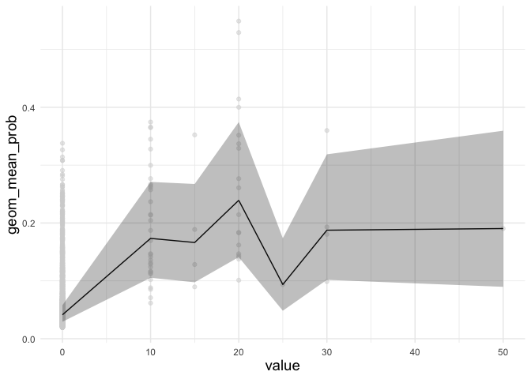
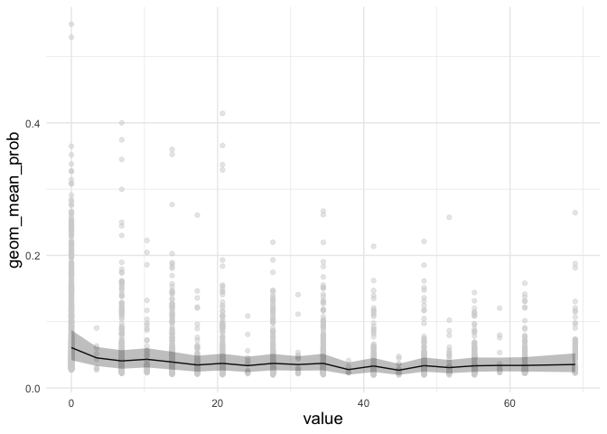
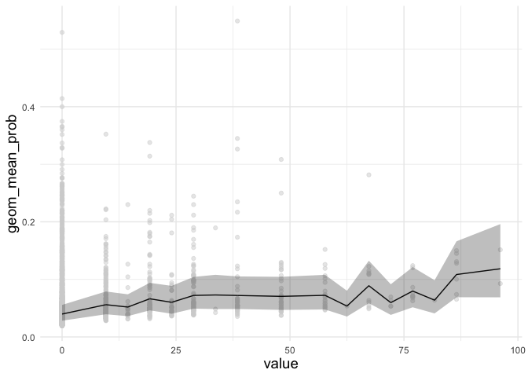
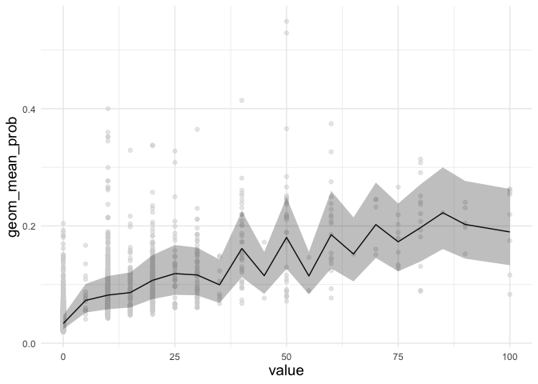
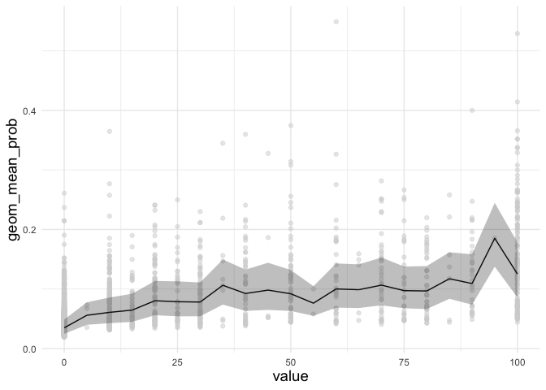
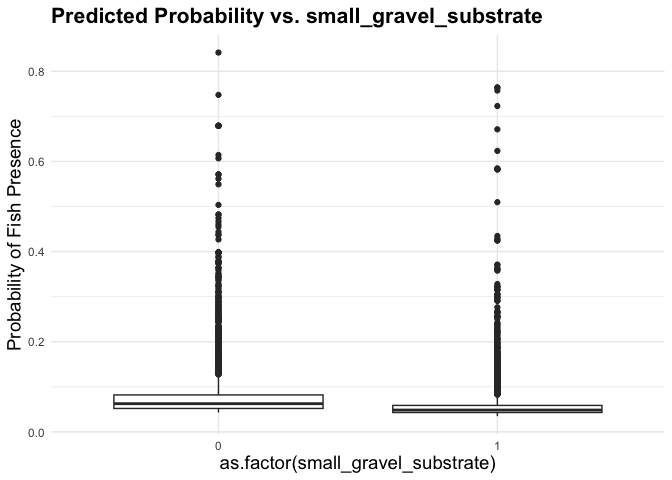
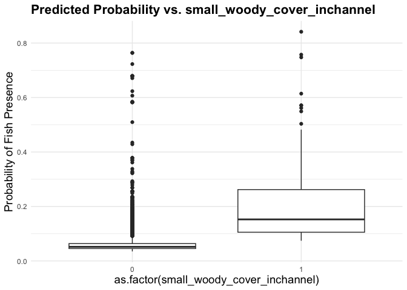
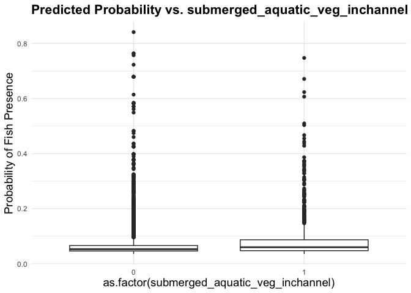
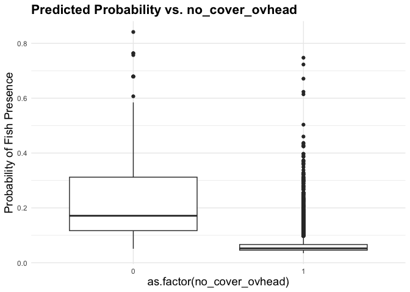

Mini Snorkel Feather HSC Using Logistic Regression
================
Maddee Rubenson
2024-05-23

- [Objective](#objective)
- [Pre-process data](#pre-process-data)
- [Logistic Regression: 1 - Using Cover, Substrate, Velocity, and
  Depth](#logistic-regression-1---using-cover-substrate-velocity-and-depth)
  - [Results](#results)
- [Logistic Regression: 2 - Use cover as presence/absence
  variable](#logistic-regression-2---use-cover-as-presenceabsence-variable)
- [Logistic Regression: 3 - using dominant cover and
  substrate](#logistic-regression-3---using-dominant-cover-and-substrate)
  - [Build Model](#build-model-1)
  - [Results](#results-2)
- [Logistic Regression 4: Cover Variables by
  Dominance](#logistic-regression-4-cover-variables-by-dominance)
  - [Build Model](#build-model-2)
  - [Results](#results-3)
- [Hurdle Model - Binary Cover
  Values](#hurdle-model---binary-cover-values)
  - [Results](#results-4)
- [Hurdle Model - with values](#hurdle-model---with-values)
  - [Results](#results-5)

## Objective

Using the mini snorkel data for the Feather River, produce an HSC that
uses cover, substrate, depth and velocity.

``` r
# read in mini snorkel data
mini_snorkel_model_ready <- read_csv(here::here('data-raw', 'microhabitat_with_fish_observations.csv')) |> 
  mutate(count = ifelse(is.na(count), 0, count),
        fish_presence = as.factor(ifelse(count < 1, "0", "1"))) |> 
  glimpse()
```

    ## Rows: 5018 Columns: 28
    ## ── Column specification ────────────────────────────────────────────────────────
    ## Delimiter: ","
    ## chr   (2): species, channel_geomorphic_unit
    ## dbl  (25): micro_hab_data_tbl_id, location_table_id, transect_code, depth, v...
    ## date  (1): date
    ## 
    ## ℹ Use `spec()` to retrieve the full column specification for this data.
    ## ℹ Specify the column types or set `show_col_types = FALSE` to quiet this message.

    ## Rows: 5,018
    ## Columns: 29
    ## $ micro_hab_data_tbl_id                       <dbl> 18, 18, 18, 19, 20, 21, 22…
    ## $ location_table_id                           <dbl> 11, 11, 11, 11, 11, 11, 11…
    ## $ transect_code                               <dbl> 0.1, 0.1, 0.1, 0.2, 0.3, 0…
    ## $ depth                                       <dbl> 17, 17, 17, 19, 11, 12, 11…
    ## $ velocity                                    <dbl> 0.22, 0.22, 0.22, 0.35, 1.…
    ## $ percent_fine_substrate                      <dbl> 0, 0, 0, 0, 0, 0, 0, 0, 0,…
    ## $ percent_sand_substrate                      <dbl> 40, 40, 40, 50, 25, 0, 70,…
    ## $ percent_small_gravel_substrate              <dbl> 20, 20, 20, 40, 75, 80, 30…
    ## $ percent_large_gravel_substrate              <dbl> 30, 30, 30, 10, 0, 20, 0, …
    ## $ percent_cobble_substrate                    <dbl> 10, 10, 10, 0, 0, 0, 0, 0,…
    ## $ percent_boulder_substrate                   <dbl> 0, 0, 0, 0, 0, 0, 0, 0, 0,…
    ## $ percent_no_cover_inchannel                  <dbl> 75, 75, 75, 100, 100, 100,…
    ## $ percent_small_woody_cover_inchannel         <dbl> 15, 15, 15, 0, 0, 0, 20, 0…
    ## $ percent_large_woody_cover_inchannel         <dbl> 0, 0, 0, 0, 0, 0, 40, 0, 0…
    ## $ percent_submerged_aquatic_veg_inchannel     <dbl> 10, 10, 10, 0, 0, 0, 30, 0…
    ## $ percent_undercut_bank                       <dbl> 0, 0, 0, 0, 0, 0, 0, 0, 0,…
    ## $ percent_no_cover_overhead                   <dbl> 100, 100, 100, 100, 100, 1…
    ## $ percent_cover_half_meter_overhead           <dbl> 0, 0, 0, 0, 0, 0, 0, 0, 0,…
    ## $ percent_cover_more_than_half_meter_overhead <dbl> 0, 0, 0, 0, 0, 0, 0, 0, 0,…
    ## $ surface_turbidity                           <dbl> 20, 20, 20, 30, 30, 30, 10…
    ## $ fish_data_id                                <dbl> 21, 22, 23, NA, NA, NA, 25…
    ## $ count                                       <dbl> 2, 3, 1, 0, 0, 0, 3, 0, 0,…
    ## $ fl_mm                                       <dbl> 35, 35, 25, NA, NA, NA, 25…
    ## $ dist_to_bottom                              <dbl> 1.0, 1.5, 1.5, NA, NA, NA,…
    ## $ focal_velocity                              <dbl> 0.94, 0.16, 0.16, NA, NA, …
    ## $ species                                     <chr> "Chinook salmon", "Chinook…
    ## $ date                                        <date> 2001-03-14, 2001-03-14, 2…
    ## $ channel_geomorphic_unit                     <chr> "Glide", "Glide", "Glide",…
    ## $ fish_presence                               <fct> 1, 1, 1, 0, 0, 0, 1, 0, 0,…

## Pre-process data

#### Normalize Substrate by Prevalence

This table provides a weighting for each substrate type based on the
overall presence (\>20%) of each substrate type. Use this to normalize
the substrate columns.

``` r
substrate_percent <- mini_snorkel_model_ready |> 
  group_by(micro_hab_data_tbl_id) |> 
  select(contains('substrate')) |> 
  distinct() |> 
  pivot_longer(cols = c(percent_fine_substrate:percent_boulder_substrate), names_to = "substrate_type", values_to = "percent") |> 
  mutate(substrate_presence_absence = ifelse(percent < 19, 0, 1)) |>  # 20% threshold
  group_by(substrate_type) |> 
  summarise(total_presence = sum(substrate_presence_absence)) |> 
  ungroup() |> 
  mutate(perc_total = total_presence/sum(total_presence))
```

    ## Adding missing grouping variables: `micro_hab_data_tbl_id`

``` r
knitr::kable(substrate_percent |> mutate(perc_total = perc_total*100), digits = 2)
```

| substrate_type                 | total_presence | perc_total |
|:-------------------------------|---------------:|-----------:|
| percent_boulder_substrate      |            360 |       3.86 |
| percent_cobble_substrate       |           1498 |      16.05 |
| percent_fine_substrate         |            271 |       2.90 |
| percent_large_gravel_substrate |           2919 |      31.27 |
| percent_sand_substrate         |           1385 |      14.84 |
| percent_small_gravel_substrate |           2901 |      31.08 |

Apply substrate normalization values to substrate columns and remove
unnecessary columns

``` r
mini_snorkel_grouped <- mini_snorkel_model_ready |> 
  # filter(species %in% c('Chinook Salmon', 'Steelhead trout (wild)', 'Steelhead trout, (clipped)') | is.na(species)) |> 
  rowwise() |> 
  mutate(fine_substrate = percent_fine_substrate * (1-substrate_percent[substrate_percent$substrate_type == "percent_fine_substrate", 'perc_total']$perc_total),
         sand_substrate = percent_sand_substrate * (1-substrate_percent[substrate_percent$substrate_type == "percent_sand_substrate", 'perc_total']$perc_total),
         small_gravel = percent_small_gravel_substrate * (1-substrate_percent[substrate_percent$substrate_type == "percent_small_gravel_substrate", 'perc_total']$perc_total),
         large_gravel = percent_large_gravel_substrate * (1-substrate_percent[substrate_percent$substrate_type == "percent_large_gravel_substrate", 'perc_total']$perc_total),
         cobble_substrate = percent_cobble_substrate * (1-substrate_percent[substrate_percent$substrate_type == "percent_cobble_substrate", 'perc_total']$perc_total),
         boulder_substrate = percent_boulder_substrate * (1-substrate_percent[substrate_percent$substrate_type == "percent_boulder_substrate", 'perc_total']$perc_total)) |> 
  select(-c(percent_fine_substrate:percent_boulder_substrate)) |> 
  mutate(woody_debris = sum(percent_large_woody_cover_inchannel, percent_small_woody_cover_inchannel),
         overhead_cover = sum(percent_cover_half_meter_overhead, percent_cover_more_than_half_meter_overhead)
         ) |> 
  select(-c(percent_small_woody_cover_inchannel, percent_large_woody_cover_inchannel, percent_cover_more_than_half_meter_overhead, percent_cover_half_meter_overhead)) |> 
  #filter(species == "Chinook salmon" | is.na(species)) |> 
  select(-count, -channel_geomorphic_unit, -micro_hab_data_tbl_id, -location_table_id, -fish_data_id,
         -focal_velocity, -dist_to_bottom, -fl_mm, -species,  -transect_code, -date, -surface_turbidity) |> 
  select(-(contains("no_cover"))) |> 
  distinct() |> 
  na.omit() |> glimpse()
```

    ## Rows: 4,723
    ## Columns: 13
    ## Rowwise: 
    ## $ depth                                   <dbl> 17, 19, 11, 12, 11, 10, 8, 9, …
    ## $ velocity                                <dbl> 0.22, 0.35, 1.95, 2.14, 1.19, …
    ## $ percent_submerged_aquatic_veg_inchannel <dbl> 10, 0, 0, 0, 30, 0, 0, 0, 40, …
    ## $ percent_undercut_bank                   <dbl> 0, 0, 0, 0, 0, 0, 0, 0, 0, 0, …
    ## $ fish_presence                           <fct> 1, 0, 0, 0, 1, 0, 0, 1, 1, 1, …
    ## $ fine_substrate                          <dbl> 0.00000, 0.00000, 0.00000, 0.0…
    ## $ sand_substrate                          <dbl> 34.064710, 42.580887, 21.29044…
    ## $ small_gravel                            <dbl> 13.784015, 27.568031, 51.69005…
    ## $ large_gravel                            <dbl> 20.618170, 6.872723, 0.000000,…
    ## $ cobble_substrate                        <dbl> 8.395115, 0.000000, 0.000000, …
    ## $ boulder_substrate                       <dbl> 0, 0, 0, 0, 0, 0, 0, 0, 0, 0, …
    ## $ woody_debris                            <dbl> 15, 0, 0, 0, 60, 0, 0, 0, 10, …
    ## $ overhead_cover                          <dbl> 0, 0, 0, 0, 0, 0, 0, 0, 25, 0,…

## Logistic Regression: 1 - Using Cover, Substrate, Velocity, and Depth

**Predictors**

- Depth

- Velocity

- Substrate (fine through boulder) normalized by prevalence

- Woody Debris (`percent_small_woody_cover_inchannel` +
  `percent_large_woody_cover_inchannel`)

- Overhead Cover (`percent_cover_more_than_half_meter_overhead` +
  `percent_cover_half_meter_overhead`)

- Submerged Aquatic Vegetation

- Undercut Bank

**Notes**

- Chose to remove surface turbidity from predictors because it is not a
  parameter aligned with the strategic plan. This parameter, however,
  was initially found significant in the logistic regression

**Preliminary Results**

- Significant Predictors include: undercut bank (+), small gravel (-),
  boulder substrate (+), woody debris (+), and overhead cover (+)

#### Build Model

``` r
recipe <- recipe(data = mini_snorkel_grouped, formula = fish_presence ~.) |> 
  # step_poly(all_predictors(), degree = 2) |> x^2
  step_mutate_at(all_numeric_predictors(), fn = asinh) |> # inverse hyperbolic sine as alternative to log that can handle zeros
  step_naomit(all_predictors()) |> # ensure there are no NAs
  step_zv(all_predictors()) |> # ensure there are no columns that are all the same value
  step_normalize(all_numeric_predictors()) # Normalization can facilitate the comparison of the relative importance of different predictors

log_reg <- logistic_reg() |> 
  set_engine("glm") 

log_reg_model <- workflow() |>
  add_recipe(recipe) |>
  add_model(log_reg) |> 
  fit(data = mini_snorkel_grouped)

log_reg_model |> glance()
```

    ## # A tibble: 1 × 8
    ##   null.deviance df.null logLik   AIC   BIC deviance df.residual  nobs
    ##           <dbl>   <int>  <dbl> <dbl> <dbl>    <dbl>       <int> <int>
    ## 1         1933.    4722  -898. 1823. 1907.    1797.        4710  4723

``` r
log_reg_model |> tidy() |> filter(p.value < 0.1)
```

    ## # A tibble: 6 × 5
    ##   term                  estimate std.error statistic       p.value
    ##   <chr>                    <dbl>     <dbl>     <dbl>         <dbl>
    ## 1 (Intercept)             -3.11     0.0761    -40.9  0            
    ## 2 percent_undercut_bank    0.127    0.0380      3.35 0.000806     
    ## 3 small_gravel            -0.175    0.0772     -2.27 0.0234       
    ## 4 boulder_substrate        0.155    0.0661      2.35 0.0188       
    ## 5 woody_debris             0.375    0.0615      6.11 0.00000000101
    ## 6 overhead_cover           0.274    0.0636      4.31 0.0000166

``` r
sig_predictors <- log_reg_model |> tidy() |> filter(p.value < 0.1) |> filter(term != "(Intercept)") |>  pull(term)

predictions <- predict(log_reg_model, mini_snorkel_grouped, type = "prob") |> 
  bind_cols(mini_snorkel_grouped) 
```

### Results

The following predictors were found to significantly effect fish
presence: percent_undercut_bank, small_gravel, boulder_substrate,
woody_debris, overhead_cover

    ## Warning: Returning more (or less) than 1 row per `summarise()` group was deprecated in
    ## dplyr 1.1.0.
    ## ℹ Please use `reframe()` instead.
    ## ℹ When switching from `summarise()` to `reframe()`, remember that `reframe()`
    ##   always returns an ungrouped data frame and adjust accordingly.
    ## Call `lifecycle::last_lifecycle_warnings()` to see where this warning was
    ## generated.

    ## `summarise()` has grouped output by 'predictor', 'value'. You can override
    ## using the `.groups` argument.

<!-- --><!-- --><!-- --><!-- --><!-- -->

## Logistic Regression: 2 - Use cover as presence/absence variable

[Beakes et al.
2012](https://www.sfu.ca/biology/faculty/jwmoore/publications/Beakes_etal_RRA_inpress.pdf)
We identified locations with cover when they were within 50 cm of large
woody debris (\>7.5 cm diameter), tall vegetation (\>50 cm above
ground), overhanging vegetation (\<50 cm from water’s surface), large
boulders (\>17.5 cm diameter), undercut banks, large bedrock crevasses
or combinations of these cover types. Areas without cover included
characteristics such as small vegetation, small substrate (\<17.5 cm
diameter) or filamentous algae.

**Predictors**

- Cover Presence (1/0): summation of undercut bank, woody debris,
  overhead cover, and submerged aquatic vegetation and greater than 20%

- Substrate (fine through boulder) normalized by prevalence

- Depth

- Velocity

**Preliminary Results**

- Cover Presence is a significant predictor and the strongest when
  describing probability of fish presence

- Boulder (+) and Small Gravel (-) are also significant predictors

``` r
mini_snork_cover <- mini_snorkel_grouped |> 
  mutate(cover_total = percent_undercut_bank + woody_debris + overhead_cover + percent_submerged_aquatic_veg_inchannel,
         cover_presence = as.factor(ifelse(cover_total >= 20, 1, 0))) |> 
  select(-c(percent_undercut_bank, woody_debris, overhead_cover, percent_submerged_aquatic_veg_inchannel, cover_total)) |> 
  glimpse()
```

    ## Rows: 4,723
    ## Columns: 10
    ## Rowwise: 
    ## $ depth             <dbl> 17, 19, 11, 12, 11, 10, 8, 9, 10, 19, 19, 37, 16, 14…
    ## $ velocity          <dbl> 0.22, 0.35, 1.95, 2.14, 1.19, 1.54, 1.26, 1.97, 0.75…
    ## $ fish_presence     <fct> 1, 0, 0, 0, 1, 0, 0, 1, 1, 1, 1, 1, 1, 0, 0, 1, 1, 0…
    ## $ fine_substrate    <dbl> 0.00000, 0.00000, 0.00000, 0.00000, 0.00000, 0.00000…
    ## $ sand_substrate    <dbl> 34.064710, 42.580887, 21.290444, 0.000000, 59.613242…
    ## $ small_gravel      <dbl> 13.784015, 27.568031, 51.690058, 55.136062, 20.67602…
    ## $ large_gravel      <dbl> 20.618170, 6.872723, 0.000000, 13.745447, 0.000000, …
    ## $ cobble_substrate  <dbl> 8.395115, 0.000000, 0.000000, 0.000000, 0.000000, 0.…
    ## $ boulder_substrate <dbl> 0, 0, 0, 0, 0, 0, 0, 0, 0, 0, 0, 0, 0, 0, 0, 0, 0, 0…
    ## $ cover_presence    <fct> 1, 0, 0, 0, 1, 0, 0, 0, 1, 0, 0, 0, 1, 0, 0, 0, 1, 0…

``` r
recipe <- recipe(data = mini_snork_cover, formula = fish_presence ~.) |> 
  # step_poly(all_predictors(), degree = 2) |> x^2
  step_mutate_at(all_numeric_predictors(), fn = asinh) |> # inverse hyperbolic sine as alternative to log that can handle zeros
  step_naomit(all_predictors()) |> # ensure there are no NAs
  step_zv(all_predictors()) |> # ensure there are no columns that are all the same value
  step_normalize(all_numeric_predictors()) # Normalization can facilitate the comparison of the relative importance of different predictors

log_reg <- logistic_reg() |> 
  set_engine("glm") 

log_reg_model <- workflow() |>
  add_recipe(recipe) |>
  add_model(log_reg) |> 
  fit(data = mini_snork_cover)

log_reg_model |> glance()
```

    ## # A tibble: 1 × 8
    ##   null.deviance df.null logLik   AIC   BIC deviance df.residual  nobs
    ##           <dbl>   <int>  <dbl> <dbl> <dbl>    <dbl>       <int> <int>
    ## 1         1933.    4722  -933. 1887. 1951.    1867.        4713  4723

``` r
log_reg_model |> tidy() |> filter(p.value < 0.1)
```

    ## # A tibble: 4 × 5
    ##   term              estimate std.error statistic   p.value
    ##   <chr>                <dbl>     <dbl>     <dbl>     <dbl>
    ## 1 (Intercept)         -2.56     0.0976    -26.2  9.09e-152
    ## 2 small_gravel        -0.195    0.0756     -2.58 9.84e-  3
    ## 3 boulder_substrate    0.149    0.0658      2.26 2.40e-  2
    ## 4 cover_presence0     -0.741    0.142      -5.20 1.97e-  7

``` r
sig_predictors <- log_reg_model |> tidy() |> filter(p.value < 0.1) |> filter(term != "(Intercept)") |>  pull(term)

predictions <- predict(log_reg_model, mini_snork_cover, type = "prob") |> 
  bind_cols(mini_snork_cover) 
```

#### Results

The following predictors were found to significantly effect fish
presence: small_gravel, boulder_substrate, cover_presence0

``` r
ggplot(predictions, aes(x = cover_presence, y = .pred_1)) +
    geom_boxplot() +
    labs(title = "Predicted Probability vs. cover presence",
         y = 'Probability of Fish Presence')
```

<!-- -->

``` r
map(sig_predictors[1:2], function(predictor) {
  ggplot(predictions, aes_string(x = predictor, y = ".pred_1")) +
    geom_smooth(method = "glm") +
    labs(title = paste("Predicted Probability vs.", predictor),
         y = 'Probability of Fish Presence')
})
```

    ## Warning: `aes_string()` was deprecated in ggplot2 3.0.0.
    ## ℹ Please use tidy evaluation idioms with `aes()`.
    ## ℹ See also `vignette("ggplot2-in-packages")` for more information.
    ## This warning is displayed once every 8 hours.
    ## Call `lifecycle::last_lifecycle_warnings()` to see where this warning was
    ## generated.

    ## [[1]]

    ## `geom_smooth()` using formula = 'y ~ x'

<!-- -->

    ## 
    ## [[2]]

    ## `geom_smooth()` using formula = 'y ~ x'

<!-- -->

## Logistic Regression: 3 - using dominant cover and substrate

Instead of using percent - treat cover and substrate as
presence/absence. If there percent is \>= 80%, it is treated as present.

**Predictors**

- fine substrate (1/0)

- sand substrate (1/0)

- small gravel (1/0)

- large gravel (1/0)

- submerged aquatic veg (1/0)

- undercut bank (1/0)

- no cover overhead (1/0)

- half meter overhead (1/0)

- cover more than half meter overhead (1/0)

- velocity

- depth

**Preliminary Results**

- Significant Predictors include: fine substrate (+), sand substrate
  (+), small gravel (-), small woody in channel cover (+), submerged
  aquatic veg (-), no overhead cover (-)

**Notes**

- The highest percent undercut bank in mini snorkel data is 50% and
  therefore this method doesn’t find that as a significant predictor
  because all data is considered to not have an undercut bank. Could
  consider adjusting threshold. Could be worth considering using 20% as
  threshold since that is what is used for the Strategic Plan.

``` r
percent_threshold <- 20

log_3_data <- mini_snorkel_model_ready |> 
  select(fish_presence, depth, velocity, percent_fine_substrate:percent_cover_more_than_half_meter_overhead) |> 
  mutate(fine_substrate = ifelse(percent_fine_substrate >= percent_threshold, 1, 0),
         sand_substrate = ifelse(percent_sand_substrate >= percent_threshold, 1, 0),
         small_gravel_substrate = ifelse(percent_small_gravel_substrate >= percent_threshold, 1, 0),
         large_gravel_substrate = ifelse(percent_large_gravel_substrate >= percent_threshold, 1, 0),
         small_woody_cover_inchannel = ifelse(percent_small_woody_cover_inchannel >= percent_threshold, 1, 0 ),
         large_woody_cover_inchannel = ifelse(percent_large_woody_cover_inchannel >= percent_threshold, 1, 0 ),
         submerged_aquatic_veg_inchannel = ifelse(percent_submerged_aquatic_veg_inchannel >= percent_threshold, 1, 0),
         undercut_bank = ifelse(percent_undercut_bank >= percent_threshold, 1, 0),
         no_cover_ovhead = ifelse(percent_no_cover_overhead >= percent_threshold, 1, 0),
         half_meter_overhead = ifelse(percent_cover_half_meter_overhead >= percent_threshold, 1, 0),
         cover_more_than_half_meter_overhead = ifelse(percent_cover_more_than_half_meter_overhead >= percent_threshold, 1, 0)) |> 
  select(fish_presence, depth, velocity, fine_substrate:cover_more_than_half_meter_overhead) |> 
  glimpse()
```

    ## Rows: 5,018
    ## Columns: 14
    ## $ fish_presence                       <fct> 1, 1, 1, 0, 0, 0, 1, 0, 0, 1, 1, 1…
    ## $ depth                               <dbl> 17, 17, 17, 19, 11, 12, 11, 10, 8,…
    ## $ velocity                            <dbl> 0.22, 0.22, 0.22, 0.35, 1.95, 2.14…
    ## $ fine_substrate                      <dbl> 0, 0, 0, 0, 0, 0, 0, 0, 0, 0, 1, 0…
    ## $ sand_substrate                      <dbl> 1, 1, 1, 1, 1, 0, 1, 1, 0, 0, 0, 1…
    ## $ small_gravel_substrate              <dbl> 1, 1, 1, 1, 1, 1, 1, 1, 1, 1, 1, 1…
    ## $ large_gravel_substrate              <dbl> 1, 1, 1, 0, 0, 1, 0, 1, 1, 1, 1, 0…
    ## $ small_woody_cover_inchannel         <dbl> 0, 0, 0, 0, 0, 0, 1, 0, 0, 0, 0, 0…
    ## $ large_woody_cover_inchannel         <dbl> 0, 0, 0, 0, 0, 0, 1, 0, 0, 0, 0, 0…
    ## $ submerged_aquatic_veg_inchannel     <dbl> 0, 0, 0, 0, 0, 0, 1, 0, 0, 0, 1, 0…
    ## $ undercut_bank                       <dbl> 0, 0, 0, 0, 0, 0, 0, 0, 0, 0, 0, 0…
    ## $ no_cover_ovhead                     <dbl> 1, 1, 1, 1, 1, 1, 1, 1, 1, 1, 1, 1…
    ## $ half_meter_overhead                 <dbl> 0, 0, 0, 0, 0, 0, 0, 0, 0, 0, 1, 0…
    ## $ cover_more_than_half_meter_overhead <dbl> 0, 0, 0, 0, 0, 0, 0, 0, 0, 0, 0, 0…

### Build Model

``` r
recipe <- recipe(data = log_3_data, formula = fish_presence ~.) |> 
  # step_poly(all_predictors(), degree = 2) |> x^2
  step_mutate_at(all_numeric_predictors(), fn = asinh) |> # inverse hyperbolic sine as alternative to log that can handle zeros
  step_naomit(all_predictors()) |> # ensure there are no NAs
  step_zv(all_predictors()) |> # ensure there are no columns that are all the same value
  step_normalize(all_numeric_predictors()) # Normalization can facilitate the comparison of the relative importance of different predictors

log_reg <- logistic_reg() |> 
  set_engine("glm") 

log_reg_model <- workflow() |>
  add_recipe(recipe) |>
  add_model(log_reg) |> 
  fit(data = log_3_data)

log_reg_model |> glance()
```

    ## # A tibble: 1 × 8
    ##   null.deviance df.null logLik   AIC   BIC deviance df.residual  nobs
    ##           <dbl>   <int>  <dbl> <dbl> <dbl>    <dbl>       <int> <int>
    ## 1         2614.    4935 -1204. 2435. 2526.    2407.        4922  4936

``` r
log_reg_model |> tidy() |> filter(p.value < 0.1)
```

    ## # A tibble: 9 × 5
    ##   term                                estimate std.error statistic     p.value
    ##   <chr>                                  <dbl>     <dbl>     <dbl>       <dbl>
    ## 1 (Intercept)                          -2.69      0.0609    -44.2  0          
    ## 2 fine_substrate                        0.0906    0.0473      1.92 0.0554     
    ## 3 sand_substrate                        0.118     0.0588      2.00 0.0450     
    ## 4 small_gravel_substrate               -0.103     0.0584     -1.76 0.0776     
    ## 5 small_woody_cover_inchannel           0.205     0.0440      4.66 0.00000319 
    ## 6 large_woody_cover_inchannel           0.0734    0.0347      2.11 0.0347     
    ## 7 undercut_bank                         0.161     0.0321      5.01 0.000000551
    ## 8 half_meter_overhead                   0.158     0.0520      3.04 0.00233    
    ## 9 cover_more_than_half_meter_overhead   0.264     0.0505      5.23 0.000000167

``` r
sig_predictors <- log_reg_model |> tidy() |> filter(p.value < 0.1) |> filter(term != "(Intercept)") |>  pull(term)

predictions <- predict(log_reg_model, log_3_data, type = "prob") |> 
  bind_cols(log_3_data) 
```

### Results

The following predictors were found to significantly effect fish
presence: fine_substrate, sand_substrate, small_gravel_substrate,
small_woody_cover_inchannel, large_woody_cover_inchannel, undercut_bank,
half_meter_overhead, cover_more_than_half_meter_overhead.

``` r
predictions |> 
  ggplot(aes(x = as.factor(fine_substrate), y = .pred_1)) +
  geom_boxplot() + 
  labs(title = paste("Predicted Probability vs. fine_substrate"),
         y = 'Probability of Fish Presence')
```

    ## Warning: Removed 82 rows containing non-finite values (`stat_boxplot()`).

<!-- -->

``` r
predictions |> 
  ggplot(aes(x = as.factor(sand_substrate), y = .pred_1)) +
  geom_boxplot() + 
  labs(title = paste("Predicted Probability vs. sand_substrate"),
         y = 'Probability of Fish Presence')
```

    ## Warning: Removed 82 rows containing non-finite values (`stat_boxplot()`).

<!-- -->

``` r
predictions |> 
  ggplot(aes(x = as.factor(small_gravel_substrate), y = .pred_1)) +
  geom_boxplot() + 
  labs(title = paste("Predicted Probability vs. small_gravel_substrate"),
         y = 'Probability of Fish Presence')
```

    ## Warning: Removed 82 rows containing non-finite values (`stat_boxplot()`).

<!-- -->

``` r
predictions |> 
  ggplot(aes(x = as.factor(small_woody_cover_inchannel), y = .pred_1)) +
  geom_boxplot() + 
  labs(title = paste("Predicted Probability vs. small_woody_cover_inchannel"),
         y = 'Probability of Fish Presence')
```

    ## Warning: Removed 82 rows containing non-finite values (`stat_boxplot()`).

<!-- -->

``` r
predictions |> 
  ggplot(aes(x = as.factor(submerged_aquatic_veg_inchannel), y = .pred_1)) +
  geom_boxplot() + 
  labs(title = paste("Predicted Probability vs. submerged_aquatic_veg_inchannel"),
         y = 'Probability of Fish Presence')
```

    ## Warning: Removed 82 rows containing non-finite values (`stat_boxplot()`).

<!-- -->

``` r
predictions |> 
  ggplot(aes(x = as.factor(no_cover_ovhead), y = .pred_1)) +
  geom_boxplot() + 
  labs(title = paste("Predicted Probability vs. no_cover_ovhead"),
         y = 'Probability of Fish Presence')
```

    ## Warning: Removed 82 rows containing non-finite values (`stat_boxplot()`).

<!-- -->

## Logistic Regression 4: Cover Variables by Dominance

Create a hierarchy of cover variables based on their dominance; include
boulder and cobble as cover and remove all other substrate variables
from dataset

``` r
cover_heirarchy <- mini_snorkel_model_ready |> 
  group_by(micro_hab_data_tbl_id) |> 
  select(count, fish_presence, micro_hab_data_tbl_id, contains("cover"), "percent_cobble_substrate", "percent_boulder_substrate", "percent_undercut_bank") |>
  select(-contains("no_cover")) |> 
  distinct() |> 
  mutate(small_woody_inchannel_and_half_meter_overhead = percent_cover_half_meter_overhead + percent_small_woody_cover_inchannel,
         small_woody_inchannel_and_more_than_half_meter_overhead = percent_cover_more_than_half_meter_overhead + percent_small_woody_cover_inchannel,
         large_woody_inchannel_and_half_meter_overhead = percent_cover_half_meter_overhead + percent_large_woody_cover_inchannel,
         large_woody_inchannel_and_more_than_half_meter_overhead = percent_cover_more_than_half_meter_overhead + percent_large_woody_cover_inchannel) |>
  pivot_longer(cols = c(percent_small_woody_cover_inchannel:large_woody_inchannel_and_more_than_half_meter_overhead), names_to = "habitat", values_to = "percent") |> 
  na.omit() |> 
  mutate(presence_absence = ifelse(percent < 20, 0, 1)) |>   # 20% threshold
  group_by(habitat) |> 
  summarise(total_presence = sum(presence_absence)) |> 
  arrange(desc(total_presence))

cover_heirarchy
```

    ## # A tibble: 11 × 2
    ##    habitat                                                 total_presence
    ##    <chr>                                                            <dbl>
    ##  1 percent_cobble_substrate                                          1519
    ##  2 small_woody_inchannel_and_half_meter_overhead                      825
    ##  3 small_woody_inchannel_and_more_than_half_meter_overhead            718
    ##  4 large_woody_inchannel_and_half_meter_overhead                      525
    ##  5 percent_cover_half_meter_overhead                                  504
    ##  6 large_woody_inchannel_and_more_than_half_meter_overhead            440
    ##  7 percent_cover_more_than_half_meter_overhead                        414
    ##  8 percent_small_woody_cover_inchannel                                386
    ##  9 percent_boulder_substrate                                          369
    ## 10 percent_large_woody_cover_inchannel                                 38
    ## 11 percent_undercut_bank                                               36

``` r
percent_threshold <- 20

log_4_data <- mini_snorkel_model_ready |> 
    select(count, fish_presence, micro_hab_data_tbl_id, depth, velocity, contains("inchannel"), contains("overhead"), "percent_cobble_substrate", "percent_boulder_substrate", "percent_undercut_bank") |> 
  # create new cover variables, based off Gard 2023
  mutate(small_woody_inchannel_and_half_meter_overhead = percent_cover_half_meter_overhead + percent_small_woody_cover_inchannel,
         small_woody_inchannel_and_more_than_half_meter_overhead = percent_cover_more_than_half_meter_overhead + percent_small_woody_cover_inchannel,
         large_woody_inchannel_and_half_meter_overhead = percent_cover_half_meter_overhead + percent_large_woody_cover_inchannel,
         large_woody_inchannel_and_more_than_half_meter_overhead = percent_cover_more_than_half_meter_overhead + percent_large_woody_cover_inchannel) |> 
  mutate(cobble_substrate = ifelse(percent_cobble_substrate >= percent_threshold, 1, 0 ),
         boulder_substrate = ifelse(percent_boulder_substrate >= percent_threshold, 1, 0 ),
         small_woody_cover_inchannel = ifelse(percent_small_woody_cover_inchannel >= percent_threshold, 1, 0 ),
         large_woody_cover_inchannel = ifelse(percent_large_woody_cover_inchannel >= percent_threshold, 1, 0 ),
         submerged_aquatic_veg_inchannel = ifelse(percent_submerged_aquatic_veg_inchannel >= percent_threshold, 1, 0),
         undercut_bank = ifelse(percent_undercut_bank >= percent_threshold, 1, 0),
         no_cover_overhead = ifelse(percent_no_cover_overhead >= percent_threshold, 1, 0),
         half_meter_overhead = ifelse(percent_cover_half_meter_overhead >= percent_threshold, 1, 0),
         cover_more_than_half_meter_overhead = ifelse(percent_cover_more_than_half_meter_overhead >= percent_threshold, 1, 0),      
         no_cover_inchannel = ifelse(percent_no_cover_inchannel >= percent_threshold, 1, 0),      
         small_woody_half_meter_overhead = ifelse(small_woody_inchannel_and_half_meter_overhead >= percent_threshold, 1, 0),
         small_woody_cover_more_than_half_meter_overhead = ifelse(small_woody_inchannel_and_more_than_half_meter_overhead >= percent_threshold, 1, 0),
         large_woody_inchannel_and_half_meter_overhead = ifelse(large_woody_inchannel_and_more_than_half_meter_overhead >= percent_threshold, 1, 0),
         large_woody_cover_more_than_half_meter_overhead = ifelse(large_woody_inchannel_and_more_than_half_meter_overhead >= percent_threshold, 1, 0)) |>
  select(fish_presence, depth, velocity, cobble_substrate:large_woody_cover_more_than_half_meter_overhead) |> 
  glimpse()
```

    ## Rows: 5,018
    ## Columns: 16
    ## $ fish_presence                                   <fct> 1, 1, 1, 0, 0, 0, 1, 0…
    ## $ depth                                           <dbl> 17, 17, 17, 19, 11, 12…
    ## $ velocity                                        <dbl> 0.22, 0.22, 0.22, 0.35…
    ## $ cobble_substrate                                <dbl> 0, 0, 0, 0, 0, 0, 0, 0…
    ## $ boulder_substrate                               <dbl> 0, 0, 0, 0, 0, 0, 0, 0…
    ## $ small_woody_cover_inchannel                     <dbl> 0, 0, 0, 0, 0, 0, 1, 0…
    ## $ large_woody_cover_inchannel                     <dbl> 0, 0, 0, 0, 0, 0, 1, 0…
    ## $ submerged_aquatic_veg_inchannel                 <dbl> 0, 0, 0, 0, 0, 0, 1, 0…
    ## $ undercut_bank                                   <dbl> 0, 0, 0, 0, 0, 0, 0, 0…
    ## $ no_cover_overhead                               <dbl> 1, 1, 1, 1, 1, 1, 1, 1…
    ## $ half_meter_overhead                             <dbl> 0, 0, 0, 0, 0, 0, 0, 0…
    ## $ cover_more_than_half_meter_overhead             <dbl> 0, 0, 0, 0, 0, 0, 0, 0…
    ## $ no_cover_inchannel                              <dbl> 1, 1, 1, 1, 1, 1, 0, 1…
    ## $ small_woody_half_meter_overhead                 <dbl> 0, 0, 0, 0, 0, 0, 1, 0…
    ## $ small_woody_cover_more_than_half_meter_overhead <dbl> 0, 0, 0, 0, 0, 0, 1, 0…
    ## $ large_woody_cover_more_than_half_meter_overhead <dbl> 0, 0, 0, 0, 0, 0, 1, 0…

### Build Model

``` r
recipe <- recipe(data = log_4_data, formula = fish_presence ~.) |> 
  step_zv(all_predictors()) |> # ensure there are no columns that are all the same value
  step_normalize(all_numeric_predictors()) # Normalization can facilitate the comparison of the relative importance of different predictors

log_reg <- logistic_reg() |> 
  set_engine("glm") 

log_reg_model <- workflow() |>
  add_recipe(recipe) |>
  add_model(log_reg) |> 
  fit(data = log_4_data)

log_reg_model |> glance()
```

    ## # A tibble: 1 × 8
    ##   null.deviance df.null logLik   AIC   BIC deviance df.residual  nobs
    ##           <dbl>   <int>  <dbl> <dbl> <dbl>    <dbl>       <int> <int>
    ## 1         2614.    4935 -1201. 2434. 2538.    2402.        4920  4936

``` r
log_reg_model |> tidy() |> filter(p.value < 0.1)
```

    ## # A tibble: 5 × 5
    ##   term                            estimate std.error statistic    p.value
    ##   <chr>                              <dbl>     <dbl>     <dbl>      <dbl>
    ## 1 (Intercept)                       -2.70     0.0616    -43.9  0         
    ## 2 boulder_substrate                  0.111    0.0524      2.12 0.0338    
    ## 3 undercut_bank                      0.159    0.0333      4.78 0.00000177
    ## 4 no_cover_inchannel                 0.122    0.0621      1.97 0.0487    
    ## 5 small_woody_half_meter_overhead    0.321    0.0972      3.31 0.000939

``` r
sig_predictors <- log_reg_model |> tidy() |> filter(p.value < 0.1) |> filter(term != "(Intercept)") |>  pull(term)

predictions <- predict(log_reg_model, log_4_data, type = "prob") |> 
  bind_cols(log_4_data) 
```

### Results

``` r
plots <- map(sig_predictors, function(predictor) {
  ggplot(predictions |> na.omit(), aes(x = factor(.data[[predictor]]), y = .pred_1)) +
    geom_boxplot() + 
    labs(title = paste("Predicted Probability vs.", predictor),
         y = 'Probability of Fish Presence',
         x = 'Presence (1) / Absence (0)')
})

plots
```

    ## [[1]]

<!-- -->

    ## 
    ## [[2]]

<!-- -->

    ## 
    ## [[3]]

<!-- -->

    ## 
    ## [[4]]

<!-- -->

## Hurdle Model - Binary Cover Values

A hurdle model was used in Gard 2024 to test for the effects of cover
and habitat type on the total abundance of Chinook salmon at both site
and cell level. Here we use the hurdle model to help understand the
influence of velocity, depth, and cover on fish count and
presence/absence.

**Hurdle Models**

Hurdle models are used when count data has an excess of zeros. These
models can be understood as a mixture of two subset of populations. In
one subset, we have a usual count model that may or may not generate
zero, and the other subset only produce zero count.

A hurdle model models excess zeroes separately from the rest of the
data. The zero counts are modeled as a binary response variable and the
positive counts are modeled using poisson distribution.

*Interpreting a Hurdle Model*

The binary part of the model helps identify factors that influence the
presence/absence of fish. The coefficients of the zero part of the
hurdle model represent the odds ratio of observing at least one fish.

The count part of the model estimate the effects of predictor variables
on the count outcome, excluding all zero counts. Coefficients of counts
represent rate ratios of one or more fish observed.

The Incidence Result Ratio (IRR) in the count part of the model (count
\> 0) represent the multiplicative effect of a one-unit change in a
predictor variable on the expected count of non-zero observations,
assuming all other variables are held constant. For example, if the IRR
for a predictor is 1.2, it means that a one-unit increase in that
predictor is associated with a 20% increase in the expected count of
non-zero observations, assuming all other variables remain constant. For
the binary part of the model - if the coefficient for a predictor in the
binary part of the hurdle model is 0.5, it means that a one-unit
increase in the predictor is associated with a 50% increase in the odds
of having a zero count versus a positive count, assuming all other
variables are held constant.

**Notes** For this hurdle model, chose to make all substrate and cover
variables presence/absence based on a 20% threshold

**Predictors**

- small woody inchannel + half meter overhead
- small woody inchannel + more than half meter overhead
- large woody inchannel + half meter overhead
- large woody inchannel + more than half meter overhead
- cobble substrate
- boulder substrate
- small woody inchannel
- large woody inchannel
- submerged aquatic veg inchannel
- undercut bank
- more than half meter overhead
- small woody half meter overhead
- small woody more than half meter overhead
- velocity
- depth

``` r
# use a hurdle model (Gard 2024); 
# pre-processing - all numeric values must be rounded to whole numbers
hurdle_data <- mini_snorkel_model_ready |>
    select(count, depth, velocity, contains("inchannel"), contains("overhead"), "percent_cobble_substrate", "percent_boulder_substrate", "percent_undercut_bank") |>
  # create new cover variables, based off Gard 2023
  mutate(small_woody_inchannel_and_half_meter_overhead = percent_cover_half_meter_overhead + percent_small_woody_cover_inchannel,
         small_woody_inchannel_and_more_than_half_meter_overhead = percent_cover_more_than_half_meter_overhead + percent_small_woody_cover_inchannel,
         large_woody_inchannel_and_half_meter_overhead = percent_cover_half_meter_overhead + percent_large_woody_cover_inchannel,
         large_woody_inchannel_and_more_than_half_meter_overhead = percent_cover_more_than_half_meter_overhead + percent_large_woody_cover_inchannel) |>
  # transform to presence/absence based on a defined threshold
  mutate(cobble_substrate = ifelse(percent_cobble_substrate >= percent_threshold, 1, 0 ),
         boulder_substrate = ifelse(percent_boulder_substrate >= percent_threshold, 1, 0 ),
         small_woody_cover_inchannel = ifelse(percent_small_woody_cover_inchannel >= percent_threshold, 1, 0 ),
         large_woody_cover_inchannel = ifelse(percent_large_woody_cover_inchannel >= percent_threshold, 1, 0 ),
         submerged_aquatic_veg_inchannel = ifelse(percent_submerged_aquatic_veg_inchannel >= percent_threshold, 1, 0),
         undercut_bank = ifelse(percent_undercut_bank >= percent_threshold, 1, 0),
         no_cover_overhead = ifelse(percent_no_cover_overhead >= percent_threshold, 1, 0),
         half_meter_overhead = ifelse(percent_cover_half_meter_overhead >= percent_threshold, 1, 0),
         cover_more_than_half_meter_overhead = ifelse(percent_cover_more_than_half_meter_overhead >= percent_threshold, 1, 0),
         no_cover_inchannel = ifelse(percent_no_cover_inchannel >= percent_threshold, 1, 0),
         small_woody_half_meter_overhead = ifelse(small_woody_inchannel_and_half_meter_overhead >= percent_threshold, 1, 0),
         small_woody_cover_more_than_half_meter_overhead = ifelse(small_woody_inchannel_and_more_than_half_meter_overhead >= percent_threshold, 1, 0),
         large_woody_inchannel_and_half_meter_overhead = ifelse(large_woody_inchannel_and_more_than_half_meter_overhead >= percent_threshold, 1, 0),
         large_woody_cover_more_than_half_meter_overhead = ifelse(large_woody_inchannel_and_more_than_half_meter_overhead >= percent_threshold, 1, 0)) |>
  select(count, depth, velocity, cobble_substrate:large_woody_cover_more_than_half_meter_overhead) |>
  # remove no cover variables (no cover overhead, no cover in channel)
  select(-contains("no_cover")) |>
  mutate_all(~ round(., digits = 0)) |>
  na.omit() |>
  glimpse()
```

    ## Rows: 4,936
    ## Columns: 14
    ## $ count                                           <dbl> 2, 3, 1, 0, 0, 0, 3, 0…
    ## $ depth                                           <dbl> 17, 17, 17, 19, 11, 12…
    ## $ velocity                                        <dbl> 0, 0, 0, 0, 2, 2, 1, 2…
    ## $ cobble_substrate                                <dbl> 0, 0, 0, 0, 0, 0, 0, 0…
    ## $ boulder_substrate                               <dbl> 0, 0, 0, 0, 0, 0, 0, 0…
    ## $ small_woody_cover_inchannel                     <dbl> 0, 0, 0, 0, 0, 0, 1, 0…
    ## $ large_woody_cover_inchannel                     <dbl> 0, 0, 0, 0, 0, 0, 1, 0…
    ## $ submerged_aquatic_veg_inchannel                 <dbl> 0, 0, 0, 0, 0, 0, 1, 0…
    ## $ undercut_bank                                   <dbl> 0, 0, 0, 0, 0, 0, 0, 0…
    ## $ half_meter_overhead                             <dbl> 0, 0, 0, 0, 0, 0, 0, 0…
    ## $ cover_more_than_half_meter_overhead             <dbl> 0, 0, 0, 0, 0, 0, 0, 0…
    ## $ small_woody_half_meter_overhead                 <dbl> 0, 0, 0, 0, 0, 0, 1, 0…
    ## $ small_woody_cover_more_than_half_meter_overhead <dbl> 0, 0, 0, 0, 0, 0, 1, 0…
    ## $ large_woody_cover_more_than_half_meter_overhead <dbl> 0, 0, 0, 0, 0, 0, 1, 0…

``` r
hurdle_model <- pscl::hurdle(count ~ small_woody_cover_inchannel + depth + velocity + large_woody_cover_inchannel + submerged_aquatic_veg_inchannel + cover_more_than_half_meter_overhead + half_meter_overhead + cobble_substrate + boulder_substrate + undercut_bank, data = hurdle_data, dist = "negbin") 
# Negative Binomial Distribution: The Negative Binomial distribution is more flexible than the Poisson distribution and is used when the variance of the counts is greater than the mean, which is known as overdispersion. The Negative Binomial model allows for the variance to be larger than the mean, which is common in count data where there is extra variability beyond what is expected from a Poisson distribution.


# zero inflated models are capable of dealing with excess zero counts
# NOTE: Chose to not use a zero inflated model because it operates under the assumption that excess zeros are generated by a separate process from the count values. 
# zeroinf_model <- pscl::zeroinfl(count ~ ., data = hurdle_data) # , zero.dist = "binomial", dist = "negbin"

best_model_hurdle <- MASS::stepAIC(hurdle_model, trace = TRUE)
```

    ## Start:  AIC=5255.72
    ## count ~ small_woody_cover_inchannel + depth + velocity + large_woody_cover_inchannel + 
    ##     submerged_aquatic_veg_inchannel + cover_more_than_half_meter_overhead + 
    ##     half_meter_overhead + cobble_substrate + boulder_substrate + 
    ##     undercut_bank
    ## 
    ##                                       Df    AIC
    ## <none>                                   5255.7
    ## - submerged_aquatic_veg_inchannel      2 5256.1
    ## - boulder_substrate                    2 5256.2
    ## - velocity                             2 5258.0
    ## - cobble_substrate                     2 5258.8
    ## - large_woody_cover_inchannel          2 5261.0
    ## - half_meter_overhead                  2 5262.4
    ## - small_woody_cover_inchannel          2 5275.6
    ## - depth                                2 5278.1
    ## - undercut_bank                        2 5284.8
    ## - cover_more_than_half_meter_overhead  2 5297.3

``` r
summary(best_model_hurdle)
```

    ## 
    ## Call:
    ## pscl::hurdle(formula = count ~ small_woody_cover_inchannel + depth + 
    ##     velocity + large_woody_cover_inchannel + submerged_aquatic_veg_inchannel + 
    ##     cover_more_than_half_meter_overhead + half_meter_overhead + cobble_substrate + 
    ##     boulder_substrate + undercut_bank, data = hurdle_data, dist = "negbin")
    ## 
    ## Pearson residuals:
    ##      Min       1Q   Median       3Q      Max 
    ## -0.60110 -0.11861 -0.10449 -0.09654 33.95121 
    ## 
    ## Count model coefficients (truncated negbin with log link):
    ##                                       Estimate Std. Error z value  Pr(>|z|)    
    ## (Intercept)                          -8.350599  65.055776  -0.128  0.897864    
    ## small_woody_cover_inchannel           0.040682   0.353920   0.115  0.908488    
    ## depth                                 0.036916   0.008621   4.282 0.0000185 ***
    ## velocity                             -0.550516   0.209553  -2.627  0.008612 ** 
    ## large_woody_cover_inchannel          -1.816126   0.745945  -2.435  0.014906 *  
    ## submerged_aquatic_veg_inchannel      -0.780161   0.355983  -2.192  0.028411 *  
    ## cover_more_than_half_meter_overhead   1.219765   0.373775   3.263  0.001101 ** 
    ## half_meter_overhead                   0.348885   0.345088   1.011  0.312016    
    ## cobble_substrate                     -0.981416   0.340406  -2.883  0.003938 ** 
    ## boulder_substrate                    -0.261675   0.506050  -0.517  0.605092    
    ## undercut_bank                        -2.382870   0.655031  -3.638  0.000275 ***
    ## Log(theta)                          -12.961943  65.055122  -0.199  0.842071    
    ## Zero hurdle model coefficients (binomial with logit link):
    ##                                      Estimate Std. Error z value
    ## (Intercept)                         -2.891742   0.122089 -23.685
    ## small_woody_cover_inchannel          0.821247   0.160976   5.102
    ## depth                               -0.001676   0.002690  -0.623
    ## velocity                             0.029183   0.077630   0.376
    ## large_woody_cover_inchannel          0.964602   0.390590   2.470
    ## submerged_aquatic_veg_inchannel     -0.009782   0.137694  -0.071
    ## cover_more_than_half_meter_overhead  0.965733   0.157195   6.144
    ## half_meter_overhead                  0.518136   0.163322   3.172
    ## cobble_substrate                     0.004003   0.130341   0.031
    ## boulder_substrate                    0.424974   0.199575   2.129
    ## undercut_bank                        1.939588   0.377417   5.139
    ##                                                 Pr(>|z|)    
    ## (Intercept)                         < 0.0000000000000002 ***
    ## small_woody_cover_inchannel               0.000000336661 ***
    ## depth                                            0.53316    
    ## velocity                                         0.70698    
    ## large_woody_cover_inchannel                      0.01353 *  
    ## submerged_aquatic_veg_inchannel                  0.94336    
    ## cover_more_than_half_meter_overhead       0.000000000807 ***
    ## half_meter_overhead                              0.00151 ** 
    ## cobble_substrate                                 0.97550    
    ## boulder_substrate                                0.03322 *  
    ## undercut_bank                             0.000000276050 ***
    ## ---
    ## Signif. codes:  0 '***' 0.001 '**' 0.01 '*' 0.05 '.' 0.1 ' ' 1 
    ## 
    ## Theta: count = 0
    ## Number of iterations in BFGS optimization: 35 
    ## Log-likelihood: -2605 on 23 Df

### Results

    ## Learn more about sjPlot with 'browseVignettes("sjPlot")'.

<table style="border-collapse:collapse; border:none;">
<tr>
<th style="border-top: double; text-align:center; font-style:normal; font-weight:bold; padding:0.2cm;  text-align:left; ">
 
</th>
<th colspan="3" style="border-top: double; text-align:center; font-style:normal; font-weight:bold; padding:0.2cm; ">
count
</th>
</tr>
<tr>
<td style=" text-align:center; border-bottom:1px solid; font-style:italic; font-weight:normal;  text-align:left; ">
Predictors
</td>
<td style=" text-align:center; border-bottom:1px solid; font-style:italic; font-weight:normal;  ">
Incidence Rate Ratios
</td>
<td style=" text-align:center; border-bottom:1px solid; font-style:italic; font-weight:normal;  ">
CI
</td>
<td style=" text-align:center; border-bottom:1px solid; font-style:italic; font-weight:normal;  ">
p
</td>
</tr>
<tr>
<td colspan="5" style="font-weight:bold; text-align:left; padding-top:.8em;">
Count Model
</td>
</tr>
<tr>
<td style=" padding:0.2cm; text-align:left; vertical-align:top; text-align:left; ">
(Intercept)
</td>
<td style=" padding:0.2cm; text-align:left; vertical-align:top; text-align:center;  ">
0.00
</td>
<td style=" padding:0.2cm; text-align:left; vertical-align:top; text-align:center;  ">
0.00 – 5609932622520279167190621446948155017250162631245824.00
</td>
<td style=" padding:0.2cm; text-align:left; vertical-align:top; text-align:center;  ">
0.898
</td>
</tr>
<tr>
<td style=" padding:0.2cm; text-align:left; vertical-align:top; text-align:left; ">
small woody cover<br>inchannel
</td>
<td style=" padding:0.2cm; text-align:left; vertical-align:top; text-align:center;  ">
1.04
</td>
<td style=" padding:0.2cm; text-align:left; vertical-align:top; text-align:center;  ">
0.52 – 2.08
</td>
<td style=" padding:0.2cm; text-align:left; vertical-align:top; text-align:center;  ">
0.908
</td>
</tr>
<tr>
<td style=" padding:0.2cm; text-align:left; vertical-align:top; text-align:left; ">
depth
</td>
<td style=" padding:0.2cm; text-align:left; vertical-align:top; text-align:center;  ">
1.04
</td>
<td style=" padding:0.2cm; text-align:left; vertical-align:top; text-align:center;  ">
1.02 – 1.06
</td>
<td style=" padding:0.2cm; text-align:left; vertical-align:top; text-align:center;  ">
<strong>\<0.001</strong>
</td>
</tr>
<tr>
<td style=" padding:0.2cm; text-align:left; vertical-align:top; text-align:left; ">
velocity
</td>
<td style=" padding:0.2cm; text-align:left; vertical-align:top; text-align:center;  ">
0.58
</td>
<td style=" padding:0.2cm; text-align:left; vertical-align:top; text-align:center;  ">
0.38 – 0.87
</td>
<td style=" padding:0.2cm; text-align:left; vertical-align:top; text-align:center;  ">
<strong>0.009</strong>
</td>
</tr>
<tr>
<td style=" padding:0.2cm; text-align:left; vertical-align:top; text-align:left; ">
large woody cover<br>inchannel
</td>
<td style=" padding:0.2cm; text-align:left; vertical-align:top; text-align:center;  ">
0.16
</td>
<td style=" padding:0.2cm; text-align:left; vertical-align:top; text-align:center;  ">
0.04 – 0.70
</td>
<td style=" padding:0.2cm; text-align:left; vertical-align:top; text-align:center;  ">
<strong>0.015</strong>
</td>
</tr>
<tr>
<td style=" padding:0.2cm; text-align:left; vertical-align:top; text-align:left; ">
submerged aquatic veg<br>inchannel
</td>
<td style=" padding:0.2cm; text-align:left; vertical-align:top; text-align:center;  ">
0.46
</td>
<td style=" padding:0.2cm; text-align:left; vertical-align:top; text-align:center;  ">
0.23 – 0.92
</td>
<td style=" padding:0.2cm; text-align:left; vertical-align:top; text-align:center;  ">
<strong>0.028</strong>
</td>
</tr>
<tr>
<td style=" padding:0.2cm; text-align:left; vertical-align:top; text-align:left; ">
cover more than half<br>meter overhead
</td>
<td style=" padding:0.2cm; text-align:left; vertical-align:top; text-align:center;  ">
3.39
</td>
<td style=" padding:0.2cm; text-align:left; vertical-align:top; text-align:center;  ">
1.63 – 7.05
</td>
<td style=" padding:0.2cm; text-align:left; vertical-align:top; text-align:center;  ">
<strong>0.001</strong>
</td>
</tr>
<tr>
<td style=" padding:0.2cm; text-align:left; vertical-align:top; text-align:left; ">
half meter overhead
</td>
<td style=" padding:0.2cm; text-align:left; vertical-align:top; text-align:center;  ">
1.42
</td>
<td style=" padding:0.2cm; text-align:left; vertical-align:top; text-align:center;  ">
0.72 – 2.79
</td>
<td style=" padding:0.2cm; text-align:left; vertical-align:top; text-align:center;  ">
0.312
</td>
</tr>
<tr>
<td style=" padding:0.2cm; text-align:left; vertical-align:top; text-align:left; ">
cobble substrate
</td>
<td style=" padding:0.2cm; text-align:left; vertical-align:top; text-align:center;  ">
0.37
</td>
<td style=" padding:0.2cm; text-align:left; vertical-align:top; text-align:center;  ">
0.19 – 0.73
</td>
<td style=" padding:0.2cm; text-align:left; vertical-align:top; text-align:center;  ">
<strong>0.004</strong>
</td>
</tr>
<tr>
<td style=" padding:0.2cm; text-align:left; vertical-align:top; text-align:left; ">
boulder substrate
</td>
<td style=" padding:0.2cm; text-align:left; vertical-align:top; text-align:center;  ">
0.77
</td>
<td style=" padding:0.2cm; text-align:left; vertical-align:top; text-align:center;  ">
0.29 – 2.08
</td>
<td style=" padding:0.2cm; text-align:left; vertical-align:top; text-align:center;  ">
0.605
</td>
</tr>
<tr>
<td style=" padding:0.2cm; text-align:left; vertical-align:top; text-align:left; ">
undercut bank
</td>
<td style=" padding:0.2cm; text-align:left; vertical-align:top; text-align:center;  ">
0.09
</td>
<td style=" padding:0.2cm; text-align:left; vertical-align:top; text-align:center;  ">
0.03 – 0.33
</td>
<td style=" padding:0.2cm; text-align:left; vertical-align:top; text-align:center;  ">
<strong>\<0.001</strong>
</td>
</tr>
<tr>
<td colspan="4" style="font-weight:bold; text-align:left; padding-top:.8em;">
Zero-Inflated Model
</td>
</tr>
<tr>
<td style=" padding:0.2cm; text-align:left; vertical-align:top; text-align:left; ">
(Intercept)
</td>
<td style=" padding:0.2cm; text-align:left; vertical-align:top; text-align:center;  ">
0.06
</td>
<td style=" padding:0.2cm; text-align:left; vertical-align:top; text-align:center;  ">
0.04 – 0.07
</td>
<td style=" padding:0.2cm; text-align:left; vertical-align:top; text-align:center;  ">
<strong>\<0.001</strong>
</td>
</tr>
<tr>
<td style=" padding:0.2cm; text-align:left; vertical-align:top; text-align:left; ">
small woody cover<br>inchannel
</td>
<td style=" padding:0.2cm; text-align:left; vertical-align:top; text-align:center;  ">
2.27
</td>
<td style=" padding:0.2cm; text-align:left; vertical-align:top; text-align:center;  ">
1.66 – 3.12
</td>
<td style=" padding:0.2cm; text-align:left; vertical-align:top; text-align:center;  ">
<strong>\<0.001</strong>
</td>
</tr>
<tr>
<td style=" padding:0.2cm; text-align:left; vertical-align:top; text-align:left; ">
depth
</td>
<td style=" padding:0.2cm; text-align:left; vertical-align:top; text-align:center;  ">
1.00
</td>
<td style=" padding:0.2cm; text-align:left; vertical-align:top; text-align:center;  ">
0.99 – 1.00
</td>
<td style=" padding:0.2cm; text-align:left; vertical-align:top; text-align:center;  ">
0.533
</td>
</tr>
<tr>
<td style=" padding:0.2cm; text-align:left; vertical-align:top; text-align:left; ">
velocity
</td>
<td style=" padding:0.2cm; text-align:left; vertical-align:top; text-align:center;  ">
1.03
</td>
<td style=" padding:0.2cm; text-align:left; vertical-align:top; text-align:center;  ">
0.88 – 1.20
</td>
<td style=" padding:0.2cm; text-align:left; vertical-align:top; text-align:center;  ">
0.707
</td>
</tr>
<tr>
<td style=" padding:0.2cm; text-align:left; vertical-align:top; text-align:left; ">
large woody cover<br>inchannel
</td>
<td style=" padding:0.2cm; text-align:left; vertical-align:top; text-align:center;  ">
2.62
</td>
<td style=" padding:0.2cm; text-align:left; vertical-align:top; text-align:center;  ">
1.22 – 5.64
</td>
<td style=" padding:0.2cm; text-align:left; vertical-align:top; text-align:center;  ">
<strong>0.014</strong>
</td>
</tr>
<tr>
<td style=" padding:0.2cm; text-align:left; vertical-align:top; text-align:left; ">
submerged aquatic veg<br>inchannel
</td>
<td style=" padding:0.2cm; text-align:left; vertical-align:top; text-align:center;  ">
0.99
</td>
<td style=" padding:0.2cm; text-align:left; vertical-align:top; text-align:center;  ">
0.76 – 1.30
</td>
<td style=" padding:0.2cm; text-align:left; vertical-align:top; text-align:center;  ">
0.943
</td>
</tr>
<tr>
<td style=" padding:0.2cm; text-align:left; vertical-align:top; text-align:left; ">
cover more than half<br>meter overhead
</td>
<td style=" padding:0.2cm; text-align:left; vertical-align:top; text-align:center;  ">
2.63
</td>
<td style=" padding:0.2cm; text-align:left; vertical-align:top; text-align:center;  ">
1.93 – 3.57
</td>
<td style=" padding:0.2cm; text-align:left; vertical-align:top; text-align:center;  ">
<strong>\<0.001</strong>
</td>
</tr>
<tr>
<td style=" padding:0.2cm; text-align:left; vertical-align:top; text-align:left; ">
half meter overhead
</td>
<td style=" padding:0.2cm; text-align:left; vertical-align:top; text-align:center;  ">
1.68
</td>
<td style=" padding:0.2cm; text-align:left; vertical-align:top; text-align:center;  ">
1.22 – 2.31
</td>
<td style=" padding:0.2cm; text-align:left; vertical-align:top; text-align:center;  ">
<strong>0.002</strong>
</td>
</tr>
<tr>
<td style=" padding:0.2cm; text-align:left; vertical-align:top; text-align:left; ">
cobble substrate
</td>
<td style=" padding:0.2cm; text-align:left; vertical-align:top; text-align:center;  ">
1.00
</td>
<td style=" padding:0.2cm; text-align:left; vertical-align:top; text-align:center;  ">
0.78 – 1.30
</td>
<td style=" padding:0.2cm; text-align:left; vertical-align:top; text-align:center;  ">
0.975
</td>
</tr>
<tr>
<td style=" padding:0.2cm; text-align:left; vertical-align:top; text-align:left; ">
boulder substrate
</td>
<td style=" padding:0.2cm; text-align:left; vertical-align:top; text-align:center;  ">
1.53
</td>
<td style=" padding:0.2cm; text-align:left; vertical-align:top; text-align:center;  ">
1.03 – 2.26
</td>
<td style=" padding:0.2cm; text-align:left; vertical-align:top; text-align:center;  ">
<strong>0.033</strong>
</td>
</tr>
<tr>
<td style=" padding:0.2cm; text-align:left; vertical-align:top; text-align:left; ">
undercut bank
</td>
<td style=" padding:0.2cm; text-align:left; vertical-align:top; text-align:center;  ">
6.96
</td>
<td style=" padding:0.2cm; text-align:left; vertical-align:top; text-align:center;  ">
3.32 – 14.58
</td>
<td style=" padding:0.2cm; text-align:left; vertical-align:top; text-align:center;  ">
<strong>\<0.001</strong>
</td>
</tr>
<tr>
<td style=" padding:0.2cm; text-align:left; vertical-align:top; text-align:left; padding-top:0.1cm; padding-bottom:0.1cm; border-top:1px solid;">
Observations
</td>
<td style=" padding:0.2cm; text-align:left; vertical-align:top; padding-top:0.1cm; padding-bottom:0.1cm; text-align:left; border-top:1px solid;" colspan="3">
4936
</td>
</tr>
<tr>
<td style=" padding:0.2cm; text-align:left; vertical-align:top; text-align:left; padding-top:0.1cm; padding-bottom:0.1cm;">
R<sup>2</sup> / R<sup>2</sup> adjusted
</td>
<td style=" padding:0.2cm; text-align:left; vertical-align:top; padding-top:0.1cm; padding-bottom:0.1cm; text-align:left;" colspan="3">
0.999 / 0.999
</td>
</tr>
</table>

## Hurdle Model - with values

This hurdle model uses substrate and cover percent values.

**Predictors**

- depth

- velocity

- percent large woody cover in channel

- percent small woody cover in channel

- percent cover half meter overhead

- percent cover more than half meter overhead

- percent cobble

- percent boulder

- percent undercut bank

**Notes** \*

- removed combined cover variables (small and large woody in channel
  with cover overhead) because of issues with collinearity within the
  hurdle model

``` r
# use a hurdle model (Gard 2024); 
# pre-processing - all numeric values must be rounded to whole numbers

# WIP
hurdle_data <- mini_snorkel_model_ready |>
    select(count, depth, velocity, contains("inchannel"), contains("overhead"), "percent_cobble_substrate", "percent_boulder_substrate", "percent_undercut_bank") |>
  # create new cover variables, based off Gard 2023
  mutate(small_woody_inchannel_and_half_meter_overhead = percent_cover_half_meter_overhead + percent_small_woody_cover_inchannel,
         small_woody_inchannel_and_more_than_half_meter_overhead = percent_cover_more_than_half_meter_overhead + percent_small_woody_cover_inchannel,
         large_woody_inchannel_and_half_meter_overhead = percent_cover_half_meter_overhead + percent_large_woody_cover_inchannel,
         large_woody_inchannel_and_more_than_half_meter_overhead = percent_cover_more_than_half_meter_overhead + percent_large_woody_cover_inchannel) |>
  # remove no cover variables (no cover overhead, no cover in channel)
  select(-contains("no_cover")) |>
  #mutate_all(~ round(., digits = 0)) |>
  na.omit() |>
  distinct() |>
  glimpse()
```

    ## Rows: 4,296
    ## Columns: 15
    ## $ count                                                   <dbl> 2, 3, 1, 0, 0,…
    ## $ depth                                                   <dbl> 17, 17, 17, 19…
    ## $ velocity                                                <dbl> 0.22, 0.22, 0.…
    ## $ percent_small_woody_cover_inchannel                     <dbl> 15, 15, 15, 0,…
    ## $ percent_large_woody_cover_inchannel                     <dbl> 0, 0, 0, 0, 0,…
    ## $ percent_submerged_aquatic_veg_inchannel                 <dbl> 10, 10, 10, 0,…
    ## $ percent_cover_half_meter_overhead                       <dbl> 0, 0, 0, 0, 0,…
    ## $ percent_cover_more_than_half_meter_overhead             <dbl> 0, 0, 0, 0, 0,…
    ## $ percent_cobble_substrate                                <dbl> 10, 10, 10, 0,…
    ## $ percent_boulder_substrate                               <dbl> 0, 0, 0, 0, 0,…
    ## $ percent_undercut_bank                                   <dbl> 0, 0, 0, 0, 0,…
    ## $ small_woody_inchannel_and_half_meter_overhead           <dbl> 15, 15, 15, 0,…
    ## $ small_woody_inchannel_and_more_than_half_meter_overhead <dbl> 15, 15, 15, 0,…
    ## $ large_woody_inchannel_and_half_meter_overhead           <dbl> 0, 0, 0, 0, 0,…
    ## $ large_woody_inchannel_and_more_than_half_meter_overhead <dbl> 0, 0, 0, 0, 0,…

``` r
hurdle_model <- pscl::hurdle(count ~ percent_small_woody_cover_inchannel + depth + velocity + percent_large_woody_cover_inchannel + percent_submerged_aquatic_veg_inchannel + percent_cover_more_than_half_meter_overhead + percent_cover_half_meter_overhead + percent_cobble_substrate + percent_boulder_substrate + percent_undercut_bank, data = hurdle_data, dist = "negbin") 
# Negative Binomial Distribution: The Negative Binomial distribution is more flexible than the Poisson distribution and is used when the variance of the counts is greater than the mean, which is known as overdispersion. The Negative Binomial model allows for the variance to be larger than the mean, which is common in count data where there is extra variability beyond what is expected from a Poisson distribution.

best_model_hurdle <- MASS::stepAIC(hurdle_model, trace = TRUE)
```

    ## Start:  AIC=4928.93
    ## count ~ percent_small_woody_cover_inchannel + depth + velocity + 
    ##     percent_large_woody_cover_inchannel + percent_submerged_aquatic_veg_inchannel + 
    ##     percent_cover_more_than_half_meter_overhead + percent_cover_half_meter_overhead + 
    ##     percent_cobble_substrate + percent_boulder_substrate + percent_undercut_bank
    ## 
    ##                                               Df    AIC
    ## - percent_cover_half_meter_overhead            2 4928.5
    ## <none>                                           4928.9
    ## - velocity                                     2 4929.4
    ## - percent_submerged_aquatic_veg_inchannel      2 4930.7
    ## - percent_large_woody_cover_inchannel          2 4931.2
    ## - percent_boulder_substrate                    2 4932.1
    ## - percent_cobble_substrate                     2 4933.5
    ## - depth                                        2 4950.0
    ## - percent_undercut_bank                        2 4951.1
    ## - percent_cover_more_than_half_meter_overhead  2 4957.7
    ## - percent_small_woody_cover_inchannel          2 4962.8
    ## 
    ## Step:  AIC=4928.53
    ## count ~ percent_small_woody_cover_inchannel + depth + velocity + 
    ##     percent_large_woody_cover_inchannel + percent_submerged_aquatic_veg_inchannel + 
    ##     percent_cover_more_than_half_meter_overhead + percent_cobble_substrate + 
    ##     percent_boulder_substrate + percent_undercut_bank
    ## 
    ##                                               Df    AIC
    ## <none>                                           4928.5
    ## - velocity                                     2 4929.3
    ## - percent_submerged_aquatic_veg_inchannel      2 4929.5
    ## - percent_boulder_substrate                    2 4931.6
    ## - percent_large_woody_cover_inchannel          2 4931.8
    ## - percent_cobble_substrate                     2 4932.7
    ## - depth                                        2 4949.9
    ## - percent_undercut_bank                        2 4952.0
    ## - percent_cover_more_than_half_meter_overhead  2 4958.8
    ## - percent_small_woody_cover_inchannel          2 4971.6

``` r
summary(best_model_hurdle)
```

    ## 
    ## Call:
    ## pscl::hurdle(formula = count ~ percent_small_woody_cover_inchannel + 
    ##     depth + velocity + percent_large_woody_cover_inchannel + percent_submerged_aquatic_veg_inchannel + 
    ##     percent_cover_more_than_half_meter_overhead + percent_cobble_substrate + 
    ##     percent_boulder_substrate + percent_undercut_bank, data = hurdle_data, 
    ##     dist = "negbin")
    ## 
    ## Pearson residuals:
    ##     Min      1Q  Median      3Q     Max 
    ## -0.8654 -0.1247 -0.1130 -0.1006 27.3291 
    ## 
    ## Count model coefficients (truncated negbin with log link):
    ##                                               Estimate Std. Error z value
    ## (Intercept)                                  -7.869921  64.111158  -0.123
    ## percent_small_woody_cover_inchannel           0.012181   0.008480   1.436
    ## depth                                         0.034592   0.008763   3.948
    ## velocity                                     -0.537110   0.290272  -1.850
    ## percent_large_woody_cover_inchannel          -0.031976   0.022022  -1.452
    ## percent_submerged_aquatic_veg_inchannel      -0.017317   0.008513  -2.034
    ## percent_cover_more_than_half_meter_overhead   0.012348   0.007787   1.586
    ## percent_cobble_substrate                     -0.019720   0.006681  -2.952
    ## percent_boulder_substrate                    -0.017792   0.010234  -1.738
    ## percent_undercut_bank                        -0.092104   0.038665  -2.382
    ## Log(theta)                                  -12.627604  64.110325  -0.197
    ##                                              Pr(>|z|)    
    ## (Intercept)                                   0.90230    
    ## percent_small_woody_cover_inchannel           0.15086    
    ## depth                                       0.0000789 ***
    ## velocity                                      0.06426 .  
    ## percent_large_woody_cover_inchannel           0.14651    
    ## percent_submerged_aquatic_veg_inchannel       0.04192 *  
    ## percent_cover_more_than_half_meter_overhead   0.11282    
    ## percent_cobble_substrate                      0.00316 ** 
    ## percent_boulder_substrate                     0.08213 .  
    ## percent_undercut_bank                         0.01721 *  
    ## Log(theta)                                    0.84385    
    ## Zero hurdle model coefficients (binomial with logit link):
    ##                                              Estimate Std. Error z value
    ## (Intercept)                                 -2.537487   0.134986 -18.798
    ## percent_small_woody_cover_inchannel          0.024230   0.003400   7.126
    ## depth                                       -0.004707   0.002796  -1.683
    ## velocity                                    -0.120061   0.090332  -1.329
    ## percent_large_woody_cover_inchannel          0.025770   0.010271   2.509
    ## percent_submerged_aquatic_veg_inchannel     -0.003011   0.002750  -1.095
    ## percent_cover_more_than_half_meter_overhead  0.014066   0.002336   6.021
    ## percent_cobble_substrate                    -0.002904   0.002868  -1.013
    ## percent_boulder_substrate                    0.010064   0.004368   2.304
    ## percent_undercut_bank                        0.077226   0.015273   5.056
    ##                                                         Pr(>|z|)    
    ## (Intercept)                                 < 0.0000000000000002 ***
    ## percent_small_woody_cover_inchannel             0.00000000000103 ***
    ## depth                                                     0.0923 .  
    ## velocity                                                  0.1838    
    ## percent_large_woody_cover_inchannel                       0.0121 *  
    ## percent_submerged_aquatic_veg_inchannel                   0.2735    
    ## percent_cover_more_than_half_meter_overhead     0.00000000173195 ***
    ## percent_cobble_substrate                                  0.3112    
    ## percent_boulder_substrate                                 0.0212 *  
    ## percent_undercut_bank                           0.00000042722806 ***
    ## ---
    ## Signif. codes:  0 '***' 0.001 '**' 0.01 '*' 0.05 '.' 0.1 ' ' 1 
    ## 
    ## Theta: count = 0
    ## Number of iterations in BFGS optimization: 48 
    ## Log-likelihood: -2443 on 21 Df

### Results

``` r
tab_model(best_model_hurdle)
```

<table style="border-collapse:collapse; border:none;">
<tr>
<th style="border-top: double; text-align:center; font-style:normal; font-weight:bold; padding:0.2cm;  text-align:left; ">
 
</th>
<th colspan="3" style="border-top: double; text-align:center; font-style:normal; font-weight:bold; padding:0.2cm; ">
count
</th>
</tr>
<tr>
<td style=" text-align:center; border-bottom:1px solid; font-style:italic; font-weight:normal;  text-align:left; ">
Predictors
</td>
<td style=" text-align:center; border-bottom:1px solid; font-style:italic; font-weight:normal;  ">
Incidence Rate Ratios
</td>
<td style=" text-align:center; border-bottom:1px solid; font-style:italic; font-weight:normal;  ">
CI
</td>
<td style=" text-align:center; border-bottom:1px solid; font-style:italic; font-weight:normal;  ">
p
</td>
</tr>
<tr>
<td colspan="5" style="font-weight:bold; text-align:left; padding-top:.8em;">
Count Model
</td>
</tr>
<tr>
<td style=" padding:0.2cm; text-align:left; vertical-align:top; text-align:left; ">
(Intercept)
</td>
<td style=" padding:0.2cm; text-align:left; vertical-align:top; text-align:center;  ">
0.00
</td>
<td style=" padding:0.2cm; text-align:left; vertical-align:top; text-align:center;  ">
0.00 – 1424470627436194294630875298467419750701597032710144.00
</td>
<td style=" padding:0.2cm; text-align:left; vertical-align:top; text-align:center;  ">
0.902
</td>
</tr>
<tr>
<td style=" padding:0.2cm; text-align:left; vertical-align:top; text-align:left; ">
percent small woody cover<br>inchannel
</td>
<td style=" padding:0.2cm; text-align:left; vertical-align:top; text-align:center;  ">
1.01
</td>
<td style=" padding:0.2cm; text-align:left; vertical-align:top; text-align:center;  ">
1.00 – 1.03
</td>
<td style=" padding:0.2cm; text-align:left; vertical-align:top; text-align:center;  ">
0.151
</td>
</tr>
<tr>
<td style=" padding:0.2cm; text-align:left; vertical-align:top; text-align:left; ">
depth
</td>
<td style=" padding:0.2cm; text-align:left; vertical-align:top; text-align:center;  ">
1.04
</td>
<td style=" padding:0.2cm; text-align:left; vertical-align:top; text-align:center;  ">
1.02 – 1.05
</td>
<td style=" padding:0.2cm; text-align:left; vertical-align:top; text-align:center;  ">
<strong>\<0.001</strong>
</td>
</tr>
<tr>
<td style=" padding:0.2cm; text-align:left; vertical-align:top; text-align:left; ">
velocity
</td>
<td style=" padding:0.2cm; text-align:left; vertical-align:top; text-align:center;  ">
0.58
</td>
<td style=" padding:0.2cm; text-align:left; vertical-align:top; text-align:center;  ">
0.33 – 1.03
</td>
<td style=" padding:0.2cm; text-align:left; vertical-align:top; text-align:center;  ">
0.064
</td>
</tr>
<tr>
<td style=" padding:0.2cm; text-align:left; vertical-align:top; text-align:left; ">
percent large woody cover<br>inchannel
</td>
<td style=" padding:0.2cm; text-align:left; vertical-align:top; text-align:center;  ">
0.97
</td>
<td style=" padding:0.2cm; text-align:left; vertical-align:top; text-align:center;  ">
0.93 – 1.01
</td>
<td style=" padding:0.2cm; text-align:left; vertical-align:top; text-align:center;  ">
0.147
</td>
</tr>
<tr>
<td style=" padding:0.2cm; text-align:left; vertical-align:top; text-align:left; ">
percent submerged aquatic<br>veg inchannel
</td>
<td style=" padding:0.2cm; text-align:left; vertical-align:top; text-align:center;  ">
0.98
</td>
<td style=" padding:0.2cm; text-align:left; vertical-align:top; text-align:center;  ">
0.97 – 1.00
</td>
<td style=" padding:0.2cm; text-align:left; vertical-align:top; text-align:center;  ">
<strong>0.042</strong>
</td>
</tr>
<tr>
<td style=" padding:0.2cm; text-align:left; vertical-align:top; text-align:left; ">
percent cover more than<br>half meter overhead
</td>
<td style=" padding:0.2cm; text-align:left; vertical-align:top; text-align:center;  ">
1.01
</td>
<td style=" padding:0.2cm; text-align:left; vertical-align:top; text-align:center;  ">
1.00 – 1.03
</td>
<td style=" padding:0.2cm; text-align:left; vertical-align:top; text-align:center;  ">
0.113
</td>
</tr>
<tr>
<td style=" padding:0.2cm; text-align:left; vertical-align:top; text-align:left; ">
percent cobble substrate
</td>
<td style=" padding:0.2cm; text-align:left; vertical-align:top; text-align:center;  ">
0.98
</td>
<td style=" padding:0.2cm; text-align:left; vertical-align:top; text-align:center;  ">
0.97 – 0.99
</td>
<td style=" padding:0.2cm; text-align:left; vertical-align:top; text-align:center;  ">
<strong>0.003</strong>
</td>
</tr>
<tr>
<td style=" padding:0.2cm; text-align:left; vertical-align:top; text-align:left; ">
percent boulder substrate
</td>
<td style=" padding:0.2cm; text-align:left; vertical-align:top; text-align:center;  ">
0.98
</td>
<td style=" padding:0.2cm; text-align:left; vertical-align:top; text-align:center;  ">
0.96 – 1.00
</td>
<td style=" padding:0.2cm; text-align:left; vertical-align:top; text-align:center;  ">
0.082
</td>
</tr>
<tr>
<td style=" padding:0.2cm; text-align:left; vertical-align:top; text-align:left; ">
percent undercut bank
</td>
<td style=" padding:0.2cm; text-align:left; vertical-align:top; text-align:center;  ">
0.91
</td>
<td style=" padding:0.2cm; text-align:left; vertical-align:top; text-align:center;  ">
0.85 – 0.98
</td>
<td style=" padding:0.2cm; text-align:left; vertical-align:top; text-align:center;  ">
<strong>0.017</strong>
</td>
</tr>
<tr>
<td colspan="4" style="font-weight:bold; text-align:left; padding-top:.8em;">
Zero-Inflated Model
</td>
</tr>
<tr>
<td style=" padding:0.2cm; text-align:left; vertical-align:top; text-align:left; ">
(Intercept)
</td>
<td style=" padding:0.2cm; text-align:left; vertical-align:top; text-align:center;  ">
0.08
</td>
<td style=" padding:0.2cm; text-align:left; vertical-align:top; text-align:center;  ">
0.06 – 0.10
</td>
<td style=" padding:0.2cm; text-align:left; vertical-align:top; text-align:center;  ">
<strong>\<0.001</strong>
</td>
</tr>
<tr>
<td style=" padding:0.2cm; text-align:left; vertical-align:top; text-align:left; ">
percent small woody cover<br>inchannel
</td>
<td style=" padding:0.2cm; text-align:left; vertical-align:top; text-align:center;  ">
1.02
</td>
<td style=" padding:0.2cm; text-align:left; vertical-align:top; text-align:center;  ">
1.02 – 1.03
</td>
<td style=" padding:0.2cm; text-align:left; vertical-align:top; text-align:center;  ">
<strong>\<0.001</strong>
</td>
</tr>
<tr>
<td style=" padding:0.2cm; text-align:left; vertical-align:top; text-align:left; ">
depth
</td>
<td style=" padding:0.2cm; text-align:left; vertical-align:top; text-align:center;  ">
1.00
</td>
<td style=" padding:0.2cm; text-align:left; vertical-align:top; text-align:center;  ">
0.99 – 1.00
</td>
<td style=" padding:0.2cm; text-align:left; vertical-align:top; text-align:center;  ">
0.092
</td>
</tr>
<tr>
<td style=" padding:0.2cm; text-align:left; vertical-align:top; text-align:left; ">
velocity
</td>
<td style=" padding:0.2cm; text-align:left; vertical-align:top; text-align:center;  ">
0.89
</td>
<td style=" padding:0.2cm; text-align:left; vertical-align:top; text-align:center;  ">
0.74 – 1.06
</td>
<td style=" padding:0.2cm; text-align:left; vertical-align:top; text-align:center;  ">
0.184
</td>
</tr>
<tr>
<td style=" padding:0.2cm; text-align:left; vertical-align:top; text-align:left; ">
percent large woody cover<br>inchannel
</td>
<td style=" padding:0.2cm; text-align:left; vertical-align:top; text-align:center;  ">
1.03
</td>
<td style=" padding:0.2cm; text-align:left; vertical-align:top; text-align:center;  ">
1.01 – 1.05
</td>
<td style=" padding:0.2cm; text-align:left; vertical-align:top; text-align:center;  ">
<strong>0.012</strong>
</td>
</tr>
<tr>
<td style=" padding:0.2cm; text-align:left; vertical-align:top; text-align:left; ">
percent submerged aquatic<br>veg inchannel
</td>
<td style=" padding:0.2cm; text-align:left; vertical-align:top; text-align:center;  ">
1.00
</td>
<td style=" padding:0.2cm; text-align:left; vertical-align:top; text-align:center;  ">
0.99 – 1.00
</td>
<td style=" padding:0.2cm; text-align:left; vertical-align:top; text-align:center;  ">
0.274
</td>
</tr>
<tr>
<td style=" padding:0.2cm; text-align:left; vertical-align:top; text-align:left; ">
percent cover more than<br>half meter overhead
</td>
<td style=" padding:0.2cm; text-align:left; vertical-align:top; text-align:center;  ">
1.01
</td>
<td style=" padding:0.2cm; text-align:left; vertical-align:top; text-align:center;  ">
1.01 – 1.02
</td>
<td style=" padding:0.2cm; text-align:left; vertical-align:top; text-align:center;  ">
<strong>\<0.001</strong>
</td>
</tr>
<tr>
<td style=" padding:0.2cm; text-align:left; vertical-align:top; text-align:left; ">
percent cobble substrate
</td>
<td style=" padding:0.2cm; text-align:left; vertical-align:top; text-align:center;  ">
1.00
</td>
<td style=" padding:0.2cm; text-align:left; vertical-align:top; text-align:center;  ">
0.99 – 1.00
</td>
<td style=" padding:0.2cm; text-align:left; vertical-align:top; text-align:center;  ">
0.311
</td>
</tr>
<tr>
<td style=" padding:0.2cm; text-align:left; vertical-align:top; text-align:left; ">
percent boulder substrate
</td>
<td style=" padding:0.2cm; text-align:left; vertical-align:top; text-align:center;  ">
1.01
</td>
<td style=" padding:0.2cm; text-align:left; vertical-align:top; text-align:center;  ">
1.00 – 1.02
</td>
<td style=" padding:0.2cm; text-align:left; vertical-align:top; text-align:center;  ">
<strong>0.021</strong>
</td>
</tr>
<tr>
<td style=" padding:0.2cm; text-align:left; vertical-align:top; text-align:left; ">
percent undercut bank
</td>
<td style=" padding:0.2cm; text-align:left; vertical-align:top; text-align:center;  ">
1.08
</td>
<td style=" padding:0.2cm; text-align:left; vertical-align:top; text-align:center;  ">
1.05 – 1.11
</td>
<td style=" padding:0.2cm; text-align:left; vertical-align:top; text-align:center;  ">
<strong>\<0.001</strong>
</td>
</tr>
<tr>
<td style=" padding:0.2cm; text-align:left; vertical-align:top; text-align:left; padding-top:0.1cm; padding-bottom:0.1cm; border-top:1px solid;">
Observations
</td>
<td style=" padding:0.2cm; text-align:left; vertical-align:top; padding-top:0.1cm; padding-bottom:0.1cm; text-align:left; border-top:1px solid;" colspan="3">
4296
</td>
</tr>
<tr>
<td style=" padding:0.2cm; text-align:left; vertical-align:top; text-align:left; padding-top:0.1cm; padding-bottom:0.1cm;">
R<sup>2</sup> / R<sup>2</sup> adjusted
</td>
<td style=" padding:0.2cm; text-align:left; vertical-align:top; padding-top:0.1cm; padding-bottom:0.1cm; text-align:left;" colspan="3">
0.999 / 0.999
</td>
</tr>
</table>

``` r
knitr::knit_exit()
```
