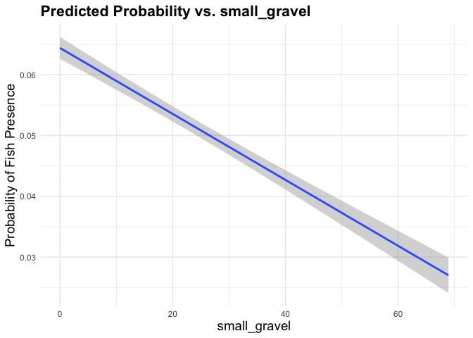

Mini Snorkel Feather HSC Using Logistic Regression
================
Maddee Rubenson
2024-05-06

## Objective

Using the mini snorkel data for the Feather River, produce an HSC that
uses cover, substrate, depth and velocity.

``` r
# read in mini snorkel data
mini_snorkel_model_ready <- read_csv(here::here('data-raw', 'microhabitat_with_fish_observations.csv')) |> 
  mutate(count = ifelse(is.na(count), 0, count),
        fish_presence = as.factor(ifelse(count < 1, "0", "1"))) |> 
  glimpse()
```

    ## Rows: 5018 Columns: 28
    ## ── Column specification ────────────────────────────────────────────────────────
    ## Delimiter: ","
    ## chr   (2): species, channel_geomorphic_unit
    ## dbl  (25): micro_hab_data_tbl_id, location_table_id, transect_code, depth, v...
    ## date  (1): date
    ## 
    ## ℹ Use `spec()` to retrieve the full column specification for this data.
    ## ℹ Specify the column types or set `show_col_types = FALSE` to quiet this message.

    ## Rows: 5,018
    ## Columns: 29
    ## $ micro_hab_data_tbl_id                       <dbl> 18, 18, 18, 19, 20, 21, 22…
    ## $ location_table_id                           <dbl> 11, 11, 11, 11, 11, 11, 11…
    ## $ transect_code                               <dbl> 0.1, 0.1, 0.1, 0.2, 0.3, 0…
    ## $ depth                                       <dbl> 17, 17, 17, 19, 11, 12, 11…
    ## $ velocity                                    <dbl> 0.22, 0.22, 0.22, 0.35, 1.…
    ## $ percent_fine_substrate                      <dbl> 0, 0, 0, 0, 0, 0, 0, 0, 0,…
    ## $ percent_sand_substrate                      <dbl> 40, 40, 40, 50, 25, 0, 70,…
    ## $ percent_small_gravel_substrate              <dbl> 20, 20, 20, 40, 75, 80, 30…
    ## $ percent_large_gravel_substrate              <dbl> 30, 30, 30, 10, 0, 20, 0, …
    ## $ percent_cobble_substrate                    <dbl> 10, 10, 10, 0, 0, 0, 0, 0,…
    ## $ percent_boulder_substrate                   <dbl> 0, 0, 0, 0, 0, 0, 0, 0, 0,…
    ## $ percent_no_cover_inchannel                  <dbl> 75, 75, 75, 100, 100, 100,…
    ## $ percent_small_woody_cover_inchannel         <dbl> 15, 15, 15, 0, 0, 0, 20, 0…
    ## $ percent_large_woody_cover_inchannel         <dbl> 0, 0, 0, 0, 0, 0, 40, 0, 0…
    ## $ percent_submerged_aquatic_veg_inchannel     <dbl> 10, 10, 10, 0, 0, 0, 30, 0…
    ## $ percent_undercut_bank                       <dbl> 0, 0, 0, 0, 0, 0, 0, 0, 0,…
    ## $ percent_no_cover_overhead                   <dbl> 100, 100, 100, 100, 100, 1…
    ## $ percent_cover_half_meter_overhead           <dbl> 0, 0, 0, 0, 0, 0, 0, 0, 0,…
    ## $ percent_cover_more_than_half_meter_overhead <dbl> 0, 0, 0, 0, 0, 0, 0, 0, 0,…
    ## $ surface_turbidity                           <dbl> 20, 20, 20, 30, 30, 30, 10…
    ## $ fish_data_id                                <dbl> 21, 22, 23, NA, NA, NA, 25…
    ## $ count                                       <dbl> 2, 3, 1, 0, 0, 0, 3, 0, 0,…
    ## $ fl_mm                                       <dbl> 35, 35, 25, NA, NA, NA, 25…
    ## $ dist_to_bottom                              <dbl> 1.0, 1.5, 1.5, NA, NA, NA,…
    ## $ focal_velocity                              <dbl> 0.94, 0.16, 0.16, NA, NA, …
    ## $ species                                     <chr> "Chinook salmon", "Chinook…
    ## $ date                                        <date> 2001-03-14, 2001-03-14, 2…
    ## $ channel_geomorphic_unit                     <chr> "Glide", "Glide", "Glide",…
    ## $ fish_presence                               <fct> 1, 1, 1, 0, 0, 0, 1, 0, 0,…

## Pre-process data

#### Normalize Substrate by Prevalence

This table provides a weighting for each substrate type based on the
overall presence (\>20%) of each substrate type. Use this to normalize
the substrate columns.

``` r
substrate_percent <- mini_snorkel_model_ready |> 
  group_by(micro_hab_data_tbl_id) |> 
  select(contains('substrate')) |> 
  distinct() |> 
  pivot_longer(cols = c(percent_fine_substrate:percent_boulder_substrate), names_to = "substrate_type", values_to = "percent") |> 
  mutate(substrate_presence_absence = ifelse(percent < 19, 0, 1)) |>  # 20% threshold
  group_by(substrate_type) |> 
  summarise(total_presence = sum(substrate_presence_absence)) |> 
  ungroup() |> 
  mutate(perc_total = total_presence/sum(total_presence))
```

    ## Adding missing grouping variables: `micro_hab_data_tbl_id`

``` r
knitr::kable(substrate_percent |> mutate(perc_total = perc_total*100), digits = 2)
```

| substrate_type                 | total_presence | perc_total |
|:-------------------------------|---------------:|-----------:|
| percent_boulder_substrate      |            360 |       3.86 |
| percent_cobble_substrate       |           1498 |      16.05 |
| percent_fine_substrate         |            271 |       2.90 |
| percent_large_gravel_substrate |           2919 |      31.27 |
| percent_sand_substrate         |           1385 |      14.84 |
| percent_small_gravel_substrate |           2901 |      31.08 |

Apply substrate normalization values to substrate columns and remove
unnecessary columns

``` r
mini_snorkel_grouped <- mini_snorkel_model_ready |> 
  # filter(species %in% c('Chinook Salmon', 'Steelhead trout (wild)', 'Steelhead trout, (clipped)') | is.na(species)) |> 
  rowwise() |> 
  mutate(fine_substrate = percent_fine_substrate * (1-substrate_percent[substrate_percent$substrate_type == "percent_fine_substrate", 'perc_total']$perc_total),
         sand_substrate = percent_sand_substrate * (1-substrate_percent[substrate_percent$substrate_type == "percent_sand_substrate", 'perc_total']$perc_total),
         small_gravel = percent_small_gravel_substrate * (1-substrate_percent[substrate_percent$substrate_type == "percent_small_gravel_substrate", 'perc_total']$perc_total),
         large_gravel = percent_large_gravel_substrate * (1-substrate_percent[substrate_percent$substrate_type == "percent_large_gravel_substrate", 'perc_total']$perc_total),
         cobble_substrate = percent_cobble_substrate * (1-substrate_percent[substrate_percent$substrate_type == "percent_cobble_substrate", 'perc_total']$perc_total),
         boulder_substrate = percent_boulder_substrate * (1-substrate_percent[substrate_percent$substrate_type == "percent_boulder_substrate", 'perc_total']$perc_total)) |> 
  select(-c(percent_fine_substrate:percent_boulder_substrate)) |> 
  mutate(woody_debris = sum(percent_large_woody_cover_inchannel, percent_small_woody_cover_inchannel),
         overhead_cover = sum(percent_cover_half_meter_overhead, percent_cover_more_than_half_meter_overhead)
         ) |> 
  select(-c(percent_small_woody_cover_inchannel, percent_large_woody_cover_inchannel, percent_cover_more_than_half_meter_overhead, percent_cover_half_meter_overhead)) |> 
  #filter(species == "Chinook salmon" | is.na(species)) |> 
  select(-count, -channel_geomorphic_unit, -micro_hab_data_tbl_id, -location_table_id, -fish_data_id,
         -focal_velocity, -dist_to_bottom, -fl_mm, -species,  -transect_code, -date, -surface_turbidity) |> 
  select(-(contains("no_cover"))) |> 
  distinct() |> 
  na.omit() |> glimpse()
```

    ## Rows: 4,723
    ## Columns: 13
    ## Rowwise: 
    ## $ depth                                   <dbl> 17, 19, 11, 12, 11, 10, 8, 9, …
    ## $ velocity                                <dbl> 0.22, 0.35, 1.95, 2.14, 1.19, …
    ## $ percent_submerged_aquatic_veg_inchannel <dbl> 10, 0, 0, 0, 30, 0, 0, 0, 40, …
    ## $ percent_undercut_bank                   <dbl> 0, 0, 0, 0, 0, 0, 0, 0, 0, 0, …
    ## $ fish_presence                           <fct> 1, 0, 0, 0, 1, 0, 0, 1, 1, 1, …
    ## $ fine_substrate                          <dbl> 0.00000, 0.00000, 0.00000, 0.0…
    ## $ sand_substrate                          <dbl> 34.064710, 42.580887, 21.29044…
    ## $ small_gravel                            <dbl> 13.784015, 27.568031, 51.69005…
    ## $ large_gravel                            <dbl> 20.618170, 6.872723, 0.000000,…
    ## $ cobble_substrate                        <dbl> 8.395115, 0.000000, 0.000000, …
    ## $ boulder_substrate                       <dbl> 0, 0, 0, 0, 0, 0, 0, 0, 0, 0, …
    ## $ woody_debris                            <dbl> 15, 0, 0, 0, 60, 0, 0, 0, 10, …
    ## $ overhead_cover                          <dbl> 0, 0, 0, 0, 0, 0, 0, 0, 25, 0,…

## Logistic Regression: 1 - Using Cover, Substrate, Velocity, and Depth

**Predictors**

- Depth

- Velocity

- Substrate (fine through boulder) normalized by prevalence

- Woody Debris (`percent_small_woody_cover_inchannel` +
  `percent_large_woody_cover_inchannel`)

- Overhead Cover (`percent_cover_more_than_half_meter_overhead` +
  `percent_cover_half_meter_overhead`)

- Submerged Aquatic Vegetation

- Undercut Bank

**Notes**

- Chose to remove surface turbidity from predictors because it is not a
  parameter aligned with the strategic plan. This parameter, however,
  was initially found significant in the logistic regression

**Preliminary Results**

- Significant Predictors include: undercut bank (+), small gravel (-),
  boulder substrate (+), woody debris (+), and overhead cover (+)

#### Build Model

``` r
recipe <- recipe(data = mini_snorkel_grouped, formula = fish_presence ~.) |> 
  # step_poly(all_predictors(), degree = 2) |> x^2
  step_mutate_at(all_numeric_predictors(), fn = asinh) |> # inverse hyperbolic sine as alternative to log that can handle zeros
  step_naomit(all_predictors()) |> # ensure there are no NAs
  step_zv(all_predictors()) |> # ensure there are no columns that are all the same value
  step_normalize(all_numeric_predictors()) # Normalization can facilitate the comparison of the relative importance of different predictors

log_reg <- logistic_reg() |> 
  set_engine("glm") 

log_reg_model <- workflow() |>
  add_recipe(recipe) |>
  add_model(log_reg) |> 
  fit(data = mini_snorkel_grouped)

log_reg_model |> glance()
```

    ## # A tibble: 1 × 8
    ##   null.deviance df.null logLik   AIC   BIC deviance df.residual  nobs
    ##           <dbl>   <int>  <dbl> <dbl> <dbl>    <dbl>       <int> <int>
    ## 1         1933.    4722  -898. 1823. 1907.    1797.        4710  4723

``` r
log_reg_model |> tidy() |> filter(p.value < 0.1)
```

    ## # A tibble: 6 × 5
    ##   term                  estimate std.error statistic       p.value
    ##   <chr>                    <dbl>     <dbl>     <dbl>         <dbl>
    ## 1 (Intercept)             -3.11     0.0761    -40.9  0            
    ## 2 percent_undercut_bank    0.127    0.0380      3.35 0.000806     
    ## 3 small_gravel            -0.175    0.0772     -2.27 0.0234       
    ## 4 boulder_substrate        0.155    0.0661      2.35 0.0188       
    ## 5 woody_debris             0.375    0.0615      6.11 0.00000000101
    ## 6 overhead_cover           0.274    0.0636      4.31 0.0000166

``` r
sig_predictors <- log_reg_model |> tidy() |> filter(p.value < 0.1) |> filter(term != "(Intercept)") |>  pull(term)

predictions <- predict(log_reg_model, mini_snorkel_grouped, type = "prob") |> 
  bind_cols(mini_snorkel_grouped) 
```

### Results

The following predictors were found to significantly effect fish
presence: percent_undercut_bank, small_gravel, boulder_substrate,
woody_debris, overhead_cover

``` r
map(sig_predictors, function(predictor) {
  ggplot(predictions, aes_string(x = predictor, y = ".pred_1")) +
    geom_smooth(method = "glm") +
    labs(title = paste("Predicted Probability vs.", predictor),
         y = 'Probability of Fish Presence')
})
```

    ## [[1]]

<!-- -->

    ## 
    ## [[2]]

<!-- -->

    ## 
    ## [[3]]

<!-- -->

    ## 
    ## [[4]]

<!-- -->

    ## 
    ## [[5]]

<!-- -->

<!-- ### Plots of the geometric mean and 90% Confidence Intervals -->

## Logistic Regression: 2 - Use cover as presence/absence variable

[Beakes et al.
2012](https://www.sfu.ca/biology/faculty/jwmoore/publications/Beakes_etal_RRA_inpress.pdf)
We identified locations with cover when they were within 50 cm of large
woody debris (\>7.5 cm diameter), tall vegetation (\>50 cm above
ground), overhanging vegetation (\<50 cm from water’s surface), large
boulders (\>17.5 cm diameter), undercut banks, large bedrock crevasses
or combinations of these cover types. Areas without cover included
characteristics such as small vegetation, small substrate (\<17.5 cm
diameter) or filamentous algae.

**Predictors**

- Cover Presence (1/0): summation of undercut bank, woody debris,
  overhead cover, and submerged aquatic vegetation and greater than 20%

- Substrate (fine through boulder) normalized by prevalence

- Depth

- Velocity

**Preliminary Results**

- Cover Presence is a significant predictor and the strongest when
  describing probability of fish presence

- Boulder (+) and Small Gravel (-) are also significant predictors

``` r
mini_snork_cover <- mini_snorkel_grouped |> 
  mutate(cover_total = percent_undercut_bank + woody_debris + overhead_cover + percent_submerged_aquatic_veg_inchannel,
         cover_presence = as.factor(ifelse(cover_total >= 20, 1, 0))) |> 
  select(-c(percent_undercut_bank, woody_debris, overhead_cover, percent_submerged_aquatic_veg_inchannel, cover_total)) |> 
  glimpse()
```

    ## Rows: 4,723
    ## Columns: 10
    ## Rowwise: 
    ## $ depth             <dbl> 17, 19, 11, 12, 11, 10, 8, 9, 10, 19, 19, 37, 16, 14…
    ## $ velocity          <dbl> 0.22, 0.35, 1.95, 2.14, 1.19, 1.54, 1.26, 1.97, 0.75…
    ## $ fish_presence     <fct> 1, 0, 0, 0, 1, 0, 0, 1, 1, 1, 1, 1, 1, 0, 0, 1, 1, 0…
    ## $ fine_substrate    <dbl> 0.00000, 0.00000, 0.00000, 0.00000, 0.00000, 0.00000…
    ## $ sand_substrate    <dbl> 34.064710, 42.580887, 21.290444, 0.000000, 59.613242…
    ## $ small_gravel      <dbl> 13.784015, 27.568031, 51.690058, 55.136062, 20.67602…
    ## $ large_gravel      <dbl> 20.618170, 6.872723, 0.000000, 13.745447, 0.000000, …
    ## $ cobble_substrate  <dbl> 8.395115, 0.000000, 0.000000, 0.000000, 0.000000, 0.…
    ## $ boulder_substrate <dbl> 0, 0, 0, 0, 0, 0, 0, 0, 0, 0, 0, 0, 0, 0, 0, 0, 0, 0…
    ## $ cover_presence    <fct> 1, 0, 0, 0, 1, 0, 0, 0, 1, 0, 0, 0, 1, 0, 0, 0, 1, 0…

``` r
recipe <- recipe(data = mini_snork_cover, formula = fish_presence ~.) |> 
  # step_poly(all_predictors(), degree = 2) |> x^2
  step_mutate_at(all_numeric_predictors(), fn = asinh) |> # inverse hyperbolic sine as alternative to log that can handle zeros
  step_naomit(all_predictors()) |> # ensure there are no NAs
  step_zv(all_predictors()) |> # ensure there are no columns that are all the same value
  step_normalize(all_numeric_predictors()) # Normalization can facilitate the comparison of the relative importance of different predictors

log_reg <- logistic_reg() |> 
  set_engine("glm") 

log_reg_model <- workflow() |>
  add_recipe(recipe) |>
  add_model(log_reg) |> 
  fit(data = mini_snork_cover)

log_reg_model |> glance()
```

    ## # A tibble: 1 × 8
    ##   null.deviance df.null logLik   AIC   BIC deviance df.residual  nobs
    ##           <dbl>   <int>  <dbl> <dbl> <dbl>    <dbl>       <int> <int>
    ## 1         1933.    4722  -933. 1887. 1951.    1867.        4713  4723

``` r
log_reg_model |> tidy() |> filter(p.value < 0.1)
```

    ## # A tibble: 4 × 5
    ##   term              estimate std.error statistic   p.value
    ##   <chr>                <dbl>     <dbl>     <dbl>     <dbl>
    ## 1 (Intercept)         -2.56     0.0976    -26.2  9.09e-152
    ## 2 small_gravel        -0.195    0.0756     -2.58 9.84e-  3
    ## 3 boulder_substrate    0.149    0.0658      2.26 2.40e-  2
    ## 4 cover_presence0     -0.741    0.142      -5.20 1.97e-  7

``` r
sig_predictors <- log_reg_model |> tidy() |> filter(p.value < 0.1) |> filter(term != "(Intercept)") |>  pull(term)

predictions <- predict(log_reg_model, mini_snork_cover, type = "prob") |> 
  bind_cols(mini_snork_cover) 
```

#### Results

The following predictors were found to significantly effect fish
presence: small_gravel, boulder_substrate, cover_presence0

``` r
ggplot(predictions, aes(x = cover_presence, y = .pred_1)) +
    geom_boxplot() +
    labs(title = "Predicted Probability vs. cover presence",
         y = 'Probability of Fish Presence')
```

<!-- -->

``` r
map(sig_predictors[1:2], function(predictor) {
  ggplot(predictions, aes_string(x = predictor, y = ".pred_1")) +
    geom_smooth(method = "glm") +
    labs(title = paste("Predicted Probability vs.", predictor),
         y = 'Probability of Fish Presence')
})
```

    ## [[1]]

    ## `geom_smooth()` using formula = 'y ~ x'

<!-- -->

    ## 
    ## [[2]]

    ## `geom_smooth()` using formula = 'y ~ x'

<!-- -->

## Next steps

1.  Compare to species presence/absence
2.  Look into methods for creating a more even sample of fish
    presence/absence that does not create a synthetic dataset
3.  Continue exploring methods for normalization and tuning parameters
    and adding interactions between parameters
4.  Explore using a fixed effect - such as geomorphic unit (pool, glide,
    riffle) or river mile

``` r
knitr::knit_exit()
```
