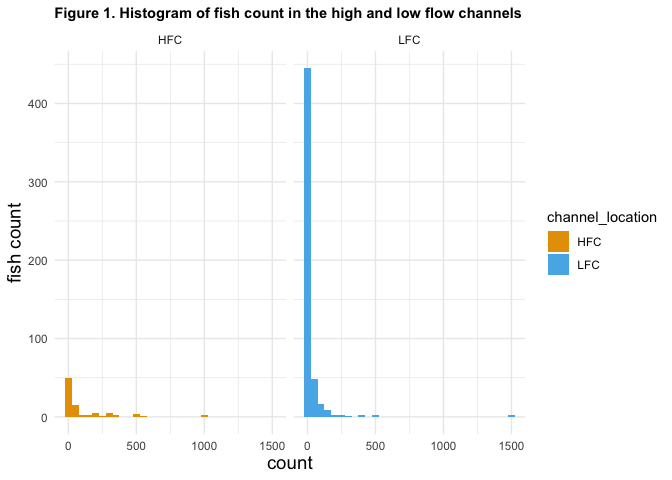
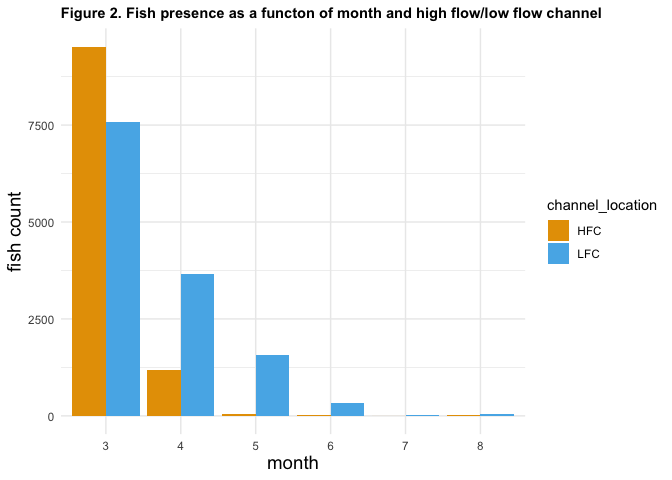
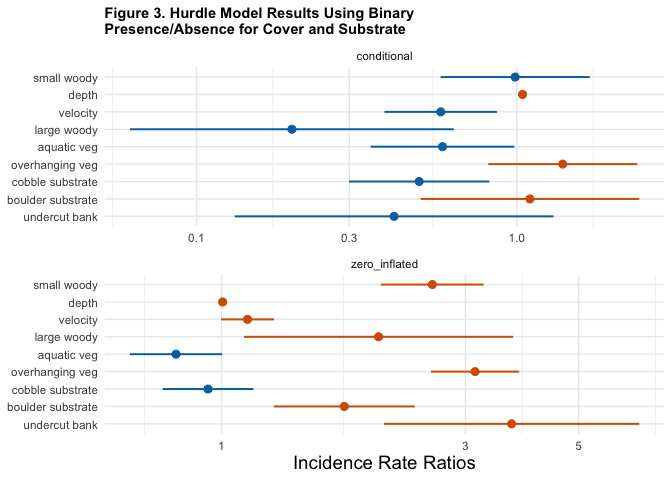

Mini Snorkel Feather Presence/Absence Model
================
Maddee Rubenson
2026-01-05

- [Objective](#objective)
- [Methodology](#methodology)
  - [Hurdle Models and
    Interpretation](#hurdle-models-and-interpretation)
- [Build Models](#build-models)
  - [Read in data](#read-in-data)
  - [Review Data](#review-data)
  - [High Flow vs. Low Flow Channel](#high-flow-vs-low-flow-channel)
- [The Binary Predictor Model](#the-binary-predictor-model)
- [What is next?](#what-is-next)

## Objective

Develop a model that reflects the significance of cover, substrate,
depth, and velocity on fish presence and absence.

## Methodology

Model was developed using [Feather River Mini Snorkel
Data](https://github.com/FlowWest/feather-mini-snorkel). The data is
structured with a numeric fish count variable that can be converted to a
binary presence/absence. Logistic regression models were tested using
the presence/absence as the response and cover, substrate, depth and
velocity as the explanatory variables. However, due to the skewness of
absence values, none of the developed models were well fit to the data.
Based on a Gard 2024 paper (in-review), we decided to explore the use of
hurdle models. Hurdle models excel with data types that are heavily
skewed towards absence.

### Hurdle Models and Interpretation

A hurdle model was used in Gard 2024 (in-review) to test for the effects
of cover and habitat type on the total abundance of Chinook salmon at
both site and cell level. Here we use the hurdle model to help
understand the influence of velocity, depth, and cover on fish count and
presence/absence.

**Hurdle Models**

Hurdle models are used when count data has an excess of zeros. These
models can be understood as a mixture of two subset of populations. In
one subset, we have a usual count model that may or may not generate
zero, and the other subset only produce zero count.

A hurdle model models excess zeroes separately from the rest of the
data. The zero counts are modeled as a binary response variable and the
positive counts are modeled using poisson distribution.

*Interpreting a Hurdle Model*

The binary part of the model helps identify factors that influence the
presence/absence of fish. The coefficients of the zero part of the
hurdle model represent the odds ratio of observing at least one fish.

The count part of the model estimate the effects of predictor variables
on the count outcome, excluding all zero counts. Coefficients of counts
represent rate ratios of one or more fish observed.

The Incidence Result Ratio (IRR) in the count part of the model (count
\> 0) represent the multiplicative effect of a one-unit change in a
predictor variable on the expected count of non-zero observations,
assuming all other variables are held constant. For example, if the IRR
for a predictor is 1.2, it means that a one-unit increase in that
predictor is associated with a 20% increase in the expected count of
non-zero observations, assuming all other variables remain constant. For
the binary part of the model - if the coefficient for a predictor in the
binary part of the hurdle model is 0.5, it means that a one-unit
increase in the predictor is associated with a 50% increase in the odds
of having a zero count versus a positive count, assuming all other
variables are held constant.

## Build Models

### Read in data

    ## Rows: 9,827
    ## Columns: 44
    ## $ micro_hab_data_tbl_id                       <dbl> 18, 18, 18, 19, 20, 21, 22…
    ## $ location_table_id                           <dbl> 11, 11, 11, 11, 11, 11, 11…
    ## $ transect_code                               <dbl> 0.1, 0.1, 0.1, 0.2, 0.3, 0…
    ## $ fish_data_id                                <dbl> 21, 22, 23, NA, NA, NA, 25…
    ## $ date                                        <date> 2001-03-14, 2001-03-14, 2…
    ## $ count                                       <dbl> 2, 3, 1, 0, 0, 0, 3, 0, 0,…
    ## $ species                                     <chr> "chinook salmon", "chinook…
    ## $ fl_mm                                       <dbl> 35, 35, 25, NA, NA, NA, 25…
    ## $ dist_to_bottom                              <dbl> 1.0, 1.5, 1.5, NA, NA, NA,…
    ## $ depth                                       <dbl> 17, 17, 17, 19, 11, 12, 11…
    ## $ focal_velocity                              <dbl> 0.94, 0.16, 0.16, NA, NA, …
    ## $ velocity                                    <dbl> 0.22, 0.22, 0.22, 0.35, 1.…
    ## $ surface_turbidity                           <dbl> 20, 20, 20, 30, 30, 30, 10…
    ## $ percent_fine_substrate                      <dbl> 0, 0, 0, 0, 0, 0, 0, 0, 0,…
    ## $ percent_sand_substrate                      <dbl> 40, 40, 40, 50, 25, 0, 70,…
    ## $ percent_small_gravel_substrate              <dbl> 20, 20, 20, 40, 75, 80, 30…
    ## $ percent_large_gravel_substrate              <dbl> 30, 30, 30, 10, 0, 20, 0, …
    ## $ percent_cobble_substrate                    <dbl> 10, 10, 10, 0, 0, 0, 0, 0,…
    ## $ percent_boulder_substrate                   <dbl> 0, 0, 0, 0, 0, 0, 0, 0, 0,…
    ## $ percent_no_cover_inchannel                  <dbl> 75, 75, 75, 100, 100, 100,…
    ## $ percent_small_woody_cover_inchannel         <dbl> 15, 15, 15, 0, 0, 0, 20, 0…
    ## $ percent_large_woody_cover_inchannel         <dbl> 0, 0, 0, 0, 0, 0, 40, 0, 0…
    ## $ percent_submerged_aquatic_veg_inchannel     <dbl> 10, 10, 10, 0, 0, 0, 30, 0…
    ## $ percent_undercut_bank                       <dbl> 0, 0, 0, 0, 0, 0, 0, 0, 0,…
    ## $ percent_no_cover_overhead                   <dbl> 100, 100, 100, 100, 100, 1…
    ## $ percent_cover_half_meter_overhead           <dbl> 0, 0, 0, 0, 0, 0, 0, 0, 0,…
    ## $ percent_cover_more_than_half_meter_overhead <dbl> 0, 0, 0, 0, 0, 0, 0, 0, 0,…
    ## $ channel_geomorphic_unit                     <chr> "glide", "glide", "glide",…
    ## $ location                                    <chr> "hatchery ditch", "hatcher…
    ## $ water_temp                                  <dbl> 47, 47, 47, 47, 47, 47, 47…
    ## $ weather                                     <chr> "direct sunlight", "direct…
    ## $ river_mile                                  <dbl> 66.6, 66.6, 66.6, 66.6, 66…
    ## $ flow                                        <dbl> 12, 12, 12, 12, 12, 12, 12…
    ## $ number_of_divers                            <dbl> 3, 3, 3, 3, 3, 3, 3, 3, 3,…
    ## $ reach_length                                <dbl> 25, 25, 25, 25, 25, 25, 25…
    ## $ reach_width                                 <dbl> 4, 4, 4, 4, 4, 4, 4, 4, 4,…
    ## $ channel_width                               <dbl> 7, 7, 7, 7, 7, 7, 7, 7, 7,…
    ## $ channel_type                                <chr> "sidechannel", "sidechanne…
    ## $ longitude                                   <dbl> -121.5588, -121.5588, -121…
    ## $ latitude                                    <dbl> 39.51602, 39.51602, 39.516…
    ## $ channel_location                            <chr> "LFC", "LFC", "LFC", "LFC"…
    ## $ coordinate_method                           <chr> "assigned based on similar…
    ## $ fish_presence                               <fct> 1, 1, 1, 0, 0, 0, 1, 0, 0,…
    ## $ month                                       <dbl> 3, 3, 3, 3, 3, 3, 3, 3, 3,…

### Review Data

#### Outliers

There are two `count` outliers, one in the high flow and one in the low
flow channel (figure 1), however their removal did not impact the model
results so they were kept in the dataset.

We thought that by removing values greater than 250 this would limit
overdispersion in the count model, however, this did not help.

<!-- -->

### High Flow vs. Low Flow Channel

Table 1 and figure 2 explore whether fish presence was impacted by the
high or low flow channels. Overall there are similar numbers of fish
present in the high flow channel compared to the low flow channel (table
1). There are more fish present in the high flow channel in March but
they move quickly downstream. Fish remain in the low flow channel for
much longer time (figure 2).

do we have the same amount of sampling plots in the high flow vs. low
flow?

| channel_location |     n |
|:-----------------|------:|
| HFC              | 10796 |
| LFC              | 13223 |

Table 1. Total count of fish between high flow and low flow channels

<!-- -->
\### Variables of Interest

The variables of interest include cover, substrate, velocity and depth
variables known to be important for salmon rearing habitat.

- Velocity - numeric
- Depth - numeric

Substrate and cover variables are measured as percentages which can also
be modeled as binary by establishing a threshold percentage. Overhanging
vegetation was measured at 1/2 meter overhead and more than 1/2 meter
overhead. These categories were combined for simplicity and for
comparison with other studies, such as those by Mark Gard.

- Undercut bank
- Aquatic vegetation
- Overhanging vegetation
- Small woody cover
- Large woody cover
- Boulder substrate
- Cobble substrate

Data was collected between March through August, however, outmigration
affects fish presence later in the season. We do not include month as it
is a strong predictor of fish presence. The analysis could be limited to
focus on the month with most observations (March), though including all
months also makes sense if seeking to determine variables that are
stable throughout time.

The conditions in the HFC and LFC are quite different and some initial
exploration was done to explore this by creating separate models for the
LFC and HFC. The results did not differ significantly. Spatial nuances
may best be explored at the site level.

## The Binary Predictor Model

This model utilizes binary cover and substate variables. The results do
not differ that much from using the absolute percentage variables for
cover and substrate.

- The count model has extremely high overdispersion. This is not
  surprising as most of the count variables are 1 with few observations
  greater than 1.
- The intercept of the zero model is significant. This is not surprising
  as the number of zeros is nearly 96%.

<!-- -->

    ## Rows: 8,588
    ## Columns: 20
    ## $ count                                       <dbl> 2, 3, 1, 0, 0, 0, 3, 0, 0,…
    ## $ channel_location                            <chr> "LFC", "LFC", "LFC", "LFC"…
    ## $ depth                                       <dbl> 17, 17, 17, 19, 11, 12, 11…
    ## $ velocity                                    <dbl> 0.22, 0.22, 0.22, 0.35, 1.…
    ## $ percent_small_woody_cover_inchannel         <dbl> 15, 15, 15, 0, 0, 0, 20, 0…
    ## $ percent_large_woody_cover_inchannel         <dbl> 0, 0, 0, 0, 0, 0, 40, 0, 0…
    ## $ percent_submerged_aquatic_veg_inchannel     <dbl> 10, 10, 10, 0, 0, 0, 30, 0…
    ## $ percent_cover_half_meter_overhead           <dbl> 0, 0, 0, 0, 0, 0, 0, 0, 0,…
    ## $ percent_cover_more_than_half_meter_overhead <dbl> 0, 0, 0, 0, 0, 0, 0, 0, 0,…
    ## $ percent_cobble_substrate                    <dbl> 10, 10, 10, 0, 0, 0, 0, 0,…
    ## $ percent_boulder_substrate                   <dbl> 0, 0, 0, 0, 0, 0, 0, 0, 0,…
    ## $ percent_undercut_bank                       <dbl> 0, 0, 0, 0, 0, 0, 0, 0, 0,…
    ## $ month                                       <dbl> 3, 3, 3, 3, 3, 3, 3, 3, 3,…
    ## $ small_woody                                 <dbl> 0, 0, 0, 0, 0, 0, 1, 0, 0,…
    ## $ large_woody                                 <dbl> 0, 0, 0, 0, 0, 0, 1, 0, 0,…
    ## $ boulder_substrate                           <dbl> 0, 0, 0, 0, 0, 0, 0, 0, 0,…
    ## $ cobble_substrate                            <dbl> 0, 0, 0, 0, 0, 0, 0, 0, 0,…
    ## $ undercut_bank                               <dbl> 0, 0, 0, 0, 0, 0, 0, 0, 0,…
    ## $ aquatic_veg                                 <dbl> 0, 0, 0, 0, 0, 0, 1, 0, 0,…
    ## $ overhanging_veg                             <dbl> 0, 0, 0, 0, 0, 0, 0, 0, 0,…

    ## Start:  AIC=8146.36
    ## count ~ small_woody + depth + velocity + large_woody + aquatic_veg + 
    ##     overhanging_veg + cobble_substrate + boulder_substrate + 
    ##     undercut_bank
    ## 
    ##                     Df    AIC
    ## <none>                 8146.4
    ## - cobble_substrate   2 8149.2
    ## - aquatic_veg        2 8150.1
    ## - large_woody        2 8151.7
    ## - velocity           2 8152.1
    ## - boulder_substrate  2 8153.1
    ## - undercut_bank      2 8161.2
    ## - small_woody        2 8201.3
    ## - depth              2 8220.6
    ## - overhanging_veg    2 8263.7

    ## 
    ## Call:
    ## pscl::hurdle(formula = count ~ small_woody + depth + velocity + large_woody + 
    ##     aquatic_veg + overhanging_veg + cobble_substrate + boulder_substrate + 
    ##     undercut_bank, data = hurdle_data, dist = "negbin")
    ## 
    ## Pearson residuals:
    ##      Min       1Q   Median       3Q      Max 
    ## -0.48559 -0.12086 -0.09607 -0.09047 69.94822 
    ## 
    ## Count model coefficients (truncated negbin with log link):
    ##                     Estimate Std. Error z value         Pr(>|z|)    
    ## (Intercept)       -12.061979 271.650391  -0.044          0.96458    
    ## small_woody        -0.011378   0.273296  -0.042          0.96679    
    ## depth               0.041843   0.005928   7.058 0.00000000000169 ***
    ## velocity           -0.546273   0.206455  -2.646          0.00815 ** 
    ## large_woody        -1.616325   0.593838  -2.722          0.00649 ** 
    ## aquatic_veg        -0.533816   0.263566  -2.025          0.04283 *  
    ## overhanging_veg     0.330892   0.273314   1.211          0.22602    
    ## cobble_substrate   -0.701161   0.257473  -2.723          0.00646 ** 
    ## boulder_substrate   0.095215   0.400779   0.238          0.81221    
    ## undercut_bank      -0.881527   0.584902  -1.507          0.13178    
    ## Log(theta)        -16.602149 271.650310  -0.061          0.95127    
    ## Zero hurdle model coefficients (binomial with logit link):
    ##                    Estimate Std. Error z value             Pr(>|z|)    
    ## (Intercept)       -3.224641   0.090605 -35.590 < 0.0000000000000002 ***
    ## small_woody        0.949806   0.117876   8.058 0.000000000000000778 ***
    ## depth              0.005342   0.001747   3.058             0.002231 ** 
    ## velocity           0.117256   0.060909   1.925             0.054216 .  
    ## large_woody        0.707673   0.309299   2.288             0.022138 *  
    ## aquatic_veg       -0.204973   0.105741  -1.938             0.052568 .  
    ## overhanging_veg    1.142434   0.101445  11.262 < 0.0000000000000002 ***
    ## cobble_substrate  -0.060772   0.104507  -0.582             0.560897    
    ## boulder_substrate  0.553204   0.161925   3.416             0.000635 ***
    ## undercut_bank      1.307208   0.293324   4.457 0.000008329482674658 ***
    ## ---
    ## Signif. codes:  0 '***' 0.001 '**' 0.01 '*' 0.05 '.' 0.1 ' ' 1 
    ## 
    ## Theta: count = 0
    ## Number of iterations in BFGS optimization: 45 
    ## Log-likelihood: -4052 on 21 Df

<!-- -->

## What is next?

- Evaluate model performance. How well is this model doing? Is it worth
  continuing with this?
- Reconsider using a standard logistic regression but applying special
  handling to interpret the results. For instance if 95% of observations
  are 0 then the model could predict all zeros and still perform pretty
  well.
