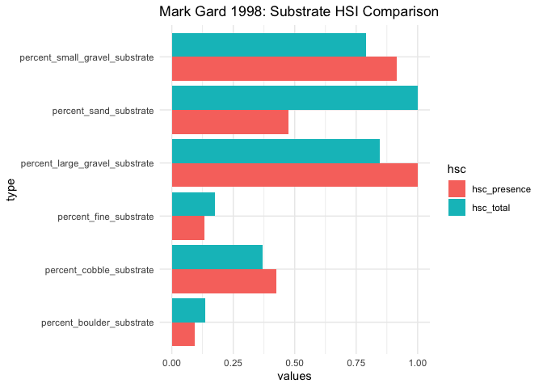
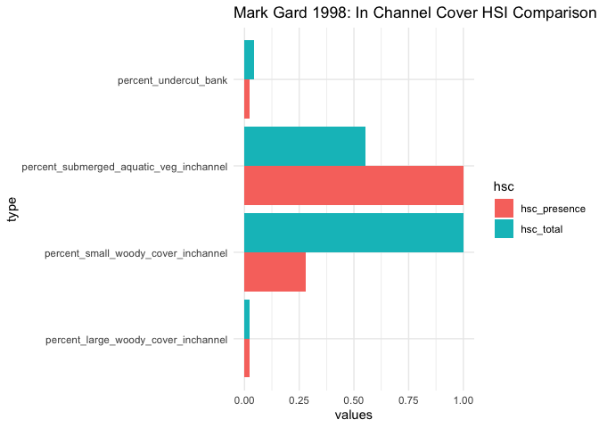
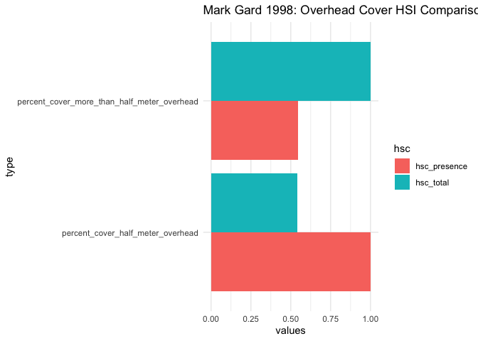
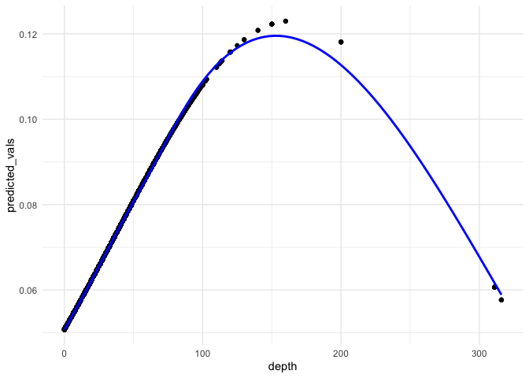
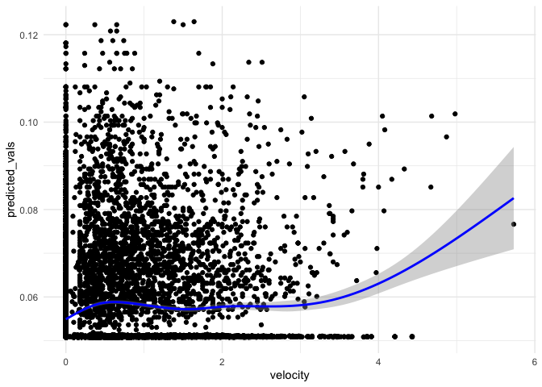

Mini Snorkel Feather HSI Analysis Exploration
================
Maddee Rubenson
2024-11-01

## Objective

The following markdown reviews and compares literature approaches to
calculating HSIs and is meant to be an exploratory analysis.

## Literature Notes

[**2004a**](https://netorg629193.sharepoint.com/:b:/s/VA-FeatherRiver/EY9qLwY15ypFn3W42E02takBH745JkefSPAbS4y9VFzuBQ?e=n2QRXK)
Data Analysis

- Stepwise binary logistic regression analysis was used to assess
  factors influencing the occurrence of steelhead and Chinook salmon.
  Fine scale survey results were analyzed at both the mesohabitat (100
  m2) and microhabitat (1 m2) scale.

- Mesohabitat analysis was performed by treating the entire 25 m reach
  as a sample

- Reach habitat variables where steelhead or salmon were present
  (logistic response variable) were compared to reaches where fish were
  absent (logistic reference variable)

- Microhabitat was done similarly except that individual one square
  meter cells were considered rather than entire reaches

- Reaches lacking salmon or steelhead were not included in microhabitat
  analysis

[**2005**](https://netorg629193.sharepoint.com/:b:/s/VA-FeatherRiver/ES8H3f7ZUO5Aj7OK8hfW03UB721tCgZd_OEb8P9cbJLiMA?e=L95bf8):
HSC development- chinook salmon rearing

- HSC were created for fry (\<50 mm) and juvenile Chinook salmon depth
  and mean column velocity data using a three-point running mean to
  smooth frequency distributions of the fry habitat use data and using
  NPTL \[what does this stand for?\] for the juvenile habitat use data.

- all substrate suitability given value of 1 after finding that
  substrate was not driving factor for microhabitat selection of fry and
  juveniles

- cover modified to: with and without. Suitability of without cover was
  calculated as the percentage of fish observed without cover to the
  total sample size

- suitability of cover present was assigned a value of 1.0 and 0.30 or
  0.22 for cover absent for Chinook salon fry and juveniles \[I do not
  get this… \]

- Focus on suitability of instream cover. When a cover variable did not
  exist, preference for low velocity and shallow depth in a large river
  indicate suitable habitat along stream margins or out in the main
  channel when the river is nearly dry and the preferred conditions are
  prevalent.

- intermediate scale data separated into four cover types: no cover,
  object only cover overhead only cover, both object and overhead cover

[**Gard
2023**](https://netorg629193.sharepoint.com/:b:/s/VA-FeatherRiver/EelfImRfhzxKjLQdrstbIPgBqbRV5S0Wke5GkSh06_CUrQ?e=6PdWKh) -
HSC comparison

- Presence/absence HSC are developed using a polynomial logistic
  regression that uses both the occupied and unoccupied data; the
  results are then rescaled that the highest value is 1 to calculate the
  HSI

- For depth and velocity HSC, the criteria were developed directly from
  use observations using a range of curve fitting and smoothing
  techniques

- Use/availability criteria are developed by dividing use observations,
  generally binned, by availability data from transects

``` r
# read in mini snorkel data
res <- read_data_entity_names(packageId = "edi.1705.2")
raw <- read_data_entity(packageId = "edi.1705.2", entityId = res$entityId[1])
locations_raw <- read_csv(file = raw)
```

    ## Rows: 580 Columns: 16
    ## ── Column specification ────────────────────────────────────────────────────────
    ## Delimiter: ","
    ## chr   (5): location, channel_location, weather, channel_type, coordinate_method
    ## dbl  (10): location_table_id, water_temp, flow, number_of_divers, reach_leng...
    ## date  (1): date
    ## 
    ## ℹ Use `spec()` to retrieve the full column specification for this data.
    ## ℹ Specify the column types or set `show_col_types = FALSE` to quiet this message.

``` r
raw <- read_data_entity(packageId = "edi.1705.2", entityId = res$entityId[2])
fish_raw <- read_csv(file = raw)
```

    ## Rows: 9827 Columns: 28
    ## ── Column specification ────────────────────────────────────────────────────────
    ## Delimiter: ","
    ## chr   (2): species, channel_geomorphic_unit
    ## dbl  (25): micro_hab_data_tbl_id, location_table_id, transect_code, fish_dat...
    ## date  (1): date
    ## 
    ## ℹ Use `spec()` to retrieve the full column specification for this data.
    ## ℹ Specify the column types or set `show_col_types = FALSE` to quiet this message.

``` r
mini_snorkel_model_ready <- fish_raw |> left_join(locations_raw |> distinct()) |> 
  mutate(count = ifelse(is.na(count), 0, count),
        fish_presence = as.factor(ifelse(count < 1, "0", "1")),
        month = month(date)) |> 
  glimpse()
```

    ## Joining with `by = join_by(location_table_id, date)`

    ## Warning in left_join(fish_raw, distinct(locations_raw)): Detected an unexpected many-to-many relationship between `x` and `y`.
    ## ℹ Row 5032 of `x` matches multiple rows in `y`.
    ## ℹ Row 1 of `y` matches multiple rows in `x`.
    ## ℹ If a many-to-many relationship is expected, set `relationship =
    ##   "many-to-many"` to silence this warning.

    ## Rows: 17,882
    ## Columns: 44
    ## $ micro_hab_data_tbl_id                       <dbl> 18, 18, 18, 19, 20, 21, 22…
    ## $ location_table_id                           <dbl> 11, 11, 11, 11, 11, 11, 11…
    ## $ transect_code                               <dbl> 0.1, 0.1, 0.1, 0.2, 0.3, 0…
    ## $ fish_data_id                                <dbl> 21, 22, 23, NA, NA, NA, 25…
    ## $ date                                        <date> 2001-03-14, 2001-03-14, 2…
    ## $ count                                       <dbl> 2, 3, 1, 0, 0, 0, 3, 0, 0,…
    ## $ species                                     <chr> "chinook salmon", "chinook…
    ## $ fl_mm                                       <dbl> 35, 35, 25, NA, NA, NA, 25…
    ## $ dist_to_bottom                              <dbl> 1.0, 1.5, 1.5, NA, NA, NA,…
    ## $ depth                                       <dbl> 17, 17, 17, 19, 11, 12, 11…
    ## $ focal_velocity                              <dbl> 0.94, 0.16, 0.16, NA, NA, …
    ## $ velocity                                    <dbl> 0.22, 0.22, 0.22, 0.35, 1.…
    ## $ surface_turbidity                           <dbl> 20, 20, 20, 30, 30, 30, 10…
    ## $ percent_fine_substrate                      <dbl> 0, 0, 0, 0, 0, 0, 0, 0, 0,…
    ## $ percent_sand_substrate                      <dbl> 40, 40, 40, 50, 25, 0, 70,…
    ## $ percent_small_gravel_substrate              <dbl> 20, 20, 20, 40, 75, 80, 30…
    ## $ percent_large_gravel_substrate              <dbl> 30, 30, 30, 10, 0, 20, 0, …
    ## $ percent_cobble_substrate                    <dbl> 10, 10, 10, 0, 0, 0, 0, 0,…
    ## $ percent_boulder_substrate                   <dbl> 0, 0, 0, 0, 0, 0, 0, 0, 0,…
    ## $ percent_no_cover_inchannel                  <dbl> 75, 75, 75, 100, 100, 100,…
    ## $ percent_small_woody_cover_inchannel         <dbl> 15, 15, 15, 0, 0, 0, 20, 0…
    ## $ percent_large_woody_cover_inchannel         <dbl> 0, 0, 0, 0, 0, 0, 40, 0, 0…
    ## $ percent_submerged_aquatic_veg_inchannel     <dbl> 10, 10, 10, 0, 0, 0, 30, 0…
    ## $ percent_undercut_bank                       <dbl> 0, 0, 0, 0, 0, 0, 0, 0, 0,…
    ## $ percent_no_cover_overhead                   <dbl> 100, 100, 100, 100, 100, 1…
    ## $ percent_cover_half_meter_overhead           <dbl> 0, 0, 0, 0, 0, 0, 0, 0, 0,…
    ## $ percent_cover_more_than_half_meter_overhead <dbl> 0, 0, 0, 0, 0, 0, 0, 0, 0,…
    ## $ channel_geomorphic_unit                     <chr> "glide", "glide", "glide",…
    ## $ location                                    <chr> "hatchery ditch", "hatcher…
    ## $ channel_location                            <chr> "LFC", "LFC", "LFC", "LFC"…
    ## $ water_temp                                  <dbl> 47, 47, 47, 47, 47, 47, 47…
    ## $ weather                                     <chr> "direct sunlight", "direct…
    ## $ flow                                        <dbl> 12, 12, 12, 12, 12, 12, 12…
    ## $ number_of_divers                            <dbl> 3, 3, 3, 3, 3, 3, 3, 3, 3,…
    ## $ reach_length                                <dbl> 25, 25, 25, 25, 25, 25, 25…
    ## $ reach_width                                 <dbl> 4, 4, 4, 4, 4, 4, 4, 4, 4,…
    ## $ channel_width                               <dbl> 7, 7, 7, 7, 7, 7, 7, 7, 7,…
    ## $ channel_type                                <chr> "sidechannel", "sidechanne…
    ## $ river_mile                                  <dbl> 66.6, 66.6, 66.6, 66.6, 66…
    ## $ coordinate_method                           <chr> "assigned based on similar…
    ## $ latitude                                    <dbl> 39.51602, 39.51602, 39.516…
    ## $ longitude                                   <dbl> -121.5588, -121.5588, -121…
    ## $ fish_presence                               <fct> 1, 1, 1, 0, 0, 0, 1, 0, 0,…
    ## $ month                                       <dbl> 3, 3, 3, 3, 3, 3, 3, 3, 3,…

<!-- ### Explore Variables -->
<!-- Specifically looking for collinearity in the variables -->

### Logistic Regression Using Cover, Substrate, Velocity, and Depth

**Predictors**

- Depth

- Velocity

- Substrate (fine through boulder) normalized by prevalence

- Woody Debris (`percent_small_woody_cover_inchannel` +
  `percent_large_woody_cover_inchannel`)

- Overhead Cover (`percent_cover_more_than_half_meter_overhead` +
  `percent_cover_half_meter_overhead`)

- Submerged Aquatic Vegetation

- Undercut Bank

- Surface Turbidity

#### Normalize Substrate by Prevalence

This table provides a weighting for each substrate type based on the
overall presence (\>20%) of each substrate type. Use this to normalize
the substrate columns.

``` r
substrate_percent <- mini_snorkel_model_ready |> 
  group_by(micro_hab_data_tbl_id) |> 
  select(contains('substrate')) |> 
  distinct() |> 
  pivot_longer(cols = c(percent_fine_substrate:percent_boulder_substrate), names_to = "substrate_type", values_to = "percent") |> 
  mutate(substrate_presence_absence = ifelse(percent < 19, 0, 1)) |>  # 20% threshold
  group_by(substrate_type) |> 
  summarise(total_presence = sum(substrate_presence_absence)) |> 
  ungroup() |> 
  mutate(perc_total = total_presence/sum(total_presence))
```

    ## Adding missing grouping variables: `micro_hab_data_tbl_id`

``` r
knitr::kable(substrate_percent |> mutate(perc_total = perc_total*100), digits = 2)
```

| substrate_type                 | total_presence | perc_total |
|:-------------------------------|---------------:|-----------:|
| percent_boulder_substrate      |             NA |         NA |
| percent_cobble_substrate       |             NA |         NA |
| percent_fine_substrate         |            710 |         NA |
| percent_large_gravel_substrate |           5879 |         NA |
| percent_sand_substrate         |           2571 |         NA |
| percent_small_gravel_substrate |           5532 |         NA |

#### Apply table to substrate columns to normalize

``` r
mini_snorkel_grouped <- mini_snorkel_model_ready |> 
  rowwise() |> 
  mutate(fine_substrate = percent_fine_substrate * (1-substrate_percent[substrate_percent$substrate_type == "percent_fine_substrate", 'perc_total']$perc_total),
         sand_substrate = percent_sand_substrate * (1-substrate_percent[substrate_percent$substrate_type == "percent_sand_substrate", 'perc_total']$perc_total),
         small_gravel = percent_small_gravel_substrate * (1-substrate_percent[substrate_percent$substrate_type == "percent_small_gravel_substrate", 'perc_total']$perc_total),
         large_gravel = percent_large_gravel_substrate * (1-substrate_percent[substrate_percent$substrate_type == "percent_large_gravel_substrate", 'perc_total']$perc_total),
         cobble_substrate = percent_cobble_substrate * (1-substrate_percent[substrate_percent$substrate_type == "percent_cobble_substrate", 'perc_total']$perc_total),
         boulder_substrate = percent_boulder_substrate * (1-substrate_percent[substrate_percent$substrate_type == "percent_boulder_substrate", 'perc_total']$perc_total)) |> 
  select(-c(percent_fine_substrate:percent_boulder_substrate)) |> 
  mutate(woody_debris = sum(percent_large_woody_cover_inchannel, percent_small_woody_cover_inchannel),
         overhead_cover = sum(percent_cover_half_meter_overhead, percent_cover_more_than_half_meter_overhead)
         ) |> 
  select(-c(percent_small_woody_cover_inchannel, percent_large_woody_cover_inchannel, percent_cover_more_than_half_meter_overhead, percent_cover_half_meter_overhead)) |> 
  #filter(species == "Chinook salmon" | is.na(species)) |> 
  select(-count, -channel_geomorphic_unit, -micro_hab_data_tbl_id, -location_table_id, -fish_data_id,
         -focal_velocity, -dist_to_bottom, -fl_mm, -species,  -transect_code, -date) |> 
  select(-(contains("no_cover"))) |> 
  distinct() |> 
  na.omit() |> 
  glimpse()
```

    ## Rows: 0
    ## Columns: 29
    ## Rowwise: 
    ## $ depth                                   <dbl> 
    ## $ velocity                                <dbl> 
    ## $ surface_turbidity                       <dbl> 
    ## $ percent_submerged_aquatic_veg_inchannel <dbl> 
    ## $ percent_undercut_bank                   <dbl> 
    ## $ location                                <chr> 
    ## $ channel_location                        <chr> 
    ## $ water_temp                              <dbl> 
    ## $ weather                                 <chr> 
    ## $ flow                                    <dbl> 
    ## $ number_of_divers                        <dbl> 
    ## $ reach_length                            <dbl> 
    ## $ reach_width                             <dbl> 
    ## $ channel_width                           <dbl> 
    ## $ channel_type                            <chr> 
    ## $ river_mile                              <dbl> 
    ## $ coordinate_method                       <chr> 
    ## $ latitude                                <dbl> 
    ## $ longitude                               <dbl> 
    ## $ fish_presence                           <fct> 
    ## $ month                                   <dbl> 
    ## $ fine_substrate                          <dbl> 
    ## $ sand_substrate                          <dbl> 
    ## $ small_gravel                            <dbl> 
    ## $ large_gravel                            <dbl> 
    ## $ cobble_substrate                        <dbl> 
    ## $ boulder_substrate                       <dbl> 
    ## $ woody_debris                            <dbl> 
    ## $ overhead_cover                          <dbl>

## Logistic Regression for Substrate and Cover

Build a logistic regression of fish presence and absence to identify
important cover and substrate variables.

**Findings**

- Substrate: most important predictor is small gravel
- Cover: all predictors (aside from the two NAs and
  `percent_cover_half_meter_overhead`) were significant.
  `percent_no_cover_overhead` was most significant.

**Questions**

- Substrate: boulder came out as NA in model. Should explore why this
  occurred.
- Cover: `percent_undercut_bank` and
  `percent_cover_more_than_half_meter_overhead` came back as NA. Need to
  explore.

#### Substrate Logistic Regression

``` r
set.seed(06221988)

# start with Chinook and substrate 
chn_mini_snorkel <- mini_snorkel_model_ready |> 
  filter(species == "Chinook salmon" | is.na(species)) |> 
  select(fish_presence, percent_fine_substrate:percent_boulder_substrate) 

# Define a recipe
rec <- recipe(fish_presence ~  percent_fine_substrate + percent_sand_substrate + percent_small_gravel_substrate + percent_large_gravel_substrate + percent_boulder_substrate + percent_cobble_substrate, data = chn_mini_snorkel)  

# Split the data into training and testing sets
data_split <- initial_split(chn_mini_snorkel, prop = 0.8, strata = "fish_presence")
data_train <- training(data_split)
data_test <- testing(data_split)

# Create a logistic regression model
log_reg <- logistic_reg() |> 
  set_engine("glm") |> 
  set_mode("classification") |> translate()

# Create a workflow
wf <- workflow()  |> 
  add_recipe(rec) |> 
  add_model(log_reg)

# Train the model
wf_fit <- wf |> 
  fit(data_train)
```

    ## Warning: glm.fit: algorithm did not converge

``` r
tidy(wf_fit) # why is boulder NA? small gravel only significant predictor
```

    ## # A tibble: 7 × 5
    ##   term                            estimate std.error statistic p.value
    ##   <chr>                              <dbl>     <dbl>     <dbl>   <dbl>
    ## 1 (Intercept)                    -2.66e+ 1  4129496. -6.43e- 6    1.00
    ## 2 percent_fine_substrate         -2.26e-15    41295. -5.46e-20    1   
    ## 3 percent_sand_substrate          7.98e-16    41295.  1.93e-20    1   
    ## 4 percent_small_gravel_substrate -9.80e-16    41295. -2.37e-20    1   
    ## 5 percent_large_gravel_substrate -2.20e-15    41295. -5.32e-20    1   
    ## 6 percent_boulder_substrate      -2.26e-15    41331. -5.46e-20    1   
    ## 7 percent_cobble_substrate       -2.38e-15    41291. -5.77e-20    1

``` r
glance(wf_fit)
```

    ## # A tibble: 1 × 8
    ##   null.deviance df.null        logLik   AIC   BIC     deviance df.residual  nobs
    ##           <dbl>   <int>         <dbl> <dbl> <dbl>        <dbl>       <int> <int>
    ## 1             0   13511 -0.0000000392  14.0  66.6 0.0000000784       13505 13512

``` r
# Make predictions
predictions <- predict(wf_fit, data_test) |>
  bind_cols(data_test)
```

#### Cover Logistic Regression

``` r
# start with Chinook and substrate 
chn_mini_snorkel <- mini_snorkel_model_ready |> 
  filter(species == "Chinook salmon" | is.na(species)) |> 
  select(fish_presence, percent_no_cover_inchannel:percent_cover_more_than_half_meter_overhead) |> 
  na.omit() 

# Define a recipe
rec <- recipe(fish_presence ~  percent_no_cover_inchannel + percent_small_woody_cover_inchannel + percent_large_woody_cover_inchannel + percent_submerged_aquatic_veg_inchannel + percent_undercut_bank + percent_no_cover_overhead + percent_cover_half_meter_overhead + percent_cover_more_than_half_meter_overhead, data = chn_mini_snorkel)  

# Split the data into training and testing sets
data_split <- initial_split(chn_mini_snorkel, prop = 0.8, strata = "fish_presence")
data_train <- training(data_split)
data_test <- testing(data_split)

# Create a logistic regression model
log_reg <- logistic_reg() |> 
  set_engine("glm") |> 
  set_mode("classification") |> translate()

# Create a workflow
wf <- workflow()  |> 
  add_recipe(rec) |> 
  add_model(log_reg)

# Train the model
wf_fit <- wf |> 
  fit(data_train)
```

    ## Warning: glm.fit: algorithm did not converge

``` r
tidy(wf_fit) # 
```

    ## # A tibble: 9 × 5
    ##   term                                      estimate std.error statistic p.value
    ##   <chr>                                        <dbl>     <dbl>     <dbl>   <dbl>
    ## 1 (Intercept)                              -2.66e+ 1   103583. -2.56e- 4    1.00
    ## 2 percent_no_cover_inchannel                3.28e-15     1024.  3.20e-18    1   
    ## 3 percent_small_woody_cover_inchannel      -8.67e-15     1064. -8.14e-18    1   
    ## 4 percent_large_woody_cover_inchannel       1.07e-15     1410.  7.61e-19    1   
    ## 5 percent_submerged_aquatic_veg_inchannel  -4.95e-15     1025. -4.82e-18    1   
    ## 6 percent_undercut_bank                    NA              NA  NA          NA   
    ## 7 percent_no_cover_overhead                 1.65e-15      216.  7.63e-18    1   
    ## 8 percent_cover_half_meter_overhead         1.16e-15      276.  4.19e-18    1   
    ## 9 percent_cover_more_than_half_meter_over… NA              NA  NA          NA

``` r
# Make predictions
# predictions <- predict(wf_fit, data_test) |>
#   bind_cols(data_test)
```

### Adapted Mark Gard 1998 HSC process to Cover and Substrate

Mark Gard’s 1998 paper identified a method to developing HSC for
presence and absence of redds in different substrate classes. I will
follow the same methodology using fish presence/absence and total fish
count instead of redds and also apply to cover.

1.  Determine number of fish with each substrate-size class
2.  Calculate the proportion of fish with each substrate size class
3.  Calculate the HSC value for each substrate size class by dividing
    the proportion of fish in each substrate class by the proportion of
    fish with the most frequent substrate class

To convert from percent to discrete:

- Cover decision: 20% or greater is considered present

- Substrate decision: used same criteria as cover (for now)

**Discussion**

Substrate:

- Sand has a stronger HSI when looking at number of fish vs.
  presence/absence

- Presence/absence results are consistent with logistic regression

Cover:

- More consistent results when looking at number of fish vs.
  presence/absence

``` r
mark_gard_1998_hsi <- function(data, percent_presence = 20, cols = c()) {
  data_tidy <- data |> 
    select(count, fish_presence, cols) |> 
    pivot_longer(cols = cols, names_to = "type", values_to = "percent") |> 
    mutate(presence = ifelse(percent >= percent_presence, 1, 0)) |> 
    filter(presence == 1) |> 
    group_by(type) |>
    summarise(n_fish_presence = sum(as.numeric(fish_presence)),
              n_fish_total = sum(count)) |> 
    mutate(prop_fish_presence = n_fish_presence/sum(n_fish_presence),
           prop_fish_total = n_fish_total/sum(n_fish_total)) |> 
    ungroup()
  
     most_freq_total <- data_tidy |> 
      arrange(desc(prop_fish_total)) |> 
      slice(1) 
 
     most_freq_presence <- data_tidy |> 
      arrange(desc(prop_fish_presence)) |> 
      slice(1) 
  
  
  data_tidy_final <- data_tidy |> 
    mutate(hsc_presence = prop_fish_presence/most_freq_presence$prop_fish_presence,
           hsc_total = prop_fish_total/most_freq_total$prop_fish_total)
  
  return(data_tidy_final)

}
```

#### Substrate

``` r
cols <- c('percent_fine_substrate', "percent_sand_substrate" , 'percent_small_gravel_substrate', 'percent_large_gravel_substrate', 'percent_cobble_substrate', 'percent_boulder_substrate')

hsi_substrate <- mark_gard_1998_hsi(data = mini_snorkel_model_ready, percent_presence = 20, cols = cols)
```

    ## Warning: Using an external vector in selections was deprecated in tidyselect 1.1.0.
    ## ℹ Please use `all_of()` or `any_of()` instead.
    ##   # Was:
    ##   data %>% select(cols)
    ## 
    ##   # Now:
    ##   data %>% select(all_of(cols))
    ## 
    ## See <https://tidyselect.r-lib.org/reference/faq-external-vector.html>.
    ## This warning is displayed once every 8 hours.
    ## Call `lifecycle::last_lifecycle_warnings()` to see where this warning was
    ## generated.

``` r
hsi_substrate |> 
  pivot_longer(cols = c(hsc_presence, hsc_total), names_to = "hsc", values_to = "values") |> 
  ggplot() + 
  geom_col(aes(y = values, x = type, fill = hsc), position = "dodge") +
  coord_flip() +
  ggtitle('Mark Gard 1998: Substrate HSI Comparison')
```

<!-- -->

#### Cover

**Notes**

- Removed no cover variables

- Created two cover HSIs: in-channel and overhead

``` r
cols_inchannel <- c('percent_small_woody_cover_inchannel', 'percent_large_woody_cover_inchannel', 
          'percent_submerged_aquatic_veg_inchannel', 'percent_undercut_bank') #'percent_no_cover_inchannel'

cols_overhead <- c('percent_cover_half_meter_overhead',
          'percent_cover_more_than_half_meter_overhead') #'percent_no_cover_overhead'

hsi_cover <- mark_gard_1998_hsi(data = mini_snorkel_model_ready, percent_presence = 20, cols = cols_inchannel)

hsi_cover |> 
  pivot_longer(cols = c(hsc_presence, hsc_total), names_to = "hsc", values_to = "values") |> 
  ggplot() + 
  geom_col(aes(y = values, x = type, fill = hsc), position = "dodge") +
  coord_flip() +
  ggtitle('Mark Gard 1998: In Channel Cover HSI Comparison')
```

<!-- -->

``` r
hsi_cover_overhead <- mark_gard_1998_hsi(data = mini_snorkel_model_ready, percent_presence = 20, cols = cols_overhead)

hsi_cover_overhead |> 
  pivot_longer(cols = c(hsc_presence, hsc_total), names_to = "hsc", values_to = "values") |> 
  ggplot() + 
  geom_col(aes(y = values, x = type, fill = hsc), position = "dodge") +
  coord_flip() +
  ggtitle('Mark Gard 1998: Overhead Cover HSI Comparison')
```

<!-- -->

<!-- ## Velocity and Depth -->

### Adapted Mark Gard 2023 HSC approach for Velocity and Depth

Mark Gard (2023) listed three approaches to calculating the HSI for
depth and velocity. Each approach is attempted below.

#### Approach 1: Criteria from use observations using curve fitting

``` r
lm_data <- mini_snorkel_model_ready |> 
  select(count, depth, velocity) |> 
  na.omit()

fit <- lm(count ~ poly(depth, 3) + poly(velocity, 3) , data = lm_data)
predicted_values <- predict(fit, type = "response")
lm_data$predicted_values <- predicted_values

tidy(fit)
```

    ## # A tibble: 7 × 5
    ##   term               estimate std.error statistic  p.value
    ##   <chr>                 <dbl>     <dbl>     <dbl>    <dbl>
    ## 1 (Intercept)            1.65     0.204      8.12 5.19e-16
    ## 2 poly(depth, 3)1      311.      26.7       11.6  4.23e-31
    ## 3 poly(depth, 3)2      -73.3     26.5       -2.76 5.75e- 3
    ## 4 poly(depth, 3)3     -124.      26.5       -4.67 2.98e- 6
    ## 5 poly(velocity, 3)1   -70.2     26.6       -2.63 8.47e- 3
    ## 6 poly(velocity, 3)2   -33.4     26.5       -1.26 2.07e- 1
    ## 7 poly(velocity, 3)3    38.4     26.6        1.44 1.49e- 1

``` r
lm_data %>%
  ggplot(aes(x = depth, y = count)) +
  geom_point() +
  geom_smooth(aes(x = depth, y = predicted_values), color = "blue") +
  labs(x = "Depth", y = "Fish Count") +
  theme_minimal()
```

    ## `geom_smooth()` using method = 'gam' and formula = 'y ~ s(x, bs = "cs")'

<!-- -->

``` r
lm_data %>%
  ggplot(aes(x = velocity, y = count)) +
  geom_point() +
  geom_smooth(aes(x = velocity, y = predicted_values), color = "blue") +
  labs(x = "Velocity", y = "Fish Count") +
  theme_minimal()
```

    ## `geom_smooth()` using method = 'gam' and formula = 'y ~ s(x, bs = "cs")'

<!-- -->

#### Approach 2: Use/Availability criteria from binned data

Use/availability criteria are developed by dividing use observations,
generally binned, by availability data from transects.

TODO: unsure how to proceed with this approach..

``` r
approach_2 <- mini_snorkel_model_ready |> 
  select(count, fish_presence, depth, velocity) |> 
  na.omit()
```

#### Approach 3: Presence/absence HSC using logistic regression

``` r
log_reg_data <- mini_snorkel_model_ready |> 
  select(fish_presence, depth, velocity) |> 
  na.omit()

# Fit polynomial logistic regression model
model <- glm(fish_presence ~ poly(depth, 2) + poly(velocity, 2), data = log_reg_data, family = binomial())

tidy(model)
```

    ## # A tibble: 5 × 5
    ##   term               estimate std.error statistic  p.value
    ##   <chr>                 <dbl>     <dbl>     <dbl>    <dbl>
    ## 1 (Intercept)           -2.91    0.0367    -79.2  0       
    ## 2 poly(depth, 2)1       17.0     3.76        4.51 6.58e- 6
    ## 3 poly(depth, 2)2       -6.77    4.04       -1.67 9.39e- 2
    ## 4 poly(velocity, 2)1   -14.8     6.81       -2.18 2.96e- 2
    ## 5 poly(velocity, 2)2   -68.7     8.04       -8.54 1.36e-17

``` r
summary(model)
```

    ## 
    ## Call:
    ## glm(formula = fish_presence ~ poly(depth, 2) + poly(velocity, 
    ##     2), family = binomial(), data = log_reg_data)
    ## 
    ## Coefficients:
    ##                     Estimate Std. Error z value Pr(>|z|)    
    ## (Intercept)         -2.90920    0.03674 -79.179  < 2e-16 ***
    ## poly(depth, 2)1     16.96380    3.76393   4.507 6.58e-06 ***
    ## poly(depth, 2)2     -6.77449    4.04453  -1.675   0.0939 .  
    ## poly(velocity, 2)1 -14.80406    6.80562  -2.175   0.0296 *  
    ## poly(velocity, 2)2 -68.67185    8.04274  -8.538  < 2e-16 ***
    ## ---
    ## Signif. codes:  0 '***' 0.001 '**' 0.01 '*' 0.05 '.' 0.1 ' ' 1
    ## 
    ## (Dispersion parameter for binomial family taken to be 1)
    ## 
    ##     Null deviance: 7328.6  on 16920  degrees of freedom
    ## Residual deviance: 7187.2  on 16916  degrees of freedom
    ## AIC: 7197.2
    ## 
    ## Number of Fisher Scoring iterations: 6

``` r
stats::step(model, test = "LRT")
```

    ## Start:  AIC=7197.17
    ## fish_presence ~ poly(depth, 2) + poly(velocity, 2)
    ## 
    ##                     Df Deviance    AIC     LRT  Pr(>Chi)    
    ## <none>                   7187.2 7197.2                      
    ## - poly(depth, 2)     2   7208.6 7214.6  21.469 2.178e-05 ***
    ## - poly(velocity, 2)  2   7296.4 7302.4 109.186 < 2.2e-16 ***
    ## ---
    ## Signif. codes:  0 '***' 0.001 '**' 0.01 '*' 0.05 '.' 0.1 ' ' 1

    ## 
    ## Call:  glm(formula = fish_presence ~ poly(depth, 2) + poly(velocity, 
    ##     2), family = binomial(), data = log_reg_data)
    ## 
    ## Coefficients:
    ##        (Intercept)     poly(depth, 2)1     poly(depth, 2)2  poly(velocity, 2)1  
    ##             -2.909              16.964              -6.774             -14.804  
    ## poly(velocity, 2)2  
    ##            -68.672  
    ## 
    ## Degrees of Freedom: 16920 Total (i.e. Null);  16916 Residual
    ## Null Deviance:       7329 
    ## Residual Deviance: 7187  AIC: 7197

``` r
# depth, 2 only significant predictor 

model_2 <- glm(fish_presence ~ poly(depth, 2), data = log_reg_data, family = binomial())

summary(model_2)
```

    ## 
    ## Call:
    ## glm(formula = fish_presence ~ poly(depth, 2), family = binomial(), 
    ##     data = log_reg_data)
    ## 
    ## Coefficients:
    ##                 Estimate Std. Error z value Pr(>|z|)    
    ## (Intercept)     -2.83407    0.03377 -83.930  < 2e-16 ***
    ## poly(depth, 2)1 20.65479    3.71727   5.556 2.75e-08 ***
    ## poly(depth, 2)2 -8.41591    4.09448  -2.055   0.0398 *  
    ## ---
    ## Signif. codes:  0 '***' 0.001 '**' 0.01 '*' 0.05 '.' 0.1 ' ' 1
    ## 
    ## (Dispersion parameter for binomial family taken to be 1)
    ## 
    ##     Null deviance: 7328.6  on 16920  degrees of freedom
    ## Residual deviance: 7296.4  on 16918  degrees of freedom
    ## AIC: 7302.4
    ## 
    ## Number of Fisher Scoring iterations: 5

``` r
# Calculate HSI values
predicted_vals <- predict.glm(model_2, type = "response")
model_2_prediction <- log_reg_data |> 
  mutate(predicted_vals = predicted_vals,
         binary_predicted_vals <- ifelse(predicted_vals <= 0.5, 0, 1))

ggplot(log_reg_data) + 
  geom_point(aes(x = depth, y = predicted_vals)) + 
  geom_smooth(aes(x = depth, y = predicted_vals), color = "blue") 
```

    ## `geom_smooth()` using method = 'gam' and formula = 'y ~ s(x, bs = "cs")'

<!-- -->

``` r
ggplot(log_reg_data) + 
  geom_point(aes(x = velocity, y = predicted_vals)) + 
  geom_smooth(aes(x = velocity, y = predicted_vals), color = "blue") 
```

    ## `geom_smooth()` using method = 'gam' and formula = 'y ~ s(x, bs = "cs")'

<!-- -->

``` r
knitr::knit_exit()
```
