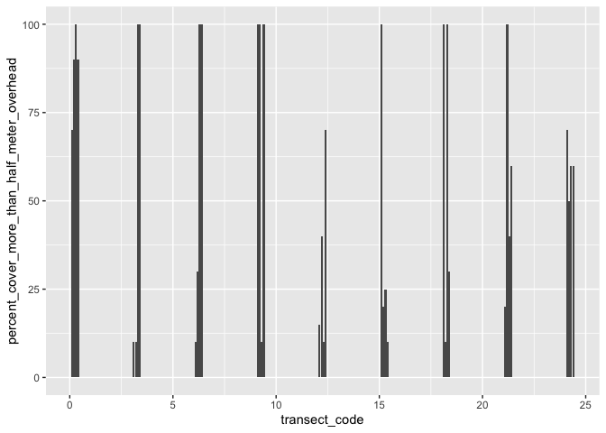

Feather River - habitat data exploration
================
Ashley Vizek (FlowWest)
2024-04-22

# Overview

The goal of this document is guide the development of habitat
suitability analyses including (1) explore the distributions of and
correlations between key variables, (2) test analysis methods to
understand relationships

Feather River will be used as a case study location with the goal of
creating a more streamlined workflow that could be applied elsewhere.
There are two relevant datasets (1) mini snorkel data, and (2) the
intermediate level ongoing snorkel survey. These data are utilizing
different methodologies and part of these analyses will explore the
differences between these two data collection methods and resulting
habitat.

# Mini Snorkel

**Description of sampling**

- 136 locations were sampled between March and August 2001 (approx 24
  per month)
- 4,891 quadrats (approx 36 per location)

*TODO* - confirm the scale of cover/substrate measurements (for the
entire quadrat fish was observed?) - do we have lat/long for the
microhabitat plots? - do we have lat/long for the missing locations?

**Key variables**

- depth: depth, dist_to_bottom
- velocity: velocity, focal_velocity
- count: treated as abesense/presence or actual count
- cover: percent_no_cover_inchannel,
  percent_small_woody_cover_inchannel,
  percent_large_woody_cover_inchannel,
  percent_submerged_aquatic_veg_instream, percent_undercut_bank,
  percent_no_cover_overhead, percent_half_meter_overhead,
  percent_cover_more_than_half_meter
- substrate: percent_fine_substrate, percent_sand_substrate,
  percent_small_gravel_substrate, percent_large_gravel_substrate,
  percent_cobble_substrate, percent_boulder_substrate

**Data processing considerations**

- Species: Analyses should be performed for chinook and steelhead
  separately or maybe if we determine there is not a strong species
  affect can lump together.
- Fork length: If there is a wide variation in fork length a ruleset
  should be used to differentiate between lifestages and analyses should
  be performed separately for each lifestage.
- Reach/location: Some of the past analyses have removed reaches where
  no fish are observed; need to consider if that is something we want to
  do.
- Absence/presence: May want to consider randomly selecting from the
  “unoccupied” observations to simulate paired random selection (?)
- Cover: These fields can be treated in many different ways. (1) Each
  can function as percent cover (though the “no cover” should be removed
  because they are different). (2) They can be transformed to a binary
  variable (cover/no cover), (3) two binary variables (instream,
  overhead), (4) They can also be treated as multiple binary variables
  where percent greater than 20% is counted as presence

## Distributions of key variables

### species

Chinook, steelhead, tule perch, and speckeled dace are observed

    ## [1] "Chinook salmon"             "Steelhead trout (wild)"    
    ## [3] NA                           "Speckled dace"             
    ## [5] "Tule perch"                 "Steelhead trout, (clipped)"

### fork length

**fork length for chinook**

Most Chinook observations are for fry (~40mm)

<!-- -->

**fork length for steelhead**

Most steelhead observations are for smaller fish but there is some
variation.

<!-- -->

### depth

**depth of microhabitat**

<!-- -->

**depth of fish observation**

<!-- -->

### velocity

**velocity of microhabitat**

<!-- -->

**velocity of fish observations**

<!-- -->

### count

**count of all species**

<!-- -->

**count by species**

Most observations are of Chinook salmon

<!-- -->

**count of chinook**

<!-- -->

**count of steelhead (wild)**

<!-- -->

**count of steelhead (clipped)**

<!-- -->

### percent cover

**summary of percent cover by cover type where cover \> 0% and Chinook
salmon observed**

<!-- -->

**summary of percent cover by cover type where cover \> 0% and Chinook
salmon observed**

``` r
# distribution of percent cover by type where fish are observed
mini_snorkel_cover_long_format |> 
  filter(percent > 0, !cover_type %in% c("percent_no_cover_inchannel", "percent_no_cover_overhead", grepl("Steelhead", species))) |> 
  ggplot(aes(x = cover_type, y = percent)) +
  geom_boxplot() +
  theme(axis.text.x = element_text(angle = 45))
```

<!-- -->
\### percent cover by transect code

The following plots summarize percent cover by type and transect code to
help describe the types of habitats surveyed. This information needs to
be summarized better.

**small woody cover**

``` r
mini_snorkel_raw |> 
  filter(percent_small_woody_cover_inchannel > 0) |> 
  distinct(transect_code, .keep_all = T) |> 
  ggplot(aes(x = transect_code, y = percent_small_woody_cover_inchannel)) +
  geom_col()
```

<!-- -->

``` r
mini_snorkel_raw |> 
  filter(percent_large_woody_cover_inchannel > 0) |> 
  distinct(transect_code, .keep_all = T) |> 
  ggplot(aes(x = transect_code, y = percent_large_woody_cover_inchannel)) +
  geom_col()
```

<!-- -->

``` r
mini_snorkel_raw |> 
  filter(percent_submerged_aquatic_veg_inchannel > 0) |> 
  distinct(transect_code, .keep_all = T) |> 
  ggplot(aes(x = transect_code, y = percent_submerged_aquatic_veg_inchannel)) +
  geom_col()
```

<!-- -->

``` r
mini_snorkel_raw |> 
  filter(percent_undercut_bank > 0) |> 
  distinct(transect_code, .keep_all = T) |> 
  ggplot(aes(x = transect_code, y = percent_undercut_bank)) +
  geom_col()
```

<!-- -->

``` r
mini_snorkel_raw |> 
  filter(percent_cover_half_meter_overhead > 0) |> 
  distinct(transect_code, .keep_all = T) |> 
  ggplot(aes(x = transect_code, y = percent_cover_half_meter_overhead)) +
  geom_col()
```

<!-- -->

``` r
mini_snorkel_raw |> 
  filter(percent_cover_more_than_half_meter_overhead > 0) |> 
  distinct(transect_code, .keep_all = T) |> 
  ggplot(aes(x = transect_code, y = percent_cover_more_than_half_meter_overhead)) +
  geom_col()
```

<!-- -->

### cover - presence/absence

We transformed cover to presence/absence. If any of the cover types are
\> 20% then cover is present.

**instream cover presence (1) and absence (0) for Chinook salmon**

``` r
mini_snorkel_cover_presence <- mini_snorkel_raw |> 
  mutate(instream_cover = as.factor(ifelse(percent_small_woody_cover_inchannel > 20 | percent_large_woody_cover_inchannel > 20 | percent_submerged_aquatic_veg_inchannel > 20 | percent_undercut_bank, 1, 0)),
         overhead_cover = as.factor(ifelse(percent_cover_half_meter_overhead > 20 | percent_cover_more_than_half_meter_overhead > 20, 1, 0)))

mini_snorkel_cover_presence |> 
  filter(species == "Chinook salmon") |> 
  group_by(instream_cover) |> 
  tally() |> 
  ggplot(aes(x = instream_cover, y = n)) +
  geom_col()
```

<!-- -->

**overhead cover presence (1) and absence (0) for Chinook salmon**

``` r
mini_snorkel_cover_presence |> 
  filter(species == "Chinook salmon") |> 
  group_by(overhead_cover) |> 
  tally() |> 
  ggplot(aes(x = overhead_cover, y = n)) +
  geom_col()
```

<!-- -->

**instream cover presence (1) and absence (0) for Steelhead**

``` r
mini_snorkel_cover_presence |> 
  filter(grepl("Steelhead", species)) |> 
  group_by(instream_cover) |> 
  tally() |> 
  ggplot(aes(x = instream_cover, y = n)) +
  geom_col()
```

<!-- -->

**overhead cover presence (1) and absence (0) for Steelhead**

``` r
mini_snorkel_cover_presence |> 
  filter(grepl("Steelhead", species)) |> 
  group_by(overhead_cover) |> 
  tally() |> 
  ggplot(aes(x = overhead_cover, y = n)) +
  geom_col()
```

<!-- -->

``` r
mini_percent_cover <- mini_snorkel_raw |> 
  select(percent_no_cover_inchannel, percent_small_woody_cover_inchannel,
                        percent_large_woody_cover_inchannel, percent_submerged_aquatic_veg_inchannel,
                        percent_undercut_bank, percent_no_cover_overhead, percent_cover_half_meter_overhead, percent_cover_more_than_half_meter_overhead)
```

``` r
library("psych")
pairs.panels(mini_percent_cover)
```

<!-- -->
\## Correlations

Checked the correlations between cover and substrate and did not find
any highly correlated.

No correlations between distance to bottom and velocty.

### Cover

Percent no cover in channel is highly inversely correlated with
submerged aquatic vegetation.

Percent no cover overhead is highly inversely correlated with cover
overhead.

``` r
library("psych")
pairs.panels(mini_percent_cover)
```

<!-- -->

### Substrate

None of the percent cover substrate variables are correlated.

``` r
pairs.panels(mini_percent_substrate)
```

<!-- -->

## Cluster analysis

The goal of the cluster analysis is to identify groupings of fish
observations and what best describes those groupings. Unlike typical
habitat analysis this will just focus on characteristics of fish
observations.

**Key variables**

- date (or month)
- species (may decide to filter to just Chinook and Steelhead)
- count (note that this variable does not seem to be working well)
- dist_to_bottom
- fl_mm (note that this variable does not seem to be working well)
- focal_velocity
- some measure of cover
- some measure of substrate

**Number of clusters**

Based on analysis of multiple indices, 3 clusters is the best fit. Note
that this could be looked into further to confirm this is the best
number of clusters.

## Occupancy modeling

The goal here is to model presence/absence in a hierarchical Bayesian
framework where there are repeat observations for a given site.

We need to consider if the mini-snorkel data is set up appropriately to
use with this modeling framework.

Refer to: Pascale’s paper:
<https://onlinelibrary.wiley.com/doi/pdfdirect/10.1111/jfb.14143>
Mahardja 2021: <https://escholarship.org/uc/item/9sp7r7q4> Another
example: <https://pubs.usgs.gov/of/2020/1100/ofr20201100.pdf>

``` r
# TODO need to better understand detection v occupancy
# Considerations - should this be an open model because fish could be migrating downstream

# ~ detection ~ occupancy

# Null model
fm1 <- occu(~1 ~1, dat)
fm1

fm2 <- occu(~depth+velocity ~1, dat)
fm2

# The expected probability that a site was occupied is 0.405. This estimate applies to the hypothetical population of all possible sites, not the sites found in our sample. For a good discussion of population-level vs finite-sample inference, see Royle and Dorazio (2008) page 117. Note also that finite-sample quantities can be computed in unmarked using empirical Bayes methods as demonstrated at the end of this document.
backTransform(fm2, "state")

# Thus, we can say that the expected probability of detection was 0.118 when depth, velocity, and instream cover are fixed at their mean value. 
backTransform(linearComb(fm2, coefficients = c(1,0,0,0,0), type = 'det'))

newData <- data.frame(depth = 0, velocity = -2:2, instream_cover = 0)
newData <- data.frame(depth = -2:2, velocity = 0, instream_cover = 0)
newData <- data.frame(depth = 0, velocity = 0, instream_cover = -2:2)
round(predict(fm2, type = 'det', newdata = newData, appendData=TRUE), 2)
```

# Intermediate Snorkel

**This is currently in progress because there is still some data
processing needed**

## Data wrangling fixes for the intermediate snorkel data

- Cover and substrate have multiple codes in some years. Currently, some
  are decoded and are others are coded. Need to keep all uncoded
- Need to map cover and substrate to a hierarchy (e.g. Gard has a cover
  and substrate coding system)
- We should double check the data Erin pulled from the database - was
  this filered to Chinook? We want all species
- section_name, units_covered, unit, location, section_type, unit_type,
  section_number are all related to location. We need to do a better job
  getting these organized.

## Distributions of key variables

### species

Only Chinook are observed

**TODO check that these were not filtered from dataset**

``` r
unique(combined_snorkel$species)
```

    ## [1] NA        "chinook" "unknown"

### fork length

**fork length for chinook**

Most Chinook observations are for fry (~40mm) though there is some
variation

``` r
combined_snorkel |> 
  filter(species == "chinook") |> 
  ggplot(aes(x = fork_length)) +
  geom_density()
```

<!-- -->

### depth

**depth**

``` r
combined_snorkel |> 
  ggplot(aes(x = water_depth_m)) +
  geom_density()
```

<!-- -->

### bank distance

``` r
combined_snorkel |> 
  ggplot(aes(x = bank_distance)) +
  geom_density()
```

<!-- -->

### count

``` r
combined_snorkel |> 
  ggplot(aes(x = count)) +
  geom_density()
```

<!-- -->

### cover

**Instream cover codes**

- A: No apparent cover (1)
- B: Small instream objects/small-medium woody debris (2)
- C: Large instream objects/large woody debris (3)
- D: Overhead objects (4)
- E: Submerged vegetation (5)
- F: Undercut bank (6)

**Overhead cover codes**

- 0: No apparent overhead cover
- 1: Overhanging vegetation with 0.5m above water surface
- 2: Overhanging vegetation 0.5-2m above water surface
- 3: Surface turbulence, bubble curtain

``` r
unique(combined_snorkel$instream_cover)
```

    ##  [1] NA      "A"     "BDEF"  "FE"    "D"     "BCDE"  "B"     "C"     "EC"   
    ## [10] "BE"    "BCDEF" "BDF"   "BD"    "E"     "EF"    "F"     "BEF"   "BCE"  
    ## [19] "BCEF"  "EB"    "CE"    "BCD"   "CDF"   "BDE"   "BF"    "CEF"   "BED"  
    ## [28] "CF"    "EFD"   "AE"    "BC"    "BEC"   "DE"    "CDEF"  "BEFD"  "CD"   
    ## [37] "ECF"   "BCF"   "BCDF"  "CDE"   "CED"   "DF"    "AG"    "ABD"   "AD"   
    ## [46] "FB"    "AB"    "bdf"

``` r
filter(combined_snorkel, is.na(instream_cover)) |> tally()
```

    ## # A tibble: 1 × 1
    ##       n
    ##   <int>
    ## 1  2061

``` r
# If 2 included then 2
# If 3 included and not 2 then 3
# If 4 included and not 2 or 3 then 4
# If 5 included and not 2, 3, 4 then 5
# If 6 included and not 2-5 then 6
# If only 1 included then 1

combined_snorkel_clean <- combined_snorkel |> 
  mutate(instream_cover = toupper(instream_cover),
    instream_cover_mapping = case_when(grepl("B", instream_cover) ~ 2,
                                            grepl("C", instream_cover) & !grepl("B", instream_cover) ~ 3,
                                            grepl("D", instream_cover) & !grepl("B", instream_cover) & !grepl("C", instream_cover) ~ 4,
                                            grepl("E", instream_cover) & !grepl("B", instream_cover) & !grepl("C", instream_cover) & !grepl("D", instream_cover) ~ 5,
                                            grepl("F", instream_cover) & !grepl("B", instream_cover) & !grepl("C", instream_cover) & !grepl("D", instream_cover) & !grepl("E", instream_cover) ~ 6,
                                            instream_cover == "A" ~ 1))
unique(combined_snorkel_clean$instream_cover_mapping)
```

    ## [1] NA  1  2  5  4  3  6

``` r
filter(combined_snorkel_clean, is.na(instream_cover_mapping)) |> tally()
```

    ## # A tibble: 1 × 1
    ##       n
    ##   <int>
    ## 1  2062

``` r
# pivots cover type variable
mini_snorkel_cover_long_format <- mini_snorkel_raw |> 
  pivot_longer(cols = c(percent_no_cover_inchannel, percent_small_woody_cover_inchannel,
                        percent_large_woody_cover_inchannel, percent_submerged_aquatic_veg_inchannel,
                        percent_undercut_bank, percent_no_cover_overhead, percent_cover_half_meter_overhead, percent_cover_more_than_half_meter_overhead), names_to = "cover_type", values_to = "percent") 

# distribution of percent cover by type where fish are observed
mini_snorkel_cover_long_format |> 
  filter(percent > 0, !cover_type %in% c("percent_no_cover_inchannel", "percent_no_cover_overhead", species == "Chinook salmon")) |> 
  ggplot(aes(x = cover_type, y = percent)) +
  geom_boxplot() +
  theme(axis.text.x = element_text(angle = 45))
```

<!-- -->
