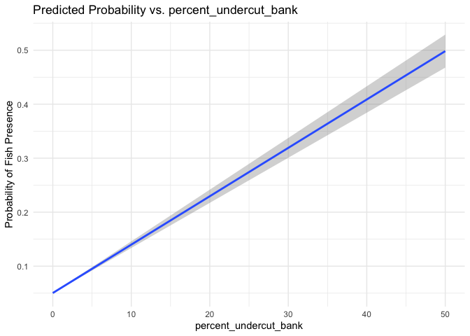
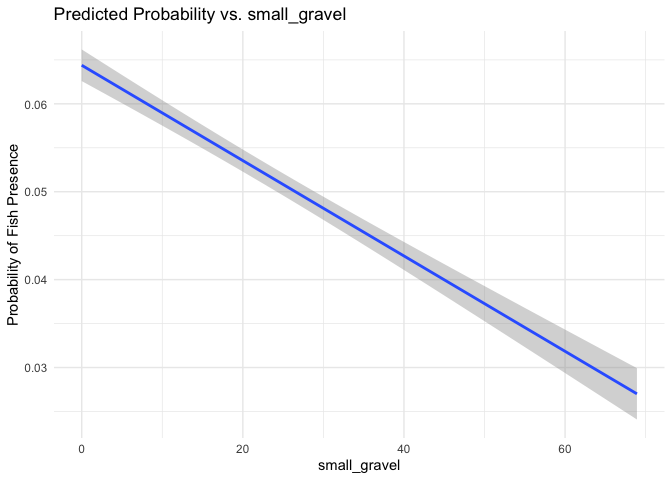
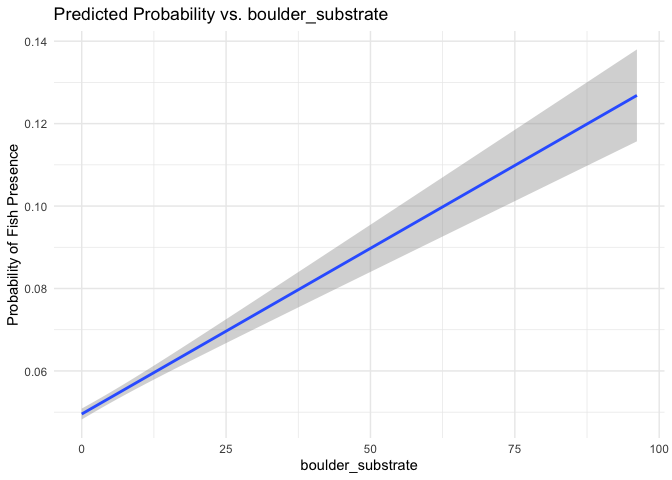
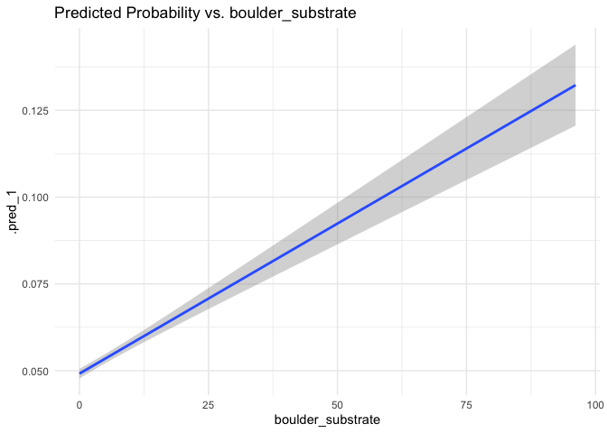
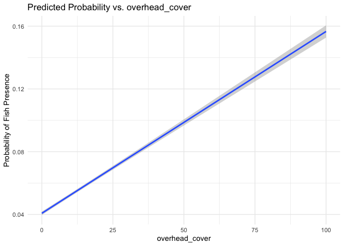

Mini Snorkel Feather HSC Using Logistic Regression
================
Maddee Rubenson
2024-04-30

``` r
# read in mini snorkel data
mini_snorkel_model_ready <- read_csv('microhabitat_with_fish_observations.csv') |> 
  mutate(count = ifelse(is.na(count), 0, count),
        fish_presence = as.factor(ifelse(count < 1, "0", "1"))) |> 
  glimpse()
```

    ## Rows: 5018 Columns: 28
    ## ── Column specification ────────────────────────────────────────────────────────
    ## Delimiter: ","
    ## chr   (2): species, channel_geomorphic_unit
    ## dbl  (25): micro_hab_data_tbl_id, location_table_id, transect_code, depth, v...
    ## date  (1): date
    ## 
    ## ℹ Use `spec()` to retrieve the full column specification for this data.
    ## ℹ Specify the column types or set `show_col_types = FALSE` to quiet this message.

    ## Rows: 5,018
    ## Columns: 29
    ## $ micro_hab_data_tbl_id                       <dbl> 18, 18, 18, 19, 20, 21, 22…
    ## $ location_table_id                           <dbl> 11, 11, 11, 11, 11, 11, 11…
    ## $ transect_code                               <dbl> 0.1, 0.1, 0.1, 0.2, 0.3, 0…
    ## $ depth                                       <dbl> 17, 17, 17, 19, 11, 12, 11…
    ## $ velocity                                    <dbl> 0.22, 0.22, 0.22, 0.35, 1.…
    ## $ percent_fine_substrate                      <dbl> 0, 0, 0, 0, 0, 0, 0, 0, 0,…
    ## $ percent_sand_substrate                      <dbl> 40, 40, 40, 50, 25, 0, 70,…
    ## $ percent_small_gravel_substrate              <dbl> 20, 20, 20, 40, 75, 80, 30…
    ## $ percent_large_gravel_substrate              <dbl> 30, 30, 30, 10, 0, 20, 0, …
    ## $ percent_cobble_substrate                    <dbl> 10, 10, 10, 0, 0, 0, 0, 0,…
    ## $ percent_boulder_substrate                   <dbl> 0, 0, 0, 0, 0, 0, 0, 0, 0,…
    ## $ percent_no_cover_inchannel                  <dbl> 75, 75, 75, 100, 100, 100,…
    ## $ percent_small_woody_cover_inchannel         <dbl> 15, 15, 15, 0, 0, 0, 20, 0…
    ## $ percent_large_woody_cover_inchannel         <dbl> 0, 0, 0, 0, 0, 0, 40, 0, 0…
    ## $ percent_submerged_aquatic_veg_inchannel     <dbl> 10, 10, 10, 0, 0, 0, 30, 0…
    ## $ percent_undercut_bank                       <dbl> 0, 0, 0, 0, 0, 0, 0, 0, 0,…
    ## $ percent_no_cover_overhead                   <dbl> 100, 100, 100, 100, 100, 1…
    ## $ percent_cover_half_meter_overhead           <dbl> 0, 0, 0, 0, 0, 0, 0, 0, 0,…
    ## $ percent_cover_more_than_half_meter_overhead <dbl> 0, 0, 0, 0, 0, 0, 0, 0, 0,…
    ## $ surface_turbidity                           <dbl> 20, 20, 20, 30, 30, 30, 10…
    ## $ fish_data_id                                <dbl> 21, 22, 23, NA, NA, NA, 25…
    ## $ count                                       <dbl> 2, 3, 1, 0, 0, 0, 3, 0, 0,…
    ## $ fl_mm                                       <dbl> 35, 35, 25, NA, NA, NA, 25…
    ## $ dist_to_bottom                              <dbl> 1.0, 1.5, 1.5, NA, NA, NA,…
    ## $ focal_velocity                              <dbl> 0.94, 0.16, 0.16, NA, NA, …
    ## $ species                                     <chr> "Chinook salmon", "Chinook…
    ## $ date                                        <date> 2001-03-14, 2001-03-14, 2…
    ## $ channel_geomorphic_unit                     <chr> "Glide", "Glide", "Glide",…
    ## $ fish_presence                               <fct> 1, 1, 1, 0, 0, 0, 1, 0, 0,…

### Logistic Regression Using Cover, Substrate, Velocity, and Depth

**Predictors**

- Depth

- Velocity

- Substrate (fine through boulder) normalized by prevalence

- Woody Debris (`percent_small_woody_cover_inchannel` +
  `percent_large_woody_cover_inchannel`)

- Overhead Cover (`percent_cover_more_than_half_meter_overhead` +
  `percent_cover_half_meter_overhead`)

- Submerged Aquatic Vegetation

- Undercut Bank

- Surface Turbidity

#### Normalize Substrate by Prevalence

This table provides a weighting for each substrate type based on the
overall presence (\>20%) of each substrate type. Use this to normalize
the substrate columns.

``` r
substrate_percent <- mini_snorkel_model_ready |> 
  group_by(micro_hab_data_tbl_id) |> 
  select(contains('substrate')) |> 
  distinct() |> 
  pivot_longer(cols = c(percent_fine_substrate:percent_boulder_substrate), names_to = "substrate_type", values_to = "percent") |> 
  mutate(substrate_presence_absence = ifelse(percent < 19, 0, 1)) |>  # 20% threshold
  group_by(substrate_type) |> 
  summarise(total_presence = sum(substrate_presence_absence)) |> 
  ungroup() |> 
  mutate(perc_total = total_presence/sum(total_presence))
```

    ## Adding missing grouping variables: `micro_hab_data_tbl_id`

``` r
knitr::kable(substrate_percent |> mutate(perc_total = perc_total*100), digits = 2)
```

| substrate_type                 | total_presence | perc_total |
|:-------------------------------|---------------:|-----------:|
| percent_boulder_substrate      |            360 |       3.86 |
| percent_cobble_substrate       |           1498 |      16.05 |
| percent_fine_substrate         |            271 |       2.90 |
| percent_large_gravel_substrate |           2919 |      31.27 |
| percent_sand_substrate         |           1385 |      14.84 |
| percent_small_gravel_substrate |           2901 |      31.08 |

#### Apply table to substrate columns to normalize

``` r
mini_snorkel_grouped <- mini_snorkel_model_ready |> 
  rowwise() |> 
  mutate(fine_substrate = percent_fine_substrate * (1-substrate_percent[substrate_percent$substrate_type == "percent_fine_substrate", 'perc_total']$perc_total),
         sand_substrate = percent_sand_substrate * (1-substrate_percent[substrate_percent$substrate_type == "percent_sand_substrate", 'perc_total']$perc_total),
         small_gravel = percent_small_gravel_substrate * (1-substrate_percent[substrate_percent$substrate_type == "percent_small_gravel_substrate", 'perc_total']$perc_total),
         large_gravel = percent_large_gravel_substrate * (1-substrate_percent[substrate_percent$substrate_type == "percent_large_gravel_substrate", 'perc_total']$perc_total),
         cobble_substrate = percent_cobble_substrate * (1-substrate_percent[substrate_percent$substrate_type == "percent_cobble_substrate", 'perc_total']$perc_total),
         boulder_substrate = percent_boulder_substrate * (1-substrate_percent[substrate_percent$substrate_type == "percent_boulder_substrate", 'perc_total']$perc_total)) |> 
  select(-c(percent_fine_substrate:percent_boulder_substrate)) |> 
  mutate(woody_debris = sum(percent_large_woody_cover_inchannel, percent_small_woody_cover_inchannel),
         overhead_cover = sum(percent_cover_half_meter_overhead, percent_cover_more_than_half_meter_overhead)
         ) |> 
  select(-c(percent_small_woody_cover_inchannel, percent_large_woody_cover_inchannel, percent_cover_more_than_half_meter_overhead, percent_cover_half_meter_overhead)) |> 
  #filter(species == "Chinook salmon" | is.na(species)) |> 
  select(-count, -channel_geomorphic_unit, -micro_hab_data_tbl_id, -location_table_id, -fish_data_id,
         -focal_velocity, -dist_to_bottom, -fl_mm, -species,  -transect_code, -date) |> 
  select(-(contains("no_cover"))) |> 
  distinct() |> 
  na.omit()
```

### Build Model

``` r
recipe <- recipe(data = mini_snorkel_grouped, formula = fish_presence ~.) |> 
  step_mutate_at(all_numeric_predictors(), fn = asinh) |> 
  step_naomit(all_predictors()) |> 
  step_zv(all_predictors()) |> 
  step_normalize(all_numeric_predictors())

log_reg <- logistic_reg() |> 
  set_engine("glm") 

log_reg_model <- workflow() |>
  add_recipe(recipe) |>
  add_model(log_reg) |> 
  fit(data = mini_snorkel_grouped)

log_reg_model |> glance()
```

    ## # A tibble: 1 × 8
    ##   null.deviance df.null logLik   AIC   BIC deviance df.residual  nobs
    ##           <dbl>   <int>  <dbl> <dbl> <dbl>    <dbl>       <int> <int>
    ## 1         1935.    4740  -891. 1810. 1900.    1782.        4727  4741

``` r
log_reg_model |> tidy() |> filter(p.value < 0.1)
```

    ## # A tibble: 7 × 5
    ##   term                  estimate std.error statistic  p.value
    ##   <chr>                    <dbl>     <dbl>     <dbl>    <dbl>
    ## 1 (Intercept)             -3.15     0.0783    -40.2  0       
    ## 2 percent_undercut_bank    0.123    0.0378      3.26 1.10e- 3
    ## 3 surface_turbidity        0.286    0.0697      4.10 4.14e- 5
    ## 4 small_gravel            -0.202    0.0777     -2.60 9.31e- 3
    ## 5 boulder_substrate        0.131    0.0663      1.97 4.85e- 2
    ## 6 woody_debris             0.395    0.0617      6.40 1.57e-10
    ## 7 overhead_cover           0.266    0.0637      4.18 2.88e- 5

``` r
sig_predictors <- log_reg_model |> tidy() |> filter(p.value < 0.1) |> filter(term != "(Intercept)") |>  pull(term)

# print(sig_predictors)

predictions <- predict(log_reg_model, mini_snorkel_grouped, type = "prob") |> 
  bind_cols(mini_snorkel_grouped) 
```

## Results

The following predictors were found to significantly effect fish
presence: percent_undercut_bank, surface_turbidity, small_gravel,
boulder_substrate, woody_debris, overhead_cover

``` r
map(sig_predictors, function(predictor) {
  ggplot(predictions, aes_string(x = predictor, y = ".pred_1")) +
    geom_smooth(method = "glm") +
    labs(title = paste("Predicted Probability vs.", predictor))
})
```

    ## [[1]]

<!-- -->

    ## 
    ## [[2]]

<!-- -->

    ## 
    ## [[3]]

<!-- -->

    ## 
    ## [[4]]

<!-- -->

    ## 
    ## [[5]]

<!-- -->

    ## 
    ## [[6]]

<!-- -->

## Next steps

1.  Compare to species presence/absence
2.  Look into methods for creating a more even sample of fish
    presence/absence that does not create a synthetic dataset
3.  Continue exploring methods for normalization and tuning parameters
