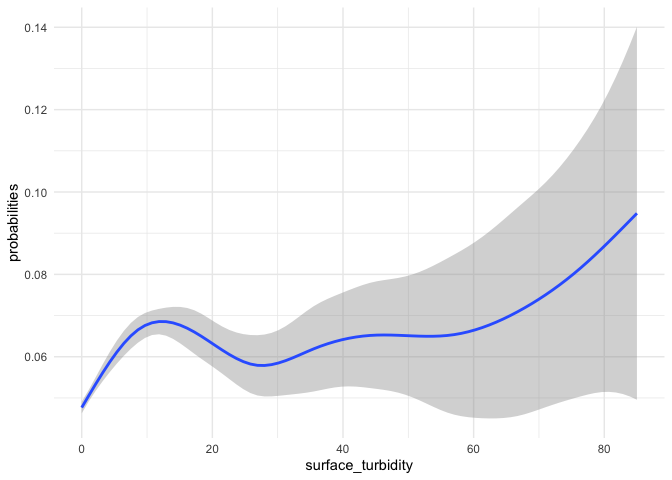
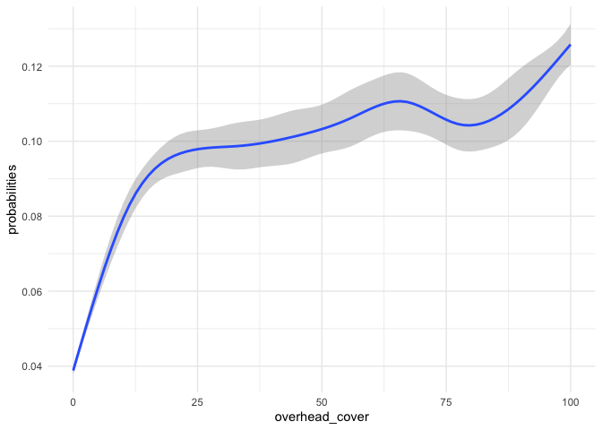

Mini Snorkel Feather HSI Workflow
================
Maddee Rubenson
2024-04-29

``` r
# read in mini snorkel data
mini_snorkel <- read_csv('microhabitat_with_fish_observations.csv') |> 
  mutate(count = ifelse(is.na(count), 0, count)) |> 
  glimpse()
```

    ## Rows: 5018 Columns: 28
    ## ── Column specification ────────────────────────────────────────────────────────
    ## Delimiter: ","
    ## chr   (2): species, channel_geomorphic_unit
    ## dbl  (25): micro_hab_data_tbl_id, location_table_id, transect_code, depth, v...
    ## date  (1): date
    ## 
    ## ℹ Use `spec()` to retrieve the full column specification for this data.
    ## ℹ Specify the column types or set `show_col_types = FALSE` to quiet this message.

    ## Rows: 5,018
    ## Columns: 28
    ## $ micro_hab_data_tbl_id                       <dbl> 18, 18, 18, 19, 20, 21, 22…
    ## $ location_table_id                           <dbl> 11, 11, 11, 11, 11, 11, 11…
    ## $ transect_code                               <dbl> 0.1, 0.1, 0.1, 0.2, 0.3, 0…
    ## $ depth                                       <dbl> 17, 17, 17, 19, 11, 12, 11…
    ## $ velocity                                    <dbl> 0.22, 0.22, 0.22, 0.35, 1.…
    ## $ percent_fine_substrate                      <dbl> 0, 0, 0, 0, 0, 0, 0, 0, 0,…
    ## $ percent_sand_substrate                      <dbl> 40, 40, 40, 50, 25, 0, 70,…
    ## $ percent_small_gravel_substrate              <dbl> 20, 20, 20, 40, 75, 80, 30…
    ## $ percent_large_gravel_substrate              <dbl> 30, 30, 30, 10, 0, 20, 0, …
    ## $ percent_cobble_substrate                    <dbl> 10, 10, 10, 0, 0, 0, 0, 0,…
    ## $ percent_boulder_substrate                   <dbl> 0, 0, 0, 0, 0, 0, 0, 0, 0,…
    ## $ percent_no_cover_inchannel                  <dbl> 75, 75, 75, 100, 100, 100,…
    ## $ percent_small_woody_cover_inchannel         <dbl> 15, 15, 15, 0, 0, 0, 20, 0…
    ## $ percent_large_woody_cover_inchannel         <dbl> 0, 0, 0, 0, 0, 0, 40, 0, 0…
    ## $ percent_submerged_aquatic_veg_inchannel     <dbl> 10, 10, 10, 0, 0, 0, 30, 0…
    ## $ percent_undercut_bank                       <dbl> 0, 0, 0, 0, 0, 0, 0, 0, 0,…
    ## $ percent_no_cover_overhead                   <dbl> 100, 100, 100, 100, 100, 1…
    ## $ percent_cover_half_meter_overhead           <dbl> 0, 0, 0, 0, 0, 0, 0, 0, 0,…
    ## $ percent_cover_more_than_half_meter_overhead <dbl> 0, 0, 0, 0, 0, 0, 0, 0, 0,…
    ## $ surface_turbidity                           <dbl> 20, 20, 20, 30, 30, 30, 10…
    ## $ fish_data_id                                <dbl> 21, 22, 23, NA, NA, NA, 25…
    ## $ count                                       <dbl> 2, 3, 1, 0, 0, 0, 3, 0, 0,…
    ## $ fl_mm                                       <dbl> 35, 35, 25, NA, NA, NA, 25…
    ## $ dist_to_bottom                              <dbl> 1.0, 1.5, 1.5, NA, NA, NA,…
    ## $ focal_velocity                              <dbl> 0.94, 0.16, 0.16, NA, NA, …
    ## $ species                                     <chr> "Chinook salmon", "Chinook…
    ## $ date                                        <date> 2001-03-14, 2001-03-14, 2…
    ## $ channel_geomorphic_unit                     <chr> "Glide", "Glide", "Glide",…

## Literature Notes

[**2004a**](https://netorg629193.sharepoint.com/:b:/s/VA-FeatherRiver/EY9qLwY15ypFn3W42E02takBH745JkefSPAbS4y9VFzuBQ?e=n2QRXK)
Data Analysis

- Stepwise binary logistic regression analysis was used to assess
  factors influencing the occurrence of steelhead and Chinook salmon.
  Fine scale survey results were analyzed at both the mesohabitat (100
  m2) and microhabitat (1 m2) scale.

- Mesohabitat analysis was performed by treating the entire 25 m reach
  as a sample

- Reach habitat variables where steelhead or salmon were present
  (logistic response variable) were compared to reaches where fish were
  absent (logistic reference variable)

- Microhabitat was done similarly except that individual one square
  meter cells were considered rather than entire reaches

- Reaches lacking salmon or steelhead were not included in microhabitat
  analysis

[**2005**](https://netorg629193.sharepoint.com/:b:/s/VA-FeatherRiver/ES8H3f7ZUO5Aj7OK8hfW03UB721tCgZd_OEb8P9cbJLiMA?e=L95bf8):
HSC development- chinook salmon rearing

- HSC were created for fry (\<50 mm) and juvenile Chinook salmon depth
  and mean column velocity data using a three-point running mean to
  smooth frequency distributions of the fry habitat use data and using
  NPTL \[what does this stand for?\] for the juvenile habitat use data.

- all substrate suitability given value of 1 after finding that
  substrate was not driving factor for microhabitat selection of fry and
  juveniles

- cover modified to: with and without. Suitability of without cover was
  calculated as the percentage of fish observed without cover to the
  total sample size

- suitability of cover present was assigned a value of 1.0 and 0.30 or
  0.22 for cover absent for Chinook salon fry and juveniles \[I do not
  get this… \]

- Focus on suitability of instream cover. When a cover variable did not
  exist, preference for low velocity and shallow depth in a large river
  indicate suitable habitat along stream margins or out in the main
  channel when the river is nearly dry and the preferred conditions are
  prevalent.

- intermediate scale data separated into four cover types: no cover,
  object only cover overhead only cover, both object and overhead cover

[**Gard
2023**](https://netorg629193.sharepoint.com/:b:/s/VA-FeatherRiver/EelfImRfhzxKjLQdrstbIPgBqbRV5S0Wke5GkSh06_CUrQ?e=6PdWKh) -
HSC comparison

- Presence/absence HSC are developed using a polynomial logistic
  regression that uses both the occupied and unoccupied data; the
  results are then rescaled that the highest value is 1 to calculate the
  HSI

- For depth and velocity HSC, the criteria were developed directly from
  use observations using a range of curve fitting and smoothing
  techniques

- Use/availability criteria are developed by dividing use observations,
  generally binned, by availability data from transects

``` r
mini_snorkel_model_ready <- mini_snorkel |> 
  #select(depth:percent_cover_more_than_half_meter_overhead, count, channel_geomorphic_unit, species) |> 
  mutate(fish_presence = as.factor(ifelse(count < 1, "0", "1")))
```

# Chinook Salmon

### Explore Variables

Specifically looking for collinearity in the variables

### Logistic Regression Using Cover, Substrate, Velocity, and Depth

**Predictors**

- Depth

- Velocity

- Substrate (fine through boulder) normalized by prevalence

- Woody Debris (`percent_small_woody_cover_inchannel` +
  `percent_large_woody_cover_inchannel`)

- Overhead Cover (`percent_cover_more_than_half_meter_overhead` +
  `percent_cover_half_meter_overhead`)

- Submerged Aquatic Vegetation

- Undercut Bank

- Surface Turbidity

#### Normalize Substrate by Prevalence

This table provides a weighting for each substrate type based on the
overall presence (\>20%) of each substrate type. Use this to normalize
the substrate columns.

``` r
substrate_percent <- mini_snorkel |> 
  group_by(micro_hab_data_tbl_id) |> 
  select(contains('substrate')) |> 
  distinct() |> 
  pivot_longer(cols = c(percent_fine_substrate:percent_boulder_substrate), names_to = "substrate_type", values_to = "percent") |> 
  mutate(substrate_presence_absence = ifelse(percent < 19, 0, 1)) |>  # 20% threshold
  group_by(substrate_type) |> 
  summarise(total_presence = sum(substrate_presence_absence)) |> 
  ungroup() |> 
  mutate(perc_total = total_presence/sum(total_presence))
```

    ## Adding missing grouping variables: `micro_hab_data_tbl_id`

``` r
knitr::kable(substrate_percent |> mutate(perc_total = perc_total*100), digits = 2)
```

| substrate_type                 | total_presence | perc_total |
|:-------------------------------|---------------:|-----------:|
| percent_boulder_substrate      |            360 |       3.86 |
| percent_cobble_substrate       |           1498 |      16.05 |
| percent_fine_substrate         |            271 |       2.90 |
| percent_large_gravel_substrate |           2919 |      31.27 |
| percent_sand_substrate         |           1385 |      14.84 |
| percent_small_gravel_substrate |           2901 |      31.08 |

#### Apply table to substrate columns to normalize

``` r
mini_snorkel_grouped <- mini_snorkel_model_ready |> 
  rowwise() |> 
  mutate(fine_substrate = percent_fine_substrate * (1-substrate_percent[substrate_percent$substrate_type == "percent_fine_substrate", 'perc_total']$perc_total),
         sand_substrate = percent_sand_substrate * (1-substrate_percent[substrate_percent$substrate_type == "percent_sand_substrate", 'perc_total']$perc_total),
         small_gravel = percent_small_gravel_substrate * (1-substrate_percent[substrate_percent$substrate_type == "percent_small_gravel_substrate", 'perc_total']$perc_total),
         large_gravel = percent_large_gravel_substrate * (1-substrate_percent[substrate_percent$substrate_type == "percent_large_gravel_substrate", 'perc_total']$perc_total),
         cobble_substrate = percent_cobble_substrate * (1-substrate_percent[substrate_percent$substrate_type == "percent_cobble_substrate", 'perc_total']$perc_total),
         boulder_substrate = percent_boulder_substrate * (1-substrate_percent[substrate_percent$substrate_type == "percent_boulder_substrate", 'perc_total']$perc_total)) |> 
  select(-c(percent_fine_substrate:percent_boulder_substrate)) |> 
  mutate(woody_debris = sum(percent_large_woody_cover_inchannel, percent_small_woody_cover_inchannel),
         overhead_cover = sum(percent_cover_half_meter_overhead, percent_cover_more_than_half_meter_overhead)
         ) |> 
  select(-c(percent_small_woody_cover_inchannel, percent_large_woody_cover_inchannel, percent_cover_more_than_half_meter_overhead, percent_cover_half_meter_overhead)) |> 
  #filter(species == "Chinook salmon" | is.na(species)) |> 
  select(-count, -channel_geomorphic_unit, -species, -micro_hab_data_tbl_id, -location_table_id, -fish_data_id,
         -focal_velocity, -dist_to_bottom, -fl_mm, -transect_code, -date) |> 
  select(-(contains("no_cover"))) |> 
  distinct() |> 
  na.omit() |> 
  glimpse()
```

    ## Rows: 4,741
    ## Columns: 14
    ## Rowwise: 
    ## $ depth                                   <dbl> 17, 19, 11, 12, 11, 10, 8, 9, …
    ## $ velocity                                <dbl> 0.22, 0.35, 1.95, 2.14, 1.19, …
    ## $ percent_submerged_aquatic_veg_inchannel <dbl> 10, 0, 0, 0, 30, 0, 0, 0, 40, …
    ## $ percent_undercut_bank                   <dbl> 0, 0, 0, 0, 0, 0, 0, 0, 0, 0, …
    ## $ surface_turbidity                       <dbl> 20, 30, 30, 30, 10, 10, 10, 10…
    ## $ fish_presence                           <fct> 1, 0, 0, 0, 1, 0, 0, 1, 1, 1, …
    ## $ fine_substrate                          <dbl> 0.00000, 0.00000, 0.00000, 0.0…
    ## $ sand_substrate                          <dbl> 34.064710, 42.580887, 21.29044…
    ## $ small_gravel                            <dbl> 13.784015, 27.568031, 51.69005…
    ## $ large_gravel                            <dbl> 20.618170, 6.872723, 0.000000,…
    ## $ cobble_substrate                        <dbl> 8.395115, 0.000000, 0.000000, …
    ## $ boulder_substrate                       <dbl> 0, 0, 0, 0, 0, 0, 0, 0, 0, 0, …
    ## $ woody_debris                            <dbl> 15, 0, 0, 0, 60, 0, 0, 0, 10, …
    ## $ overhead_cover                          <dbl> 0, 0, 0, 0, 0, 0, 0, 0, 25, 0,…

#### Explore newly constructed variables

<!-- --><!-- --><!-- --><!-- --><!-- --><!-- --><!-- -->

Normalized data

``` r
library(caret)
```

    ## Loading required package: lattice

    ## 
    ## Attaching package: 'caret'

    ## The following objects are masked from 'package:yardstick':
    ## 
    ##     precision, recall, sensitivity, specificity

    ## The following object is masked from 'package:purrr':
    ## 
    ##     lift

``` r
test <- caret::preProcess(mini_snorkel_grouped, method = c("center", "scale", "YeoJohnson"))
test
```

    ## Created from 4741 samples and 14 variables
    ## 
    ## Pre-processing:
    ##   - centered (13)
    ##   - ignored (1)
    ##   - scaled (13)
    ##   - Yeo-Johnson transformation (11)
    ## 
    ## Lambda estimates for Yeo-Johnson transformation:
    ##    Min. 1st Qu.  Median    Mean 3rd Qu.    Max. 
    ## -2.6245 -1.5607 -0.5054 -0.8345 -0.1017  0.3098

``` r
test_transformed <- predict(test, mini_snorkel_grouped) |> na.omit()

names_change <- names(test_transformed)
names(test_transformed) <- paste0(names(test_transformed), "_transformed")
test_transformed <- test_transformed |> rename(fish_presence = fish_presence_transformed)
```

#### Create Logistic Regression

``` r
model <- glm(fish_presence ~., data = test_transformed, family = binomial)

probabilities <- predict(model, type = "response")
predicted_classes <- ifelse(probabilities > 0.5, "1", "0") 

# influential values
plot(model, which = 4, id.n = 3)
```

<!-- -->

``` r
# Extract model results
model_data <- augment(model) %>% 
  mutate(index = 1:n()) 

model_data |> top_n(3, .cooksd) # top three largest influential values (as seen in plot)
```

    ## # A tibble: 3 × 21
    ##   fish_presence depth_transformed velocity_transformed percent_submerged_aquat…¹
    ##   <fct>                     <dbl>                <dbl>                     <dbl>
    ## 1 1                        -2.36                -0.926                    -0.780
    ## 2 1                        -0.122                0.257                    -0.780
    ## 3 0                         1.28                 0.566                     1.04 
    ## # ℹ abbreviated name: ¹​percent_submerged_aquatic_veg_inchannel_transformed
    ## # ℹ 17 more variables: percent_undercut_bank_transformed <dbl>,
    ## #   surface_turbidity_transformed <dbl>, fine_substrate_transformed <dbl>,
    ## #   sand_substrate_transformed <dbl>, small_gravel_transformed <dbl>,
    ## #   large_gravel_transformed <dbl>, cobble_substrate_transformed <dbl>,
    ## #   boulder_substrate_transformed <dbl>, woody_debris_transformed <dbl>,
    ## #   overhead_cover_transformed <dbl>, .fitted <dbl>, .resid <dbl>, …

``` r
#standard resuiduals: a measure of the strength of the difference between observed and expected values. 
ggplot(model_data, aes(index, .std.resid)) + 
  geom_point(aes(color = fish_presence), alpha = .5) 
```

<!-- -->

``` r
# Filter potential influential data points with abs(.std.res) > 3:
chn_mini_snorkel_filtered <- model_data %>% 
  filter(abs(.std.resid) < 3)

#the linearly dependent variables. These variables are too linear and need to be removed from 
# the model formula: 
ld_vars <- attributes(alias(model)$Complete)$dimnames[[1]]
print(ld_vars)
```

    ## NULL

``` r
chn_mini_snorkel_filtered_without_linear_cols <- chn_mini_snorkel_filtered |> 
  select(-ld_vars, -(.fitted:index)) 
```

    ## Warning: Using an external vector in selections was deprecated in tidyselect 1.1.0.
    ## ℹ Please use `all_of()` or `any_of()` instead.
    ##   # Was:
    ##   data %>% select(ld_vars)
    ## 
    ##   # Now:
    ##   data %>% select(all_of(ld_vars))
    ## 
    ## See <https://tidyselect.r-lib.org/reference/faq-external-vector.html>.
    ## This warning is displayed once every 8 hours.
    ## Call `lifecycle::last_lifecycle_warnings()` to see where this warning was
    ## generated.

``` r
model_2 <- glm(fish_presence ~., data = chn_mini_snorkel_filtered_without_linear_cols, family = binomial)

# test for multicollinarity:
# As a rule of thumb, a VIF value that exceeds 5 or 10 indicates a problematic amount of collinearity.
car::vif(model_2) 
```

    ##                                   depth_transformed 
    ##                                            1.228695 
    ##                                velocity_transformed 
    ##                                            1.379456 
    ## percent_submerged_aquatic_veg_inchannel_transformed 
    ##                                            1.237600 
    ##                   percent_undercut_bank_transformed 
    ##                                            1.037404 
    ##                       surface_turbidity_transformed 
    ##                                            1.266114 
    ##                          fine_substrate_transformed 
    ##                                            1.456608 
    ##                          sand_substrate_transformed 
    ##                                            1.907022 
    ##                            small_gravel_transformed 
    ##                                            1.566785 
    ##                            large_gravel_transformed 
    ##                                            1.614546 
    ##                        cobble_substrate_transformed 
    ##                                            1.636372 
    ##                       boulder_substrate_transformed 
    ##                                            1.368208 
    ##                            woody_debris_transformed 
    ##                                            1.280364 
    ##                          overhead_cover_transformed 
    ##                                            1.327627

``` r
summary(model_2)
```

    ## 
    ## Call:
    ## glm(formula = fish_presence ~ ., family = binomial, data = chn_mini_snorkel_filtered_without_linear_cols)
    ## 
    ## Deviance Residuals: 
    ##     Min       1Q   Median       3Q      Max  
    ## -1.1205  -0.3318  -0.2688  -0.2131   2.7882  
    ## 
    ## Coefficients:
    ##                                                      Estimate Std. Error
    ## (Intercept)                                         -3.140055   0.078079
    ## depth_transformed                                   -0.032723   0.074917
    ## velocity_transformed                                 0.004733   0.080413
    ## percent_submerged_aquatic_veg_inchannel_transformed -0.052889   0.073159
    ## percent_undercut_bank_transformed                    0.112577   0.035607
    ## surface_turbidity_transformed                        0.252854   0.069590
    ## fine_substrate_transformed                           0.022758   0.060926
    ## sand_substrate_transformed                          -0.046758   0.088531
    ## small_gravel_transformed                            -0.251273   0.082692
    ## large_gravel_transformed                            -0.063394   0.081007
    ## cobble_substrate_transformed                        -0.142761   0.084796
    ## boulder_substrate_transformed                        0.131829   0.067794
    ## woody_debris_transformed                             0.396093   0.062136
    ## overhead_cover_transformed                           0.269272   0.064593
    ##                                                     z value Pr(>|z|)    
    ## (Intercept)                                         -40.216  < 2e-16 ***
    ## depth_transformed                                    -0.437  0.66226    
    ## velocity_transformed                                  0.059  0.95307    
    ## percent_submerged_aquatic_veg_inchannel_transformed  -0.723  0.46972    
    ## percent_undercut_bank_transformed                     3.162  0.00157 ** 
    ## surface_turbidity_transformed                         3.633  0.00028 ***
    ## fine_substrate_transformed                            0.374  0.70875    
    ## sand_substrate_transformed                           -0.528  0.59739    
    ## small_gravel_transformed                             -3.039  0.00238 ** 
    ## large_gravel_transformed                             -0.783  0.43388    
    ## cobble_substrate_transformed                         -1.684  0.09226 .  
    ## boulder_substrate_transformed                         1.945  0.05183 .  
    ## woody_debris_transformed                              6.375 1.83e-10 ***
    ## overhead_cover_transformed                            4.169 3.06e-05 ***
    ## ---
    ## Signif. codes:  0 '***' 0.001 '**' 0.01 '*' 0.05 '.' 0.1 ' ' 1
    ## 
    ## (Dispersion parameter for binomial family taken to be 1)
    ## 
    ##     Null deviance: 1934.7  on 4740  degrees of freedom
    ## Residual deviance: 1794.2  on 4727  degrees of freedom
    ## AIC: 1822.2
    ## 
    ## Number of Fisher Scoring iterations: 6

``` r
probabilities_model_2 <- predict(model_2, type = "response")
```

``` r
to_plot <- test_transformed |> 
  bind_cols(data.frame("probabliliites" = probabilities_model_2)) |> 
  bind_cols(mini_snorkel_grouped |> select(-fish_presence)) |> glimpse()
```

    ## Rows: 4,741
    ## Columns: 28
    ## Rowwise: 
    ## $ depth_transformed                                   <dbl> -0.5238591, -0.378…
    ## $ velocity_transformed                                <dbl> -0.1118426, 0.2139…
    ## $ percent_submerged_aquatic_veg_inchannel_transformed <dbl> 1.0368603, -0.7803…
    ## $ percent_undercut_bank_transformed                   <dbl> -0.1024662, -0.102…
    ## $ surface_turbidity_transformed                       <dbl> 1.8785096, 1.88847…
    ## $ fish_presence                                       <fct> 1, 0, 0, 0, 1, 0, …
    ## $ fine_substrate_transformed                          <dbl> -0.2312380, -0.231…
    ## $ sand_substrate_transformed                          <dbl> 1.3697741, 1.41390…
    ## $ small_gravel_transformed                            <dbl> 0.02630361, 0.5567…
    ## $ large_gravel_transformed                            <dbl> 0.35737163, -0.411…
    ## $ cobble_substrate_transformed                        <dbl> 0.8083423, -0.8529…
    ## $ boulder_substrate_transformed                       <dbl> -0.3762372, -0.376…
    ## $ woody_debris_transformed                            <dbl> 1.9524380, -0.5139…
    ## $ overhead_cover_transformed                          <dbl> -0.5214114, -0.521…
    ## $ probabliliites                                      <dbl> 0.08742784, 0.0440…
    ## $ depth                                               <dbl> 17, 19, 11, 12, 11…
    ## $ velocity                                            <dbl> 0.22, 0.35, 1.95, …
    ## $ percent_submerged_aquatic_veg_inchannel             <dbl> 10, 0, 0, 0, 30, 0…
    ## $ percent_undercut_bank                               <dbl> 0, 0, 0, 0, 0, 0, …
    ## $ surface_turbidity                                   <dbl> 20, 30, 30, 30, 10…
    ## $ fine_substrate                                      <dbl> 0.00000, 0.00000, …
    ## $ sand_substrate                                      <dbl> 34.064710, 42.5808…
    ## $ small_gravel                                        <dbl> 13.784015, 27.5680…
    ## $ large_gravel                                        <dbl> 20.618170, 6.87272…
    ## $ cobble_substrate                                    <dbl> 8.395115, 0.000000…
    ## $ boulder_substrate                                   <dbl> 0, 0, 0, 0, 0, 0, …
    ## $ woody_debris                                        <dbl> 15, 0, 0, 0, 60, 0…
    ## $ overhead_cover                                      <dbl> 0, 0, 0, 0, 0, 0, …

``` r
ggplot(to_plot, aes(x = surface_turbidity, y = probabilities)) +
  geom_smooth()
```

    ## `geom_smooth()` using method = 'gam' and formula = 'y ~ s(x, bs = "cs")'

<!-- -->

``` r
ggplot(to_plot, aes(x = overhead_cover, y = probabilities)) +
  geom_smooth()
```

    ## `geom_smooth()` using method = 'gam' and formula = 'y ~ s(x, bs = "cs")'

<!-- -->

``` r
ggplot(to_plot, aes(x = woody_debris, y = probabilities)) +
  geom_smooth()
```

    ## `geom_smooth()` using method = 'gam' and formula = 'y ~ s(x, bs = "cs")'

<!-- -->

``` r
ggplot(to_plot, aes(x = small_gravel, y = probabilities)) +
  geom_smooth()
```

    ## `geom_smooth()` using method = 'gam' and formula = 'y ~ s(x, bs = "cs")'

<!-- -->

``` r
ggplot(to_plot, aes(x = percent_undercut_bank, y = probabilities)) +
  geom_point()
```

<!-- -->

## Checks

- Sample size of presence observations
- remove month
- stepwise
- fix plots to not use scaled values

``` r
knitr::knit_exit()
```
