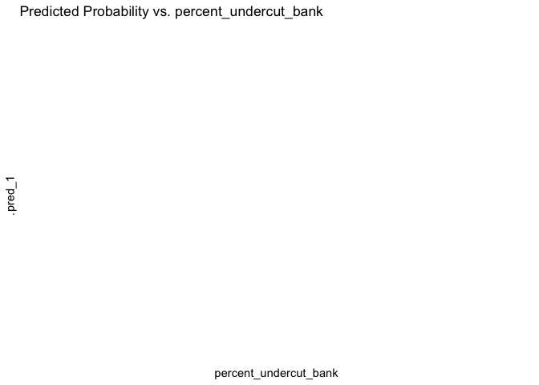

Mini Snorkel Feather HSI Workflow
================
Maddee Rubenson
2024-04-30

``` r
# read in mini snorkel data
mini_snorkel <- read_csv('microhabitat_with_fish_observations.csv') |> 
  mutate(count = ifelse(is.na(count), 0, count)) |> 
  glimpse()
```

    ## Rows: 5018 Columns: 28
    ## ── Column specification ────────────────────────────────────────────────────────
    ## Delimiter: ","
    ## chr   (2): species, channel_geomorphic_unit
    ## dbl  (25): micro_hab_data_tbl_id, location_table_id, transect_code, depth, v...
    ## date  (1): date
    ## 
    ## ℹ Use `spec()` to retrieve the full column specification for this data.
    ## ℹ Specify the column types or set `show_col_types = FALSE` to quiet this message.

    ## Rows: 5,018
    ## Columns: 28
    ## $ micro_hab_data_tbl_id                       <dbl> 18, 18, 18, 19, 20, 21, 22…
    ## $ location_table_id                           <dbl> 11, 11, 11, 11, 11, 11, 11…
    ## $ transect_code                               <dbl> 0.1, 0.1, 0.1, 0.2, 0.3, 0…
    ## $ depth                                       <dbl> 17, 17, 17, 19, 11, 12, 11…
    ## $ velocity                                    <dbl> 0.22, 0.22, 0.22, 0.35, 1.…
    ## $ percent_fine_substrate                      <dbl> 0, 0, 0, 0, 0, 0, 0, 0, 0,…
    ## $ percent_sand_substrate                      <dbl> 40, 40, 40, 50, 25, 0, 70,…
    ## $ percent_small_gravel_substrate              <dbl> 20, 20, 20, 40, 75, 80, 30…
    ## $ percent_large_gravel_substrate              <dbl> 30, 30, 30, 10, 0, 20, 0, …
    ## $ percent_cobble_substrate                    <dbl> 10, 10, 10, 0, 0, 0, 0, 0,…
    ## $ percent_boulder_substrate                   <dbl> 0, 0, 0, 0, 0, 0, 0, 0, 0,…
    ## $ percent_no_cover_inchannel                  <dbl> 75, 75, 75, 100, 100, 100,…
    ## $ percent_small_woody_cover_inchannel         <dbl> 15, 15, 15, 0, 0, 0, 20, 0…
    ## $ percent_large_woody_cover_inchannel         <dbl> 0, 0, 0, 0, 0, 0, 40, 0, 0…
    ## $ percent_submerged_aquatic_veg_inchannel     <dbl> 10, 10, 10, 0, 0, 0, 30, 0…
    ## $ percent_undercut_bank                       <dbl> 0, 0, 0, 0, 0, 0, 0, 0, 0,…
    ## $ percent_no_cover_overhead                   <dbl> 100, 100, 100, 100, 100, 1…
    ## $ percent_cover_half_meter_overhead           <dbl> 0, 0, 0, 0, 0, 0, 0, 0, 0,…
    ## $ percent_cover_more_than_half_meter_overhead <dbl> 0, 0, 0, 0, 0, 0, 0, 0, 0,…
    ## $ surface_turbidity                           <dbl> 20, 20, 20, 30, 30, 30, 10…
    ## $ fish_data_id                                <dbl> 21, 22, 23, NA, NA, NA, 25…
    ## $ count                                       <dbl> 2, 3, 1, 0, 0, 0, 3, 0, 0,…
    ## $ fl_mm                                       <dbl> 35, 35, 25, NA, NA, NA, 25…
    ## $ dist_to_bottom                              <dbl> 1.0, 1.5, 1.5, NA, NA, NA,…
    ## $ focal_velocity                              <dbl> 0.94, 0.16, 0.16, NA, NA, …
    ## $ species                                     <chr> "Chinook salmon", "Chinook…
    ## $ date                                        <date> 2001-03-14, 2001-03-14, 2…
    ## $ channel_geomorphic_unit                     <chr> "Glide", "Glide", "Glide",…

## Literature Notes

[**2004a**](https://netorg629193.sharepoint.com/:b:/s/VA-FeatherRiver/EY9qLwY15ypFn3W42E02takBH745JkefSPAbS4y9VFzuBQ?e=n2QRXK)
Data Analysis

- Stepwise binary logistic regression analysis was used to assess
  factors influencing the occurrence of steelhead and Chinook salmon.
  Fine scale survey results were analyzed at both the mesohabitat (100
  m2) and microhabitat (1 m2) scale.

- Mesohabitat analysis was performed by treating the entire 25 m reach
  as a sample

- Reach habitat variables where steelhead or salmon were present
  (logistic response variable) were compared to reaches where fish were
  absent (logistic reference variable)

- Microhabitat was done similarly except that individual one square
  meter cells were considered rather than entire reaches

- Reaches lacking salmon or steelhead were not included in microhabitat
  analysis

[**2005**](https://netorg629193.sharepoint.com/:b:/s/VA-FeatherRiver/ES8H3f7ZUO5Aj7OK8hfW03UB721tCgZd_OEb8P9cbJLiMA?e=L95bf8):
HSC development- chinook salmon rearing

- HSC were created for fry (\<50 mm) and juvenile Chinook salmon depth
  and mean column velocity data using a three-point running mean to
  smooth frequency distributions of the fry habitat use data and using
  NPTL \[what does this stand for?\] for the juvenile habitat use data.

- all substrate suitability given value of 1 after finding that
  substrate was not driving factor for microhabitat selection of fry and
  juveniles

- cover modified to: with and without. Suitability of without cover was
  calculated as the percentage of fish observed without cover to the
  total sample size

- suitability of cover present was assigned a value of 1.0 and 0.30 or
  0.22 for cover absent for Chinook salon fry and juveniles \[I do not
  get this… \]

- Focus on suitability of instream cover. When a cover variable did not
  exist, preference for low velocity and shallow depth in a large river
  indicate suitable habitat along stream margins or out in the main
  channel when the river is nearly dry and the preferred conditions are
  prevalent.

- intermediate scale data separated into four cover types: no cover,
  object only cover overhead only cover, both object and overhead cover

[**Gard
2023**](https://netorg629193.sharepoint.com/:b:/s/VA-FeatherRiver/EelfImRfhzxKjLQdrstbIPgBqbRV5S0Wke5GkSh06_CUrQ?e=6PdWKh) -
HSC comparison

- Presence/absence HSC are developed using a polynomial logistic
  regression that uses both the occupied and unoccupied data; the
  results are then rescaled that the highest value is 1 to calculate the
  HSI

- For depth and velocity HSC, the criteria were developed directly from
  use observations using a range of curve fitting and smoothing
  techniques

- Use/availability criteria are developed by dividing use observations,
  generally binned, by availability data from transects

``` r
mini_snorkel_model_ready <- mini_snorkel |> 
  mutate(fish_presence = as.factor(ifelse(count < 1, "0", "1")))
```

# Chinook Salmon

### Explore Variables

Specifically looking for collinearity in the variables

### Logistic Regression Using Cover, Substrate, Velocity, and Depth

**Predictors**

- Depth

- Velocity

- Substrate (fine through boulder) normalized by prevalence

- Woody Debris (`percent_small_woody_cover_inchannel` +
  `percent_large_woody_cover_inchannel`)

- Overhead Cover (`percent_cover_more_than_half_meter_overhead` +
  `percent_cover_half_meter_overhead`)

- Submerged Aquatic Vegetation

- Undercut Bank

- Surface Turbidity

#### Normalize Substrate by Prevalence

This table provides a weighting for each substrate type based on the
overall presence (\>20%) of each substrate type. Use this to normalize
the substrate columns.

``` r
substrate_percent <- mini_snorkel |> 
  group_by(micro_hab_data_tbl_id) |> 
  select(contains('substrate')) |> 
  distinct() |> 
  pivot_longer(cols = c(percent_fine_substrate:percent_boulder_substrate), names_to = "substrate_type", values_to = "percent") |> 
  mutate(substrate_presence_absence = ifelse(percent < 19, 0, 1)) |>  # 20% threshold
  group_by(substrate_type) |> 
  summarise(total_presence = sum(substrate_presence_absence)) |> 
  ungroup() |> 
  mutate(perc_total = total_presence/sum(total_presence))
```

    ## Adding missing grouping variables: `micro_hab_data_tbl_id`

``` r
knitr::kable(substrate_percent |> mutate(perc_total = perc_total*100), digits = 2)
```

| substrate_type                 | total_presence | perc_total |
|:-------------------------------|---------------:|-----------:|
| percent_boulder_substrate      |            360 |       3.86 |
| percent_cobble_substrate       |           1498 |      16.05 |
| percent_fine_substrate         |            271 |       2.90 |
| percent_large_gravel_substrate |           2919 |      31.27 |
| percent_sand_substrate         |           1385 |      14.84 |
| percent_small_gravel_substrate |           2901 |      31.08 |

#### Apply table to substrate columns to normalize

``` r
mini_snorkel_grouped <- mini_snorkel_model_ready |> 
  rowwise() |> 
  mutate(fine_substrate = percent_fine_substrate * (1-substrate_percent[substrate_percent$substrate_type == "percent_fine_substrate", 'perc_total']$perc_total),
         sand_substrate = percent_sand_substrate * (1-substrate_percent[substrate_percent$substrate_type == "percent_sand_substrate", 'perc_total']$perc_total),
         small_gravel = percent_small_gravel_substrate * (1-substrate_percent[substrate_percent$substrate_type == "percent_small_gravel_substrate", 'perc_total']$perc_total),
         large_gravel = percent_large_gravel_substrate * (1-substrate_percent[substrate_percent$substrate_type == "percent_large_gravel_substrate", 'perc_total']$perc_total),
         cobble_substrate = percent_cobble_substrate * (1-substrate_percent[substrate_percent$substrate_type == "percent_cobble_substrate", 'perc_total']$perc_total),
         boulder_substrate = percent_boulder_substrate * (1-substrate_percent[substrate_percent$substrate_type == "percent_boulder_substrate", 'perc_total']$perc_total)) |> 
  select(-c(percent_fine_substrate:percent_boulder_substrate)) |> 
  mutate(woody_debris = sum(percent_large_woody_cover_inchannel, percent_small_woody_cover_inchannel),
         overhead_cover = sum(percent_cover_half_meter_overhead, percent_cover_more_than_half_meter_overhead)
         ) |> 
  select(-c(percent_small_woody_cover_inchannel, percent_large_woody_cover_inchannel, percent_cover_more_than_half_meter_overhead, percent_cover_half_meter_overhead)) |> 
  #filter(species == "Chinook salmon" | is.na(species)) |> 
  select(-count, -channel_geomorphic_unit, -micro_hab_data_tbl_id, -location_table_id, -fish_data_id,
         -focal_velocity, -dist_to_bottom, -fl_mm, -species,  -transect_code, -date) |> 
  select(-(contains("no_cover"))) |> 
  distinct() |> 
  na.omit() |> 
  glimpse()
```

    ## Rows: 4,741
    ## Columns: 14
    ## Rowwise: 
    ## $ depth                                   <dbl> 17, 19, 11, 12, 11, 10, 8, 9, …
    ## $ velocity                                <dbl> 0.22, 0.35, 1.95, 2.14, 1.19, …
    ## $ percent_submerged_aquatic_veg_inchannel <dbl> 10, 0, 0, 0, 30, 0, 0, 0, 40, …
    ## $ percent_undercut_bank                   <dbl> 0, 0, 0, 0, 0, 0, 0, 0, 0, 0, …
    ## $ surface_turbidity                       <dbl> 20, 30, 30, 30, 10, 10, 10, 10…
    ## $ fish_presence                           <fct> 1, 0, 0, 0, 1, 0, 0, 1, 1, 1, …
    ## $ fine_substrate                          <dbl> 0.00000, 0.00000, 0.00000, 0.0…
    ## $ sand_substrate                          <dbl> 34.064710, 42.580887, 21.29044…
    ## $ small_gravel                            <dbl> 13.784015, 27.568031, 51.69005…
    ## $ large_gravel                            <dbl> 20.618170, 6.872723, 0.000000,…
    ## $ cobble_substrate                        <dbl> 8.395115, 0.000000, 0.000000, …
    ## $ boulder_substrate                       <dbl> 0, 0, 0, 0, 0, 0, 0, 0, 0, 0, …
    ## $ woody_debris                            <dbl> 15, 0, 0, 0, 60, 0, 0, 0, 10, …
    ## $ overhead_cover                          <dbl> 0, 0, 0, 0, 0, 0, 0, 0, 25, 0,…

#### Explore newly constructed variables

<!-- --><!-- --><!-- --><!-- --><!-- --><!-- --><!-- -->

Normalized and Center the data

- 

``` r
library(caret)
```

    ## Loading required package: lattice

    ## 
    ## Attaching package: 'caret'

    ## The following objects are masked from 'package:yardstick':
    ## 
    ##     precision, recall, sensitivity, specificity

    ## The following object is masked from 'package:purrr':
    ## 
    ##     lift

``` r
test <- caret::preProcess(mini_snorkel_grouped, method = c("center", "scale", "YeoJohnson"))
test
```

    ## Created from 4741 samples and 14 variables
    ## 
    ## Pre-processing:
    ##   - centered (13)
    ##   - ignored (1)
    ##   - scaled (13)
    ##   - Yeo-Johnson transformation (11)
    ## 
    ## Lambda estimates for Yeo-Johnson transformation:
    ##    Min. 1st Qu.  Median    Mean 3rd Qu.    Max. 
    ## -2.6245 -1.5607 -0.5054 -0.8345 -0.1017  0.3098

``` r
# Yeo Johnson:
test[["method"]][["YeoJohnson"]]
```

    ##  [1] "depth"                                  
    ##  [2] "velocity"                               
    ##  [3] "percent_submerged_aquatic_veg_inchannel"
    ##  [4] "surface_turbidity"                      
    ##  [5] "sand_substrate"                         
    ##  [6] "small_gravel"                           
    ##  [7] "large_gravel"                           
    ##  [8] "cobble_substrate"                       
    ##  [9] "boulder_substrate"                      
    ## [10] "woody_debris"                           
    ## [11] "overhead_cover"

``` r
test[["method"]][["center"]]
```

    ##  [1] "depth"                                  
    ##  [2] "velocity"                               
    ##  [3] "percent_submerged_aquatic_veg_inchannel"
    ##  [4] "percent_undercut_bank"                  
    ##  [5] "surface_turbidity"                      
    ##  [6] "fine_substrate"                         
    ##  [7] "sand_substrate"                         
    ##  [8] "small_gravel"                           
    ##  [9] "large_gravel"                           
    ## [10] "cobble_substrate"                       
    ## [11] "boulder_substrate"                      
    ## [12] "woody_debris"                           
    ## [13] "overhead_cover"

``` r
test[["method"]][["scale"]]
```

    ##  [1] "depth"                                  
    ##  [2] "velocity"                               
    ##  [3] "percent_submerged_aquatic_veg_inchannel"
    ##  [4] "percent_undercut_bank"                  
    ##  [5] "surface_turbidity"                      
    ##  [6] "fine_substrate"                         
    ##  [7] "sand_substrate"                         
    ##  [8] "small_gravel"                           
    ##  [9] "large_gravel"                           
    ## [10] "cobble_substrate"                       
    ## [11] "boulder_substrate"                      
    ## [12] "woody_debris"                           
    ## [13] "overhead_cover"

``` r
test_transformed <- predict(test, mini_snorkel_grouped) |> na.omit()

names_change <- names(test_transformed)
names(test_transformed) <- paste0(names(test_transformed), "_transformed")
test_transformed <- test_transformed |> rename(fish_presence = fish_presence_transformed)


ggplot() +
  geom_histogram(data = test_transformed, aes(depth_transformed)) 
```

    ## `stat_bin()` using `bins = 30`. Pick better value with `binwidth`.

<!-- -->

``` r
ggplot() +
geom_histogram(data = mini_snorkel_grouped, aes(log(depth)), alpha = 0.5)
```

    ## `stat_bin()` using `bins = 30`. Pick better value with `binwidth`.

<!-- -->

``` r
# ggplot() +
#   geom_histogram(data = test_transformed, aes(overhead_cover_transformed)) 
# 
# ggplot() +
# geom_histogram(data = mini_snorkel_grouped, aes(overhead_cover), alpha = 0.5)
```

``` r
options(scipen=999)


# Split the data into training and testing sets
data_split <- initial_split(mini_snorkel_grouped, prop = 0.8, strata = "fish_presence")
data_train <- training(data_split)
data_test <- testing(data_split)

recipe <- recipe(data = mini_snorkel_grouped, formula = fish_presence ~.) |> 
  step_mutate_at(all_numeric_predictors(), fn = asinh) |> 
  step_naomit(all_predictors()) |> 
  step_zv(all_predictors()) |> 
  step_normalize(all_numeric_predictors())

log_reg <- logistic_reg() |> 
  set_engine("glm") 

log_reg_model <- workflow() |>
  add_recipe(recipe) |>
  add_model(log_reg) |> 
  fit(data = mini_snorkel_grouped)

log_reg_model |> glance()
```

    ## # A tibble: 1 × 8
    ##   null.deviance df.null logLik   AIC   BIC deviance df.residual  nobs
    ##           <dbl>   <int>  <dbl> <dbl> <dbl>    <dbl>       <int> <int>
    ## 1         1935.    4740  -891. 1810. 1900.    1782.        4727  4741

``` r
log_reg_model |> tidy() |> filter(p.value < 0.1)
```

    ## # A tibble: 7 × 5
    ##   term                  estimate std.error statistic  p.value
    ##   <chr>                    <dbl>     <dbl>     <dbl>    <dbl>
    ## 1 (Intercept)             -3.15     0.0783    -40.2  0       
    ## 2 percent_undercut_bank    0.123    0.0378      3.26 1.10e- 3
    ## 3 surface_turbidity        0.286    0.0697      4.10 4.14e- 5
    ## 4 small_gravel            -0.202    0.0777     -2.60 9.31e- 3
    ## 5 boulder_substrate        0.131    0.0663      1.97 4.85e- 2
    ## 6 woody_debris             0.395    0.0617      6.40 1.57e-10
    ## 7 overhead_cover           0.266    0.0637      4.18 2.88e- 5

``` r
sig_predictors <- log_reg_model |> tidy() |> filter(p.value < 0.1) |> filter(term != "(Intercept)") |>  pull(term)

print(sig_predictors)
```

    ## [1] "percent_undercut_bank" "surface_turbidity"     "small_gravel"         
    ## [4] "boulder_substrate"     "woody_debris"          "overhead_cover"

``` r
predictions <- predict(log_reg_model, mini_snorkel_grouped, type = "prob") |> 
  bind_cols(mini_snorkel_grouped) |> glimpse()
```

    ## Rows: 4,741
    ## Columns: 16
    ## $ .pred_0                                 <dbl> 0.8987728, 0.9489380, 0.948948…
    ## $ .pred_1                                 <dbl> 0.10122716, 0.05106199, 0.0510…
    ## $ depth                                   <dbl> 17, 19, 11, 12, 11, 10, 8, 9, …
    ## $ velocity                                <dbl> 0.22, 0.35, 1.95, 2.14, 1.19, …
    ## $ percent_submerged_aquatic_veg_inchannel <dbl> 10, 0, 0, 0, 30, 0, 0, 0, 40, …
    ## $ percent_undercut_bank                   <dbl> 0, 0, 0, 0, 0, 0, 0, 0, 0, 0, …
    ## $ surface_turbidity                       <dbl> 20, 30, 30, 30, 10, 10, 10, 10…
    ## $ fish_presence                           <fct> 1, 0, 0, 0, 1, 0, 0, 1, 1, 1, …
    ## $ fine_substrate                          <dbl> 0.00000, 0.00000, 0.00000, 0.0…
    ## $ sand_substrate                          <dbl> 34.064710, 42.580887, 21.29044…
    ## $ small_gravel                            <dbl> 13.784015, 27.568031, 51.69005…
    ## $ large_gravel                            <dbl> 20.618170, 6.872723, 0.000000,…
    ## $ cobble_substrate                        <dbl> 8.395115, 0.000000, 0.000000, …
    ## $ boulder_substrate                       <dbl> 0, 0, 0, 0, 0, 0, 0, 0, 0, 0, …
    ## $ woody_debris                            <dbl> 15, 0, 0, 0, 60, 0, 0, 0, 10, …
    ## $ overhead_cover                          <dbl> 0, 0, 0, 0, 0, 0, 0, 0, 25, 0,…

``` r
map(sig_predictors, function(predictor) {
  ggplot(predictions, aes_string(x = predictor, y = ".pred_1")) +
    geom_smooth() +
    labs(title = paste("Predicted Probability vs.", predictor))
})
```

    ## Warning: `aes_string()` was deprecated in ggplot2 3.0.0.
    ## ℹ Please use tidy evaluation idioms with `aes()`.
    ## ℹ See also `vignette("ggplot2-in-packages")` for more information.
    ## This warning is displayed once every 8 hours.
    ## Call `lifecycle::last_lifecycle_warnings()` to see where this warning was
    ## generated.

    ## [[1]]

    ## `geom_smooth()` using method = 'gam' and formula = 'y ~ s(x, bs = "cs")'

    ## Warning: Computation failed in `stat_smooth()`
    ## Caused by error in `smooth.construct.cr.smooth.spec()`:
    ## ! x has insufficient unique values to support 10 knots: reduce k.

<!-- -->

    ## 
    ## [[2]]

    ## `geom_smooth()` using method = 'gam' and formula = 'y ~ s(x, bs = "cs")'

<!-- -->

    ## 
    ## [[3]]

    ## `geom_smooth()` using method = 'gam' and formula = 'y ~ s(x, bs = "cs")'

<!-- -->

    ## 
    ## [[4]]

    ## `geom_smooth()` using method = 'gam' and formula = 'y ~ s(x, bs = "cs")'

<!-- -->

    ## 
    ## [[5]]

    ## `geom_smooth()` using method = 'gam' and formula = 'y ~ s(x, bs = "cs")'

<!-- -->

    ## 
    ## [[6]]

    ## `geom_smooth()` using method = 'gam' and formula = 'y ~ s(x, bs = "cs")'

<!-- -->

``` r
# exploratory to see if we want to change the thresold? 
# hard_pred_0.5 <- predictions |> 
#   mutate(.pred = probably::make_two_class_pred(
#       estimate = .pred_1,
#       levels = levels(fish_presence),
#       threshold = .5))  |> 
#   select(fish_presence, contains(".pred"))
# 
# hard_pred_0.5 %>%
#   count(.truth = fish_presence, .pred)
```

#### Create Logistic Regression

## Checks

- Sample size of presence observations
- stepwise

``` r
knitr::knit_exit()
```
