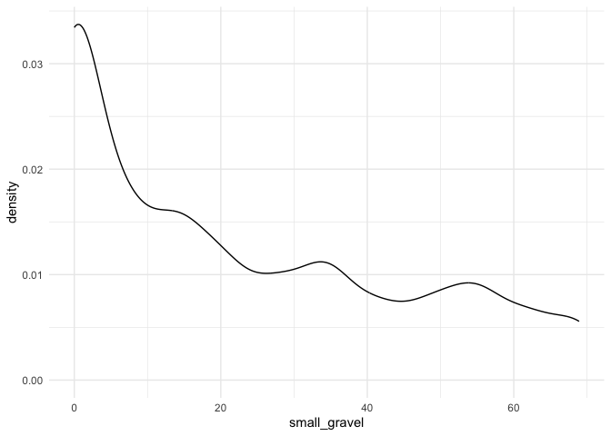
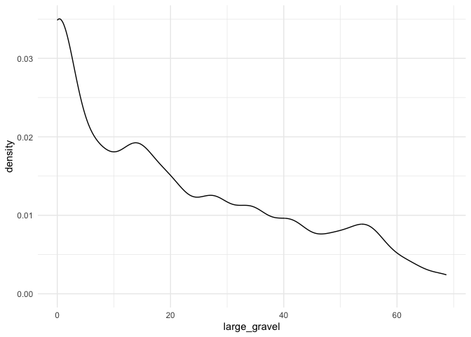
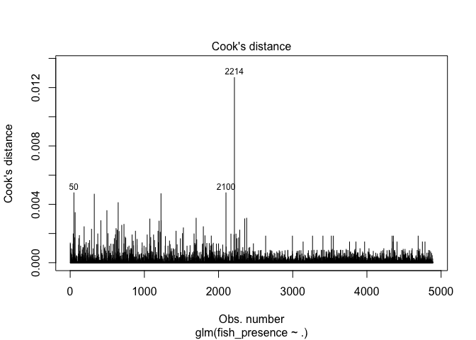
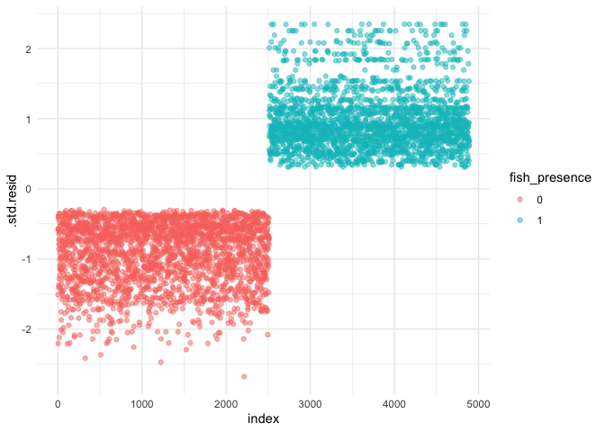
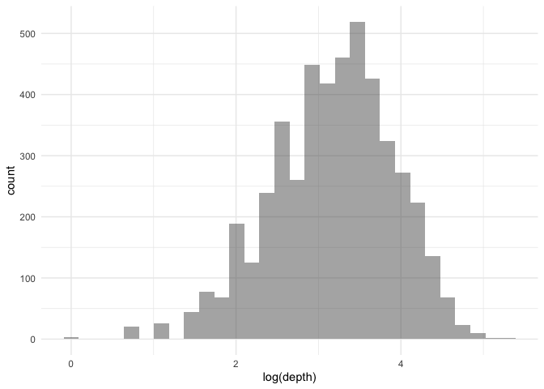
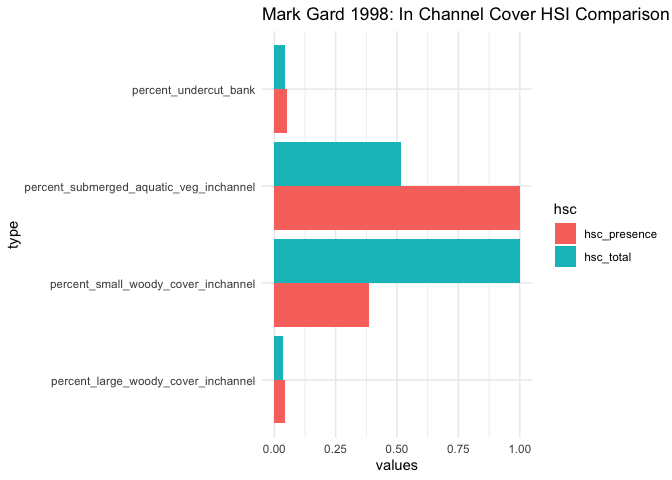

Mini Snorkel Feather HSI Workflow
================
Maddee Rubenson
2024-04-29

``` r
# read in mini snorkel data
mini_snorkel <- read_csv('microhabitat_with_fish_observations.csv') |> 
  mutate(count = ifelse(is.na(count), 0, count)) |> 
  glimpse()
```

    ## Rows: 5018 Columns: 28
    ## ── Column specification ────────────────────────────────────────────────────────
    ## Delimiter: ","
    ## chr   (2): species, channel_geomorphic_unit
    ## dbl  (25): micro_hab_data_tbl_id, location_table_id, transect_code, depth, v...
    ## date  (1): date
    ## 
    ## ℹ Use `spec()` to retrieve the full column specification for this data.
    ## ℹ Specify the column types or set `show_col_types = FALSE` to quiet this message.

    ## Rows: 5,018
    ## Columns: 28
    ## $ micro_hab_data_tbl_id                       <dbl> 18, 18, 18, 19, 20, 21, 22…
    ## $ location_table_id                           <dbl> 11, 11, 11, 11, 11, 11, 11…
    ## $ transect_code                               <dbl> 0.1, 0.1, 0.1, 0.2, 0.3, 0…
    ## $ depth                                       <dbl> 17, 17, 17, 19, 11, 12, 11…
    ## $ velocity                                    <dbl> 0.22, 0.22, 0.22, 0.35, 1.…
    ## $ percent_fine_substrate                      <dbl> 0, 0, 0, 0, 0, 0, 0, 0, 0,…
    ## $ percent_sand_substrate                      <dbl> 40, 40, 40, 50, 25, 0, 70,…
    ## $ percent_small_gravel_substrate              <dbl> 20, 20, 20, 40, 75, 80, 30…
    ## $ percent_large_gravel_substrate              <dbl> 30, 30, 30, 10, 0, 20, 0, …
    ## $ percent_cobble_substrate                    <dbl> 10, 10, 10, 0, 0, 0, 0, 0,…
    ## $ percent_boulder_substrate                   <dbl> 0, 0, 0, 0, 0, 0, 0, 0, 0,…
    ## $ percent_no_cover_inchannel                  <dbl> 75, 75, 75, 100, 100, 100,…
    ## $ percent_small_woody_cover_inchannel         <dbl> 15, 15, 15, 0, 0, 0, 20, 0…
    ## $ percent_large_woody_cover_inchannel         <dbl> 0, 0, 0, 0, 0, 0, 40, 0, 0…
    ## $ percent_submerged_aquatic_veg_inchannel     <dbl> 10, 10, 10, 0, 0, 0, 30, 0…
    ## $ percent_undercut_bank                       <dbl> 0, 0, 0, 0, 0, 0, 0, 0, 0,…
    ## $ percent_no_cover_overhead                   <dbl> 100, 100, 100, 100, 100, 1…
    ## $ percent_cover_half_meter_overhead           <dbl> 0, 0, 0, 0, 0, 0, 0, 0, 0,…
    ## $ percent_cover_more_than_half_meter_overhead <dbl> 0, 0, 0, 0, 0, 0, 0, 0, 0,…
    ## $ surface_turbidity                           <dbl> 20, 20, 20, 30, 30, 30, 10…
    ## $ fish_data_id                                <dbl> 21, 22, 23, NA, NA, NA, 25…
    ## $ count                                       <dbl> 2, 3, 1, 0, 0, 0, 3, 0, 0,…
    ## $ fl_mm                                       <dbl> 35, 35, 25, NA, NA, NA, 25…
    ## $ dist_to_bottom                              <dbl> 1.0, 1.5, 1.5, NA, NA, NA,…
    ## $ focal_velocity                              <dbl> 0.94, 0.16, 0.16, NA, NA, …
    ## $ species                                     <chr> "Chinook salmon", "Chinook…
    ## $ date                                        <date> 2001-03-14, 2001-03-14, 2…
    ## $ channel_geomorphic_unit                     <chr> "Glide", "Glide", "Glide",…

## Literature Notes

[**2004a**](https://netorg629193.sharepoint.com/:b:/s/VA-FeatherRiver/EY9qLwY15ypFn3W42E02takBH745JkefSPAbS4y9VFzuBQ?e=n2QRXK)
Data Analysis

- Stepwise binary logistic regression analysis was used to assess
  factors influencing the occurrence of steelhead and Chinook salmon.
  Fine scale survey results were analyzed at both the mesohabitat (100
  m2) and microhabitat (1 m2) scale.

- Mesohabitat analysis was performed by treating the entire 25 m reach
  as a sample

- Reach habitat variables where steelhead or salmon were present
  (logistic response variable) were compared to reaches where fish were
  absent (logistic reference variable)

- Microhabitat was done similarly except that individual one square
  meter cells were considered rather than entire reaches

- Reaches lacking salmon or steelhead were not included in microhabitat
  analysis

[**2005**](https://netorg629193.sharepoint.com/:b:/s/VA-FeatherRiver/ES8H3f7ZUO5Aj7OK8hfW03UB721tCgZd_OEb8P9cbJLiMA?e=L95bf8):
HSC development- chinook salmon rearing

- HSC were created for fry (\<50 mm) and juvenile Chinook salmon depth
  and mean column velocity data using a three-point running mean to
  smooth frequency distributions of the fry habitat use data and using
  NPTL \[what does this stand for?\] for the juvenile habitat use data.

- all substrate suitability given value of 1 after finding that
  substrate was not driving factor for microhabitat selection of fry and
  juveniles

- cover modified to: with and without. Suitability of without cover was
  calculated as the percentage of fish observed without cover to the
  total sample size

- suitability of cover present was assigned a value of 1.0 and 0.30 or
  0.22 for cover absent for Chinook salon fry and juveniles \[I do not
  get this… \]

- Focus on suitability of instream cover. When a cover variable did not
  exist, preference for low velocity and shallow depth in a large river
  indicate suitable habitat along stream margins or out in the main
  channel when the river is nearly dry and the preferred conditions are
  prevalent.

- intermediate scale data separated into four cover types: no cover,
  object only cover overhead only cover, both object and overhead cover

[**Gard
2023**](https://netorg629193.sharepoint.com/:b:/s/VA-FeatherRiver/EelfImRfhzxKjLQdrstbIPgBqbRV5S0Wke5GkSh06_CUrQ?e=6PdWKh) -
HSC comparison

- Presence/absence HSC are developed using a polynomial logistic
  regression that uses both the occupied and unoccupied data; the
  results are then rescaled that the highest value is 1 to calculate the
  HSI

- For depth and velocity HSC, the criteria were developed directly from
  use observations using a range of curve fitting and smoothing
  techniques

- Use/availability criteria are developed by dividing use observations,
  generally binned, by availability data from transects

``` r
mini_snorkel_model_ready <- mini_snorkel |> 
  #select(depth:percent_cover_more_than_half_meter_overhead, count, channel_geomorphic_unit, species) |> 
  mutate(fish_presence = as.factor(ifelse(count < 1, "0", "1")))
```

# Chinook Salmon

### Explore Variables

Specifically looking for collinearity in the variables

### Logistic Regression Using Cover, Substrate, Velocity, and Depth

**Predictors**

- Depth

- Velocity

- Substrate (fine through boulder) normalized by prevalence

- Woody Debris (`percent_small_woody_cover_inchannel` +
  `percent_large_woody_cover_inchannel`)

- Overhead Cover (`percent_cover_more_than_half_meter_overhead` +
  `percent_cover_half_meter_overhead`)

- Submerged Aquatic Vegetation

- Undercut Bank

- Transect Code

- Surface Turbidity

- Month

#### Normalize Substrate by Prevalence

This table provides a weighting for each substrate type based on the
overall presence (\>20%) of each substrate type. Use this to normalize
the substrate columns.

``` r
substrate_percent <- mini_snorkel |> 
  group_by(micro_hab_data_tbl_id) |> 
  select(contains('substrate')) |> 
  distinct() |> 
  pivot_longer(cols = c(percent_fine_substrate:percent_boulder_substrate), names_to = "substrate_type", values_to = "percent") |> 
  mutate(substrate_presence_absence = ifelse(percent < 19, 0, 1)) |>  # 20% threshold
  group_by(substrate_type) |> 
  summarise(total_presence = sum(substrate_presence_absence)) |> 
  ungroup() |> 
  mutate(perc_total = total_presence/sum(total_presence))
```

    ## Adding missing grouping variables: `micro_hab_data_tbl_id`

``` r
knitr::kable(substrate_percent |> mutate(perc_total = perc_total*100), digits = 2)
```

| substrate_type                 | total_presence | perc_total |
|:-------------------------------|---------------:|-----------:|
| percent_boulder_substrate      |            360 |       3.86 |
| percent_cobble_substrate       |           1498 |      16.05 |
| percent_fine_substrate         |            271 |       2.90 |
| percent_large_gravel_substrate |           2919 |      31.27 |
| percent_sand_substrate         |           1385 |      14.84 |
| percent_small_gravel_substrate |           2901 |      31.08 |

#### Apply table to substrate columns to normalize

``` r
mini_snorkel_grouped <- mini_snorkel_model_ready |> 
  rowwise() |> 
  mutate(fine_substrate = percent_fine_substrate * (1-substrate_percent[substrate_percent$substrate_type == "percent_fine_substrate", 'perc_total']$perc_total),
         sand_substrate = percent_sand_substrate * (1-substrate_percent[substrate_percent$substrate_type == "percent_sand_substrate", 'perc_total']$perc_total),
         small_gravel = percent_small_gravel_substrate * (1-substrate_percent[substrate_percent$substrate_type == "percent_small_gravel_substrate", 'perc_total']$perc_total),
         large_gravel = percent_large_gravel_substrate * (1-substrate_percent[substrate_percent$substrate_type == "percent_large_gravel_substrate", 'perc_total']$perc_total),
         cobble_substrate = percent_cobble_substrate * (1-substrate_percent[substrate_percent$substrate_type == "percent_cobble_substrate", 'perc_total']$perc_total),
         boulder_substrate = percent_boulder_substrate * (1-substrate_percent[substrate_percent$substrate_type == "percent_boulder_substrate", 'perc_total']$perc_total)) |> 
  select(-c(percent_fine_substrate:percent_boulder_substrate)) |> 
  mutate(woody_debris = sum(percent_large_woody_cover_inchannel, percent_small_woody_cover_inchannel),
         overhead_cover = sum(percent_cover_half_meter_overhead, percent_cover_more_than_half_meter_overhead)
         ) |> 
  select(-c(percent_small_woody_cover_inchannel, percent_large_woody_cover_inchannel, percent_cover_more_than_half_meter_overhead, percent_cover_half_meter_overhead)) |> 
  #filter(species == "Chinook salmon" | is.na(species)) |> 
  select(-count, -channel_geomorphic_unit, -species, -micro_hab_data_tbl_id, -location_table_id, -fish_data_id,
         -focal_velocity, -dist_to_bottom, -fl_mm) |> 
  select(-(contains("no_cover"))) |> 
  mutate(month = month(date)) |> 
  select(-date) |> 
  distinct() |> 
  glimpse()
```

    ## Rows: 4,890
    ## Columns: 16
    ## Rowwise: 
    ## $ transect_code                           <dbl> 0.1, 0.2, 0.3, 0.4, 3.1, 3.2, …
    ## $ depth                                   <dbl> 17, 19, 11, 12, 11, 10, 8, 9, …
    ## $ velocity                                <dbl> 0.22, 0.35, 1.95, 2.14, 1.19, …
    ## $ percent_submerged_aquatic_veg_inchannel <dbl> 10, 0, 0, 0, 30, 0, 0, 0, 40, …
    ## $ percent_undercut_bank                   <dbl> 0, 0, 0, 0, 0, 0, 0, 0, 0, 0, …
    ## $ surface_turbidity                       <dbl> 20, 30, 30, 30, 10, 10, 10, 10…
    ## $ fish_presence                           <fct> 1, 0, 0, 0, 1, 0, 0, 1, 1, 1, …
    ## $ fine_substrate                          <dbl> 0.00000, 0.00000, 0.00000, 0.0…
    ## $ sand_substrate                          <dbl> 34.064710, 42.580887, 21.29044…
    ## $ small_gravel                            <dbl> 13.784015, 27.568031, 51.69005…
    ## $ large_gravel                            <dbl> 20.618170, 6.872723, 0.000000,…
    ## $ cobble_substrate                        <dbl> 8.395115, 0.000000, 0.000000, …
    ## $ boulder_substrate                       <dbl> 0, 0, 0, 0, 0, 0, 0, 0, 0, 0, …
    ## $ woody_debris                            <dbl> 15, 0, 0, 0, 60, 0, 0, 0, 10, …
    ## $ overhead_cover                          <dbl> 0, 0, 0, 0, 0, 0, 0, 0, 25, 0,…
    ## $ month                                   <dbl> 3, 3, 3, 3, 3, 3, 3, 3, 3, 3, …

#### Explore newly constructed variables

<!-- --><!-- --><!-- --><!-- --><!-- -->

    ## Warning: Removed 1 rows containing non-finite values (`stat_density()`).

<!-- --><!-- -->

#### Resample for an Equal Distribution

Use `ROSE` library to generate a synthetic dataset that randomly samples
and creates an equal distribution of fish presence/absence

``` r
table(mini_snorkel_grouped$fish_presence)
```

    ## 
    ##    0    1 
    ## 4635  255

``` r
mini_snorkel_equal_sample <- ROSE::ovun.sample(fish_presence~., data = mini_snorkel_grouped,
                                N = nrow(mini_snorkel_grouped), p = 0.5, 
                                seed = 1, method = "both")$data

table(mini_snorkel_equal_sample$fish_presence)
```

    ## 
    ##    0    1 
    ## 2510 2380

#### Create Logistic Regression

``` r
model <- glm(fish_presence ~., data = mini_snorkel_equal_sample, family = binomial)

probabilities <- predict(model, type = "response")
predicted_classes <- ifelse(probabilities > 0.5, "1", "0") 

# check for linearity

# influential values
plot(model, which = 4, id.n = 3)
```

<!-- -->

``` r
# Extract model results
model_data <- augment(model) %>% 
  mutate(index = 1:n()) 

model_data |> top_n(3, .cooksd) # top three largest influential values (as seen in plot)
```

    ## # A tibble: 3 × 23
    ##   fish_presence transect_code depth velocity percent_submerged_aquatic_veg_inc…¹
    ##   <fct>                 <dbl> <dbl>    <dbl>                               <dbl>
    ## 1 0                      15.1    20     1.11                                  20
    ## 2 0                      15.1    20     1.11                                  20
    ## 3 0                      18.2    68     0.55                                   0
    ## # ℹ abbreviated name: ¹​percent_submerged_aquatic_veg_inchannel
    ## # ℹ 18 more variables: percent_undercut_bank <dbl>, surface_turbidity <dbl>,
    ## #   fine_substrate <dbl>, sand_substrate <dbl>, small_gravel <dbl>,
    ## #   large_gravel <dbl>, cobble_substrate <dbl>, boulder_substrate <dbl>,
    ## #   woody_debris <dbl>, overhead_cover <dbl>, month <dbl>, .fitted <dbl>,
    ## #   .resid <dbl>, .hat <dbl>, .sigma <dbl>, .cooksd <dbl>, .std.resid <dbl>,
    ## #   index <int>

``` r
ggplot(model_data, aes(index, .std.resid)) + 
  geom_point(aes(color = fish_presence), alpha = .5) 
```

<!-- -->

``` r
# Filter potential influential data points with abs(.std.res) > 3:
chn_mini_snorkel_filtered <- model_data %>% 
  filter(abs(.std.resid) < 3)

# test if any columns are equal, none are perfectly equal
test_if_equal <- cor(mini_snorkel_equal_sample |> select(-fish_presence)) |>  
  as_tibble() |> 
        rowwise()  |> 
        mutate(match = n_distinct(unlist(cur_data())) == 1)  |> 
        ungroup()
```

    ## Warning: There was 1 warning in `mutate()`.
    ## ℹ In argument: `match = n_distinct(unlist(cur_data())) == 1`.
    ## ℹ In row 1.
    ## Caused by warning:
    ## ! `cur_data()` was deprecated in dplyr 1.1.0.
    ## ℹ Please use `pick()` instead.

``` r
#the linearly dependent variables. These variables are too linear and need to be removed from 
# the model formula: 
ld_vars <- attributes(alias(model)$Complete)$dimnames[[1]]
print(ld_vars)
```

    ## [1] "boulder_substrate"

``` r
chn_mini_snorkel_filtered_without_linear_cols <- chn_mini_snorkel_filtered |> 
  select(-ld_vars, -(.fitted:index)) 
```

    ## Warning: Using an external vector in selections was deprecated in tidyselect 1.1.0.
    ## ℹ Please use `all_of()` or `any_of()` instead.
    ##   # Was:
    ##   data %>% select(ld_vars)
    ## 
    ##   # Now:
    ##   data %>% select(all_of(ld_vars))
    ## 
    ## See <https://tidyselect.r-lib.org/reference/faq-external-vector.html>.
    ## This warning is displayed once every 8 hours.
    ## Call `lifecycle::last_lifecycle_warnings()` to see where this warning was
    ## generated.

``` r
model_2 <- glm(fish_presence ~., data = chn_mini_snorkel_filtered_without_linear_cols, family = binomial)

# test for multicollinarity:
# As a rule of thumb, a VIF value that exceeds 5 or 10 indicates a problematic amount of collinearity.
car::vif(model_2) 
```

    ##                           transect_code                                   depth 
    ##                                1.025848                                1.146079 
    ##                                velocity percent_submerged_aquatic_veg_inchannel 
    ##                                1.356325                                1.167433 
    ##                   percent_undercut_bank                       surface_turbidity 
    ##                                1.052970                                1.202540 
    ##                          fine_substrate                          sand_substrate 
    ##                                2.953529                                6.179065 
    ##                            small_gravel                            large_gravel 
    ##                                6.302645                                5.299181 
    ##                        cobble_substrate                            woody_debris 
    ##                                4.858194                                1.263653 
    ##                          overhead_cover                                   month 
    ##                                1.273616                                1.336579

``` r
summary(model_2)
```

    ## 
    ## Call:
    ## glm(formula = fish_presence ~ ., family = binomial, data = chn_mini_snorkel_filtered_without_linear_cols)
    ## 
    ## Deviance Residuals: 
    ##     Min       1Q   Median       3Q      Max  
    ## -2.6693  -0.8461  -0.3556   0.8705   2.3455  
    ## 
    ## Coefficients:
    ##                                          Estimate Std. Error z value Pr(>|z|)
    ## (Intercept)                              3.820814   0.306050  12.484  < 2e-16
    ## transect_code                            0.008887   0.004512   1.970 0.048869
    ## depth                                   -0.007603   0.001509  -5.039 4.67e-07
    ## velocity                                 0.486162   0.055020   8.836  < 2e-16
    ## percent_submerged_aquatic_veg_inchannel  0.002493   0.001642   1.518 0.129047
    ## percent_undercut_bank                    0.017796   0.013069   1.362 0.173299
    ## surface_turbidity                        0.010138   0.004449   2.279 0.022686
    ## fine_substrate                          -0.005384   0.003214  -1.675 0.093860
    ## sand_substrate                          -0.009829   0.003271  -3.005 0.002660
    ## small_gravel                            -0.013432   0.003977  -3.377 0.000733
    ## large_gravel                            -0.011724   0.003931  -2.983 0.002857
    ## cobble_substrate                        -0.014154   0.003973  -3.562 0.000368
    ## woody_debris                             0.011800   0.002778   4.247 2.16e-05
    ## overhead_cover                           0.010697   0.001317   8.121 4.63e-16
    ## month                                   -0.705359   0.026120 -27.004  < 2e-16
    ##                                            
    ## (Intercept)                             ***
    ## transect_code                           *  
    ## depth                                   ***
    ## velocity                                ***
    ## percent_submerged_aquatic_veg_inchannel    
    ## percent_undercut_bank                      
    ## surface_turbidity                       *  
    ## fine_substrate                          .  
    ## sand_substrate                          ** 
    ## small_gravel                            ***
    ## large_gravel                            ** 
    ## cobble_substrate                        ***
    ## woody_debris                            ***
    ## overhead_cover                          ***
    ## month                                   ***
    ## ---
    ## Signif. codes:  0 '***' 0.001 '**' 0.01 '*' 0.05 '.' 0.1 ' ' 1
    ## 
    ## (Dispersion parameter for binomial family taken to be 1)
    ## 
    ##     Null deviance: 6775.5  on 4889  degrees of freedom
    ## Residual deviance: 5218.6  on 4875  degrees of freedom
    ## AIC: 5248.6
    ## 
    ## Number of Fisher Scoring iterations: 4

``` r
# # columns with vif less than 10
# vif_cols <- names(car::vif(model_2)[car::vif(model_2) < 10])
# 
# chn_mini_snorkel_filtered_without_linear_cols_vif <- chn_mini_snorkel_filtered_without_linear_cols |> 
#   select(fish_presence, vif_cols) |> glimpse()
# 
# model_3 <-  glm(fish_presence ~., data = chn_mini_snorkel_filtered_without_linear_cols_vif, family = binomial)
# 
# # test that there is still no multicollinearity
# car::vif(model_3) 
# 
# probabilities <- predict(model_3, type = "response")
# predicted_classes <- ifelse(probabilities > 0.5, "1", "0") 
# 
# summary(model_3)
```

``` r
library(patchwork)
library(ggeffects)

plts = lapply(names(coefficients(model_2))[-1],function(i){
       return(plot(ggpredict(model_2,i)))
       })
```

    ## Data were 'prettified'. Consider using `terms="transect_code [all]"` to
    ##   get smooth plots.

    ## Data were 'prettified'. Consider using `terms="depth [all]"` to get
    ##   smooth plots.

    ## Data were 'prettified'. Consider using `terms="velocity [all]"` to get
    ##   smooth plots.

    ## Data were 'prettified'. Consider using
    ##   `terms="percent_submerged_aquatic_veg_inchannel [all]"` to get smooth
    ##   plots.

    ## Data were 'prettified'. Consider using `terms="small_gravel [all]"` to
    ##   get smooth plots.

    ## Data were 'prettified'. Consider using `terms="large_gravel [all]"` to
    ##   get smooth plots.

``` r
#wrap_plots(plts)

plts
```

    ## [[1]]

<!-- -->

    ## 
    ## [[2]]

<!-- -->

    ## 
    ## [[3]]

<!-- -->

    ## 
    ## [[4]]

<!-- -->

    ## 
    ## [[5]]

<!-- -->

    ## 
    ## [[6]]

<!-- -->

    ## 
    ## [[7]]

<!-- -->

    ## 
    ## [[8]]

<!-- -->

    ## 
    ## [[9]]

<!-- -->

    ## 
    ## [[10]]

<!-- -->

    ## 
    ## [[11]]

<!-- -->

    ## 
    ## [[12]]

<!-- -->

    ## 
    ## [[13]]

<!-- -->

    ## 
    ## [[14]]

<!-- -->

``` r
# ggpredict(model_3)
```

### Logistic Regression for Substrate and Cover

Build a logistic regression of fish presence and absence to identify
important cover and substrate variables.

**Findings**

- Substrate: most important predictor is small gravel
- Cover: all predictors (aside from the two NAs and
  `percent_cover_half_meter_overhead`) were significant.
  `percent_no_cover_overhead` was most significant.

**Questions**

- Substrate: boulder came out as NA in model. Should explore why this
  occurred.
- Cover: `percent_undercut_bank` and
  `percent_cover_more_than_half_meter_overhead` came back as NA. Need to
  explore.

#### Substrate Logistic Regression

``` r
set.seed(06221988)

# start with Chinook and substrate 
chn_mini_snorkel <- mini_snorkel_model_ready |> 
  filter(species == "Chinook salmon" | is.na(species)) |> 
  select(fish_presence, percent_fine_substrate:percent_boulder_substrate) 

# Define a recipe
rec <- recipe(fish_presence ~  percent_fine_substrate + percent_sand_substrate + percent_small_gravel_substrate + percent_large_gravel_substrate + percent_boulder_substrate + percent_cobble_substrate, data = chn_mini_snorkel)  

# Split the data into training and testing sets
data_split <- initial_split(chn_mini_snorkel, prop = 0.8, strata = "fish_presence")
data_train <- training(data_split)
data_test <- testing(data_split)

# Create a logistic regression model
log_reg <- logistic_reg() |> 
  set_engine("glm") |> 
  set_mode("classification") |> translate()

# Create a workflow
wf <- workflow()  |> 
  add_recipe(rec) |> 
  add_model(log_reg)

# Train the model
wf_fit <- wf |> 
  fit(data_train)

tidy(wf_fit) # why is boulder NA? small gravel only significant predictor
```

    ## # A tibble: 7 × 5
    ##   term                             estimate std.error statistic   p.value
    ##   <chr>                               <dbl>     <dbl>     <dbl>     <dbl>
    ## 1 (Intercept)                    -3.39        0.390    -8.68     3.98e-18
    ## 2 percent_fine_substrate          0.0116      0.00543   2.13     3.29e- 2
    ## 3 percent_sand_substrate          0.0141      0.00428   3.29     1.01e- 3
    ## 4 percent_small_gravel_substrate -0.00593     0.00464  -1.28     2.01e- 1
    ## 5 percent_large_gravel_substrate  0.0000212   0.00526   0.00404  9.97e- 1
    ## 6 percent_boulder_substrate       0.00722     0.00864   0.836    4.03e- 1
    ## 7 percent_cobble_substrate       NA          NA        NA       NA

``` r
glance(wf_fit)
```

    ## # A tibble: 1 × 8
    ##   null.deviance df.null logLik   AIC   BIC deviance df.residual  nobs
    ##           <dbl>   <int>  <dbl> <dbl> <dbl>    <dbl>       <int> <int>
    ## 1         1345.    3871  -643. 1299. 1336.    1287.        3866  3872

``` r
# Make predictions
predictions <- predict(wf_fit, data_test) |>
  bind_cols(data_test)
```

    ## Warning in predict.lm(object, newdata, se.fit, scale = 1, type = if (type == :
    ## prediction from a rank-deficient fit may be misleading

#### Cover Logistic Regression

``` r
# start with Chinook and substrate 
chn_mini_snorkel <- mini_snorkel_model_ready |> 
  filter(species == "Chinook salmon" | is.na(species)) |> 
  select(fish_presence, percent_no_cover_inchannel:percent_cover_more_than_half_meter_overhead) |> 
  na.omit() 

# Define a recipe
rec <- recipe(fish_presence ~  percent_no_cover_inchannel + percent_small_woody_cover_inchannel + percent_large_woody_cover_inchannel + percent_submerged_aquatic_veg_inchannel + percent_undercut_bank + percent_no_cover_overhead + percent_cover_half_meter_overhead + percent_cover_more_than_half_meter_overhead, data = chn_mini_snorkel)  

# Split the data into training and testing sets
data_split <- initial_split(chn_mini_snorkel, prop = 0.8, strata = "fish_presence")
data_train <- training(data_split)
data_test <- testing(data_split)

# Create a logistic regression model
log_reg <- logistic_reg() |> 
  set_engine("glm") |> 
  set_mode("classification") |> translate()

# Create a workflow
wf <- workflow()  |> 
  add_recipe(rec) |> 
  add_model(log_reg)

# Train the model
wf_fit <- wf |> 
  fit(data_train)

tidy(wf_fit) # 
```

    ## # A tibble: 9 × 5
    ##   term                                     estimate std.error statistic  p.value
    ##   <chr>                                       <dbl>     <dbl>     <dbl>    <dbl>
    ## 1 (Intercept)                               5.50      1.83         3.00  2.66e-3
    ## 2 percent_no_cover_inchannel               -0.0732    0.0185      -3.95  7.70e-5
    ## 3 percent_small_woody_cover_inchannel      -0.0474    0.0187      -2.54  1.11e-2
    ## 4 percent_large_woody_cover_inchannel      -0.0565    0.0236      -2.39  1.69e-2
    ## 5 percent_submerged_aquatic_veg_inchannel  -0.0815    0.0190      -4.30  1.69e-5
    ## 6 percent_undercut_bank                    NA        NA           NA    NA      
    ## 7 percent_no_cover_overhead                -0.0156    0.00306     -5.08  3.68e-7
    ## 8 percent_cover_half_meter_overhead        -0.00849   0.00580     -1.46  1.43e-1
    ## 9 percent_cover_more_than_half_meter_over… NA        NA           NA    NA

``` r
# Make predictions
# predictions <- predict(wf_fit, data_test) |>
#   bind_cols(data_test)
```

### Adapted Mark Gard 1998 HSC process to Cover and Substrate

Mark Gard’s 1998 paper identified a method to developing HSC for
presence and absence of redds in different substrate classes. I will
follow the same methodology using fish presence/absence and total fish
count instead of redds and also apply to cover.

1.  Determine number of fish with each substrate-size class
2.  Calculate the proportion of fish with each substrate size class
3.  Calculate the HSC value for each substrate size class by dividing
    the proportion of fish in each substrate class by the proportion of
    fish with the most frequent substrate class

To convert from percent to discrete:

- Cover decision: 20% or greater is considered present

- Substrate decision: used same criteria as cover (for now)

**Discussion**

Substrate:

- Sand has a stronger HSI when looking at number of fish vs.
  presence/absence

- Presence/absence results are consistent with logistic regression

Cover:

- More consistent results when looking at number of fish vs.
  presence/absence

``` r
mark_gard_1998_hsi <- function(data, percent_presence = 20, cols = c()) {
  data_tidy <- data |> 
    select(count, fish_presence, cols) |> 
    pivot_longer(cols = cols, names_to = "type", values_to = "percent") |> 
    mutate(presence = ifelse(percent >= percent_presence, 1, 0)) |> 
    filter(presence == 1) |> 
    group_by(type) |>
    summarise(n_fish_presence = sum(as.numeric(fish_presence)),
              n_fish_total = sum(count)) |> 
    mutate(prop_fish_presence = n_fish_presence/sum(n_fish_presence),
           prop_fish_total = n_fish_total/sum(n_fish_total)) |> 
    ungroup()
  
     most_freq_total <- data_tidy |> 
      arrange(desc(prop_fish_total)) |> 
      slice(1) 
 
     most_freq_presence <- data_tidy |> 
      arrange(desc(prop_fish_presence)) |> 
      slice(1) 
  
  
  data_tidy_final <- data_tidy |> 
    mutate(hsc_presence = prop_fish_presence/most_freq_presence$prop_fish_presence,
           hsc_total = prop_fish_total/most_freq_total$prop_fish_total)
  
  return(data_tidy_final)

}
```

#### Substrate

``` r
cols <- c('percent_fine_substrate', "percent_sand_substrate" , 'percent_small_gravel_substrate', 'percent_large_gravel_substrate', 'percent_cobble_substrate', 'percent_boulder_substrate')

hsi_substrate <- mark_gard_1998_hsi(data = mini_snorkel_model_ready, percent_presence = 20, cols = cols)
```

    ## Warning: Using an external vector in selections was deprecated in tidyselect 1.1.0.
    ## ℹ Please use `all_of()` or `any_of()` instead.
    ##   # Was:
    ##   data %>% select(cols)
    ## 
    ##   # Now:
    ##   data %>% select(all_of(cols))
    ## 
    ## See <https://tidyselect.r-lib.org/reference/faq-external-vector.html>.
    ## This warning is displayed once every 8 hours.
    ## Call `lifecycle::last_lifecycle_warnings()` to see where this warning was
    ## generated.

``` r
hsi_substrate |> 
  pivot_longer(cols = c(hsc_presence, hsc_total), names_to = "hsc", values_to = "values") |> 
  ggplot() + 
  geom_col(aes(y = values, x = type, fill = hsc), position = "dodge") +
  coord_flip() +
  ggtitle('Mark Gard 1998: Substrate HSI Comparison')
```

<!-- -->

#### Cover

**Notes**

- Removed no cover variables

- Created two cover HSIs: in-channel and overhead

``` r
cols_inchannel <- c('percent_small_woody_cover_inchannel', 'percent_large_woody_cover_inchannel', 
          'percent_submerged_aquatic_veg_inchannel', 'percent_undercut_bank') #'percent_no_cover_inchannel'

cols_overhead <- c('percent_cover_half_meter_overhead',
          'percent_cover_more_than_half_meter_overhead') #'percent_no_cover_overhead'

hsi_cover <- mark_gard_1998_hsi(data = mini_snorkel_model_ready, percent_presence = 20, cols = cols_inchannel)

hsi_cover |> 
  pivot_longer(cols = c(hsc_presence, hsc_total), names_to = "hsc", values_to = "values") |> 
  ggplot() + 
  geom_col(aes(y = values, x = type, fill = hsc), position = "dodge") +
  coord_flip() +
  ggtitle('Mark Gard 1998: In Channel Cover HSI Comparison')
```

<!-- -->

``` r
hsi_cover_overhead <- mark_gard_1998_hsi(data = mini_snorkel_model_ready, percent_presence = 20, cols = cols_overhead)

hsi_cover_overhead |> 
  pivot_longer(cols = c(hsc_presence, hsc_total), names_to = "hsc", values_to = "values") |> 
  ggplot() + 
  geom_col(aes(y = values, x = type, fill = hsc), position = "dodge") +
  coord_flip() +
  ggtitle('Mark Gard 1998: Overhead Cover HSI Comparison')
```

<!-- -->

## Velocity and Depth

### Adapted Mark Gard 2023 HSC approach for Velocity and Depth

Mark Gard (2023) listed three approaches to calculating the HSI for
depth and velocity. Each approach is attempted below.

#### Approach 1: Criteria from use observations using curve fitting

``` r
lm_data <- mini_snorkel_model_ready |> 
  select(count, depth, velocity) |> 
  na.omit()

fit <- lm(count ~ poly(depth, 3) + poly(velocity, 3) , data = lm_data)
predicted_values <- predict(fit, type = "response")
lm_data$predicted_values <- predicted_values

tidy(fit)
```

    ## # A tibble: 7 × 5
    ##   term               estimate std.error statistic  p.value
    ##   <chr>                 <dbl>     <dbl>     <dbl>    <dbl>
    ## 1 (Intercept)           3.90      0.633    6.16   7.97e-10
    ## 2 poly(depth, 3)1     205.       46.0      4.46   8.20e- 6
    ## 3 poly(depth, 3)2      57.3      44.9      1.27   2.03e- 1
    ## 4 poly(depth, 3)3     106.       44.6      2.38   1.75e- 2
    ## 5 poly(velocity, 3)1 -122.       45.9     -2.66   7.82e- 3
    ## 6 poly(velocity, 3)2   -0.741    44.7     -0.0166 9.87e- 1
    ## 7 poly(velocity, 3)3   37.3      44.9      0.830  4.07e- 1

``` r
lm_data %>%
  ggplot(aes(x = depth, y = count)) +
  geom_point() +
  geom_smooth(aes(x = depth, y = predicted_values), color = "blue") +
  labs(x = "Depth", y = "Fish Count") +
  theme_minimal()
```

    ## `geom_smooth()` using method = 'gam' and formula = 'y ~ s(x, bs = "cs")'

<!-- -->

``` r
lm_data %>%
  ggplot(aes(x = velocity, y = count)) +
  geom_point() +
  geom_smooth(aes(x = velocity, y = predicted_values), color = "blue") +
  labs(x = "Velocity", y = "Fish Count") +
  theme_minimal()
```

    ## `geom_smooth()` using method = 'gam' and formula = 'y ~ s(x, bs = "cs")'

<!-- -->

#### Approach 2: Use/Availability criteria from binned data

Use/availability criteria are developed by dividing use observations,
generally binned, by availability data from transects.

TODO: unsure how to proceed with this approach..

``` r
approach_2 <- mini_snorkel_model_ready |> 
  select(count, fish_presence, depth, velocity) |> 
  na.omit()
```

#### Approach 3: Presence/absence HSC using logistic regression

``` r
log_reg_data <- mini_snorkel_model_ready |> 
  select(fish_presence, depth, velocity) |> 
  na.omit()

# Fit polynomial logistic regression model
model <- glm(fish_presence ~ poly(depth, 2) + poly(velocity, 2), data = log_reg_data, family = binomial())

tidy(model)
```

    ## # A tibble: 5 × 5
    ##   term               estimate std.error statistic p.value
    ##   <chr>                 <dbl>     <dbl>     <dbl>   <dbl>
    ## 1 (Intercept)           -2.53    0.0547   -46.2   0      
    ## 2 poly(depth, 2)1       -1.28    3.72      -0.343 0.731  
    ## 3 poly(depth, 2)2        8.03    2.77       2.90  0.00376
    ## 4 poly(velocity, 2)1    -5.15    4.51      -1.14  0.253  
    ## 5 poly(velocity, 2)2    -6.46    5.18      -1.25  0.212

``` r
summary(model)
```

    ## 
    ## Call:
    ## glm(formula = fish_presence ~ poly(depth, 2) + poly(velocity, 
    ##     2), family = binomial(), data = log_reg_data)
    ## 
    ## Deviance Residuals: 
    ##     Min       1Q   Median       3Q      Max  
    ## -1.1627  -0.4053  -0.3901  -0.3781   2.5716  
    ## 
    ## Coefficients:
    ##                    Estimate Std. Error z value Pr(>|z|)    
    ## (Intercept)        -2.52789    0.05471 -46.209  < 2e-16 ***
    ## poly(depth, 2)1    -1.27784    3.72036  -0.343  0.73124    
    ## poly(depth, 2)2     8.02761    2.77009   2.898  0.00376 ** 
    ## poly(velocity, 2)1 -5.15296    4.51194  -1.142  0.25342    
    ## poly(velocity, 2)2 -6.45635    5.17744  -1.247  0.21239    
    ## ---
    ## Signif. codes:  0 '***' 0.001 '**' 0.01 '*' 0.05 '.' 0.1 ' ' 1
    ## 
    ## (Dispersion parameter for binomial family taken to be 1)
    ## 
    ##     Null deviance: 2624.0  on 4937  degrees of freedom
    ## Residual deviance: 2613.3  on 4933  degrees of freedom
    ## AIC: 2623.3
    ## 
    ## Number of Fisher Scoring iterations: 5

``` r
stats::step(model, test = "LRT")
```

    ## Start:  AIC=2623.3
    ## fish_presence ~ poly(depth, 2) + poly(velocity, 2)
    ## 
    ##                     Df Deviance    AIC    LRT Pr(>Chi)  
    ## - poly(velocity, 2)  2   2616.1 2622.1 2.7848  0.24848  
    ## <none>                   2613.3 2623.3                  
    ## - poly(depth, 2)     2   2620.8 2626.8 7.5123  0.02337 *
    ## ---
    ## Signif. codes:  0 '***' 0.001 '**' 0.01 '*' 0.05 '.' 0.1 ' ' 1
    ## 
    ## Step:  AIC=2622.08
    ## fish_presence ~ poly(depth, 2)
    ## 
    ##                  Df Deviance    AIC    LRT Pr(>Chi)  
    ## <none>                2616.1 2622.1                  
    ## - poly(depth, 2)  2   2624.0 2626.0 7.9409  0.01886 *
    ## ---
    ## Signif. codes:  0 '***' 0.001 '**' 0.01 '*' 0.05 '.' 0.1 ' ' 1

    ## 
    ## Call:  glm(formula = fish_presence ~ poly(depth, 2), family = binomial(), 
    ##     data = log_reg_data)
    ## 
    ## Coefficients:
    ##     (Intercept)  poly(depth, 2)1  poly(depth, 2)2  
    ##          -2.523           -1.612            8.209  
    ## 
    ## Degrees of Freedom: 4937 Total (i.e. Null);  4935 Residual
    ## Null Deviance:       2624 
    ## Residual Deviance: 2616  AIC: 2622

``` r
# depth, 2 only significant predictor 

model_2 <- glm(fish_presence ~ poly(depth, 2), data = log_reg_data, family = binomial())

summary(model_2)
```

    ## 
    ## Call:
    ## glm(formula = fish_presence ~ poly(depth, 2), family = binomial(), 
    ##     data = log_reg_data)
    ## 
    ## Deviance Residuals: 
    ##     Min       1Q   Median       3Q      Max  
    ## -1.1705  -0.4036  -0.3873  -0.3742   2.3296  
    ## 
    ## Coefficients:
    ##                 Estimate Std. Error z value Pr(>|z|)    
    ## (Intercept)     -2.52310    0.05439 -46.393  < 2e-16 ***
    ## poly(depth, 2)1 -1.61190    3.61007  -0.446  0.65524    
    ## poly(depth, 2)2  8.20883    2.73543   3.001  0.00269 ** 
    ## ---
    ## Signif. codes:  0 '***' 0.001 '**' 0.01 '*' 0.05 '.' 0.1 ' ' 1
    ## 
    ## (Dispersion parameter for binomial family taken to be 1)
    ## 
    ##     Null deviance: 2624.0  on 4937  degrees of freedom
    ## Residual deviance: 2616.1  on 4935  degrees of freedom
    ## AIC: 2622.1
    ## 
    ## Number of Fisher Scoring iterations: 5

``` r
# Calculate HSI values
predicted_vals <- predict.glm(model_2, type = "response")
model_2_prediction <- log_reg_data |> 
  mutate(predicted_vals = predicted_vals,
         binary_predicted_vals <- ifelse(predicted_vals <= 0.5, 0, 1))

ggplot(log_reg_data) + 
  geom_point(aes(x = depth, y = predicted_vals)) + 
  geom_smooth(aes(x = depth, y = predicted_vals), color = "blue") 
```

    ## `geom_smooth()` using method = 'gam' and formula = 'y ~ s(x, bs = "cs")'

<!-- -->

``` r
ggplot(log_reg_data) + 
  geom_point(aes(x = velocity, y = predicted_vals)) + 
  geom_smooth(aes(x = velocity, y = predicted_vals), color = "blue") 
```

    ## `geom_smooth()` using method = 'gam' and formula = 'y ~ s(x, bs = "cs")'

<!-- -->

### Alternative Mark Allen Approach

[Seasonal microhabitat use by juvenile spring Chinook salmon in the
Yakima River Basin,
Washington](https://www.researchgate.net/publication/283579544_Seasonal_microhabitat_use_by_juvenile_spring_Chinook_salmon_in_the_Yakima_River_Basin_Washington?enrichId=rgreq-24ca3dc3af200b9ac3ffc17b07b2e506-XXX&enrichSource=Y292ZXJQYWdlOzI4MzU3OTU0NDtBUzoyOTM5MjI4ODM1NTUzMzNAMTQ0NzA4ODA4NDU5OA%3D%3D&el=1_x_3&_esc=publicationCoverPdf)

1.  **Organize Data into Frequency Histograms:**

    - Create frequency histograms for each habitat variable (depth, mean
      column velocity, substrate, distance to bank, cover) using the
      specified bin intervals.

    - Bin intervals: 0.2 ft for depths and nose heights, 0.2 fps for
      mean column and nose velocities, 0.5 for the substrate code, and
      5.0 ft for distance to bank.

2.  **Develop Habitat Suitability Criteria Curves:**

    - Fit 4th-order polynomial regression models to the histograms for
      depth, mean column velocity, and substrate.

    - Use 6 discrete cover codes to develop cover-based HSC.

    - 4th-order polynomials are used for their ability to provide a
      visually realistic fit to skewed HSC data.

3.  **Calculate HSI Values:**

    - Once the polynomial regression models are fitted, use them to
      calculate HSI values for each habitat variable.

    - The HSI values should range from 0 to 1, with 1 representing the
      most suitable habitat.

**Notes**

- binned by 0.1 for depth and 0.01 for velocity

- TODO mapping for substrate and cover

- depth and velocity data has outliers removed and is filtered to data
  that has fish present

``` r
depth_data_all <- mini_snorkel_model_ready |> 
  select(count, depth) |> 
  filter(count > 0) |>
  mutate(weighted_depth = depth * count / sum(count)) |> 
  na.omit()

outlier_threshold <- quantile(depth_data_all$depth, 0.75)

depth_data <- depth_data_all |> 
  filter(depth <= outlier_threshold)

max_depth <- max(depth_data$depth)

depth_bins <- seq(0.1, max_depth + 1, by = 0.1)

depth_hist <- hist(depth_data$depth, breaks = depth_bins, plot = FALSE)

plot(depth_hist)

depth_model <- lm(depth_hist$counts ~ poly(depth_hist$mids, 4)) #mids represent the central value of each bin

depth_predicted <- predict(depth_model, newdata = data.frame(depth = depth_data$depth))
```

    ## Warning: 'newdata' had 296 rows but variables found have 379 rows

``` r
# Calculate HSI values
hsi_depth <- pmax(0, pmin(1, depth_predicted / max(depth_predicted))) # noramlizes predicted values to the bounds of 0 to 1

depth_to_hsi <- data.frame(hsi_depth = hsi_depth, 
           depth = depth_hist$mids)

plot(depth_hist)
```

<!-- -->

``` r
# Plotting
ggplot(depth_to_hsi, aes(x = depth, y = hsi_depth)) +
  geom_line() +
  labs(x = "Depth", y = "HSI") +
  ggtitle("Allen (2000): Depth Habitat Suitability Index")
```

<!-- -->

``` r
velocity_data_all <- mini_snorkel_model_ready |> 
  select(count, velocity) |> 
  filter(count > 0) |>
  na.omit()

outlier_threshold <- quantile(velocity_data_all$velocity, 0.75)

velocity_data <- velocity_data_all |> 
  filter(velocity <= outlier_threshold)

max_velocity <- max(velocity_data$velocity)

velocity_bins <- seq(0, max_velocity+1, by = 0.01)

velocity_hist <- hist(velocity_data$velocity, breaks = velocity_bins, plot = FALSE)

# Fit 4th-order polynomial regression model
velocity_model <- lm(velocity_hist$counts ~ poly(velocity_hist$mids, 4))

vel_predicted <- predict(velocity_model, newdata = data.frame(velocity = velocity_data$velocity))
```

    ## Warning: 'newdata' had 278 rows but variables found have 176 rows

``` r
hsi_vel <- pmax(0, pmin(1, vel_predicted / max(vel_predicted)))
vel_to_hsi <- data.frame(hsi_vel = hsi_vel, 
           mid_vel = velocity_hist$mids)

plot(velocity_hist)
```

<!-- -->

``` r
ggplot(vel_to_hsi, aes(x = mid_vel, y = hsi_vel)) +
  geom_line() +
  labs(x = "Velocity", y = "HSI") +
  ggtitle("Allen (2000): Velocity Habitat Suitability Index")
```

<!-- -->

#### Allen: Substrate

Map the substrate types to unique codes.

| Mini Snorkel Data Type | Substrate Size Range (mm) | Substrate Code |
|------------------------|---------------------------|----------------|
| fine                   | 0-0.05                    | 1              |
| sand                   | 0.05-2                    | 2              |
| small gravel           | 2-50                      | 3              |
| large gravel           | 50-150                    | 4              |
| cobble                 | 150-300                   | 5              |
| boulder                | \>300                     | 6              |

``` r
cols <- c('percent_fine_substrate', "percent_sand_substrate" , 'percent_small_gravel_substrate', 'percent_large_gravel_substrate', 'percent_cobble_substrate', 'percent_boulder_substrate')


allen_substrate <- mini_snorkel_model_ready |> 
  select(count, fish_presence, cols) |> 
    pivot_longer(cols = cols, names_to = "type", values_to = "percent") |> 
  mutate(substrate_code = case_when(type == "percent_fine_substrate" ~ 1,
                                    type == "percent_sand_substrate" ~ 2,
                                    type == "percent_small_gravel_substrate" ~ 3,
                                    type == "percent_large_gravel_substrate" ~ 4,
                                    type == "percent_cobble_substrate" ~ 5,
                                    type == "percent_boulder_substrate" ~ 6)) |> 
  filter(percent > 20) |> 
  filter(count > 0) |> 
  filter(substrate_code == 3) # |> 
 # mutate(percent = count * (percent / 100)) # normalize to fish count


# outlier_threshold <- quantile(allen_substrate$percent, 0.75)
# 
# depth_data <- depth_data_all |> 
#   filter(depth <= outlier_threshold)

max_percent <- max(allen_substrate$percent)

percent_bins <- seq(0, max_percent, by = 1)

sub_hist <- hist(allen_substrate$percent, breaks = percent_bins, plot = FALSE)

plot(sub_hist)
```

<!-- -->

``` r
model <- lm(sub_hist$counts ~ poly(sub_hist$mids, 4)) #mids represent the central value of each bin

sub_predicted <- predict(model, newdata = data.frame(substrate = allen_substrate$percent))
```

    ## Warning: 'newdata' had 149 rows but variables found have 100 rows

``` r
# Calculate HSI values
hsi <- pmax(0, pmin(1, sub_predicted / max(sub_predicted))) # noramlizes predicted values to the bounds of 0 to 1

sub_to_hsi <- data.frame(hsi = hsi, 
           substrate = sub_hist$mids)

# Plotting
ggplot(sub_to_hsi, aes(x = substrate, y = hsi)) +
  geom_line() +
  labs(x = "Substrate %", y = "HSI") +
  ggtitle("Allen (2000): Substrate Habitat Suitability Index")
```

<!-- -->

``` r
knitr::knit_exit()
```
