Feather River - HSI exploration
================
Maddee Rubenson (FlowWest)
2024-03-13

### Questions/Notes

- explanation for high fish counts, how are these counted?
- habitat types are not mutually exclusive, does it make sense to assign
  weights to types?
- unique hsi developed for high and low flow channels? habitat type
  (pool, riffle, run)?
- `NA`s in `fish_count`, could these be no-fish observations?

**Species**: Chinook, most likely

### TODO:

- look into how CVPIA habitat docs defined the substrate HSI
  <https://s3-us-west-2.amazonaws.com/cvpiahabitat-r-package/cvpia-sit-model-inputs/Feather_FERC_IFIM_Phase_2.pdf>
- continue lit review of HSI methods
- review cluster analysis and survey analysis techniques to see if they
  could be applied
- incorporate additional years of data
- review and add mini snorkel data

### Limitations:

- DWR HSC does not include Cover and is outdated
  <https://s3-us-west-2.amazonaws.com/cvpiahabitat-r-package/cvpia-sit-model-inputs/Feather_FERC_IFIM_Phase_2.pdf>
- Mostly have data for fish presence, not absence. A lot of NAs in
  fish_count.

``` r
# https://github.com/SRJPE/JPE-datasets/blob/main/data-raw/qc-markdowns/seine-snorkel-data/feather-river/feather_snorkel_qc.Rmd
cleaner_snorkel_data <- readRDS('cleaner_snorkel_data.RDS') |> 
  rename(fish_count = count) |> 
  filter(!is.na(fish_count)) |> 
  mutate(section_name = case_when(section_name == "Eye" ~ "Eye Riffle",
                                  section_name == "Vance West" ~ "Vance Riffle",
                                  section_name %in% c("Hatchery Side Ditch") ~ "Hatchery Ditch",
                                  section_name == "Hatchery Side Channel" ~ "Hatchery Riffle", # TODO: check this one
                                  section_name == "Gridley Side Channel" ~ "Gridley Riffle", # TODO: check this one
                                  section_name %in% c("Robinson", "Lower Robinson") ~ "Robinson Riffle",
                                  section_name == "Goose" ~ "Goose Riffle", 
                                  section_name == "Auditorium" ~ "Auditorium Riffle",
                                  section_name %in% c("Matthews", "Mathews", "Mathews Riffle") ~ "Matthews Riffle",
                                  section_name %in% c("G95 Side Channel", "G95 West Side Channel", "G95 Side West", "G95 Side") ~ "G95", 
                                  section_name %in% c("Vance West Riffle", "Vance W Riffle", "Vance East") ~ "Vance Riffle",
                                  section_name == "Moes" ~ "Mo's Ditch",
                                  section_name == "Aleck" ~ "Aleck Riffle",
                                  section_name == "Lower Mcfarland" ~ "McFarland",
                                  section_name %in% c("Bed Rock Riffle", "Bedrock", "Bedrock Park") ~ "Bedrock Park Riffle",
                                  section_name == "Steep" ~ "Steep Riffle",
                                  section_name %in% c("Keister", "Keister Riffle") ~ "Kiester Riffle",
                                  section_name == "Junkyard" ~ "Junkyard Riffle",
                                  section_name == "Gateway" ~ "Gateway Riffle",
                                  section_name == "Trailer Park" ~ "Trailer Park Riffle",
                                  section_name %in% c("Hatchery Ditch And Moes", "Hatchery Ditch Moes Ditch", 
                                                      "Hatchery Side Channel Moes Ditch", 
                                                      "Hatchery Ditch And Moes Ditch", 
                                                      "Hatchery Side Channel And Moes Ditch", 
                                                      "Hatchery Ditch Moes") ~ "Hatchery Ditch and Mo's Ditch", # TODO: check this one since they are separate in the map
                                  section_name %in% c("Hatchery And Moes Side Channels", "Hatchery Side Ch Moes Side Ch", 
                                                      "Hatchery Side Channel And Moes") ~ "Hatchery and Mo's Riffles", # TODO: check on this one 
                                  .default = as.character(section_name))) |> 
  glimpse()
```

    ## Rows: 2,444
    ## Columns: 27
    ## $ survey_id            <chr> "2", "2", "2", "2", "3", "3", "3", "3", "3", "3",…
    ## $ date                 <date> 2007-06-27, 2007-06-27, 2007-06-27, 2007-06-27, …
    ## $ flow                 <dbl> NA, NA, NA, NA, NA, NA, NA, NA, NA, NA, NA, NA, N…
    ## $ weather_code         <chr> NA, NA, NA, NA, "clear", "clear", "clear", "clear…
    ## $ turbidity            <dbl> NA, NA, NA, NA, NA, NA, NA, NA, NA, NA, NA, NA, N…
    ## $ temperature          <dbl> NA, NA, NA, NA, NA, NA, NA, NA, NA, NA, NA, NA, N…
    ## $ time_of_temperature  <time> NA, NA, NA, NA, NA, NA, NA, NA, NA, NA, NA, NA, …
    ## $ start_time           <time>       NA,       NA,       NA,       NA, 10:00:00…
    ## $ end_time             <time>       NA,       NA,       NA,       NA, 14:00:00…
    ## $ section_name         <chr> NA, NA, NA, NA, NA, NA, NA, NA, NA, NA, NA, NA, N…
    ## $ units_covered        <chr> NA, NA, NA, NA, "26,33,30,31,31a,32,32a", "26,33,…
    ## $ survey_comments      <chr> NA, NA, NA, NA, NA, NA, NA, NA, NA, NA, NA, NA, N…
    ## $ observation_id       <chr> "79", "81", "84", "86", "96", "98", "99", "100", …
    ## $ unit                 <chr> "169", "173", "185", "215B", "26", "33", "33", "3…
    ## $ fish_count           <dbl> 50, 4, 15, 7, 0, 3, 30, 1, 15, 70, 14, 245, 3, 1,…
    ## $ size_class           <chr> "III", "I", "III", "III", NA, "II", "III", NA, NA…
    ## $ est_size             <dbl> NA, NA, NA, NA, NA, 50, 75, 100, 100, 75, 75, 75,…
    ## $ substrate            <chr> NA, NA, NA, NA, NA, NA, NA, NA, NA, NA, NA, NA, N…
    ## $ instream_cover       <chr> NA, NA, NA, NA, NA, NA, NA, NA, NA, NA, NA, NA, N…
    ## $ overhead_cover       <chr> NA, NA, NA, NA, NA, NA, NA, NA, NA, NA, NA, NA, N…
    ## $ hydrology_code       <chr> NA, NA, NA, NA, NA, NA, NA, NA, NA, NA, NA, NA, N…
    ## $ water_depth_m        <dbl> NA, NA, NA, NA, NA, NA, NA, NA, NA, NA, NA, NA, N…
    ## $ lwd_number           <chr> NA, NA, NA, NA, NA, NA, NA, NA, NA, NA, NA, NA, N…
    ## $ observation_comments <chr> NA, NA, NA, NA, NA, NA, NA, NA, NA, NA, NA, NA, N…
    ## $ run                  <chr> "unknown", "unknown", "unknown", "unknown", "unkn…
    ## $ tagged               <lgl> FALSE, FALSE, FALSE, FALSE, FALSE, FALSE, FALSE, …
    ## $ clipped              <lgl> FALSE, FALSE, FALSE, FALSE, FALSE, FALSE, FALSE, …

``` r
high_flows <- c('Vance Riffle', 'G95', 'Kiester Riffle', 'Goose Riffle', 'Big Riffle', 'McFarland', 'Gridley Riffle', 'Junkyard Riffle')
low_flows <- cleaner_snorkel_data |> filter(!(section_name %in% high_flows)) |> filter(!is.na(section_name)) |> pull(section_name) |> unique()

high_flows
```

    ## [1] "Vance Riffle"    "G95"             "Kiester Riffle"  "Goose Riffle"   
    ## [5] "Big Riffle"      "McFarland"       "Gridley Riffle"  "Junkyard Riffle"

``` r
low_flows
```

    ##  [1] "Hatchery Riffle"                      
    ##  [2] "Mo's Ditch"                           
    ##  [3] "Bedrock Riffle"                       
    ##  [4] "Trailer Park Riffle"                  
    ##  [5] "Aleck Riffle"                         
    ##  [6] "Steep Riffle"                         
    ##  [7] "Eye Riffle"                           
    ##  [8] "Bedrock Park Riffle"                  
    ##  [9] "Gateway Riffle"                       
    ## [10] "Hatchery Ditch"                       
    ## [11] "Matthews Riffle"                      
    ## [12] "Robinson Riffle"                      
    ## [13] "Hatchery and Mo's Riffles"            
    ## [14] "Auditorium Riffle"                    
    ## [15] "Hatchery Ditch and Mo's Ditch"        
    ## [16] "Hatchery Ditch Lower Moes Ditch Upper"
    ## [17] "Moes Ditch"

``` r
cleaner_snorkel_data <- cleaner_snorkel_data |> 
  mutate(channel_flow_type = ifelse(section_name %in% high_flows, "high flow channel", "low flow channel"))
```

``` r
snorkel_data_dev <- cleaner_snorkel_data |> 
  select(section_name, date, fish_count, substrate, instream_cover, overhead_cover, size_class, est_size) |> 
  mutate(substrate_unique = strsplit(substrate, ""),
         instream_cover_unique = strsplit(instream_cover, ""),
         overhead_cover_unique = strsplit(overhead_cover, "")) |> 
  unnest(substrate_unique) |> 
  unnest(instream_cover_unique) |> 
  unnest(overhead_cover_unique) 
```

### Variable: `substrate`

| SubstrateCode | Substrate                    | Proposed Weight |
|---------------|------------------------------|-----------------|
| 1             | Organic Fines, Mud (0.05 mm) | 1               |
| 2             | Sand (0.05 to 2 mm)          | 1               |
| 3             | Small Gravel (2 to 50 mm)    | 2               |
| 4             | Large Gravel (50 to 150 mm)  | 5               |
| 5             | Cobble (150 to 300 mm)       | 5               |
| 6             | Boulder (\> 300 mm)          | 2               |
| 0             | ?                            | 0               |

### Variable: `instream_cover`

| CoverCode | Cover                                            | Proposed Weight |
|-----------|--------------------------------------------------|-----------------|
| A         | No apparent cover                                | 0               |
| B         | Small instream objects/small-medium woody debris | 2               |
| C         | Large instream objects/large woody debris        | 4               |
| D         | Overhead objects                                 | 4               |
| E         | Submerged aquatic veg/filamentous algae          | 0               |
| F         | Undercut bank                                    | 0               |

### Variable: `overhead_cover`

| CoverCode | Cover                                         | Proposed Weight |
|-----------|-----------------------------------------------|-----------------|
| 0         | No Apparent Cover                             | 0               |
| 1         | Overhanging veg/obj (\< 0.5 m above surface)  | 2               |
| 2         | Overhanging veg/obj (0.5 to 2 m above surface | 4               |
| 3         | Surface turbulence, bubble curtain            | 2               |

### Data Exploration

#### fish count by habitat types

``` r
snorkel_data_dev |> 
  ggplot() +
  geom_jitter(aes(y = fish_count, x = substrate_unique))
```

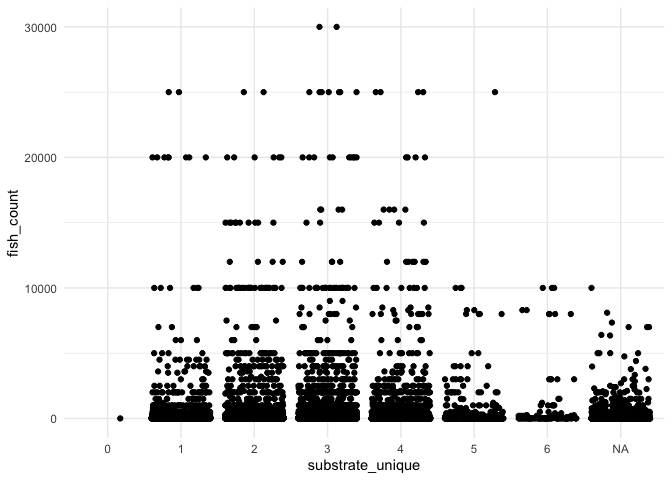<!-- -->

``` r
snorkel_data_dev |> 
  ggplot() +
  geom_jitter(aes(y = fish_count, x = instream_cover_unique))
```

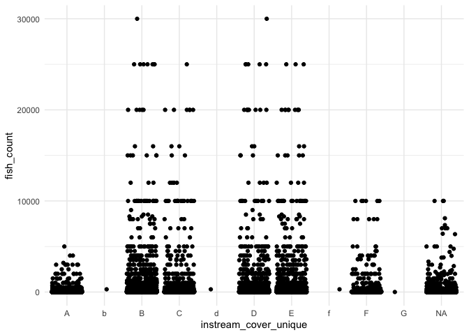<!-- -->

``` r
snorkel_data_dev |> 
  ggplot() +
  geom_jitter(aes(y = fish_count, x = overhead_cover_unique))
```

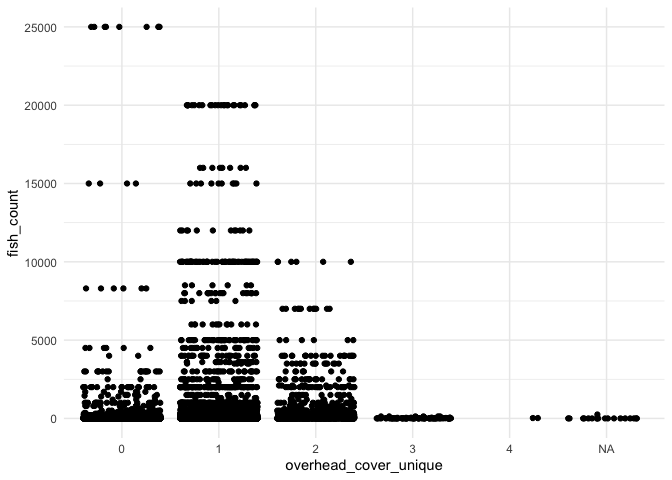<!-- -->

#### Data Completeness

Summarizes how complete the fish count data is by `year`, `section` and
`flow type`.

``` r
# by year
cleaner_snorkel_data |> 
  mutate(year = year(date)) |>
  group_by(year) |> 
  summarise(total_fish_obs = length(fish_count))|> 
  knitr::kable(col.names = c('year', 'total fish observations'))
```

| year | total fish observations |
|-----:|------------------------:|
| 2004 |                     143 |
| 2005 |                     126 |
| 2007 |                      20 |
| 2010 |                      71 |
| 2011 |                     199 |
| 2012 |                     340 |
| 2013 |                      21 |
| 2015 |                      60 |
| 2016 |                     121 |
| 2017 |                      39 |
| 2018 |                     519 |
| 2019 |                     222 |
| 2020 |                     563 |

``` r
cleaner_snorkel_data |> 
  group_by(year(date)) |> 
  summarise(total_fish_obs = length(fish_count)) |> 
  rename(year = `year(date)`) |> 
  ggplot() + 
  geom_col(aes(x = as.factor(year), y = total_fish_obs)) +
  xlab("year") + ylab("total fish count observations")
```

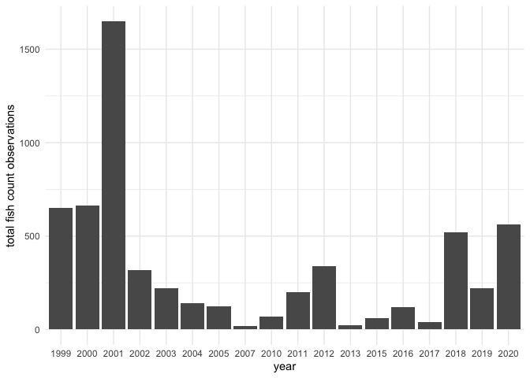<!-- -->

``` r
# by section
cleaner_snorkel_data |> 
  group_by(section_name) |> 
  summarise(total_fish_obs = length(fish_count)) |> 
  knitr::kable(col.names = c('section name', 'total fish observations'))
```

| section name                          | total fish observations |
|:--------------------------------------|------------------------:|
| Aleck Riffle                          |                      57 |
| Auditorium Riffle                     |                      46 |
| Bedrock Park Riffle                   |                      59 |
| Bedrock Riffle                        |                      38 |
| Big Riffle                            |                      22 |
| Eye Riffle                            |                     131 |
| G95                                   |                      45 |
| Gateway Riffle                        |                      95 |
| Goose Riffle                          |                      16 |
| Gridley Riffle                        |                      19 |
| Hatchery Ditch                        |                     171 |
| Hatchery Ditch Lower Moes Ditch Upper |                       1 |
| Hatchery Ditch and Mo’s Ditch         |                      97 |
| Hatchery Riffle                       |                     160 |
| Hatchery and Mo’s Riffles             |                      55 |
| Junkyard Riffle                       |                      18 |
| Kiester Riffle                        |                      12 |
| Matthews Riffle                       |                      62 |
| McFarland                             |                      10 |
| Mo’s Ditch                            |                       9 |
| Moes Ditch                            |                       1 |
| Robinson Riffle                       |                     127 |
| Steep Riffle                          |                     171 |
| Trailer Park Riffle                   |                      65 |
| Vance Riffle                          |                      37 |
| NA                                    |                     920 |

``` r
cleaner_snorkel_data |> 
  group_by(section_name) |> 
  summarise(total_fish_obs = length(fish_count)) |> 
  ggplot() + 
  geom_col(aes(x = section_name, y = total_fish_obs)) +
  xlab("section name") + ylab("total fish count observations") + 
  coord_flip()
```

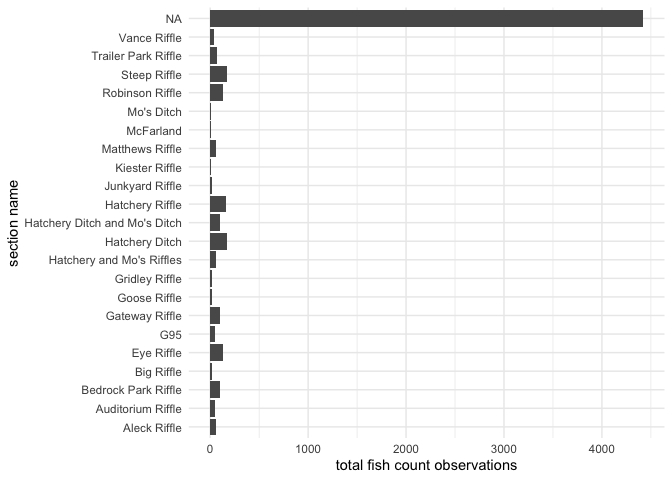<!-- -->

``` r
# by section
cleaner_snorkel_data |> 
  group_by(channel_flow_type) |> 
  summarise(total_fish_obs = length(fish_count)) |> 
  knitr::kable(col.names = c('channel flow type', 'total fish count observations'))
```

| channel flow type | total fish count observations |
|:------------------|------------------------------:|
| high flow channel |                           179 |
| low flow channel  |                          2265 |

``` r
cleaner_snorkel_data |> 
  group_by(channel_flow_type) |> 
  summarise(total_fish_obs = length(fish_count)) |> 
  ggplot() + 
  geom_col(aes(x = channel_flow_type, y = total_fish_obs)) +
  xlab("channel flow type") + ylab("total fish count observations") + 
  coord_flip()
```

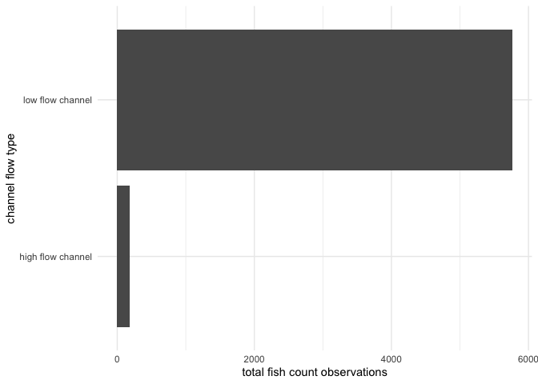<!-- -->

#### Fish size

##### Notes

- size class is mostly `NA`s
- we do not know what the units are for `est_size` nor what it is
  describing

| Size Class | Size Range |
|------------|------------|
| I          | 0-50       |
| II         | 51-75      |
| III        | 76-100     |
| IV         | 101-150    |
| V          | 151-300    |
| VI         | 301-499    |
| VII        | 500+       |

``` r
table(cleaner_snorkel_data$size_class, useNA = "always")
```

    ## 
    ##    I   II  III   IV    V   VI  VII <NA> 
    ##  272  326  167   48   11   49   55 1516

``` r
summary(cleaner_snorkel_data$est_size)
```

    ##    Min. 1st Qu.  Median    Mean 3rd Qu.    Max.    NA's 
    ##     0.0    45.0    60.0   127.2    85.0   950.0     423

#### Large Wood

- assuming `lwd_number` stands for large wood number
- `28` NAs for large wood
- mostly `0` values with some values in the 3000 range. The most being
  `16` observations at a `lwd_number` of `3006`

``` r
table(as.numeric(cleaner_snorkel_data$lwd_number), useNA = "always")
```

    ## 
    ##    0 3001 3002 3003 3004 3005 3006 3007 3008 3010 3013 3018 3020 <NA> 
    ## 2040    2    1    7    1    1   16    6    2    4    1    1    1  361

## HSI Dev

### Mark Gard 1998 Process

1.  Determine number of redds with each substrate-size class
2.  Calculate the proportion of redds with each substrate size class
3.  Calculate the HSC value for each substrate size class by dividing
    the proportion of redds in each substrate class by the proportion of
    redds with the most frequent substrate class

#### Discussion

- This process incorporates substrate only - will need to add depth,
  velocity, and cover  
- This keeps the substrate types grouped - should we ungroup?
- Used fish counts instead of redds

``` r
hsi_dev_markgard_1998 <- cleaner_snorkel_data |> 
  group_by(substrate) |> # note this is grouped by multiple substrate types
  summarise(n_fish = sum(fish_count)) |>  # don't have a value for redds
  mutate(prop_fish_count = n_fish/sum(n_fish)) |> 
  ungroup()

most_freq <- hsi_dev_markgard_1998 |> 
  arrange(desc(n_fish)) |> 
  slice(1) 

hsi_dev_markgard_1998 <- hsi_dev_markgard_1998 |> 
  mutate(hsc = prop_fish_count/most_freq$prop_fish_count)

ggplot(hsi_dev_markgard_1998) +
  geom_col(aes(y = hsc, x = substrate)) +
  coord_flip()
```

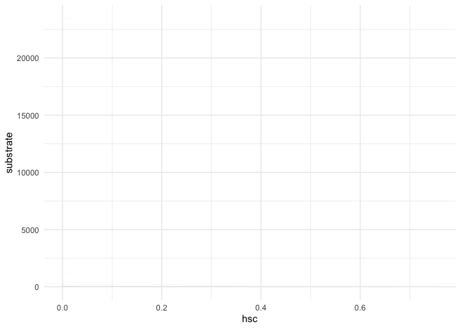<!-- -->

## HSI dev using linear regression

#### Assumptions:

- removed outliers of `fish_count` \> 50
- substrate and cover variables remain grouped
- `NA`s on `fish_count` are removed, `NA`s in other variables remain
- Need to add velocity and depth

``` r
format_snorkel_data <- cleaner_snorkel_data |> 
  select(fish_count, flow, instream_cover, overhead_cover, substrate, temperature, turbidity, hydrology_code, water_depth_m) |> 
  mutate(instream_cover = as.factor(instream_cover),
         overhead_cover = as.factor(overhead_cover),
         hydrology_code = as.factor(hydrology_code),
         substrate = as.factor(substrate),
         fish_presence = as.factor(ifelse(fish_count > 0, "1", "0"))) |> # necessary for a logistic regression 
  filter(fish_count <= 50) |> # removes outliers
  glimpse()
```

    ## Rows: 1,844
    ## Columns: 10
    ## $ fish_count     <dbl> 50, 4, 15, 7, 0, 3, 30, 1, 15, 14, 3, 1, 4, 4, 9, 1, 1,…
    ## $ flow           <dbl> NA, NA, NA, NA, NA, NA, NA, NA, NA, NA, NA, NA, NA, NA,…
    ## $ instream_cover <fct> NA, NA, NA, NA, NA, NA, NA, NA, NA, NA, NA, NA, NA, NA,…
    ## $ overhead_cover <fct> NA, NA, NA, NA, NA, NA, NA, NA, NA, NA, NA, NA, NA, NA,…
    ## $ substrate      <fct> NA, NA, NA, NA, NA, NA, NA, NA, NA, NA, NA, NA, NA, NA,…
    ## $ temperature    <dbl> NA, NA, NA, NA, NA, NA, NA, NA, NA, NA, NA, NA, NA, NA,…
    ## $ turbidity      <dbl> NA, NA, NA, NA, NA, NA, NA, NA, NA, NA, NA, NA, NA, NA,…
    ## $ hydrology_code <fct> NA, NA, NA, NA, NA, NA, NA, NA, NA, NA, NA, NA, NA, NA,…
    ## $ water_depth_m  <dbl> NA, NA, NA, NA, NA, NA, NA, NA, NA, NA, NA, NA, NA, NA,…
    ## $ fish_presence  <fct> 1, 1, 1, 1, 0, 1, 1, 1, 1, 1, 1, 1, 1, 1, 1, 1, 1, 1, 1…

``` r
# TODO: velocity + depth

# Define a recipe
rec <- recipe(fish_count ~ instream_cover + overhead_cover + substrate + 
                flow + hydrology_code + turbidity + temperature,   data = format_snorkel_data)  |> 
  step_dummy(all_nominal(), one_hot = TRUE)

# Split the data into training and testing sets
data_split <- initial_split(format_snorkel_data, prop = 0.8, strata = "fish_count")
data_train <- training(data_split)
data_test <- testing(data_split)

# Create a linear regression model
lm_reg <- linear_reg() %>%
  set_engine("lm") %>%
  set_mode("regression")

# Create a workflow
wf <- workflow() %>%
  add_recipe(rec) %>%
  add_model(lm_reg)

# Train the model
wf_fit <- wf |> 
  fit(data_train)

# Make predictions
predictions <- predict(wf_fit, data_test) |> 
  bind_cols(data_test)

wf_fit |> glance()
```

    ## # A tibble: 1 × 12
    ##   r.squared adj.r.squared sigma statistic  p.value    df logLik   AIC    BIC
    ##       <dbl>         <dbl> <dbl>     <dbl>    <dbl> <dbl>  <dbl> <dbl>  <dbl>
    ## 1     0.237         0.182  13.1      4.29 5.32e-29    81 -4746. 9658. 10081.
    ## # ℹ 3 more variables: deviance <dbl>, df.residual <int>, nobs <int>

``` r
wf_fit |> tidy()
```

    ## # A tibble: 92 × 5
    ##    term                 estimate std.error statistic  p.value
    ##    <chr>                   <dbl>     <dbl>     <dbl>    <dbl>
    ##  1 (Intercept)          6.08     19.3          0.315  0.753  
    ##  2 flow                -0.000892  0.000426    -2.09   0.0366 
    ##  3 turbidity            1.51      0.613        2.47   0.0137 
    ##  4 temperature         -0.0393    0.0187      -2.10   0.0363 
    ##  5 instream_cover_A     7.10      5.10         1.39   0.164  
    ##  6 instream_cover_AE   NA        NA           NA     NA      
    ##  7 instream_cover_B    15.0       5.05         2.97   0.00309
    ##  8 instream_cover_BC    9.18      6.21         1.48   0.140  
    ##  9 instream_cover_BCD   9.03      5.85         1.54   0.123  
    ## 10 instream_cover_BCDE 16.0       5.49         2.91   0.00371
    ## # ℹ 82 more rows

``` r
wf_fit$fit$fit |> dotwhisker::dwplot()
```

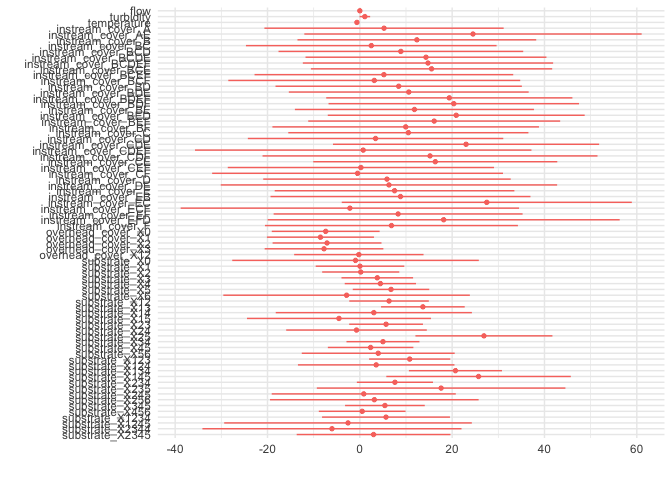<!-- -->

``` r
# Normalize predicted probabilities
predictions$normalized_predicted_prob <- (predictions$.pred - min(predictions$.pred, na.rm = TRUE)) / 
                                        (max(predictions$.pred, na.rm = TRUE) - min(predictions$.pred, na.rm = TRUE))

# Create HSI
predictions$HSI <- predictions$normalized_predicted_prob

ggplot(predictions, aes(x = fish_count, y = .pred)) +
  geom_point() +
  geom_smooth(method = "lm", se = FALSE) +  # Add a linear regression line
  labs(x = "Actual Fish Abundance", y = "Predicted Fish Abundance") +
  ggtitle("Actual vs. Predicted Fish Abundance")
```

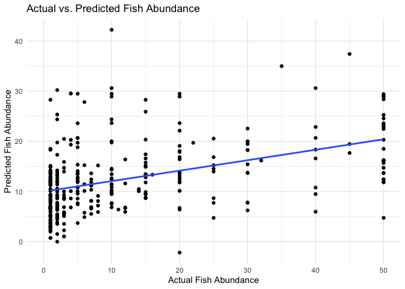<!-- -->

``` r
ggplot(predictions, aes(x = substrate, y = HSI)) +
  geom_boxplot() +
  geom_point() 
```

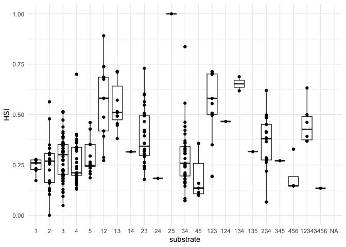<!-- -->

``` r
ggplot(predictions, aes(x = instream_cover, y = HSI)) +
  geom_boxplot() +
  geom_point() 
```

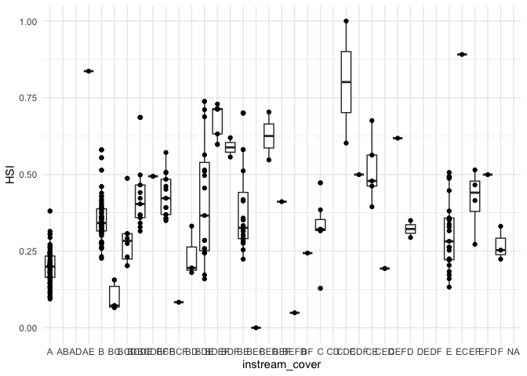<!-- -->

``` r
ggplot(predictions, aes(x = overhead_cover, y = HSI)) +
  geom_boxplot() +
  geom_point() 
```

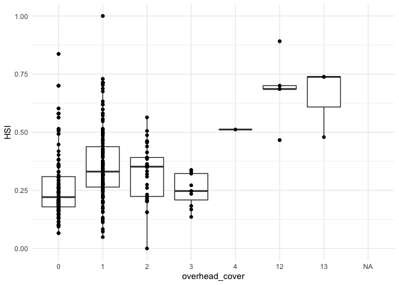<!-- -->

## Logistic Regression HSI

``` r
knitr::knit_exit()
```
