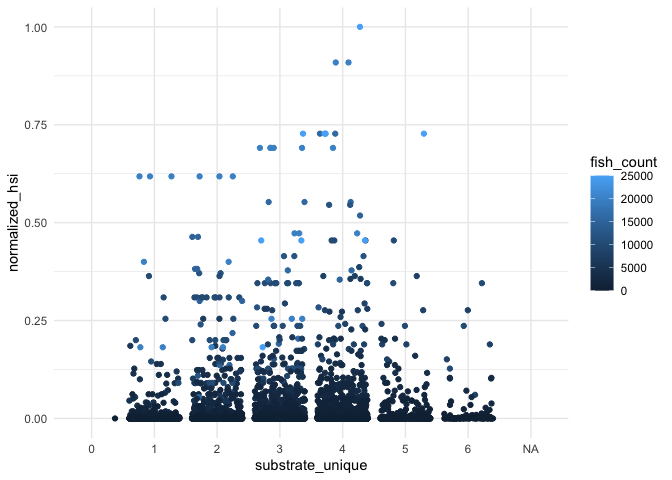
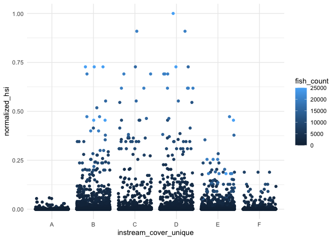
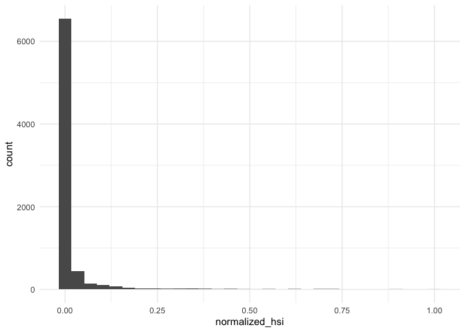
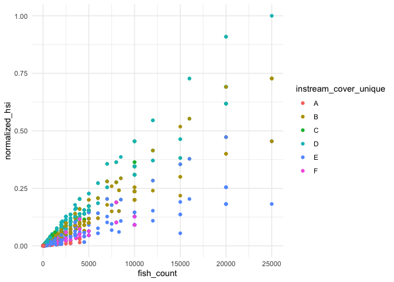

Feather River - HSI exploration
================
Maddee Rubenson (FlowWest)
2024-02-22

``` r
# https://github.com/SRJPE/JPE-datasets/blob/main/data-raw/qc-markdowns/seine-snorkel-data/feather-river/feather_snorkel_qc.Rmd
cleaner_snorkel_data <- readRDS('cleaner_snorkel_data.RDS') |> 
  glimpse()
```

    ## Rows: 2,753
    ## Columns: 27
    ## $ survey_id            <chr> "2", "2", "2", "2", "3", "3", "3", "3", "3", "3",…
    ## $ date                 <date> 2007-06-27, 2007-06-27, 2007-06-27, 2007-06-27, …
    ## $ flow                 <dbl> NA, NA, NA, NA, NA, NA, NA, NA, NA, NA, NA, NA, N…
    ## $ weather_code         <chr> NA, NA, NA, NA, "clear", "clear", "clear", "clear…
    ## $ turbidity            <dbl> NA, NA, NA, NA, NA, NA, NA, NA, NA, NA, NA, NA, N…
    ## $ temperature          <dbl> NA, NA, NA, NA, NA, NA, NA, NA, NA, NA, NA, NA, N…
    ## $ time_of_temperature  <time> NA, NA, NA, NA, NA, NA, NA, NA, NA, NA, NA, NA, …
    ## $ start_time           <time>       NA,       NA,       NA,       NA, 10:00:00…
    ## $ end_time             <time>       NA,       NA,       NA,       NA, 14:00:00…
    ## $ section_name         <chr> NA, NA, NA, NA, NA, NA, NA, NA, NA, NA, NA, NA, N…
    ## $ units_covered        <chr> NA, NA, NA, NA, "26,33,30,31,31a,32,32a", "26,33,…
    ## $ survey_comments      <chr> NA, NA, NA, NA, NA, NA, NA, NA, NA, NA, NA, NA, N…
    ## $ observation_id       <chr> "79", "81", "84", "86", "96", "98", "99", "100", …
    ## $ unit                 <chr> "169", "173", "185", "215B", "26", "33", "33", "3…
    ## $ count                <dbl> 50, 4, 15, 7, 0, 3, 30, 1, NA, 15, NA, 70, 14, 24…
    ## $ size_class           <chr> "III", "I", "III", "III", NA, "II", "III", NA, NA…
    ## $ est_size             <dbl> NA, NA, NA, NA, NA, 50, 75, 100, NA, 100, NA, 75,…
    ## $ substrate            <chr> NA, NA, NA, NA, NA, NA, NA, NA, NA, NA, NA, NA, N…
    ## $ instream_cover       <chr> NA, NA, NA, NA, NA, NA, NA, NA, NA, NA, NA, NA, N…
    ## $ overhead_cover       <chr> NA, NA, NA, NA, NA, NA, NA, NA, NA, NA, NA, NA, N…
    ## $ hydrology_code       <chr> NA, NA, NA, NA, NA, NA, NA, NA, NA, NA, NA, NA, N…
    ## $ water_depth_m        <dbl> NA, NA, NA, NA, NA, NA, NA, NA, NA, NA, NA, NA, N…
    ## $ lwd_number           <chr> NA, NA, NA, NA, NA, NA, NA, NA, NA, NA, NA, NA, N…
    ## $ observation_comments <chr> NA, NA, NA, NA, NA, NA, NA, NA, NA, NA, NA, NA, N…
    ## $ run                  <chr> "unknown", "unknown", "unknown", "unknown", "unkn…
    ## $ tagged               <lgl> FALSE, FALSE, FALSE, FALSE, FALSE, FALSE, FALSE, …
    ## $ clipped              <lgl> FALSE, FALSE, FALSE, FALSE, FALSE, FALSE, FALSE, …

``` r
snorkel_data_dev <- cleaner_snorkel_data |> 
  select(section_name, date, fish_count = count, substrate, instream_cover, overhead_cover) |> #size_class, est_size
  filter(!is.na(fish_count) & !is.na(instream_cover)) |> 
  mutate(substrate_unique = strsplit(substrate, ""),
         instream_cover_unique = strsplit(instream_cover, ""),
         overhead_cover_unique = strsplit(overhead_cover, "")) |> 
  unnest(substrate_unique) |> 
  unnest(instream_cover_unique) |> 
  unnest(overhead_cover_unique) 
```

``` r
snorkel_data_dev |> 
  ggplot() +
  geom_jitter(aes(y = fish_count, x = substrate_unique))
```

<!-- -->

``` r
snorkel_data_dev |> 
  ggplot() +
  geom_jitter(aes(y = fish_count, x = instream_cover_unique))
```

<!-- -->

``` r
snorkel_data_dev |> 
  ggplot() +
  geom_jitter(aes(y = fish_count, x = overhead_cover_unique))
```

<!-- -->

### Variable: `substrate`

| SubstrateCode | Substrate                    | Proposed Weight |
|---------------|------------------------------|-----------------|
| 1             | Organic Fines, Mud (0.05 mm) | 1               |
| 2             | Sand (0.05 to 2 mm)          | 1               |
| 3             | Small Gravel (2 to 50 mm)    | 2               |
| 4             | Large Gravel (50 to 150 mm)  | 5               |
| 5             | Cobble (150 to 300 mm)       | 5               |
| 6             | Boulder (\> 300 mm)          | 2               |
| 0             | ?                            | 0               |

### Variable: `instream_cover`

| CoverCode | Cover                                            | Proposed Weight |
|-----------|--------------------------------------------------|-----------------|
| A         | No apparent cover                                | 0               |
| B         | Small instream objects/small-medium woody debris | 2               |
| C         | Large instream objects/large woody debris        | 4               |
| D         | Overhead objects                                 | 4               |
| E         | Submerged aquatic veg/filamentous algae          | 0               |
| F         | Undercut bank                                    | 0               |

### Variable: `overhead_cover`

| CoverCode | Cover                                         | Proposed Weight |
|-----------|-----------------------------------------------|-----------------|
| 0         | No Apparent Cover                             | 0               |
| 1         | Overhanging veg/obj (\< 0.5 m above surface)  | 2               |
| 2         | Overhanging veg/obj (0.5 to 2 m above surface | 4               |
| 3         | Surface turbulence, bubble curtain            | 2               |

### Apply weights to variables and develop HSI

``` r
substrate_scoring <- c('1' = 1,'2' = 1,'3' = 2, '4' = 5,'5' = 5, '6' = 2,'0' = 0)
instream_cover_scoring <- c('A' = 0, "B" = 2, "C" = 4, "D" = 4, "E" = 0, "F" = 0)
overhead_cover_scoring <- c('0' = 0, '1' = 2,'2' = 4,'3' = 2)

# Define weights for vegetation and substrate
instream_cover_weight <- 0.6
overhead_cover_weight <- 0.3 
substrate_weight <- 0.4

hsi_dev <- snorkel_data_dev |> 
  mutate(normalized_fish_count = fish_count/max(fish_count)) |> 
  mutate(
    instream_cover_score = instream_cover_scoring[instream_cover_unique],
    substrate_score = substrate_scoring[substrate_unique],
    overhead_cover_score = overhead_cover_scoring[overhead_cover_unique],
    hsi = as.numeric((instream_cover_score * instream_cover_weight +
             overhead_cover_score * overhead_cover_weight + 
           substrate_score * substrate_weight) * normalized_fish_count
    )) |> 
  mutate(normalized_hsi = hsi/max(hsi, na.rm = TRUE)) |> 
  glimpse()
```

    ## Rows: 7,509
    ## Columns: 15
    ## $ section_name          <chr> NA, NA, "Hatchery Side Channel", "Hatchery Side …
    ## $ date                  <date> 2010-08-11, 2010-08-17, 2018-03-19, 2018-03-19,…
    ## $ fish_count            <dbl> 6, 1, 50, 50, 50, 50, 50, 50, 50, 50, 50, 50, 50…
    ## $ substrate             <chr> "5", "5", "13", "13", "13", "13", "13", "13", "1…
    ## $ instream_cover        <chr> "A", "A", "BDEF", "BDEF", "BDEF", "BDEF", "BDEF"…
    ## $ overhead_cover        <chr> "0", "0", "0", "0", "0", "0", "0", "0", "0", "0"…
    ## $ substrate_unique      <chr> "5", "5", "1", "1", "1", "1", "3", "3", "3", "3"…
    ## $ instream_cover_unique <chr> "A", "A", "B", "D", "E", "F", "B", "D", "E", "F"…
    ## $ overhead_cover_unique <chr> "0", "0", "0", "0", "0", "0", "0", "0", "0", "0"…
    ## $ normalized_fish_count <dbl> 0.00024, 0.00004, 0.00200, 0.00200, 0.00200, 0.0…
    ## $ instream_cover_score  <dbl> 0, 0, 2, 4, 0, 0, 2, 4, 0, 0, 2, 4, 0, 0, 2, 4, …
    ## $ substrate_score       <dbl> 5, 5, 1, 1, 1, 1, 2, 2, 2, 2, 1, 1, 1, 1, 2, 2, …
    ## $ overhead_cover_score  <dbl> 0, 0, 0, 0, 0, 0, 0, 0, 0, 0, 0, 0, 0, 0, 0, 0, …
    ## $ hsi                   <dbl> 0.00048, 0.00008, 0.00320, 0.00560, 0.00080, 0.0…
    ## $ normalized_hsi        <dbl> 1.090909e-04, 1.818182e-05, 7.272727e-04, 1.2727…

``` r
hsi_dev |> 
  ggplot() +
  geom_jitter(aes(y = normalized_hsi, x = substrate_unique, color = fish_count))
```

    ## Warning: Removed 22 rows containing missing values (`geom_point()`).

<!-- -->

``` r
hsi_dev |> 
  ggplot() +
  geom_jitter(aes(y = normalized_hsi, x = instream_cover_unique, color = fish_count))
```

    ## Warning: Removed 22 rows containing missing values (`geom_point()`).

<!-- -->

``` r
hsi_dev |> 
  ggplot() +
  geom_jitter(aes(y = normalized_hsi, x = overhead_cover_unique, color = fish_count))
```

    ## Warning: Removed 22 rows containing missing values (`geom_point()`).

<!-- -->

``` r
hsi_dev |> 
  ggplot() +
  geom_histogram(aes(x = normalized_hsi))
```

    ## `stat_bin()` using `bins = 30`. Pick better value with `binwidth`.

    ## Warning: Removed 22 rows containing non-finite values (`stat_bin()`).

<!-- -->

``` r
hsi_dev |> 
  ggplot() +
  geom_point(aes(x = fish_count, y = normalized_hsi, color = instream_cover_unique))
```

    ## Warning: Removed 22 rows containing missing values (`geom_point()`).

<!-- -->
