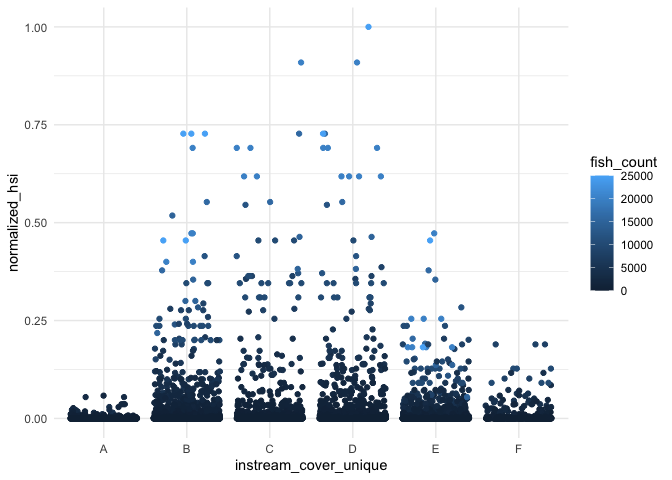
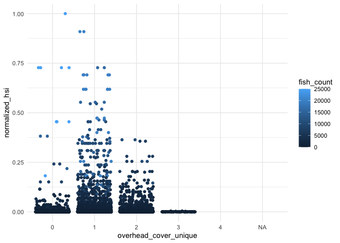
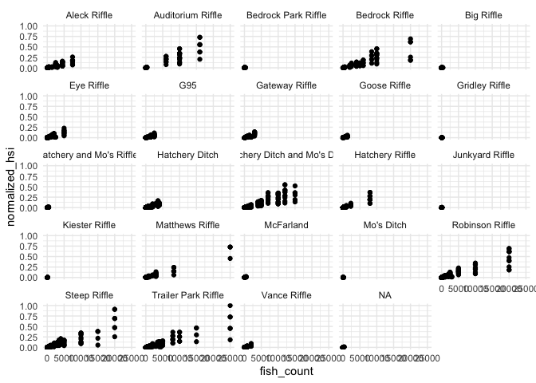

Feather River - HSI exploration
================
Maddee Rubenson (FlowWest)
2024-02-23

### Questions/Notes

- explanation for high fish counts, how are these counted?
- habitat types are not mutually exclusive, does it make sense to assign
  weights to types?
- fish use by habitat type or hsi?
- how complete is each year of data? by section? by water year?
- how many times are they surveying each location in a given year?
- unique hsi developed for high and low flow channels?
- is there more data? froroville (1999-2003) - FR S and S Oroville.MDB
  (ashley slacked to me)

### TODO:

- look into how CVPIA habitat docs defined the substrate HSI
  <https://s3-us-west-2.amazonaws.com/cvpiahabitat-r-package/cvpia-sit-model-inputs/Feather_FERC_IFIM_Phase_2.pdf>
- continue lit review of HSI methods

``` r
# https://github.com/SRJPE/JPE-datasets/blob/main/data-raw/qc-markdowns/seine-snorkel-data/feather-river/feather_snorkel_qc.Rmd
cleaner_snorkel_data <- readRDS('cleaner_snorkel_data.RDS') |> 
  rename(fish_count = count) |> 
  filter(!is.na(fish_count) & !is.na(instream_cover)) |> 
  mutate(section_name = case_when(section_name == "Eye" ~ "Eye Riffle",
                                  section_name == "Vance West" ~ "Vance Riffle",
                                  section_name %in% c("Hatchery Side Ditch") ~ "Hatchery Ditch",
                                  section_name == "Hatchery Side Channel" ~ "Hatchery Riffle", # TODO: check this one
                                  section_name == "Gridley Side Channel" ~ "Gridley Riffle", # TODO: check this one
                                  section_name %in% c("Robinson", "Lower Robinson") ~ "Robinson Riffle",
                                  section_name == "Goose" ~ "Goose Riffle", 
                                  section_name == "Auditorium" ~ "Auditorium Riffle",
                                  section_name %in% c("Matthews", "Mathews", "Mathews Riffle") ~ "Matthews Riffle",
                                  section_name %in% c("G95 Side Channel", "G95 West Side Channel", "G95 Side West", "G95 Side") ~ "G95", 
                                  section_name %in% c("Vance West Riffle", "Vance W Riffle", "Vance East") ~ "Vance Riffle",
                                  section_name == "Moes" ~ "Mo's Ditch",
                                  section_name == "Aleck" ~ "Aleck Riffle",
                                  section_name == "Lower Mcfarland" ~ "McFarland",
                                  section_name %in% c("Bed Rock Riffle", "Bedrock") ~ "Bedrock Riffle",
                                  section_name == "Steep" ~ "Steep Riffle",
                                  section_name == "Keister" ~ "Kiester Riffle",
                                  section_name == "Junkyard" ~ "Junkyard Riffle",
                                  section_name == "Gateway" ~ "Gateway Riffle",
                                  section_name %in% c("Hatchery Ditch And Moes", "Hatchery Ditch Moes Ditch", 
                                                      "Hatchery Side Channel Moes Ditch", 
                                                      "Hatchery Ditch And Moes Ditch", 
                                                      "Hatchery Side Channel And Moes Ditch", 
                                                      "Hatchery Ditch Moes") ~ "Hatchery Ditch and Mo's Ditch", # TODO: check this one since they are separate in the map
                                  section_name %in% c("Hatchery And Moes Side Channels", "Hatchery Side Ch Moes Side Ch", 
                                                      "Hatchery Side Channel And Moes") ~ "Hatchery and Mo's Riffles", # TODO: check on this one 
                                  .default = as.character(section_name))) |> 
  glimpse()
```

    ## Rows: 1,999
    ## Columns: 27
    ## $ survey_id            <chr> "46", "48", "318", "318", "318", "318", "318", "3…
    ## $ date                 <date> 2010-08-11, 2010-08-17, 2018-03-19, 2018-03-19, …
    ## $ flow                 <dbl> 620, 620, 800, 800, 800, 800, 800, 800, 800, 800,…
    ## $ weather_code         <chr> "sunny", "sunny", "clear", "clear", "clear", "cle…
    ## $ turbidity            <dbl> 0, 0, 0, 0, 0, 0, 0, 0, 0, 0, 0, 0, 0, 0, 0, 0, 0…
    ## $ temperature          <dbl> 64.8, 65.2, 46.4, 46.4, 46.4, 46.4, 46.4, 46.4, 4…
    ## $ time_of_temperature  <time>       NA,       NA, 13:00:00, 13:00:00, 13:00:00…
    ## $ start_time           <time> 10:30:00, 11:00:00, 12:50:00, 12:50:00, 12:50:00…
    ## $ end_time             <time>       NA, 14:00:00, 14:24:00, 14:24:00, 14:24:00…
    ## $ section_name         <chr> NA, NA, "Hatchery Riffle", "Hatchery Riffle", "Ha…
    ## $ units_covered        <chr> NA, NA, "33 26", "33 26", "33 26", "33 26", "33 2…
    ## $ survey_comments      <chr> NA, NA, NA, NA, NA, NA, NA, NA, NA, NA, NA, NA, N…
    ## $ observation_id       <chr> "1068", "1091", "6420", "6421", "6422", "6423", "…
    ## $ unit                 <chr> "104", "185", "33", "33", "33", "33", "33", "33",…
    ## $ fish_count           <dbl> 6, 1, 50, 50, 25, 50, 5, 10, 10, 40, 10, 1, 8, 5,…
    ## $ size_class           <chr> "VI", "VI", NA, NA, NA, NA, NA, NA, NA, NA, NA, N…
    ## $ est_size             <dbl> 900, 600, 35, 40, 50, 45, 35, 40, 45, 50, 60, 70,…
    ## $ substrate            <chr> "5", "5", "13", "13", "13", "13", "23", "23", "23…
    ## $ instream_cover       <chr> "A", "A", "BDEF", "BDEF", "BDEF", "BDEF", "FE", "…
    ## $ overhead_cover       <chr> "0", "0", "0", "0", "0", "0", "1", "1", "1", "1",…
    ## $ hydrology_code       <chr> "Riffle", "Glide", "Glide Edgewater", "Glide Edge…
    ## $ water_depth_m        <dbl> 1.0, 0.5, 0.4, 0.4, 0.4, 0.4, 0.3, 0.4, 0.4, 0.4,…
    ## $ lwd_number           <chr> NA, NA, "0", "0", "0", "0", "0", "0", "0", "0", "…
    ## $ observation_comments <chr> NA, NA, NA, NA, NA, NA, NA, NA, NA, NA, NA, NA, N…
    ## $ run                  <chr> "unknown", "unknown", "unknown", "unknown", "unkn…
    ## $ tagged               <lgl> FALSE, FALSE, FALSE, FALSE, FALSE, FALSE, FALSE, …
    ## $ clipped              <lgl> FALSE, FALSE, FALSE, FALSE, FALSE, FALSE, FALSE, …

``` r
high_flows <- c('Vance Riffle', 'G95', 'Kiester Riffle', 'Goose Riffle', 'Big Riffle', 'McFarland', 'Gridley Riffle', 'Junkyard Riffle')
low_flows <- cleaner_snorkel_data |> filter(!(section_name %in% high_flows)) |> filter(!is.na(section_name)) |> pull(section_name) |> unique()

high_flows
```

    ## [1] "Vance Riffle"    "G95"             "Kiester Riffle"  "Goose Riffle"   
    ## [5] "Big Riffle"      "McFarland"       "Gridley Riffle"  "Junkyard Riffle"

``` r
low_flows
```

    ##  [1] "Hatchery Riffle"               "Mo's Ditch"                   
    ##  [3] "Bedrock Riffle"                "Trailer Park"                 
    ##  [5] "Aleck Riffle"                  "Steep Riffle"                 
    ##  [7] "Eye Riffle"                    "Gateway Riffle"               
    ##  [9] "Hatchery Ditch"                "Matthews Riffle"              
    ## [11] "Robinson Riffle"               "Hatchery and Mo's Riffles"    
    ## [13] "Auditorium Riffle"             "Bedrock Park"                 
    ## [15] "Hatchery Ditch and Mo's Ditch" "Trailer Park Riffle"          
    ## [17] "Keister Riffle"

``` r
cleaner_snorkel_data <- cleaner_snorkel_data |> 
  mutate(channel_flow_type = ifelse(section_name %in% high_flows, "high flow channel", "low flow channel"))
```

``` r
snorkel_data_dev <- cleaner_snorkel_data |> 
  select(section_name, date, fish_count, substrate, instream_cover, overhead_cover, size_class, est_size) |> 
  mutate(substrate_unique = strsplit(substrate, ""),
         instream_cover_unique = strsplit(instream_cover, ""),
         overhead_cover_unique = strsplit(overhead_cover, "")) |> 
  unnest(substrate_unique) |> 
  unnest(instream_cover_unique) |> 
  unnest(overhead_cover_unique) 
```

### Variable: `substrate`

| SubstrateCode | Substrate                    | Proposed Weight |
|---------------|------------------------------|-----------------|
| 1             | Organic Fines, Mud (0.05 mm) | 1               |
| 2             | Sand (0.05 to 2 mm)          | 1               |
| 3             | Small Gravel (2 to 50 mm)    | 2               |
| 4             | Large Gravel (50 to 150 mm)  | 5               |
| 5             | Cobble (150 to 300 mm)       | 5               |
| 6             | Boulder (\> 300 mm)          | 2               |
| 0             | ?                            | 0               |

### Variable: `instream_cover`

| CoverCode | Cover                                            | Proposed Weight |
|-----------|--------------------------------------------------|-----------------|
| A         | No apparent cover                                | 0               |
| B         | Small instream objects/small-medium woody debris | 2               |
| C         | Large instream objects/large woody debris        | 4               |
| D         | Overhead objects                                 | 4               |
| E         | Submerged aquatic veg/filamentous algae          | 0               |
| F         | Undercut bank                                    | 0               |

### Variable: `overhead_cover`

| CoverCode | Cover                                         | Proposed Weight |
|-----------|-----------------------------------------------|-----------------|
| 0         | No Apparent Cover                             | 0               |
| 1         | Overhanging veg/obj (\< 0.5 m above surface)  | 2               |
| 2         | Overhanging veg/obj (0.5 to 2 m above surface | 4               |
| 3         | Surface turbulence, bubble curtain            | 2               |

### Data Exploration

#### fish count by habitat types

``` r
snorkel_data_dev |> 
  ggplot() +
  geom_jitter(aes(y = fish_count, x = substrate_unique))
```

<!-- -->

``` r
snorkel_data_dev |> 
  ggplot() +
  geom_jitter(aes(y = fish_count, x = instream_cover_unique))
```

<!-- -->

``` r
snorkel_data_dev |> 
  ggplot() +
  geom_jitter(aes(y = fish_count, x = overhead_cover_unique))
```

<!-- -->

#### Data Completeness

By year, river section, water year

``` r
# by year
cleaner_snorkel_data |> 
  mutate(year = year(date)) |>
  group_by(year) |> 
  summarise(total_fish_counts = sum(fish_count, na.rm = TRUE)) |> 
  knitr::kable(col.names = c('year', 'total fish counted'))
```

| year | total fish counted |
|-----:|-------------------:|
| 2010 |                166 |
| 2011 |               4248 |
| 2012 |               6045 |
| 2013 |                175 |
| 2015 |                116 |
| 2016 |               2087 |
| 2017 |                  1 |
| 2018 |              65954 |
| 2019 |               7747 |
| 2020 |             535668 |

``` r
cleaner_snorkel_data |> 
  group_by(year(date)) |> 
  summarise(total_fish_counts = sum(fish_count, na.rm = TRUE)) |> 
  rename(year = `year(date)`) |> 
  ggplot() + 
  geom_col(aes(x = as.factor(year), y = total_fish_counts))
```

<!-- -->

``` r
# by section
cleaner_snorkel_data |> 
  group_by(section_name) |> 
  summarise(total_fish_counts = sum(fish_count, na.rm = TRUE)) |> 
  knitr::kable(col.names = c('section name', 'total fish counted'))
```

| section name                  | total fish counted |
|:------------------------------|-------------------:|
| Aleck Riffle                  |              27650 |
| Auditorium Riffle             |              32800 |
| Bedrock Park                  |               1130 |
| Bedrock Riffle                |              63420 |
| Big Riffle                    |                816 |
| Eye Riffle                    |              24662 |
| G95                           |               8391 |
| Gateway Riffle                |              11966 |
| Goose Riffle                  |               3913 |
| Gridley Riffle                |                618 |
| Hatchery Ditch                |              28177 |
| Hatchery Ditch and Mo’s Ditch |              83928 |
| Hatchery Riffle               |              21144 |
| Hatchery and Mo’s Riffles     |               1708 |
| Junkyard Riffle               |                455 |
| Keister Riffle                |                  1 |
| Kiester Riffle                |                250 |
| Matthews Riffle               |              46169 |
| McFarland                     |                973 |
| Mo’s Ditch                    |                537 |
| Robinson Riffle               |              59692 |
| Steep Riffle                  |              89984 |
| Trailer Park                  |              96505 |
| Trailer Park Riffle           |                 13 |
| Vance Riffle                  |               6671 |
| NA                            |              10634 |

``` r
cleaner_snorkel_data |> 
  group_by(section_name) |> 
  summarise(total_fish_counts = sum(fish_count, na.rm = TRUE)) |> 
  ggplot() + 
  geom_col(aes(x = section_name, y = total_fish_counts)) +
  coord_flip()
```

<!-- -->

``` r
# by section
cleaner_snorkel_data |> 
  group_by(channel_flow_type) |> 
  summarise(total_fish_counts = sum(fish_count, na.rm = TRUE)) |> 
  knitr::kable(col.names = c('channel flow type', 'total fish counted'))
```

| channel flow type | total fish counted |
|:------------------|-------------------:|
| high flow channel |              22087 |
| low flow channel  |             600120 |

``` r
cleaner_snorkel_data |> 
  group_by(channel_flow_type) |> 
  summarise(total_fish_counts = sum(fish_count, na.rm = TRUE)) |> 
  ggplot() + 
  geom_col(aes(x = channel_flow_type, y = total_fish_counts)) +
  coord_flip()
```

<!-- -->

#### Fish size

##### Notes

- size class is mostly `NA`s
- we do not know what the units are for `est_size` nor what it is
  describing

| Size Class | Size Range |
|------------|------------|
| I          | 0-50       |
| II         | 51-75      |
| III        | 76-100     |
| IV         | 101-150    |
| V          | 151-300    |
| VI         | 301-499    |
| VII        | 500+       |

``` r
table(cleaner_snorkel_data$size_class, useNA = "always")
```

    ## 
    ##    I   II  III   IV    V   VI  VII <NA> 
    ##  177  202  121   41   10   46   55 1347

``` r
summary(cleaner_snorkel_data$est_size)
```

    ##    Min. 1st Qu.  Median    Mean 3rd Qu.    Max.    NA's 
    ##    30.0    45.0    60.0   126.3    85.0   950.0       2

## HSI Development

### Apply weights to variables and develop HSI

``` r
substrate_scoring <- c('1' = 1,'2' = 1,'3' = 2, '4' = 5,'5' = 5, '6' = 2,'0' = 0)
instream_cover_scoring <- c('A' = 0, "B" = 2, "C" = 4, "D" = 4, "E" = 0, "F" = 0)
overhead_cover_scoring <- c('0' = 0, '1' = 2,'2' = 4,'3' = 2)

# Define weights for vegetation and substrate
instream_cover_weight <- 0.6
overhead_cover_weight <- 0.3 
substrate_weight <- 0.4

hsi_dev <- snorkel_data_dev |> 
  mutate(normalized_fish_count = fish_count/max(fish_count)) |> 
  mutate(
    instream_cover_score = instream_cover_scoring[instream_cover_unique],
    substrate_score = substrate_scoring[substrate_unique],
    overhead_cover_score = overhead_cover_scoring[overhead_cover_unique],
    hsi = as.numeric((instream_cover_score * instream_cover_weight +
             overhead_cover_score * overhead_cover_weight + 
           substrate_score * substrate_weight) * normalized_fish_count
    )) |> 
  mutate(normalized_hsi = hsi/max(hsi, na.rm = TRUE)) |> 
  glimpse()
```

    ## Rows: 7,509
    ## Columns: 17
    ## $ section_name          <chr> NA, NA, "Hatchery Riffle", "Hatchery Riffle", "H…
    ## $ date                  <date> 2010-08-11, 2010-08-17, 2018-03-19, 2018-03-19,…
    ## $ fish_count            <dbl> 6, 1, 50, 50, 50, 50, 50, 50, 50, 50, 50, 50, 50…
    ## $ substrate             <chr> "5", "5", "13", "13", "13", "13", "13", "13", "1…
    ## $ instream_cover        <chr> "A", "A", "BDEF", "BDEF", "BDEF", "BDEF", "BDEF"…
    ## $ overhead_cover        <chr> "0", "0", "0", "0", "0", "0", "0", "0", "0", "0"…
    ## $ size_class            <chr> "VI", "VI", NA, NA, NA, NA, NA, NA, NA, NA, NA, …
    ## $ est_size              <dbl> 900, 600, 35, 35, 35, 35, 35, 35, 35, 35, 40, 40…
    ## $ substrate_unique      <chr> "5", "5", "1", "1", "1", "1", "3", "3", "3", "3"…
    ## $ instream_cover_unique <chr> "A", "A", "B", "D", "E", "F", "B", "D", "E", "F"…
    ## $ overhead_cover_unique <chr> "0", "0", "0", "0", "0", "0", "0", "0", "0", "0"…
    ## $ normalized_fish_count <dbl> 0.00024, 0.00004, 0.00200, 0.00200, 0.00200, 0.0…
    ## $ instream_cover_score  <dbl> 0, 0, 2, 4, 0, 0, 2, 4, 0, 0, 2, 4, 0, 0, 2, 4, …
    ## $ substrate_score       <dbl> 5, 5, 1, 1, 1, 1, 2, 2, 2, 2, 1, 1, 1, 1, 2, 2, …
    ## $ overhead_cover_score  <dbl> 0, 0, 0, 0, 0, 0, 0, 0, 0, 0, 0, 0, 0, 0, 0, 0, …
    ## $ hsi                   <dbl> 0.00048, 0.00008, 0.00320, 0.00560, 0.00080, 0.0…
    ## $ normalized_hsi        <dbl> 1.090909e-04, 1.818182e-05, 7.272727e-04, 1.2727…

``` r
hsi_dev |> 
  ggplot() +
  geom_jitter(aes(y = normalized_hsi, x = substrate_unique, color = fish_count))
```

    ## Warning: Removed 22 rows containing missing values (`geom_point()`).

<!-- -->

``` r
hsi_dev |> 
  ggplot() +
  geom_jitter(aes(y = normalized_hsi, x = instream_cover_unique, color = fish_count))
```

    ## Warning: Removed 22 rows containing missing values (`geom_point()`).

<!-- -->

``` r
hsi_dev |> 
  ggplot() +
  geom_jitter(aes(y = normalized_hsi, x = overhead_cover_unique, color = fish_count))
```

    ## Warning: Removed 22 rows containing missing values (`geom_point()`).

<!-- -->

``` r
hsi_dev |> 
  ggplot() +
  geom_histogram(aes(x = normalized_hsi))
```

    ## `stat_bin()` using `bins = 30`. Pick better value with `binwidth`.

    ## Warning: Removed 22 rows containing non-finite values (`stat_bin()`).

<!-- -->

``` r
hsi_dev |> 
  ggplot() +
  geom_point(aes(x = fish_count, y = normalized_hsi, color = instream_cover_unique))
```

    ## Warning: Removed 22 rows containing missing values (`geom_point()`).

<!-- -->

``` r
hsi_dev |>  
  ggplot() +
  geom_point(aes(x = fish_count, y = normalized_hsi)) +
  facet_wrap(~section_name)
```

    ## Warning: Removed 22 rows containing missing values (`geom_point()`).

<!-- -->

### Create a single HSI per fish count

``` r
hsi_grouped <- hsi_dev |> 
  group_by(fish_count) |> 
  summarise(hsi_val_mean = mean(normalized_hsi, na.rm = TRUE),
            hsi_val_median = median(normalized_hsi, na.rm = TRUE))

hsi_grouped |> 
  ggplot() + 
  geom_point(aes(x = fish_count, y = hsi_val_mean)) + 
  geom_smooth(aes(x = fish_count, y = hsi_val_mean))
```

    ## `geom_smooth()` using method = 'loess' and formula = 'y ~ x'

<!-- -->

``` r
hsi_grouped |> 
  ggplot() + 
  geom_point(aes(x = fish_count, y = hsi_val_median)) + 
  geom_smooth(aes(x = fish_count, y = hsi_val_median))
```

    ## `geom_smooth()` using method = 'loess' and formula = 'y ~ x'

<!-- -->
