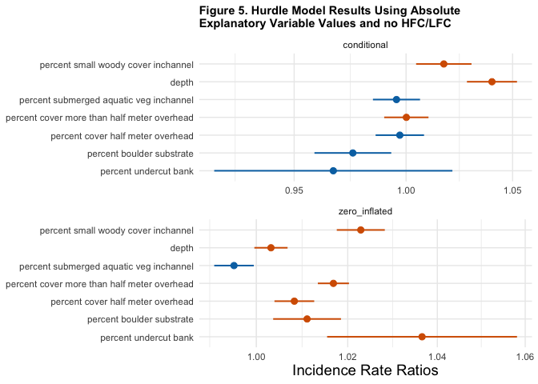

Mini Snorkel Feather Presence/Absence Model
================
Maddee Rubenson
2024-09-25

- [Objective](#objective)
- [Methodology](#methodology)
  - [Hurdle Models and
    Interpretation](#hurdle-models-and-interpretation)
- [Build Models](#build-models)
  - [Read in data](#read-in-data)
  - [Review Data](#review-data)
  - [High Flow vs. Low Flow Channel](#high-flow-vs-low-flow-channel)
- [Model 1 - Binary Cover Values](#model-1---binary-cover-values)
  - [Model 1 Results](#model-1-results)
- [Model 2 - Using Absolute Values](#model-2---using-absolute-values)
  - [Model 2 Results](#model-2-results)
- [Model 3 - Using Absolute Values and no High Flow/Low
  Flow](#model-3---using-absolute-values-and-no-high-flowlow-flow)
  - [Model 3 Results](#model-3-results)
- [Interpretation of Model 1](#interpretation-of-model-1)
- [Interpretation of Model 2](#interpretation-of-model-2)
- [Interpretation of Model 3](#interpretation-of-model-3)
- [Discussion](#discussion)
- [Other Discussion Points](#other-discussion-points)

## Objective

Develop a model that reflects the significance of cover, substrate,
depth, and velocity on fish presence and absence.

## Methodology

Model was developed using [Feather River Mini Snorkel
Data](https://github.com/FlowWest/feather-mini-snorkel). The data is
structured with a numeric fish count variable that can be converted to a
binary presence/absence. Logistic regression models were tested using
the presence/absence as the response and cover, substrate, depth and
velocity as the explanatory variables. However, due to the skewness of
absence values, none of the developed models were well fit to the data.
Based on a Gard 2024 paper (in-review), we decided to explore the use of
hurdle models. Hurdle models excel with data types that are heavily
skewed towards absence.

### Hurdle Models and Interpretation

A hurdle model was used in Gard 2024 (in-review) to test for the effects
of cover and habitat type on the total abundance of Chinook salmon at
both site and cell level. Here we use the hurdle model to help
understand the influence of velocity, depth, and cover on fish count and
presence/absence.

**Hurdle Models**

Hurdle models are used when count data has an excess of zeros. These
models can be understood as a mixture of two subset of populations. In
one subset, we have a usual count model that may or may not generate
zero, and the other subset only produce zero count.

A hurdle model models excess zeroes separately from the rest of the
data. The zero counts are modeled as a binary response variable and the
positive counts are modeled using poisson distribution.

*Interpreting a Hurdle Model*

The binary part of the model helps identify factors that influence the
presence/absence of fish. The coefficients of the zero part of the
hurdle model represent the odds ratio of observing at least one fish.

The count part of the model estimate the effects of predictor variables
on the count outcome, excluding all zero counts. Coefficients of counts
represent rate ratios of one or more fish observed.

The Incidence Result Ratio (IRR) in the count part of the model (count
\> 0) represent the multiplicative effect of a one-unit change in a
predictor variable on the expected count of non-zero observations,
assuming all other variables are held constant. For example, if the IRR
for a predictor is 1.2, it means that a one-unit increase in that
predictor is associated with a 20% increase in the expected count of
non-zero observations, assuming all other variables remain constant. For
the binary part of the model - if the coefficient for a predictor in the
binary part of the hurdle model is 0.5, it means that a one-unit
increase in the predictor is associated with a 50% increase in the odds
of having a zero count versus a positive count, assuming all other
variables are held constant.

## Build Models

### Read in data

    ## Rows: 21,321
    ## Columns: 43
    ## $ micro_hab_data_tbl_id                       <dbl> 18, 18, 18, 19, 20, 21, 22…
    ## $ location_table_id                           <dbl> 11, 11, 11, 11, 11, 11, 11…
    ## $ transect_code                               <dbl> 0.1, 0.1, 0.1, 0.2, 0.3, 0…
    ## $ fish_data_id                                <dbl> 21, 22, 23, NA, NA, NA, 25…
    ## $ date                                        <date> 2001-03-14, 2001-03-14, 2…
    ## $ count                                       <dbl> 2, 3, 1, 0, 0, 0, 3, 0, 0,…
    ## $ species                                     <chr> "chinook salmon", "chinook…
    ## $ fl_mm                                       <dbl> 35, 35, 25, NA, NA, NA, 25…
    ## $ dist_to_bottom                              <dbl> 1.0, 1.5, 1.5, NA, NA, NA,…
    ## $ depth                                       <dbl> 17, 17, 17, 19, 11, 12, 11…
    ## $ focal_velocity                              <dbl> 0.94, 0.16, 0.16, NA, NA, …
    ## $ velocity                                    <dbl> 0.22, 0.22, 0.22, 0.35, 1.…
    ## $ surface_turbidity                           <dbl> 20, 20, 20, 30, 30, 30, 10…
    ## $ percent_fine_substrate                      <dbl> 0, 0, 0, 0, 0, 0, 0, 0, 0,…
    ## $ percent_sand_substrate                      <dbl> 40, 40, 40, 50, 25, 0, 70,…
    ## $ percent_small_gravel_substrate              <dbl> 20, 20, 20, 40, 75, 80, 30…
    ## $ percent_large_gravel_substrate              <dbl> 30, 30, 30, 10, 0, 20, 0, …
    ## $ percent_cobble_substrate                    <dbl> 10, 10, 10, 0, 0, 0, 0, 0,…
    ## $ percent_boulder_substrate                   <dbl> 0, 0, 0, 0, 0, 0, 0, 0, 0,…
    ## $ percent_no_cover_inchannel                  <dbl> 75, 75, 75, 100, 100, 100,…
    ## $ percent_small_woody_cover_inchannel         <dbl> 15, 15, 15, 0, 0, 0, 20, 0…
    ## $ percent_large_woody_cover_inchannel         <dbl> 0, 0, 0, 0, 0, 0, 40, 0, 0…
    ## $ percent_submerged_aquatic_veg_inchannel     <dbl> 10, 10, 10, 0, 0, 0, 30, 0…
    ## $ percent_undercut_bank                       <dbl> 0, 0, 0, 0, 0, 0, 0, 0, 0,…
    ## $ percent_no_cover_overhead                   <dbl> 100, 100, 100, 100, 100, 1…
    ## $ percent_cover_half_meter_overhead           <dbl> 0, 0, 0, 0, 0, 0, 0, 0, 0,…
    ## $ percent_cover_more_than_half_meter_overhead <dbl> 0, 0, 0, 0, 0, 0, 0, 0, 0,…
    ## $ channel_geomorphic_unit                     <chr> "glide", "glide", "glide",…
    ## $ location                                    <chr> "hatchery ditch", "hatcher…
    ## $ channel_location                            <chr> "LFC", "LFC", "LFC", "LFC"…
    ## $ water_temp                                  <dbl> 47, 47, 47, 47, 47, 47, 47…
    ## $ weather                                     <chr> "direct sunlight", "direct…
    ## $ flow                                        <dbl> 12, 12, 12, 12, 12, 12, 12…
    ## $ number_of_divers                            <dbl> 3, 3, 3, 3, 3, 3, 3, 3, 3,…
    ## $ reach_length                                <dbl> 25, 25, 25, 25, 25, 25, 25…
    ## $ reach_width                                 <dbl> 4, 4, 4, 4, 4, 4, 4, 4, 4,…
    ## $ channel_width                               <dbl> 7, 7, 7, 7, 7, 7, 7, 7, 7,…
    ## $ channel_type                                <chr> "sidechannel", "sidechanne…
    ## $ river_mile                                  <dbl> 66.6, 66.6, 66.6, 66.6, 66…
    ## $ coordinate_method                           <chr> "assigned based on similar…
    ## $ latitude                                    <dbl> 39.51602, 39.51602, 39.516…
    ## $ longitude                                   <dbl> -121.5588, -121.5588, -121…
    ## $ fish_presence                               <fct> 1, 1, 1, 0, 0, 0, 1, 0, 0,…

### Review Data

#### Outliers

There are two `count` outliers, one in the high flow and one in the low
flow channel (figure 1), however their removal did not impact the model
results so they were kept in the dataset.

<!-- -->

### High Flow vs. Low Flow Channel

Table 1 and figure 2 explore whether fish presence was impacted by the
high or low flow channels. Overall there are approximately half as many
fish present in the high flow channel compared to the low flow channel
(table 1). There are more fish present in the high flow channel but they
move quickly downstream into the low flow channel. Fish remain in the
low flow channel for much longer time (figure 2).

| channel_location |     n |
|:-----------------|------:|
| HFC              | 11134 |
| LFC              | 20082 |

Table 1. Total count of fish between high flow and low flow channels

<!-- -->

## Model 1 - Binary Cover Values

**Notes**

For this hurdle model, all substrate and cover variables
presence/absence based on a 20% threshold. Some of the cover variables
were also grouped as a cumulative of inchannel and overhead.

<!-- TODO: add no_cover into variables -->

**Predictors**

- small woody inchannel + half meter overhead
- small woody inchannel + more than half meter overhead
- large woody inchannel + half meter overhead
- large woody inchannel + more than half meter overhead
- cobble substrate
- boulder substrate
- small woody inchannel
- large woody inchannel
- submerged aquatic veg inchannel
- undercut bank
- more than half meter overhead
- small woody half meter overhead
- small woody more than half meter overhead
- velocity
- depth
- channel_location (high flow, low flow)

<!-- -->

    ## Rows: 20,188
    ## Columns: 15
    ## $ count                                           <dbl> 2, 3, 1, 0, 0, 0, 3, 0…
    ## $ depth                                           <dbl> 17, 17, 17, 19, 11, 12…
    ## $ velocity                                        <dbl> 0.22, 0.22, 0.22, 0.35…
    ## $ cobble_substrate                                <dbl> 0, 0, 0, 0, 0, 0, 0, 0…
    ## $ boulder_substrate                               <dbl> 0, 0, 0, 0, 0, 0, 0, 0…
    ## $ small_woody_cover_inchannel                     <dbl> 0, 0, 0, 0, 0, 0, 1, 0…
    ## $ large_woody_cover_inchannel                     <dbl> 0, 0, 0, 0, 0, 0, 1, 0…
    ## $ submerged_aquatic_veg_inchannel                 <dbl> 0, 0, 0, 0, 0, 0, 1, 0…
    ## $ undercut_bank                                   <dbl> 0, 0, 0, 0, 0, 0, 0, 0…
    ## $ half_meter_overhead                             <dbl> 0, 0, 0, 0, 0, 0, 0, 0…
    ## $ cover_more_than_half_meter_overhead             <dbl> 0, 0, 0, 0, 0, 0, 0, 0…
    ## $ small_woody_half_meter_overhead                 <dbl> 0, 0, 0, 0, 0, 0, 1, 0…
    ## $ small_woody_cover_more_than_half_meter_overhead <dbl> 0, 0, 0, 0, 0, 0, 1, 0…
    ## $ large_woody_cover_more_than_half_meter_overhead <dbl> 0, 0, 0, 0, 0, 0, 1, 0…
    ## $ channel_location                                <chr> "LFC", "LFC", "LFC", "…

    ## Start:  AIC=15050.38
    ## count ~ small_woody_cover_inchannel + depth + velocity + large_woody_cover_inchannel + 
    ##     submerged_aquatic_veg_inchannel + cover_more_than_half_meter_overhead + 
    ##     half_meter_overhead + cobble_substrate + boulder_substrate + 
    ##     undercut_bank + channel_location
    ## 
    ##                                       Df   AIC
    ## <none>                                   15050
    ## - submerged_aquatic_veg_inchannel      2 15054
    ## - cobble_substrate                     2 15061
    ## - large_woody_cover_inchannel          2 15061
    ## - undercut_bank                        2 15067
    ## - boulder_substrate                    2 15067
    ## - velocity                             2 15096
    ## - depth                                2 15153
    ## - cover_more_than_half_meter_overhead  2 15190
    ## - small_woody_cover_inchannel          2 15192
    ## - half_meter_overhead                  2 15263
    ## - channel_location                     2 15413

### Model 1 Results

    ## 
    ## Call:
    ## pscl::hurdle(formula = count ~ small_woody_cover_inchannel + depth + 
    ##     velocity + large_woody_cover_inchannel + submerged_aquatic_veg_inchannel + 
    ##     cover_more_than_half_meter_overhead + half_meter_overhead + cobble_substrate + 
    ##     boulder_substrate + undercut_bank + channel_location, data = hurdle_data, 
    ##     dist = "negbin")
    ## 
    ## Pearson residuals:
    ##      Min       1Q   Median       3Q      Max 
    ## -0.65101 -0.11957 -0.09667 -0.04153 61.91551 
    ## 
    ## Count model coefficients (truncated negbin with log link):
    ##                                      Estimate Std. Error z value
    ## (Intercept)                         -11.59329  234.41901  -0.049
    ## small_woody_cover_inchannel          -0.50914    0.16355  -3.113
    ## depth                                 0.04762    0.00626   7.608
    ## velocity                             -0.89781    0.14710  -6.104
    ## large_woody_cover_inchannel          -1.43286    0.43273  -3.311
    ## submerged_aquatic_veg_inchannel      -0.40043    0.17550  -2.282
    ## cover_more_than_half_meter_overhead   0.63527    0.18418   3.449
    ## half_meter_overhead                  -1.35822    0.17067  -7.958
    ## cobble_substrate                     -0.60276    0.18117  -3.327
    ## boulder_substrate                     0.63779    0.29252   2.180
    ## undercut_bank                         2.06789    0.58531   3.533
    ## channel_locationLFC                  -0.73727    0.26606  -2.771
    ## Log(theta)                          -17.19779  234.41882  -0.073
    ##                                                Pr(>|z|)    
    ## (Intercept)                                    0.960556    
    ## small_woody_cover_inchannel                    0.001852 ** 
    ## depth                               0.00000000000002794 ***
    ## velocity                            0.00000000103714681 ***
    ## large_woody_cover_inchannel                    0.000929 ***
    ## submerged_aquatic_veg_inchannel                0.022507 *  
    ## cover_more_than_half_meter_overhead            0.000562 ***
    ## half_meter_overhead                 0.00000000000000175 ***
    ## cobble_substrate                               0.000878 ***
    ## boulder_substrate                              0.029234 *  
    ## undercut_bank                                  0.000411 ***
    ## channel_locationLFC                            0.005588 ** 
    ## Log(theta)                                     0.941517    
    ## Zero hurdle model coefficients (binomial with logit link):
    ##                                      Estimate Std. Error z value
    ## (Intercept)                         -4.626891   0.103572 -44.673
    ## small_woody_cover_inchannel          0.982440   0.080425  12.216
    ## depth                                0.007726   0.001476   5.236
    ## velocity                             0.187251   0.042054   4.453
    ## large_woody_cover_inchannel          0.703642   0.241259   2.917
    ## submerged_aquatic_veg_inchannel     -0.127933   0.075200  -1.701
    ## cover_more_than_half_meter_overhead  0.954188   0.079530  11.998
    ## half_meter_overhead                  0.988781   0.076667  12.897
    ## cobble_substrate                    -0.171808   0.077923  -2.205
    ## boulder_substrate                    0.499928   0.121199   4.125
    ## undercut_bank                        0.106370   0.240106   0.443
    ## channel_locationLFC                  1.627159   0.100612  16.173
    ##                                                 Pr(>|z|)    
    ## (Intercept)                         < 0.0000000000000002 ***
    ## small_woody_cover_inchannel         < 0.0000000000000002 ***
    ## depth                                        0.000000164 ***
    ## velocity                                     0.000008483 ***
    ## large_woody_cover_inchannel                      0.00354 ** 
    ## submerged_aquatic_veg_inchannel                  0.08890 .  
    ## cover_more_than_half_meter_overhead < 0.0000000000000002 ***
    ## half_meter_overhead                 < 0.0000000000000002 ***
    ## cobble_substrate                                 0.02746 *  
    ## boulder_substrate                            0.000037095 ***
    ## undercut_bank                                    0.65776    
    ## channel_locationLFC                 < 0.0000000000000002 ***
    ## ---
    ## Signif. codes:  0 '***' 0.001 '**' 0.01 '*' 0.05 '.' 0.1 ' ' 1 
    ## 
    ## Theta: count = 0
    ## Number of iterations in BFGS optimization: 63 
    ## Log-likelihood: -7500 on 25 Df

    ## Scale for colour is already present.
    ## Adding another scale for colour, which will replace the existing scale.

<!-- -->

## Model 2 - Using Absolute Values

This hurdle model uses substrate and cover absolute percent values.

**Predictors**

- depth
- velocity
- percent large woody cover in channel
- percent small woody cover in channel
- percent cover half meter overhead
- percent cover more than half meter overhead
- percent cobble
- percent boulder
- percent undercut bank
- channel_location (high flow, low flow)

**Notes**

- removed combined cover variables (small and large woody in channel
  with cover overhead) because of issues with collinearity within the
  hurdle model

<!-- -->

    ## Rows: 8,022
    ## Columns: 16
    ## $ count                                                   <dbl> 2, 3, 1, 0, 0,…
    ## $ depth                                                   <dbl> 17, 17, 17, 19…
    ## $ velocity                                                <dbl> 0.22, 0.22, 0.…
    ## $ channel_location                                        <chr> "LFC", "LFC", …
    ## $ percent_small_woody_cover_inchannel                     <dbl> 15, 15, 15, 0,…
    ## $ percent_large_woody_cover_inchannel                     <dbl> 0, 0, 0, 0, 0,…
    ## $ percent_submerged_aquatic_veg_inchannel                 <dbl> 10, 10, 10, 0,…
    ## $ percent_cover_half_meter_overhead                       <dbl> 0, 0, 0, 0, 0,…
    ## $ percent_cover_more_than_half_meter_overhead             <dbl> 0, 0, 0, 0, 0,…
    ## $ percent_cobble_substrate                                <dbl> 10, 10, 10, 0,…
    ## $ percent_boulder_substrate                               <dbl> 0, 0, 0, 0, 0,…
    ## $ percent_undercut_bank                                   <dbl> 0, 0, 0, 0, 0,…
    ## $ small_woody_inchannel_and_half_meter_overhead           <dbl> 15, 15, 15, 0,…
    ## $ small_woody_inchannel_and_more_than_half_meter_overhead <dbl> 15, 15, 15, 0,…
    ## $ large_woody_inchannel_and_half_meter_overhead           <dbl> 0, 0, 0, 0, 0,…
    ## $ large_woody_inchannel_and_more_than_half_meter_overhead <dbl> 0, 0, 0, 0, 0,…

    ## Start:  AIC=7538.19
    ## count ~ percent_small_woody_cover_inchannel + depth + velocity + 
    ##     percent_large_woody_cover_inchannel + percent_submerged_aquatic_veg_inchannel + 
    ##     percent_cover_more_than_half_meter_overhead + percent_cover_half_meter_overhead + 
    ##     percent_cobble_substrate + percent_boulder_substrate + percent_undercut_bank + 
    ##     channel_location
    ## 
    ##                                               Df    AIC
    ## - velocity                                     2 7537.0
    ## - percent_submerged_aquatic_veg_inchannel      2 7537.9
    ## <none>                                           7538.2
    ## - percent_large_woody_cover_inchannel          2 7539.0
    ## - percent_boulder_substrate                    2 7539.4
    ## - percent_cobble_substrate                     2 7540.4
    ## - percent_cover_half_meter_overhead            2 7540.6
    ## - percent_undercut_bank                        2 7542.3
    ## - depth                                        2 7569.4
    ## - percent_cover_more_than_half_meter_overhead  2 7584.0
    ## - percent_small_woody_cover_inchannel          2 7592.4
    ## - channel_location                             2 7693.1
    ## 
    ## Step:  AIC=7537.01
    ## count ~ percent_small_woody_cover_inchannel + depth + percent_large_woody_cover_inchannel + 
    ##     percent_submerged_aquatic_veg_inchannel + percent_cover_more_than_half_meter_overhead + 
    ##     percent_cover_half_meter_overhead + percent_cobble_substrate + 
    ##     percent_boulder_substrate + percent_undercut_bank + channel_location
    ## 
    ##                                               Df    AIC
    ## - percent_submerged_aquatic_veg_inchannel      2 7535.6
    ## <none>                                           7537.0
    ## - percent_large_woody_cover_inchannel          2 7537.9
    ## - percent_cobble_substrate                     2 7538.3
    ## - percent_boulder_substrate                    2 7538.9
    ## - percent_cover_half_meter_overhead            2 7540.0
    ## - percent_undercut_bank                        2 7541.2
    ## - depth                                        2 7569.2
    ## - percent_cover_more_than_half_meter_overhead  2 7584.4
    ## - percent_small_woody_cover_inchannel          2 7598.3
    ## - channel_location                             2 7690.0
    ## 
    ## Step:  AIC=7535.56
    ## count ~ percent_small_woody_cover_inchannel + depth + percent_large_woody_cover_inchannel + 
    ##     percent_cover_more_than_half_meter_overhead + percent_cover_half_meter_overhead + 
    ##     percent_cobble_substrate + percent_boulder_substrate + percent_undercut_bank + 
    ##     channel_location
    ## 
    ##                                               Df    AIC
    ## <none>                                           7535.6
    ## - percent_cobble_substrate                     2 7536.7
    ## - percent_large_woody_cover_inchannel          2 7536.8
    ## - percent_cover_half_meter_overhead            2 7537.2
    ## - percent_boulder_substrate                    2 7537.3
    ## - percent_undercut_bank                        2 7539.7
    ## - depth                                        2 7569.7
    ## - percent_cover_more_than_half_meter_overhead  2 7582.5
    ## - percent_small_woody_cover_inchannel          2 7601.0
    ## - channel_location                             2 7690.8

### Model 2 Results

    ## 
    ## Call:
    ## pscl::hurdle(formula = count ~ percent_small_woody_cover_inchannel + 
    ##     depth + percent_large_woody_cover_inchannel + percent_cover_more_than_half_meter_overhead + 
    ##     percent_cover_half_meter_overhead + percent_cobble_substrate + percent_boulder_substrate + 
    ##     percent_undercut_bank + channel_location, data = hurdle_data, dist = "negbin")
    ## 
    ## Pearson residuals:
    ##      Min       1Q   Median       3Q      Max 
    ## -0.48788 -0.13064 -0.11000 -0.06173 60.27279 
    ## 
    ## Count model coefficients (truncated negbin with log link):
    ##                                               Estimate Std. Error z value
    ## (Intercept)                                  -8.470187  56.091563  -0.151
    ## percent_small_woody_cover_inchannel           0.015022   0.006925   2.169
    ## depth                                         0.033820   0.006844   4.941
    ## percent_large_woody_cover_inchannel          -0.020333   0.018515  -1.098
    ## percent_cover_more_than_half_meter_overhead   0.002377   0.005422   0.438
    ## percent_cover_half_meter_overhead            -0.001739   0.005642  -0.308
    ## percent_cobble_substrate                      0.001081   0.005232   0.207
    ## percent_boulder_substrate                    -0.020474   0.009553  -2.143
    ## percent_undercut_bank                        -0.025534   0.027343  -0.934
    ## channel_locationLFC                          -0.758106   0.360781  -2.101
    ## Log(theta)                                  -13.155641  56.090522  -0.235
    ##                                                Pr(>|z|)    
    ## (Intercept)                                      0.8800    
    ## percent_small_woody_cover_inchannel              0.0301 *  
    ## depth                                       0.000000776 ***
    ## percent_large_woody_cover_inchannel              0.2721    
    ## percent_cover_more_than_half_meter_overhead      0.6612    
    ## percent_cover_half_meter_overhead                0.7578    
    ## percent_cobble_substrate                         0.8363    
    ## percent_boulder_substrate                        0.0321 *  
    ## percent_undercut_bank                            0.3504    
    ## channel_locationLFC                              0.0356 *  
    ## Log(theta)                                       0.8146    
    ## Zero hurdle model coefficients (binomial with logit link):
    ##                                              Estimate Std. Error z value
    ## (Intercept)                                 -3.995982   0.123713 -32.300
    ## percent_small_woody_cover_inchannel          0.022931   0.002698   8.498
    ## depth                                        0.005943   0.001895   3.135
    ## percent_large_woody_cover_inchannel          0.017607   0.007858   2.241
    ## percent_cover_more_than_half_meter_overhead  0.013462   0.001772   7.597
    ## percent_cover_half_meter_overhead            0.005107   0.002108   2.423
    ## percent_cobble_substrate                    -0.004885   0.002217  -2.203
    ## percent_boulder_substrate                    0.005856   0.003830   1.529
    ## percent_undercut_bank                        0.029206   0.010023   2.914
    ## channel_locationLFC                          1.371284   0.122687  11.177
    ##                                                         Pr(>|z|)    
    ## (Intercept)                                 < 0.0000000000000002 ***
    ## percent_small_woody_cover_inchannel         < 0.0000000000000002 ***
    ## depth                                                    0.00172 ** 
    ## percent_large_woody_cover_inchannel                      0.02506 *  
    ## percent_cover_more_than_half_meter_overhead   0.0000000000000302 ***
    ## percent_cover_half_meter_overhead                        0.01541 *  
    ## percent_cobble_substrate                                 0.02756 *  
    ## percent_boulder_substrate                                0.12631    
    ## percent_undercut_bank                                    0.00357 ** 
    ## channel_locationLFC                         < 0.0000000000000002 ***
    ## ---
    ## Signif. codes:  0 '***' 0.001 '**' 0.01 '*' 0.05 '.' 0.1 ' ' 1 
    ## 
    ## Theta: count = 0
    ## Number of iterations in BFGS optimization: 48 
    ## Log-likelihood: -3747 on 21 Df

<!-- -->

## Model 3 - Using Absolute Values and no High Flow/Low Flow

This hurdle model uses substrate and cover absolute percent values.
Chose to remove high and low flow channel since it heavily skewed the
results.

**Predictors**

- depth
- velocity
- percent large woody cover in channel
- percent small woody cover in channel
- percent cover half meter overhead
- percent cover more than half meter overhead
- percent cobble
- percent boulder
- percent undercut bank
- channel_location (high flow, low flow)

**Notes**

- removed combined cover variables (small and large woody in channel
  with cover overhead) because of issues with collinearity within the
  hurdle model

<!-- -->

    ## Rows: 7,806
    ## Columns: 15
    ## $ count                                                   <dbl> 2, 3, 1, 0, 0,…
    ## $ depth                                                   <dbl> 17, 17, 17, 19…
    ## $ velocity                                                <dbl> 0.22, 0.22, 0.…
    ## $ percent_small_woody_cover_inchannel                     <dbl> 15, 15, 15, 0,…
    ## $ percent_large_woody_cover_inchannel                     <dbl> 0, 0, 0, 0, 0,…
    ## $ percent_submerged_aquatic_veg_inchannel                 <dbl> 10, 10, 10, 0,…
    ## $ percent_cover_half_meter_overhead                       <dbl> 0, 0, 0, 0, 0,…
    ## $ percent_cover_more_than_half_meter_overhead             <dbl> 0, 0, 0, 0, 0,…
    ## $ percent_cobble_substrate                                <dbl> 10, 10, 10, 0,…
    ## $ percent_boulder_substrate                               <dbl> 0, 0, 0, 0, 0,…
    ## $ percent_undercut_bank                                   <dbl> 0, 0, 0, 0, 0,…
    ## $ small_woody_inchannel_and_half_meter_overhead           <dbl> 15, 15, 15, 0,…
    ## $ small_woody_inchannel_and_more_than_half_meter_overhead <dbl> 15, 15, 15, 0,…
    ## $ large_woody_inchannel_and_half_meter_overhead           <dbl> 0, 0, 0, 0, 0,…
    ## $ large_woody_inchannel_and_more_than_half_meter_overhead <dbl> 0, 0, 0, 0, 0,…

    ## Start:  AIC=7671.36
    ## count ~ percent_small_woody_cover_inchannel + depth + velocity + 
    ##     percent_large_woody_cover_inchannel + percent_submerged_aquatic_veg_inchannel + 
    ##     percent_cover_more_than_half_meter_overhead + percent_cover_half_meter_overhead + 
    ##     percent_cobble_substrate + percent_boulder_substrate + percent_undercut_bank
    ## 
    ##                                               Df    AIC
    ## - velocity                                     2 7668.2
    ## - percent_cobble_substrate                     2 7668.9
    ## - percent_large_woody_cover_inchannel          2 7671.3
    ## <none>                                           7671.4
    ## - percent_submerged_aquatic_veg_inchannel      2 7673.0
    ## - percent_cover_half_meter_overhead            2 7678.7
    ## - percent_undercut_bank                        2 7678.9
    ## - percent_boulder_substrate                    2 7680.7
    ## - depth                                        2 7731.1
    ## - percent_small_woody_cover_inchannel          2 7734.9
    ## - percent_cover_more_than_half_meter_overhead  2 7742.2
    ## 
    ## Step:  AIC=7668.22
    ## count ~ percent_small_woody_cover_inchannel + depth + percent_large_woody_cover_inchannel + 
    ##     percent_submerged_aquatic_veg_inchannel + percent_cover_more_than_half_meter_overhead + 
    ##     percent_cover_half_meter_overhead + percent_cobble_substrate + 
    ##     percent_boulder_substrate + percent_undercut_bank
    ## 
    ##                                               Df    AIC
    ## - percent_cobble_substrate                     2 7665.7
    ## - percent_large_woody_cover_inchannel          2 7668.0
    ## <none>                                           7668.2
    ## - percent_submerged_aquatic_veg_inchannel      2 7669.6
    ## - percent_cover_half_meter_overhead            2 7675.5
    ## - percent_undercut_bank                        2 7675.6
    ## - percent_boulder_substrate                    2 7678.0
    ## - depth                                        2 7732.3
    ## - percent_small_woody_cover_inchannel          2 7736.3
    ## - percent_cover_more_than_half_meter_overhead  2 7739.3
    ## 
    ## Step:  AIC=7665.7
    ## count ~ percent_small_woody_cover_inchannel + depth + percent_large_woody_cover_inchannel + 
    ##     percent_submerged_aquatic_veg_inchannel + percent_cover_more_than_half_meter_overhead + 
    ##     percent_cover_half_meter_overhead + percent_boulder_substrate + 
    ##     percent_undercut_bank
    ## 
    ##                                               Df    AIC
    ## - percent_large_woody_cover_inchannel          2 7665.6
    ## <none>                                           7665.7
    ## - percent_submerged_aquatic_veg_inchannel      2 7666.9
    ## - percent_cover_half_meter_overhead            2 7673.1
    ## - percent_undercut_bank                        2 7673.3
    ## - percent_boulder_substrate                    2 7675.0
    ## - depth                                        2 7731.6
    ## - percent_small_woody_cover_inchannel          2 7735.0
    ## - percent_cover_more_than_half_meter_overhead  2 7738.6
    ## 
    ## Step:  AIC=7665.59
    ## count ~ percent_small_woody_cover_inchannel + depth + percent_submerged_aquatic_veg_inchannel + 
    ##     percent_cover_more_than_half_meter_overhead + percent_cover_half_meter_overhead + 
    ##     percent_boulder_substrate + percent_undercut_bank
    ## 
    ##                                               Df    AIC
    ## <none>                                           7665.6
    ## - percent_submerged_aquatic_veg_inchannel      2 7667.4
    ## - percent_undercut_bank                        2 7673.3
    ## - percent_boulder_substrate                    2 7674.4
    ## - percent_cover_half_meter_overhead            2 7674.8
    ## - depth                                        2 7731.1
    ## - percent_small_woody_cover_inchannel          2 7734.8
    ## - percent_cover_more_than_half_meter_overhead  2 7741.1

### Model 3 Results

    ## 
    ## Call:
    ## pscl::hurdle(formula = count ~ percent_small_woody_cover_inchannel + 
    ##     depth + percent_submerged_aquatic_veg_inchannel + percent_cover_more_than_half_meter_overhead + 
    ##     percent_cover_half_meter_overhead + percent_boulder_substrate + percent_undercut_bank, 
    ##     data = hurdle_data, dist = "negbin")
    ## 
    ## Pearson residuals:
    ##      Min       1Q   Median       3Q      Max 
    ## -0.82179 -0.11698 -0.10678 -0.09887 63.01165 
    ## 
    ## Count model coefficients (truncated negbin with log link):
    ##                                                Estimate  Std. Error z value
    ## (Intercept)                                  -6.8423342  17.7596926  -0.385
    ## percent_small_woody_cover_inchannel           0.0172668   0.0064716   2.668
    ## depth                                         0.0393348   0.0058523   6.721
    ## percent_submerged_aquatic_veg_inchannel      -0.0044167   0.0055025  -0.803
    ## percent_cover_more_than_half_meter_overhead   0.0001028   0.0051741   0.020
    ## percent_cover_half_meter_overhead            -0.0028900   0.0056608  -0.511
    ## percent_boulder_substrate                    -0.0244118   0.0089755  -2.720
    ## percent_undercut_bank                        -0.0333623   0.0278386  -1.198
    ## Log(theta)                                  -10.9076116  17.7596360  -0.614
    ##                                                   Pr(>|z|)    
    ## (Intercept)                                        0.70003    
    ## percent_small_woody_cover_inchannel                0.00763 ** 
    ## depth                                       0.000000000018 ***
    ## percent_submerged_aquatic_veg_inchannel            0.42217    
    ## percent_cover_more_than_half_meter_overhead        0.98415    
    ## percent_cover_half_meter_overhead                  0.60968    
    ## percent_boulder_substrate                          0.00653 ** 
    ## percent_undercut_bank                              0.23075    
    ## Log(theta)                                         0.53910    
    ## Zero hurdle model coefficients (binomial with logit link):
    ##                                              Estimate Std. Error z value
    ## (Intercept)                                 -3.007788   0.074596 -40.321
    ## percent_small_woody_cover_inchannel          0.022635   0.002655   8.525
    ## depth                                        0.003167   0.001836   1.725
    ## percent_submerged_aquatic_veg_inchannel     -0.004844   0.002186  -2.216
    ## percent_cover_more_than_half_meter_overhead  0.016698   0.001719   9.713
    ## percent_cover_half_meter_overhead            0.008234   0.002197   3.748
    ## percent_boulder_substrate                    0.010996   0.003750   2.933
    ## percent_undercut_bank                        0.035914   0.010498   3.421
    ##                                                         Pr(>|z|)    
    ## (Intercept)                                 < 0.0000000000000002 ***
    ## percent_small_woody_cover_inchannel         < 0.0000000000000002 ***
    ## depth                                                   0.084523 .  
    ## percent_submerged_aquatic_veg_inchannel                 0.026714 *  
    ## percent_cover_more_than_half_meter_overhead < 0.0000000000000002 ***
    ## percent_cover_half_meter_overhead                       0.000178 ***
    ## percent_boulder_substrate                               0.003362 ** 
    ## percent_undercut_bank                                   0.000624 ***
    ## ---
    ## Signif. codes:  0 '***' 0.001 '**' 0.01 '*' 0.05 '.' 0.1 ' ' 1 
    ## 
    ## Theta: count = 0
    ## Number of iterations in BFGS optimization: 44 
    ## Log-likelihood: -3816 on 17 Df

<!-- -->

## Interpretation of Model 1

**Significant Predictors**

*Fish Count*

- Small Woody Cover Inchannel (-)
- Depth (+)
- Velocity (-)
- Large Woody Cover Inchannel (-)
- Submerged Aquatic Vegetation Inchannel (-)
- Cover More than Half Meter Overhead (+)
- Cobble Substrate (-)
- Boulder Substrate (+)
- Undercut Bank (+)
- Channel Location LFC (-)

*Fish Presence*

- Small Woody Cover Inchannel (+)
- Depth (+)
- Velocity (+)
- Large Woody Cover Inchannel (+)
- Cover More than Half Meter Overhead (+)
- Cobble Substrate (-)
- Boulder Substrate (+)
- Channel Location LFC (+)

## Interpretation of Model 2

**Significant Predictors**

*Fish Count*

- Percent Small Woody Cover Inchannel (+)
- Depth (+)
- Percent Boulder Substrate (-)
- Channel Location (-)

*Fish Presence*

- Percent Small Woody Cover Inchannel (+)
- Depth (+)
- Percent Large Woody Cover inchannel (+)
- Percent Cover More than Half Meter Overhead (+)
- Percent Cover Half Meter Overhead (+)
- Percent Cobble Substrate (-)
- Percent Undercut Bank (+)
- Channel Location (LFC) (+)

## Interpretation of Model 3

**Significant Predictors**

*Fish Count*

- Percent Small Woody Cover Inchannel (+)
- Depth (+)
- Percent submerged aquatic vegetation inchannel (-)
- Percent cover more than half meter overhead (+)
- Percent cover half meter overhead (-)
- Percent Boulder Substrate (-)
- Percent undercut bank (-)

*Fish Presence*

- Percent Small Woody Cover Inchannel (+)
- Depth (+)
- Percent submerged aquatic vegetation inchannel (-)
- Percent cover more than half meter overhead (+)
- Percent cover half meter overhead (+)
- Percent Boulder Substrate (+)
- Percent undercut bank (+)

## Discussion

- Removing large outliers in the `count` data within this analysis did
  not impact the results so two outliers remained in the dataset
- Model 1 has much a much larger range in the incidence result ratio,
  implying that each significant predictor has a stronger impact on fish
  count and fish presence than in Model 2 or Model 3

**LFC/HFC**

\- There are about twice as many fish counted in the Low Flow Channel

\- Fish remain in low flow channel for a longer duration of time and
move through the High Flow Channel quickly

\- Low flow channel has a strong positive impact to fish presence. In
the LFC, the presence of fish is more likely

\- Low flow channel has a negative impact to the number of fish. In the
LFC, the number of fish is less

**Predictors**

\- Velocity has a negative impact to fish count and fish presence -
Increased velocity, decreased or absent fish

\- In Model 2, velocity was a significant predictor in fish presence and
was not significant in Model 1

\- The directionality between the significant predictors and whether
they were significant were similar between the two models, however there
was much large variability in the incidence result ratios for Model 1

## Other Discussion Points

- The use of one model or the other is dependent on the input dataset
  and whether absolute cover variables are available. The overall
  consistency between the two approaches gives confidence that either
  could work with assessing overall significance of cover on fish
  presence.
- Adding the 2002 data modified the results giving less confidence in
  the amount of data we have to build these models

``` r
knitr::knit_exit()
```
