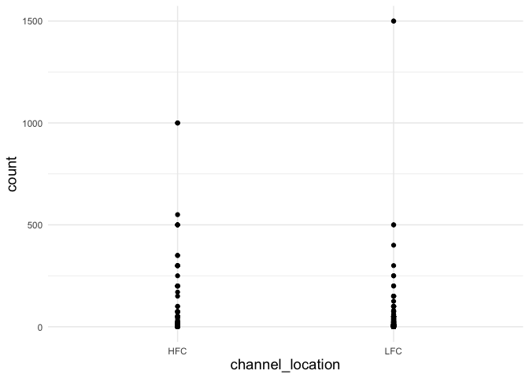
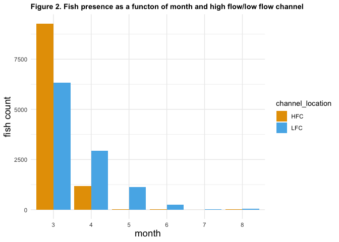
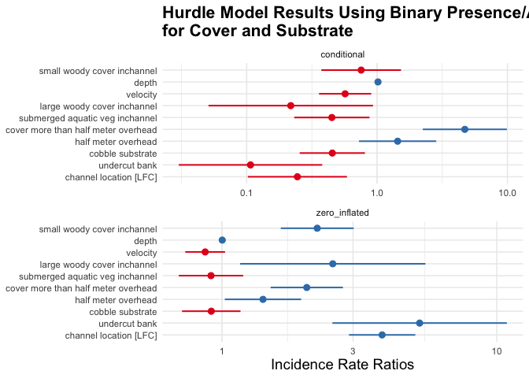
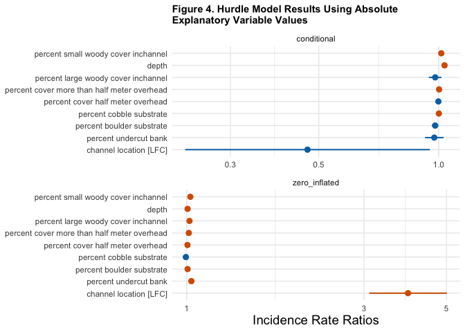

Mini Snorkel Feather Presence/Absence Model
================
Maddee Rubenson
2024-07-03

- [Objective](#objective)
- [Methodology](#methodology)
  - [Hurdle Models and
    Interpretation](#hurdle-models-and-interpretation)
- [Build Models](#build-models)
  - [Read in data](#read-in-data)
  - [Review Data](#review-data)
  - [High Flow vs. Low Flow Channel](#high-flow-vs-low-flow-channel)
- [Model 1 - Binary Cover Values](#model-1---binary-cover-values)
  - [Model 1 Results](#model-1-results)
- [Model 2 - Using Absolute Values](#model-2---using-absolute-values)
  - [Model 2 Results](#model-2-results)
- [Discussion](#discussion)
  - [Interpretation of Model 1](#interpretation-of-model-1)
  - [Interpretation of Model 2](#interpretation-of-model-2)
  - [Suggestions](#suggestions)
  - [Limitations](#limitations)

## Objective

Develop a model that reflects the significance of cover, substrate,
depth, and velocity on fish presence and absence.

## Methodology

Model was developed using [Feather River Mini Snorkel
Data](https://github.com/FlowWest/feather-mini-snorkel). The data is
structured with a numeric fish count variable that can be converted to a
binary presence/absence. Logistic regression models were tested using
the presence/absence as the response and cover, substrate, depth and
velocity as the explanatory variables. However, due to the skewness of
absence values, none of the developed models were well fit to the data.
Based on a Gard 2024 paper (in-review), we decided to explore the use of
hurdle models. Hurdle models excel with data types that are heavily
skewed towards absence.

### Hurdle Models and Interpretation

A hurdle model was used in Gard 2024 (in-review) to test for the effects
of cover and habitat type on the total abundance of Chinook salmon at
both site and cell level. Here we use the hurdle model to help
understand the influence of velocity, depth, and cover on fish count and
presence/absence.

**Hurdle Models**

Hurdle models are used when count data has an excess of zeros. These
models can be understood as a mixture of two subset of populations. In
one subset, we have a usual count model that may or may not generate
zero, and the other subset only produce zero count.

A hurdle model models excess zeroes separately from the rest of the
data. The zero counts are modeled as a binary response variable and the
positive counts are modeled using poisson distribution.

*Interpreting a Hurdle Model*

The binary part of the model helps identify factors that influence the
presence/absence of fish. The coefficients of the zero part of the
hurdle model represent the odds ratio of observing at least one fish.

The count part of the model estimate the effects of predictor variables
on the count outcome, excluding all zero counts. Coefficients of counts
represent rate ratios of one or more fish observed.

The Incidence Result Ratio (IRR) in the count part of the model (count
\> 0) represent the multiplicative effect of a one-unit change in a
predictor variable on the expected count of non-zero observations,
assuming all other variables are held constant. For example, if the IRR
for a predictor is 1.2, it means that a one-unit increase in that
predictor is associated with a 20% increase in the expected count of
non-zero observations, assuming all other variables remain constant. For
the binary part of the model - if the coefficient for a predictor in the
binary part of the hurdle model is 0.5, it means that a one-unit
increase in the predictor is associated with a 50% increase in the odds
of having a zero count versus a positive count, assuming all other
variables are held constant.

## Build Models

### Read in data

    ## Rows: 5,029
    ## Columns: 43
    ## $ micro_hab_data_tbl_id                       <dbl> 18, 18, 18, 19, 20, 21, 22…
    ## $ location_table_id                           <dbl> 11, 11, 11, 11, 11, 11, 11…
    ## $ transect_code                               <dbl> 0.1, 0.1, 0.1, 0.2, 0.3, 0…
    ## $ fish_data_id                                <dbl> 21, 22, 23, NA, NA, NA, 25…
    ## $ date                                        <date> 2001-03-14, 2001-03-14, 2…
    ## $ count                                       <dbl> 2, 3, 1, 0, 0, 0, 3, 0, 0,…
    ## $ species                                     <chr> "chinook salmon", "chinook…
    ## $ fl_mm                                       <dbl> 35, 35, 25, NA, NA, NA, 25…
    ## $ dist_to_bottom                              <dbl> 1.0, 1.5, 1.5, NA, NA, NA,…
    ## $ depth                                       <dbl> 17, 17, 17, 19, 11, 12, 11…
    ## $ focal_velocity                              <dbl> 0.94, 0.16, 0.16, NA, NA, …
    ## $ velocity                                    <dbl> 0.22, 0.22, 0.22, 0.35, 1.…
    ## $ surface_turbidity                           <dbl> 20, 20, 20, 30, 30, 30, 10…
    ## $ percent_fine_substrate                      <dbl> 0, 0, 0, 0, 0, 0, 0, 0, 0,…
    ## $ percent_sand_substrate                      <dbl> 40, 40, 40, 50, 25, 0, 70,…
    ## $ percent_small_gravel_substrate              <dbl> 20, 20, 20, 40, 75, 80, 30…
    ## $ percent_large_gravel_substrate              <dbl> 30, 30, 30, 10, 0, 20, 0, …
    ## $ percent_cobble_substrate                    <dbl> 10, 10, 10, 0, 0, 0, 0, 0,…
    ## $ percent_boulder_substrate                   <dbl> 0, 0, 0, 0, 0, 0, 0, 0, 0,…
    ## $ percent_no_cover_inchannel                  <dbl> 75, 75, 75, 100, 100, 100,…
    ## $ percent_small_woody_cover_inchannel         <dbl> 15, 15, 15, 0, 0, 0, 20, 0…
    ## $ percent_large_woody_cover_inchannel         <dbl> 0, 0, 0, 0, 0, 0, 40, 0, 0…
    ## $ percent_submerged_aquatic_veg_inchannel     <dbl> 10, 10, 10, 0, 0, 0, 30, 0…
    ## $ percent_undercut_bank                       <dbl> 0, 0, 0, 0, 0, 0, 0, 0, 0,…
    ## $ percent_no_cover_overhead                   <dbl> 100, 100, 100, 100, 100, 1…
    ## $ percent_cover_half_meter_overhead           <dbl> 0, 0, 0, 0, 0, 0, 0, 0, 0,…
    ## $ percent_cover_more_than_half_meter_overhead <dbl> 0, 0, 0, 0, 0, 0, 0, 0, 0,…
    ## $ channel_geomorphic_unit                     <chr> "glide", "glide", "glide",…
    ## $ location                                    <chr> "hatchery ditch", "hatcher…
    ## $ channel_location                            <chr> "LFC", "LFC", "LFC", "LFC"…
    ## $ water_temp                                  <dbl> 47, 47, 47, 47, 47, 47, 47…
    ## $ weather                                     <chr> "direct sunlight", "direct…
    ## $ flow                                        <dbl> 12, 12, 12, 12, 12, 12, 12…
    ## $ number_of_divers                            <dbl> 3, 3, 3, 3, 3, 3, 3, 3, 3,…
    ## $ reach_length                                <dbl> 25, 25, 25, 25, 25, 25, 25…
    ## $ reach_width                                 <dbl> 4, 4, 4, 4, 4, 4, 4, 4, 4,…
    ## $ channel_width                               <dbl> 7, 7, 7, 7, 7, 7, 7, 7, 7,…
    ## $ channel_type                                <chr> "sidechannel", "sidechanne…
    ## $ river_mile                                  <dbl> 66.6, 66.6, 66.6, 66.6, 66…
    ## $ coordinate_method                           <chr> "assigned based on similar…
    ## $ latitude                                    <dbl> 39.51602, 39.51602, 39.516…
    ## $ longitude                                   <dbl> -121.5588, -121.5588, -121…
    ## $ fish_presence                               <fct> 1, 1, 1, 0, 0, 0, 1, 0, 0,…

### Review Data

#### Outliers

There are two `count` outliers, one in the high flow and one in the low
flow channel (figure 1), however their removal did not impact the model
results so they were kept in the dataset.

<!-- -->

### High Flow vs. Low Flow Channel

Table 1 and figure 2 explore whether fish presence was impacted by the
high or low flow channels. Overall, the cumulative number of fish are
similar across the high and low flow channels (table 1) however there
are more fish present in the high flow channel for less time and the
fish remain in the low flow channel for much longer (figure 2).

| channel_location |     n |
|:-----------------|------:|
| HFC              | 10505 |
| LFC              | 10694 |

Table 1. Total count of fish between high flow and low flow channels

<!-- -->

## Model 1 - Binary Cover Values

**Notes**

For this hurdle model, all substrate and cover variables
presence/absence based on a 20% threshold

TODO: add no_cover into variables

**Predictors**

- small woody inchannel + half meter overhead
- small woody inchannel + more than half meter overhead
- large woody inchannel + half meter overhead
- large woody inchannel + more than half meter overhead
- cobble substrate
- boulder substrate
- small woody inchannel
- large woody inchannel
- submerged aquatic veg inchannel
- undercut bank
- more than half meter overhead
- small woody half meter overhead
- small woody more than half meter overhead
- velocity
- depth
- channel_location (high flow, low flow)

<!-- -->

    ## Rows: 4,947
    ## Columns: 15
    ## $ count                                           <dbl> 2, 3, 1, 0, 0, 0, 3, 0…
    ## $ depth                                           <dbl> 17, 17, 17, 19, 11, 12…
    ## $ velocity                                        <dbl> 0.22, 0.22, 0.22, 0.35…
    ## $ cobble_substrate                                <dbl> 0, 0, 0, 0, 0, 0, 0, 0…
    ## $ boulder_substrate                               <dbl> 0, 0, 0, 0, 0, 0, 0, 0…
    ## $ small_woody_cover_inchannel                     <dbl> 0, 0, 0, 0, 0, 0, 1, 0…
    ## $ large_woody_cover_inchannel                     <dbl> 0, 0, 0, 0, 0, 0, 1, 0…
    ## $ submerged_aquatic_veg_inchannel                 <dbl> 0, 0, 0, 0, 0, 0, 1, 0…
    ## $ undercut_bank                                   <dbl> 0, 0, 0, 0, 0, 0, 0, 0…
    ## $ half_meter_overhead                             <dbl> 0, 0, 0, 0, 0, 0, 0, 0…
    ## $ cover_more_than_half_meter_overhead             <dbl> 0, 0, 0, 0, 0, 0, 0, 0…
    ## $ small_woody_half_meter_overhead                 <dbl> 0, 0, 0, 0, 0, 0, 1, 0…
    ## $ small_woody_cover_more_than_half_meter_overhead <dbl> 0, 0, 0, 0, 0, 0, 1, 0…
    ## $ large_woody_cover_more_than_half_meter_overhead <dbl> 0, 0, 0, 0, 0, 0, 1, 0…
    ## $ channel_location                                <chr> "LFC", "LFC", "LFC", "…

    ## Start:  AIC=5312.89
    ## count ~ small_woody_cover_inchannel + depth + velocity + large_woody_cover_inchannel + 
    ##     submerged_aquatic_veg_inchannel + cover_more_than_half_meter_overhead + 
    ##     half_meter_overhead + cobble_substrate + boulder_substrate + 
    ##     undercut_bank + channel_location
    ## 
    ##                                       Df    AIC
    ## - boulder_substrate                    2 5309.1
    ## <none>                                   5312.9
    ## - depth                                2 5313.1
    ## - submerged_aquatic_veg_inchannel      2 5314.3
    ## - half_meter_overhead                  2 5314.4
    ## - cobble_substrate                     2 5315.1
    ## - velocity                             2 5316.7
    ## - large_woody_cover_inchannel          2 5316.7
    ## - small_woody_cover_inchannel          2 5333.6
    ## - undercut_bank                        2 5335.3
    ## - cover_more_than_half_meter_overhead  2 5346.2
    ## - channel_location                     2 5422.2
    ## 
    ## Step:  AIC=5309.09
    ## count ~ small_woody_cover_inchannel + depth + velocity + large_woody_cover_inchannel + 
    ##     submerged_aquatic_veg_inchannel + cover_more_than_half_meter_overhead + 
    ##     half_meter_overhead + cobble_substrate + undercut_bank + 
    ##     channel_location
    ## 
    ##                                       Df    AIC
    ## <none>                                   5309.1
    ## - depth                                2 5309.6
    ## - half_meter_overhead                  2 5310.6
    ## - submerged_aquatic_veg_inchannel      2 5310.6
    ## - cobble_substrate                     2 5312.1
    ## - large_woody_cover_inchannel          2 5312.9
    ## - velocity                             2 5313.0
    ## - small_woody_cover_inchannel          2 5330.0
    ## - undercut_bank                        2 5331.5
    ## - cover_more_than_half_meter_overhead  2 5342.5
    ## - channel_location                     2 5421.7

### Model 1 Results

    ## 
    ## Call:
    ## pscl::hurdle(formula = count ~ small_woody_cover_inchannel + depth + 
    ##     velocity + large_woody_cover_inchannel + submerged_aquatic_veg_inchannel + 
    ##     cover_more_than_half_meter_overhead + half_meter_overhead + cobble_substrate + 
    ##     undercut_bank + channel_location, data = hurdle_data, dist = "negbin")
    ## 
    ## Pearson residuals:
    ##      Min       1Q   Median       3Q      Max 
    ## -0.51137 -0.14098 -0.07546 -0.06433 23.78452 
    ## 
    ## Count model coefficients (truncated negbin with log link):
    ##                                       Estimate Std. Error z value  Pr(>|z|)    
    ## (Intercept)                          -7.941453 133.255169  -0.060  0.952478    
    ## small_woody_cover_inchannel          -0.280705   0.359152  -0.782  0.434464    
    ## depth                                 0.016211   0.009175   1.767  0.077256 .  
    ## velocity                             -0.564205   0.234923  -2.402  0.016321 *  
    ## large_woody_cover_inchannel          -1.524274   0.741204  -2.056  0.039736 *  
    ## submerged_aquatic_veg_inchannel      -0.798147   0.339074  -2.354  0.018578 *  
    ## cover_more_than_half_meter_overhead   1.549821   0.378665   4.093 0.0000426 ***
    ## half_meter_overhead                   0.363238   0.348081   1.044  0.296696    
    ## cobble_substrate                     -0.790292   0.293941  -2.689  0.007175 ** 
    ## undercut_bank                        -2.234999   0.646281  -3.458  0.000544 ***
    ## channel_locationLFC                  -1.407334   0.446575  -3.151  0.001625 ** 
    ## Log(theta)                          -14.133857 133.254073  -0.106  0.915529    
    ## Zero hurdle model coefficients (binomial with logit link):
    ##                                      Estimate Std. Error z value
    ## (Intercept)                         -3.637114   0.159070 -22.865
    ## small_woody_cover_inchannel          0.798150   0.155697   5.126
    ## depth                                0.002455   0.002664   0.922
    ## velocity                            -0.140551   0.085023  -1.653
    ## large_woody_cover_inchannel          0.928604   0.396069   2.345
    ## submerged_aquatic_veg_inchannel     -0.091596   0.137767  -0.665
    ## cover_more_than_half_meter_overhead  0.710827   0.154502   4.601
    ## half_meter_overhead                  0.343941   0.163111   2.109
    ## cobble_substrate                    -0.089565   0.125035  -0.716
    ## undercut_bank                        1.656356   0.372876   4.442
    ## channel_locationLFC                  1.342197   0.141863   9.461
    ##                                                 Pr(>|z|)    
    ## (Intercept)                         < 0.0000000000000002 ***
    ## small_woody_cover_inchannel                  0.000000295 ***
    ## depth                                             0.3568    
    ## velocity                                          0.0983 .  
    ## large_woody_cover_inchannel                       0.0191 *  
    ## submerged_aquatic_veg_inchannel                   0.5061    
    ## cover_more_than_half_meter_overhead          0.000004209 ***
    ## half_meter_overhead                               0.0350 *  
    ## cobble_substrate                                  0.4738    
    ## undercut_bank                                0.000008908 ***
    ## channel_locationLFC                 < 0.0000000000000002 ***
    ## ---
    ## Signif. codes:  0 '***' 0.001 '**' 0.01 '*' 0.05 '.' 0.1 ' ' 1 
    ## 
    ## Theta: count = 0
    ## Number of iterations in BFGS optimization: 32 
    ## Log-likelihood: -2632 on 23 Df

    ## Scale for colour is already present.
    ## Adding another scale for colour, which will replace the existing scale.

<!-- -->

## Model 2 - Using Absolute Values

This hurdle model uses substrate and cover absolute percent values.

**Predictors**

- depth

- velocity

- percent large woody cover in channel

- percent small woody cover in channel

- percent cover half meter overhead

- percent cover more than half meter overhead

- percent cobble

- percent boulder

- percent undercut bank

- channel_location (high flow, low flow)

**Notes** \*

- removed combined cover variables (small and large woody in channel
  with cover overhead) because of issues with collinearity within the
  hurdle model

<!-- -->

    ## Rows: 4,404
    ## Columns: 16
    ## $ count                                                   <dbl> 2, 3, 1, 0, 0,…
    ## $ depth                                                   <dbl> 17, 17, 17, 19…
    ## $ velocity                                                <dbl> 0.22, 0.22, 0.…
    ## $ channel_location                                        <chr> "LFC", "LFC", …
    ## $ percent_small_woody_cover_inchannel                     <dbl> 15, 15, 15, 0,…
    ## $ percent_large_woody_cover_inchannel                     <dbl> 0, 0, 0, 0, 0,…
    ## $ percent_submerged_aquatic_veg_inchannel                 <dbl> 10, 10, 10, 0,…
    ## $ percent_cover_half_meter_overhead                       <dbl> 0, 0, 0, 0, 0,…
    ## $ percent_cover_more_than_half_meter_overhead             <dbl> 0, 0, 0, 0, 0,…
    ## $ percent_cobble_substrate                                <dbl> 10, 10, 10, 0,…
    ## $ percent_boulder_substrate                               <dbl> 0, 0, 0, 0, 0,…
    ## $ percent_undercut_bank                                   <dbl> 0, 0, 0, 0, 0,…
    ## $ small_woody_inchannel_and_half_meter_overhead           <dbl> 15, 15, 15, 0,…
    ## $ small_woody_inchannel_and_more_than_half_meter_overhead <dbl> 15, 15, 15, 0,…
    ## $ large_woody_inchannel_and_half_meter_overhead           <dbl> 0, 0, 0, 0, 0,…
    ## $ large_woody_inchannel_and_more_than_half_meter_overhead <dbl> 0, 0, 0, 0, 0,…

    ## Start:  AIC=5002.2
    ## count ~ percent_small_woody_cover_inchannel + depth + velocity + 
    ##     percent_large_woody_cover_inchannel + percent_submerged_aquatic_veg_inchannel + 
    ##     percent_cover_more_than_half_meter_overhead + percent_cover_half_meter_overhead + 
    ##     percent_cobble_substrate + percent_boulder_substrate + percent_undercut_bank + 
    ##     channel_location
    ## 
    ##                                               Df    AIC
    ## - percent_boulder_substrate                    2 4999.1
    ## - percent_cover_half_meter_overhead            2 5000.3
    ## - depth                                        2 5001.2
    ## <none>                                           5002.2
    ## - percent_large_woody_cover_inchannel          2 5004.9
    ## - percent_submerged_aquatic_veg_inchannel      2 5006.1
    ## - percent_cobble_substrate                     2 5006.9
    ## - velocity                                     2 5008.5
    ## - percent_undercut_bank                        2 5017.6
    ## - percent_cover_more_than_half_meter_overhead  2 5024.5
    ## - percent_small_woody_cover_inchannel          2 5037.5
    ## - channel_location                             2 5085.9
    ## 
    ## Step:  AIC=4999.1
    ## count ~ percent_small_woody_cover_inchannel + depth + velocity + 
    ##     percent_large_woody_cover_inchannel + percent_submerged_aquatic_veg_inchannel + 
    ##     percent_cover_more_than_half_meter_overhead + percent_cover_half_meter_overhead + 
    ##     percent_cobble_substrate + percent_undercut_bank + channel_location
    ## 
    ##                                               Df    AIC
    ## - percent_cover_half_meter_overhead            2 4997.2
    ## - depth                                        2 4997.7
    ## <none>                                           4999.1
    ## - percent_large_woody_cover_inchannel          2 5001.8
    ## - percent_submerged_aquatic_veg_inchannel      2 5003.0
    ## - percent_cobble_substrate                     2 5003.9
    ## - velocity                                     2 5006.2
    ## - percent_undercut_bank                        2 5014.7
    ## - percent_cover_more_than_half_meter_overhead  2 5021.7
    ## - percent_small_woody_cover_inchannel          2 5034.2
    ## - channel_location                             2 5088.5
    ## 
    ## Step:  AIC=4997.24
    ## count ~ percent_small_woody_cover_inchannel + depth + velocity + 
    ##     percent_large_woody_cover_inchannel + percent_submerged_aquatic_veg_inchannel + 
    ##     percent_cover_more_than_half_meter_overhead + percent_cobble_substrate + 
    ##     percent_undercut_bank + channel_location
    ## 
    ##                                               Df    AIC
    ## - depth                                        2 4995.4
    ## <none>                                           4997.2
    ## - percent_large_woody_cover_inchannel          2 5000.3
    ## - percent_submerged_aquatic_veg_inchannel      2 5000.9
    ## - percent_cobble_substrate                     2 5001.8
    ## - velocity                                     2 5005.2
    ## - percent_undercut_bank                        2 5013.0
    ## - percent_cover_more_than_half_meter_overhead  2 5020.5
    ## - percent_small_woody_cover_inchannel          2 5038.0
    ## - channel_location                             2 5088.1
    ## 
    ## Step:  AIC=4995.45
    ## count ~ percent_small_woody_cover_inchannel + velocity + percent_large_woody_cover_inchannel + 
    ##     percent_submerged_aquatic_veg_inchannel + percent_cover_more_than_half_meter_overhead + 
    ##     percent_cobble_substrate + percent_undercut_bank + channel_location
    ## 
    ##                                               Df    AIC
    ## <none>                                           4995.4
    ## - percent_large_woody_cover_inchannel          2 4998.6
    ## - percent_cobble_substrate                     2 4999.5
    ## - percent_submerged_aquatic_veg_inchannel      2 5003.1
    ## - velocity                                     2 5005.2
    ## - percent_undercut_bank                        2 5013.0
    ## - percent_cover_more_than_half_meter_overhead  2 5022.5
    ## - percent_small_woody_cover_inchannel          2 5035.7
    ## - channel_location                             2 5105.8

### Model 2 Results

    ## 
    ## Call:
    ## pscl::hurdle(formula = count ~ percent_small_woody_cover_inchannel + 
    ##     velocity + percent_large_woody_cover_inchannel + percent_submerged_aquatic_veg_inchannel + 
    ##     percent_cover_more_than_half_meter_overhead + percent_cobble_substrate + 
    ##     percent_undercut_bank + channel_location, data = hurdle_data, dist = "negbin")
    ## 
    ## Pearson residuals:
    ##      Min       1Q   Median       3Q      Max 
    ## -1.27207 -0.14361 -0.11793 -0.06736 22.06212 
    ## 
    ## Count model coefficients (truncated negbin with log link):
    ##                                              Estimate Std. Error z value
    ## (Intercept)                                 -2.598231  16.187256  -0.161
    ## percent_small_woody_cover_inchannel          0.003896   0.008392   0.464
    ## velocity                                    -0.615894   0.253930  -2.425
    ## percent_large_woody_cover_inchannel         -0.032654   0.021481  -1.520
    ## percent_submerged_aquatic_veg_inchannel     -0.025406   0.007677  -3.309
    ## percent_cover_more_than_half_meter_overhead  0.023804   0.007552   3.152
    ## percent_cobble_substrate                    -0.014915   0.006282  -2.374
    ## percent_undercut_bank                       -0.116192   0.036217  -3.208
    ## channel_locationLFC                         -1.733403   0.382223  -4.535
    ## Log(theta)                                  -9.711653  16.186858  -0.600
    ##                                               Pr(>|z|)    
    ## (Intercept)                                   0.872479    
    ## percent_small_woody_cover_inchannel           0.642496    
    ## velocity                                      0.015290 *  
    ## percent_large_woody_cover_inchannel           0.128478    
    ## percent_submerged_aquatic_veg_inchannel       0.000935 ***
    ## percent_cover_more_than_half_meter_overhead   0.001623 ** 
    ## percent_cobble_substrate                      0.017584 *  
    ## percent_undercut_bank                         0.001336 ** 
    ## channel_locationLFC                         0.00000576 ***
    ## Log(theta)                                    0.548525    
    ## Zero hurdle model coefficients (binomial with logit link):
    ##                                              Estimate Std. Error z value
    ## (Intercept)                                 -3.322711   0.144983 -22.918
    ## percent_small_woody_cover_inchannel          0.023928   0.003412   7.013
    ## velocity                                    -0.261821   0.091905  -2.849
    ## percent_large_woody_cover_inchannel          0.025075   0.010044   2.497
    ## percent_submerged_aquatic_veg_inchannel     -0.004455   0.002738  -1.627
    ## percent_cover_more_than_half_meter_overhead  0.011124   0.002316   4.803
    ## percent_cobble_substrate                    -0.004895   0.002796  -1.751
    ## percent_undercut_bank                        0.059626   0.015131   3.941
    ## channel_locationLFC                          1.241915   0.143526   8.653
    ##                                                         Pr(>|z|)    
    ## (Intercept)                                 < 0.0000000000000002 ***
    ## percent_small_woody_cover_inchannel             0.00000000000233 ***
    ## velocity                                                 0.00439 ** 
    ## percent_large_woody_cover_inchannel                      0.01254 *  
    ## percent_submerged_aquatic_veg_inchannel                  0.10373    
    ## percent_cover_more_than_half_meter_overhead     0.00000156525331 ***
    ## percent_cobble_substrate                                 0.08001 .  
    ## percent_undercut_bank                           0.00008126174900 ***
    ## channel_locationLFC                         < 0.0000000000000002 ***
    ## ---
    ## Signif. codes:  0 '***' 0.001 '**' 0.01 '*' 0.05 '.' 0.1 ' ' 1 
    ## 
    ## Theta: count = 0.0001
    ## Number of iterations in BFGS optimization: 45 
    ## Log-likelihood: -2479 on 19 Df

<!-- -->

## Discussion

### Interpretation of Model 1

### Interpretation of Model 2

### Suggestions

### Limitations

``` r
knitr::knit_exit()
```
